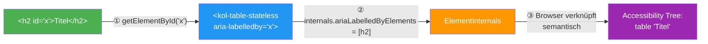

# Unterstützung für externe Beschriftungen via aria-labelledby

## Überblick

Dieses Konzept beschreibt die Unterstützung für externe Tabellenbeschriftungen in KoliBri-Tabellenkomponenten (`kol-table-stateless`, `kol-table-stateful`) mit dem `aria-labelledby`-Attribut. Dies ermöglicht, Tabellenbeschriftungen durch externe DOM-Elemente bereitzustellen, anstatt `<caption>`-Tags inline zu verwenden.

## Motivation

- **Flexible Layouts**: Anwendungen müssen Tabellenbeschriftungen möglicherweise außerhalb der Tabellenstruktur positionieren (z. B. Header, Titel, Beschreibungen), ohne die semantische Struktur zu beeinträchtigen.
- **Barrierefreiheit**: Das `aria-labelledby`-Attribut ist eine Standard-Barrierefreiheitstechnik, um deskriptiven Text mit interaktiven Elementen zu verknüpfen.
- **DOM-Struktur**: Reduziert die Kopplung zwischen Beschriftungsinhalten und Tabellenmarkup und ermöglicht UI-Kompositionsmuster, bei denen Beschriftungen separat verwaltet werden.

## Das Shadow-DOM-Problem mit ARIA-Referenzen

### Kernproblem

ARIA-Attribute wie `aria-labelledby` verwenden ID-Referenzen (IDREFs), die **auf denselben Tree Scope beschränkt** sind. Das bedeutet:

- Ein `aria-labelledby="caption-id"` auf einem `<table>` **innerhalb eines Shadow DOMs** kann ein Element mit `id="caption-id"` **im Light DOM nicht referenzieren**.
- IDREFs überqueren **niemals** Shadow-DOM-Grenzen — weder nach innen noch nach außen.
- Dies ist eine fundamentale Einschränkung der Web-Plattform, keine Eigenheit von KoliBri.

> "If the target of the IDREF is in a different tree scope, establishing a relationship is impossible."
> — [Nolan Lawson: Shadow DOM and accessibility: the trouble with ARIA](https://nolanlawson.com/2022/11/28/shadow-dom-and-accessibility-the-trouble-with-aria/)

### Auswirkung auf die Implementierung

Da KoliBri-Komponenten Shadow DOM verwenden, ist ein einfaches `aria-labelledby`-Attribut auf dem internen `<table>` **nicht ausreichend**, um auf externe Elemente im Light DOM zu verweisen. Es braucht einen programmatischen Mechanismus.

### Architektur-Diagramm



Die `ElementInternals` fungieren als Brücke über die Shadow-DOM-Grenze:
Ein klassisches `aria-labelledby` (IDREF) auf dem internen `<table>` könnte die äußere `<h2>` **nicht** erreichen, da IDREFs auf denselben Tree Scope beschränkt sind.
Stattdessen wird die Element-Referenz programmatisch in `ariaLabelledByElements` eingetragen — das überquert die Shadow-Grenze.

## Lösungsansätze

### 1. `ElementInternals.ariaLabelledByElements` (Element Reflection)

Die [ARIA Element Reflection Spezifikation](https://wicg.github.io/aom/aria-reflection-explainer.html) ermöglicht es, ARIA-Beziehungen über Element-Referenzen statt IDREFs herzustellen. `ElementInternals` bietet dafür die Eigenschaft `ariaLabelledByElements`, die ein Array von `Element`-Referenzen akzeptiert.

**Vorteile:**

- Element-Referenzen können Shadow-DOM-Grenzen überschreiten
- Keine ID-basierte Kopplung nötig
- Vom W3C als Lösung für Cross-Root-ARIA vorgesehen

**Einschränkung (Stand April 2026):**

- Browser-Unterstützung ist noch **sehr begrenzt** — nur Chrome Canary und WebKit Nightly unterstützen Element-Reflecting-Attribute auf `ElementInternals`
- Die Cross-Shadow-Boundary-Fähigkeit funktioniert nur, wenn das referenzierte Element im selben Shadow Root oder in einem Ancestor-Shadow-Root liegt
- Vollständige Cross-Root-Unterstützung (beliebige Richtung) ist noch in Entwicklung

### 2. Reference Target (Cross-Root ARIA) — zukünftiger Standard

Der vielversprechendste Ansatz ist der [Reference Target Proposal](https://leobalter.github.io/cross-root-aria-delegation/), der die beiden älteren Vorschläge (Cross-root ARIA Delegation und Cross-root ARIA Reflection) ablöst.

- In einem **Origin Trial in Chromium** (seit Mai 2025)
- Teil von **Interop 2025/2026** (Browser-Interoperabilitäts-Initiative)
- Prototyp-Implementierungen in Chromium und WebKit durch Igalia

Dieser Standard wird es ermöglichen, ARIA-Attribute auf einem Web Component Host direkt an Elemente innerhalb des Shadow DOMs weiterzuleiten — und umgekehrt.

## Aktuelle Implementierung

### Utility-Modul: `aria-labelledby.ts`

#### `resolveTargets(host, value)`

Löst leerzeichen-getrennte IDs zu DOM-Elementen auf:

```typescript
const root = host?.getRootNode({ composed: true }) as Document | ShadowRoot | undefined;
const getById = (id: string): HTMLElement | null => {
	return (root as Document)?.getElementById?.(id) || document.getElementById(id);
};
```

**Wichtiger Hinweis zu `getRootNode({ composed: true })`:**

Laut [MDN-Spezifikation](https://developer.mozilla.org/en-US/docs/Web/API/Node/getRootNode) gibt `getRootNode({ composed: true })` immer das **`Document`** zurück — nicht den `ShadowRoot`. Die Option `composed: true` traversiert **über alle Shadow-Grenzen hinaus** bis zum obersten Dokument. Das bedeutet:

- `(root as Document)?.getElementById?.(id)` und `document.getElementById(id)` sind im Ergebnis **identisch** — beides durchsucht das Hauptdokument.
- Elemente innerhalb eines Shadow DOMs werden **nicht** gefunden, da `Document.getElementById()` nur den Light DOM durchsucht.
- **Für den vorgesehenen Use Case (externe Beschriftung im Light DOM) funktioniert dies korrekt**, da die Ziel-Elemente im Hauptdokument liegen.

Falls zukünftig auch Elemente innerhalb eines Shadow DOMs referenziert werden sollen, müsste `getRootNode()` **ohne** `composed: true` (oder mit `composed: false`) aufgerufen werden, um den lokalen `ShadowRoot` zu erhalten, der eine eigene `getElementById()`-Methode besitzt.

#### `handleAriaLabelledBy(host, internals, value)`

Aktualisiert `HostInternals.ariaLabelledByElements` mit den aufgelösten Elementen. Protokolliert eine Nachricht, wenn externe Beschriftungen erkannt werden (experimentelle Feature-Markierung).

#### `attachInternalsWithAria(host, value)`

Ruft `attachInternals()` auf dem Host-Element auf und konfiguriert sofort die aria-labelledby-Unterstützung.

### Prop-Konvention: kein `_`-Präfix für `aria*`-Props

KoliBri-Props erhalten normalerweise ein `_`-Präfix (`_label`, `_data`, …), um sie von nativen HTML-Attributen zu unterscheiden. Für `aria-*`-Attribute gilt eine **Ausnahme**: Sie behalten ihren nativen camelCase-Namen **ohne** `_`.

Begründung: Der `_`-Präfix signalisiert "kein natives HTML-Attribut". Bei `aria-labelledby` wäre das falsch — es ist ein echter Web-Standard. Die Ausnahme ist im Typesystem über `NativeHtmlPropNames` in `generic-types.ts` definiert:

```typescript
export type NativeHtmlPropNames = 'ariaDescribedby' | 'ariaLabel' | 'ariaLabelledby';
```

Props in dieser Liste erhalten durch die Typ-Transformation kein `_`.

### Komponenten-Integration

Bei `kol-table-stateless` und `kol-table-stateful`:

1. **Neue Prop**: `ariaLabelledby?: string`
   - Kein `_`-Präfix — folgt dem `NativeHtmlPropNames`-Pattern
   - Akzeptiert leerzeichen-getrennte IDs (Standard-HTML aria-labelledby-Format)
   - Optional, standardmäßig undefined

2. **ElementInternals-Anhängung** (in `componentWillLoad`):

   ```typescript
   this.internals = attachInternalsWithAria(this.host, this.ariaLabelledby);
   ```

3. **Watch Handler** (reaktive Aktualisierungen):

   ```typescript
   @Watch('ariaLabelledby')
   protected watchAriaLabelledby(value?: string): void {
     handleAriaLabelledBy(this.host, this.internals, value);
   }
   ```

4. **Rendering-Logik** (in JSX):

   ```typescript
   const showCaption = this.internals?.ariaLabelledByElements?.length === 0;

   <table aria-labelledby={showCaption ? 'caption' : this.ariaLabelledby}>
     {showCaption && <caption id="caption">{this._label}</caption>}
   </table>
   ```

### Rendering-Verhalten

| Szenario                      | aria-labelledby | Externe Elemente | Verhalten                                                                        |
| ----------------------------- | --------------- | ---------------- | -------------------------------------------------------------------------------- |
| Keine externe Beschriftung    | undefined       | K.A.             | Rendert interne `<caption>` (traditionell)                                       |
| Externe Beschriftung gefunden | `"id1 id2"`     | ✓ Gefunden       | Keine interne `<caption>`; `ariaLabelledByElements` auf ElementInternals gesetzt |
| Externe Beschriftung fehlend  | `"missing"`     | ✗ Nicht gefunden | Fallback zu interner `<caption>` mit `_label`                                    |

## Bekannte Einschränkungen und offene Punkte

### 1. Fallback via `aria-labelledby`-Attribut funktioniert nicht cross-shadow

Im Rendering wird `aria-labelledby={this.ariaLabelledby}` als Fallback auf dem `<table>` gesetzt. Da sich das `<table>` im Shadow DOM befindet und die referenzierten IDs im Light DOM liegen, kann der Browser diese IDREF-Verknüpfung **nicht auflösen**. Dieser Fallback ist für assistive Technologien **wirkungslos**.

**Empfehlung:** Den Fallback als solchen dokumentieren oder alternative Strategien evaluieren (z. B. den Beschriftungstext per JavaScript in ein `aria-label` kopieren).

### 2. `HostInternals`-Typ vs. echte `ElementInternals`

Die Implementierung definiert einen eigenen Typ `HostInternals` mit `ariaLabelledByElements: HTMLElement[]`. Die echte `ElementInternals`-API gibt dieses Property möglicherweise nicht als beschreibbares Array frei. Es muss sichergestellt werden, dass der Cast von `attachInternals()` auf `HostInternals` in der Praxis funktioniert.

### 3. Browser-Unterstützung für `ariaLabelledByElements`

| Feature                                       | Chrome          | Firefox | Safari      | Spec-Status     |
| --------------------------------------------- | --------------- | ------- | ----------- | --------------- |
| `attachInternals()`                           | ✅ 77+          | ✅ 93+  | ✅ 16.4+    | Living Standard |
| `ariaLabelledByElements` auf Element          | ✅ 133+         | ❌      | ✅ TP       | Draft           |
| `ariaLabelledByElements` auf ElementInternals | 🧪 Canary       | ❌      | 🧪 Nightly  | Draft           |
| Cross-Shadow-Boundary References              | 🧪 Origin Trial | ❌      | 🧪 Prototyp | Proposal        |

## Nutzerperspektive / Anwendungsbeispiele

### Grundlegende externe Beschriftung

```jsx
<h2 id="table-caption">Verkaufsbericht Q1 2026</h2>
<KolTableStateless
  aria-labelledby="table-caption"
  _label="Verkaufsdatentabelle"
  _headerCells={headers}
  _data={data}
/>
```

### Mehrere externe Beschriftungen

```jsx
<h2 id="title">Analytik</h2>
<p id="desc">Diese Tabelle zeigt monatliche Trends.</p>
<KolTableStateless
  aria-labelledby="title desc"
  _label="Analysetabelle"
  _headerCells={headers}
  _data={data}
/>
```

### Fallback bei fehlendem Ziel

```jsx
<KolTableStateless aria-labelledby="missing-element" _label="Fallback-Tabellenbeschriftung" _headerCells={headers} _data={data} />
// Rendert: <caption>Fallback-Tabellenbeschriftung</caption>
```

## Tests

### E2E-Testfälle

1. **Externe Beschriftung gefunden**

   ```typescript
   test('unterstützt externe Beschriftung via aria-labelledby', async ({ page }) => {
   	await page.setContent(
   		`<span id="caption">Meine Beschriftung</span>
        <kol-table-stateless aria-labelledby="caption" _label="" ... />`,
   	);
   	const table = page.locator('table');
   	await expect(table.locator('caption')).toHaveCount(0);
   });
   ```

2. **Fallback zu interner Beschriftung**
   ```typescript
   test('rendert interne Beschriftung, wenn externes Ziel fehlt', async ({ page }) => {
   	await page.setContent(`<kol-table-stateless aria-labelledby="missing" _label="Fallback" ... />`);
   	const table = page.locator('table');
   	await expect(table.locator('caption')).toHaveText('Fallback');
   });
   ```

### Manuelle Test-Checkliste

- [ ] Externes Beschriftungselement existiert mit passender ID
- [ ] Tabelle rendert keine interne Beschriftung
- [ ] Screenreader geben die externe Beschriftung aus
- [ ] Externe Beschriftungs-ID fehlt (sollte Fallback verwenden)
- [ ] Mehrere IDs in aria-labelledby (alle Elemente aufgelöst)
- [ ] Dynamische ID-Änderungen (Watch Handler aktualisiert korrekt)

## Rückwärtskompatibilität

- Bestehender Code ohne `aria-labelledby` funktioniert unverändert
- `_label`-Prop-Verhalten unverändert (verwendet als interne Beschriftung Fallback)
- Keine Breaking Changes in API oder Rendering
- Graceful Degradation für fehlende externe Elemente

## Referenzen

### Spezifikationen

- [ARIA in HTML — W3C](https://www.w3.org/TR/html-aria/)
- [ARIAMixin Interface — HTML Living Standard](https://html.spec.whatwg.org/multipage/common-dom-interfaces.html#reflecting-content-attributes-in-idl-attributes:element)
- [ElementInternals API — HTML Living Standard](https://html.spec.whatwg.org/multipage/custom-elements.html#the-elementinternals-interface)
- [HTML Spec: Caption Element](https://html.spec.whatwg.org/multipage/tables.html#the-caption-element)

### MDN-Dokumentation

- [aria-labelledby — MDN](https://developer.mozilla.org/en-US/docs/Web/Accessibility/ARIA/Attributes/aria-labelledby)
- [ElementInternals — MDN](https://developer.mozilla.org/en-US/docs/Web/API/ElementInternals)
- [ElementInternals.ariaLabelledByElements — MDN](https://developer.mozilla.org/en-US/docs/Web/API/ElementInternals/ariaLabelledByElements)
- [Node.getRootNode() — MDN](https://developer.mozilla.org/en-US/docs/Web/API/Node/getRootNode)
- [Using Shadow DOM — MDN](https://developer.mozilla.org/en-US/docs/Web/API/Web_components/Using_shadow_DOM)
- [ShadowRoot.getElementById() — MDN](https://developer.mozilla.org/en-US/docs/Web/API/ShadowRoot/getElementById)

### Proposals und Hintergrund

- [ARIA Reflection Explainer — AOM (Accessibility Object Model)](https://wicg.github.io/aom/aria-reflection-explainer.html)
- [Cross-root ARIA Delegation Proposal](https://leobalter.github.io/cross-root-aria-delegation/)
- [Cross-root ARIA Reflection Proposal](https://github.com/Westbrook/cross-root-aria-reflection)
- [Reference Target for Cross-Root ARIA — Interop Issue](https://github.com/web-platform-tests/interop/issues/1011)
- [Solving Cross-root ARIA Issues in Shadow DOM — Igalia](https://blogs.igalia.com/mrego/solving-cross-root-aria-issues-in-shadow-dom/)
- [How Shadow DOM and accessibility are in conflict — Alice Boxhall (Igalia)](https://alice.pages.igalia.com/blog/how-shadow-dom-and-accessibility-are-in-conflict/)
- [Shadow DOM and accessibility: the trouble with ARIA — Nolan Lawson](https://nolanlawson.com/2022/11/28/shadow-dom-and-accessibility-the-trouble-with-aria/)
- [Can I create an ARIA reference to an element in shadow DOM? — Manuel Matuzovic](https://www.matuzo.at/blog/2023/web-components-accessibility-faq/aria-references/)
- [WICG/webcomponents Issue #974: Can ElementInternals have ARIA properties pointing inside the shadow root?](https://github.com/WICG/webcomponents/issues/974)

## Implementierungs-Status

✅ **Feature abgeschlossen (experimentell)**

- [x] Utility-Funktionen für aria-labelledby-Handling
- [x] Integration mit kol-table-stateless
- [x] Integration mit kol-table-stateful
- [x] E2E-Tests für beide Komponenten
- [x] Sample-Komponente (TableExternalCaption)
- [x] Fallback-Handling für fehlende Elemente
- [x] ElementInternals-Unterstützung mit graceful Degradation
- [x] `NativeHtmlPropNames`-Ausnahme in `generic-types.ts` — `ariaLabelledby` ohne `_`-Präfix

⚠️ **Offene Punkte**

- [ ] `aria-labelledby`-Fallback auf `<table>` im Shadow DOM verifizieren (funktioniert nicht cross-boundary)
- [ ] Alternative Fallback-Strategie evaluieren (z. B. `aria-label` mit kopiertem Text)
- [ ] Browser-Support für `ariaLabelledByElements` auf `ElementInternals` regelmäßig prüfen
- [ ] Migration auf Reference Target API evaluieren, sobald stabiler Browser-Support vorhanden
