# Open Source Prozess

In diesem Dokument wird der Prozess und dessen Teilprozesse zum Aufbau des Open Source Projekts dargestellt.

Im folgenden Diagramm wird der Gesamtprozess kompakt dargestellt:

```mermaid
flowchart
  idStart((Start))
  idStartNode(("•"))
  idStart --> idStartNode
  idStartNode --> idNPM[[NPM einrichten]]
  idStartNode --> idGitHub[[GitHub einrichten]]
  idStartNode --> idRepository[[Repository aufbereiten]]
  idStartNode --> idTeam[[Team organisieren]]
  idStartNode --> idTrademark[[Marke schützen]]
  idStartNode --> idLicense[[Lizenz prüfen]]
  idNPM --> idEndNode
  idGitHub --> idEndNode
  idRepository --> idEndNode
  idTeam --> idEndNode
  idTrademark --> idEndNode
  idLicense --> idEndNode
  idEndNode(("•"))
  idEndNode --> idLeitung{Leitungsfreigabe}
  idLeitung -- ja --> idHistory[Historie bereinigen]
  idLeitung -- nein --> idStartNode
  idHistory --> idPublicCode[Quellcode veröffentlichen]
  idNPM --> idFreigabe{Freigabe}
  idFreigabe -- ja --> idPublicPkg[Artefakte bereitstellen]
  idFreigabe -- nein --> idStartNode
  idPublicPkg --> idEnd
  idPublicCode --> idEnd
  idEnd(((Ende)))
```

## Teilprozesse

### NPM einrichten

### GitHub einrichten

### Repository aufbereiten

### Team organisieren

