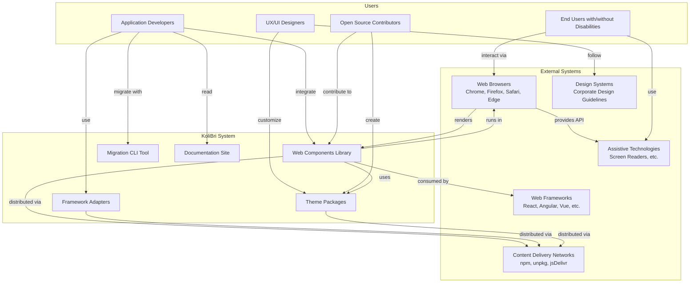
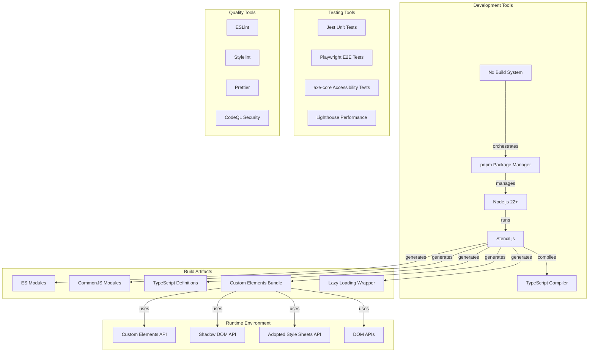

# 3. System Scope and Context

## 3.1 Business Context

### Business Context Description

| Partner/Interface | Input | Output | Description |
|-------------------|-------|--------|-------------|
| **Application Developers** | Integration requirements, bug reports, feature requests | Web components, framework adapters, documentation | Primary users who integrate KoliBri into their applications |
| **Web Frameworks** | Framework APIs and conventions | Framework-specific adapters (React, Angular, Vue, etc.) | KoliBri provides native integrations for popular frameworks |
| **Web Browsers** | Web standards APIs (Custom Elements, Shadow DOM) | Rendered accessible components | KoliBri components run in modern browsers |
| **Assistive Technologies** | ARIA attributes, semantic HTML | Accessible user interface | Components expose proper accessibility information |
| **Design Systems** | Design tokens, style guides, brand guidelines | Themed components | Organizations apply their design system via themes |
| **npm Registry** | Package distribution infrastructure | Published npm packages | Primary distribution channel for components and themes |
| **End Users** | User interactions (click, keyboard, touch) | Accessible user experience | Ultimate beneficiaries of accessible components |
| **Open Source Community** | Contributions, bug reports, discussions | Improved components, new features | Community drives evolution and quality |

## 3.2 Technical Context

### Technical Interfaces

| Interface | Technology | Description |
|-----------|------------|-------------|
| **Component Definition** | Stencil.js, TypeScript | Components are defined using Stencil decorators and TypeScript classes |
| **Component Registration** | Custom Elements API | Components register as custom HTML elements |
| **Style Encapsulation** | Shadow DOM, Adopted Style Sheets | Styles are scoped to components via Shadow DOM |
| **Theme Application** | CSS, SASS, Adopted Style Sheets | Themes provide CSS loaded as adopted style sheets |
| **Framework Integration** | Framework-specific adapters | Generated adapters wrap components for React, Angular, Vue, etc. |
| **Build System** | pnpm, Nx, Rollup (via Stencil) | Monorepo build orchestrated by pnpm and Nx |
| **Module Formats** | ES Modules, CommonJS | Components distributed in multiple module formats |
| **Type Definitions** | TypeScript .d.ts files | Full TypeScript support for developers |
| **Testing** | Jest, Playwright, axe-core | Unit tests, E2E tests, and accessibility validation |
| **Package Distribution** | npm registry | Components published as npm packages |

### Communication Channels

| Channel | Technology | Purpose |
|---------|------------|---------|
| **Component Props** | JavaScript/TypeScript objects | Configuration and data passing |
| **Component Events** | CustomEvent API | Component-to-application communication |
| **CSS Custom Properties** | CSS Variables (limited) | Theme customization points |
| **Slots** | Shadow DOM slots | Content projection into components |
| **CSS Parts** | ::part() pseudo-element | External styling of component internals (limited use) |
| **ARIA Attributes** | HTML attributes | Accessibility information for assistive technologies |
