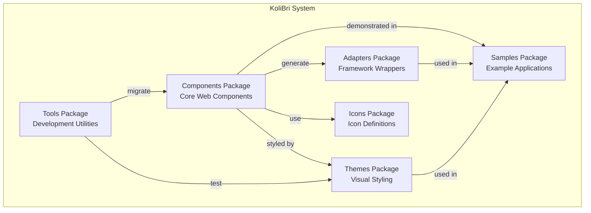
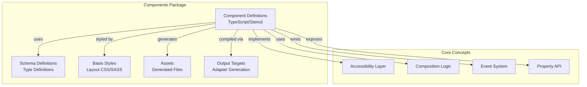
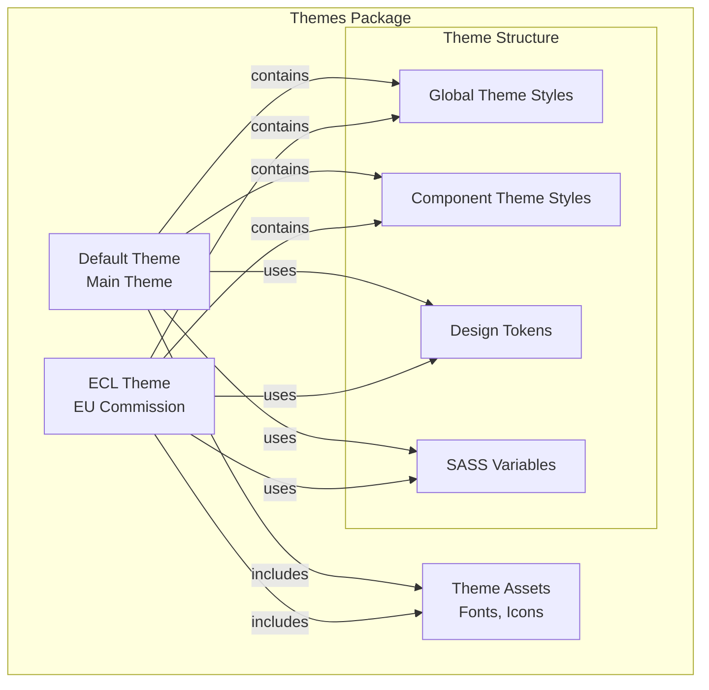
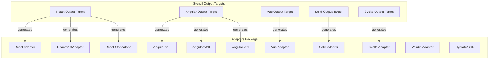
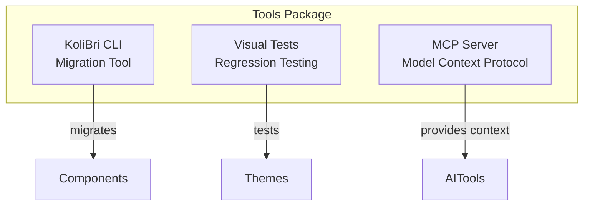

# 5. Building Block View

This section decomposes Public UI - KoliBri into its major structural elements, showing how packages, components, and modules are organized and how they interact. It provides progressively more detailed views of the system's static structure, from high-level packages down to individual component organization.

## 5.1 Whitebox Overall System



### Contained Building Blocks

| Building Block | Responsibility |
|----------------|----------------|
| **Components** | Core web component library, provides atomic, accessible HTML components |
| **Themes** | Visual styling packages, separate presentation from logic |
| **Adapters** | Framework-specific wrappers (React, Angular, Vue, etc.) for native integration |
| **Tools** | Development and migration utilities (CLI, visual testing) |
| **Samples** | Example applications demonstrating component usage |
| **Icons** | Icon font definitions and assets |

### Important Interfaces

| Interface | Description |
|-----------|-------------|
| `@public-ui/components` | Main component library export |
| `@public-ui/theme-*` | Theme packages (default, ecl, etc.) |
| `@public-ui/react`, `@public-ui/angular-*`, `@public-ui/vue` | Framework adapters |
| Theme registration API | `register(theme, defineCustomElements)` |

## 5.2 Components Package (Level 2)



### Component Structure

Each component consists of:

1. **Component Class** (`.tsx` file)
   - Stencil component decorator
   - Property definitions with validators
   - Lifecycle methods
   - Render method (JSX)

2. **Schema Definition** (`schema/` folder)
   - TypeScript interfaces for props
   - Type definitions for internal state
   - Validation schemas

3. **Basis Styles** (`.scss` files)
   - Layout-only styles (no colors)
   - Accessibility compliance (min sizes, focus styles)
   - Responsive behavior

4. **Tests**
   - Unit tests (Jest)
   - E2E tests (Playwright)
   - Accessibility tests (axe-core)

### Component Categories

```
components/
├── @deprecated/        # Deprecated components (maintained for compatibility)
├── @else/             # Utility components
├── @shared/           # Shared utilities and mixins
├── abbr/              # Abbreviation component
├── accordion/         # Accordion/expandable sections
├── alert/             # Alert/notification messages
├── avatar/            # User avatar display
├── badge/             # Badge/label component
├── breadcrumb/        # Breadcrumb navigation
├── button/            # Button component
├── button-link/       # Button styled as link
├── card/              # Card container
├── combobox/          # Combo box/autocomplete
└── ...               # 50+ more components
```

### Key Components

| Component | Purpose | Complexity |
|-----------|---------|------------|
| `KolButton` | Accessible button with icon and label support | Medium |
| `KolInputText` | Text input with validation and error handling | High |
| `KolTable` | Accessible data table with sorting and pagination | High |
| `KolModal` | Accessible modal dialog with focus management | High |
| `KolIcon` | Icon display from icon fonts | Low |
| `KolLink` | Accessible link with icon support | Low |

## 5.3 Themes Package (Level 2)



### Theme Package Structure

```
themes/
├── default/                   # Default KoliBri theme (primary)
│   ├── src/
│   │   ├── global.scss       # Global theme styles (layer 4)
│   │   ├── components/       # Component-specific styles (layer 5)
│   │   └── _variables.scss   # SASS variables and tokens
│   └── assets/               # Fonts, icons (copied from components)
├── ecl/                      # European Commission Library theme
├── assets/                   # Shared theme assets
│   ├── material-icons/       # Material Icons font
│   └── material-symbols/     # Material Symbols font
└── package.json              # Workspace package
```

### Theme Styling Layers

1. **Layer 1: A11y Preset** (from `adopted-style-sheets`)
   - Basic accessibility styles
   - Minimum sizes, focus indicators
   - Semantic defaults

2. **Layer 2: Basis Global** (from `components`)
   - Global layout defaults
   - Box-sizing, font-size baseline
   - No colors or margins

3. **Layer 3: Basis Component** (from `components`)
   - Component-specific layout
   - Structural CSS only
   - No colors or margins

4. **Layer 4: Theme Global** (from `themes`)
   - Colors, fonts, spacing
   - Design tokens
   - Brand-specific globals

5. **Layer 5: Theme Component** (from `themes`)
   - Component-specific theming
   - Colors, borders, shadows
   - Complete visual design

## 5.4 Adapters Package (Level 2)



### Adapter Generation

All adapters are **automatically generated** by Stencil output targets. Manual editing is forbidden.

**Generation Process:**

1. Component defined in `packages/components/src/components/`
2. Stencil builds component
3. Output targets generate framework-specific wrappers
4. Adapters placed in `packages/adapters/{framework}/`
5. Each adapter gets its own npm package

### Framework Support

| Framework | Package(s) | Purpose |
|-----------|-----------|---------|
| **React** | `@public-ui/react`, `@public-ui/react-v19`, `@public-ui/react-standalone` | React 18, 19, and standalone builds |
| **Angular** | `@public-ui/angular-v19`, `@public-ui/angular-v20`, `@public-ui/angular-v21` | Angular versions 19, 20, 21 |
| **Vue** | `@public-ui/vue` | Vue.js integration |
| **Solid** | `@public-ui/solid` | SolidJS integration |
| **Svelte** | `@public-ui/svelte` | Svelte integration |
| **Preact** | `@public-ui/preact` | Preact integration |
| **Vaadin** | `@public-ui/vaadin` | Vaadin Flow (Java) integration |

## 5.5 Tools Package (Level 2)



### Tool Components

1. **KoliBri CLI** (`packages/tools/kolibri-cli/`)
   - Component migration between versions
   - Project analysis and dependency checks
   - Automated code transformations
   - Migration testing framework

2. **Visual Tests** (`packages/tools/visual-tests/`)
   - Visual regression testing for themes
   - Screenshot comparison
   - Snapshot management
   - Theme validation

3. **MCP Server** (`packages/tools/mcp/`)
   - Model Context Protocol server
   - Provides repository context to AI tools
   - Helps with code generation and review

## 5.6 Key Interfaces and Dependencies

### External Dependencies

| Package | Purpose | Used By |
|---------|---------|---------|
| `@stencil/core` | Web component compiler | Components |
| `adopted-style-sheets` | Style sheet adoption polyfill | Components, Themes |
| `@floating-ui/dom` | Positioning engine | Components (tooltips, dropdowns) |
| `markdown-it` | Markdown rendering | Components (rich text) |
| `wcag-contrast` | Contrast ratio validation | Components (color validation) |

### Internal Dependencies

```
Components → Icons
Components → Adapters (generated)
Samples → Components
Samples → Adapters
Samples → Themes
Tools (CLI) → Components (for migration)
Tools (Visual Tests) → Themes
```

### Build Order

1. **Icons** - Built first, no dependencies
2. **Components** - Depends on Icons, generates Adapters
3. **Themes** - Independent, can build in parallel
4. **Adapters** - Generated by Components build
5. **Samples** - Depends on Components, Themes, Adapters
6. **Tools** - Mostly independent
