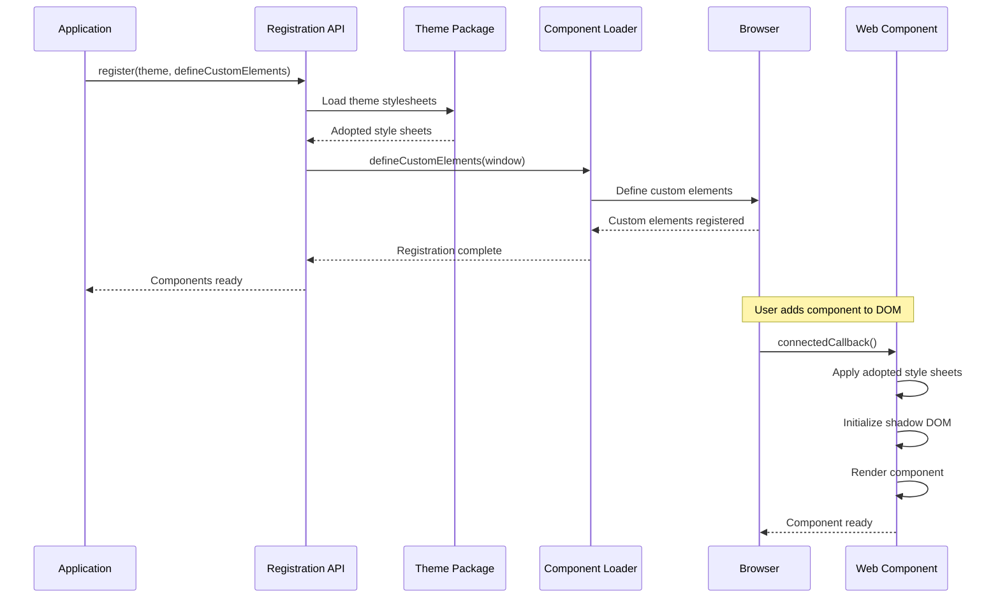
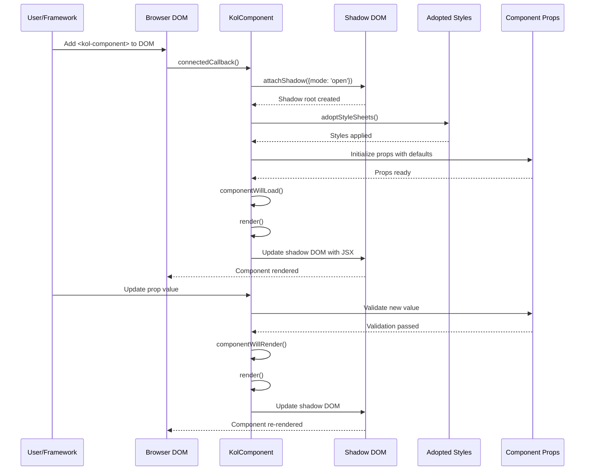
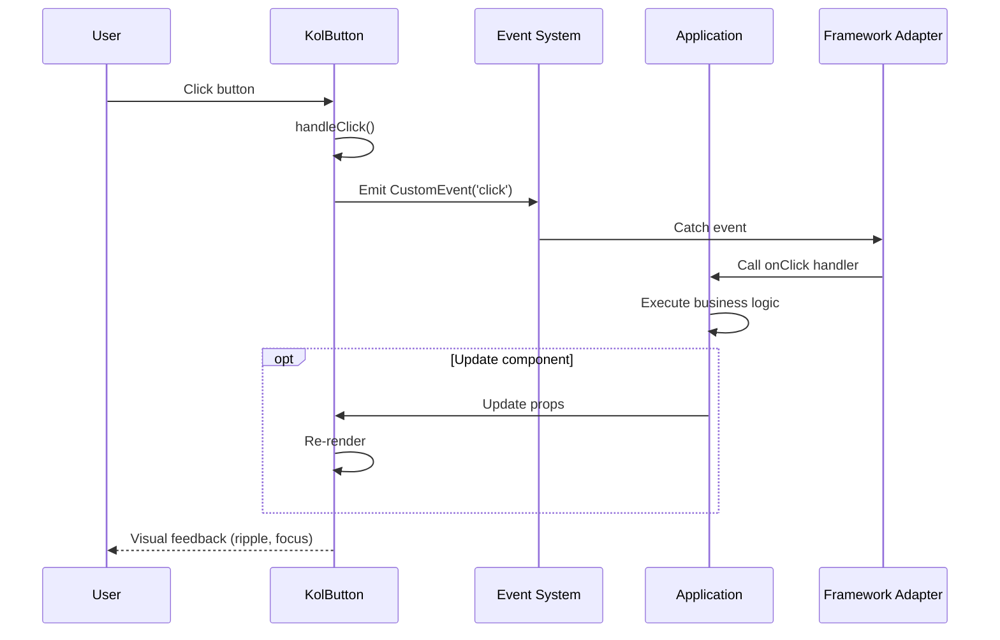
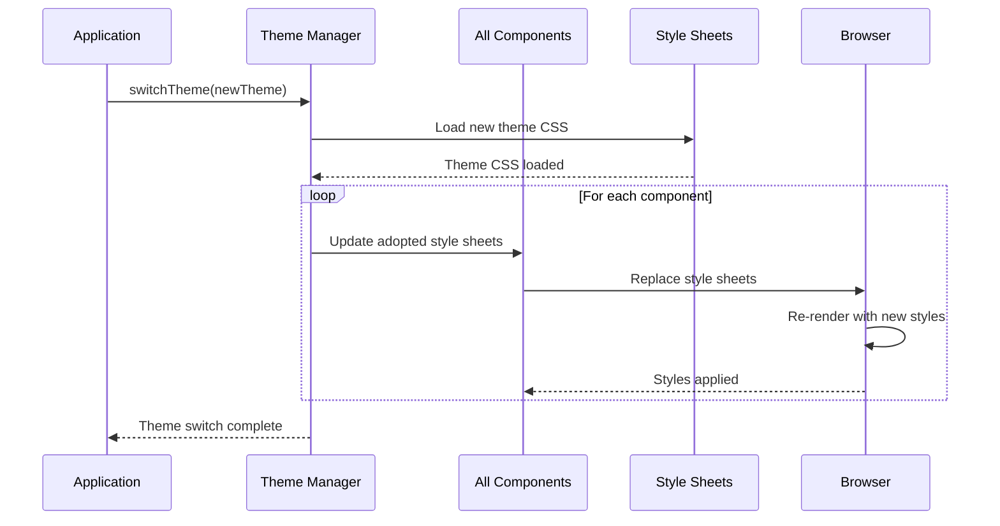
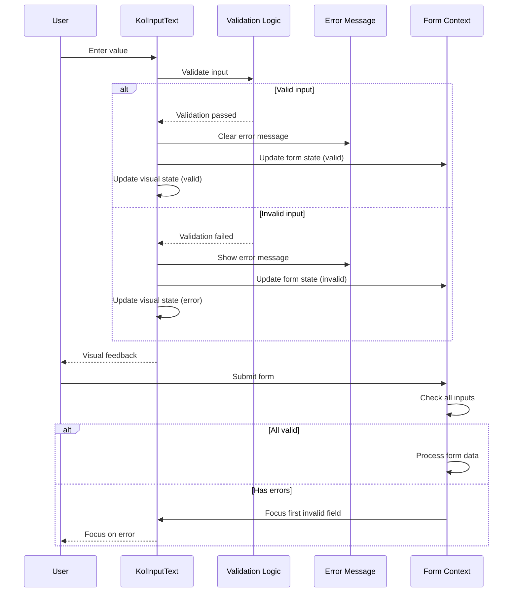
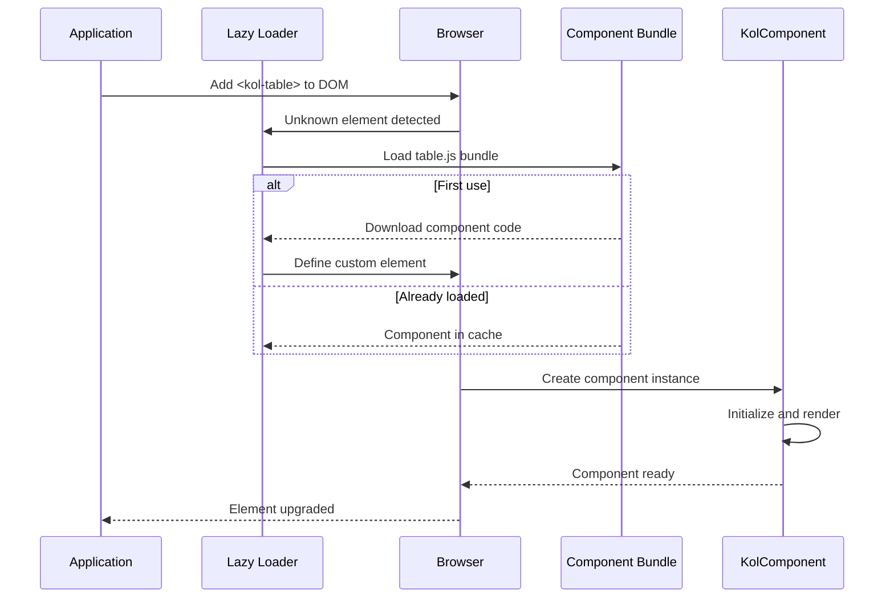
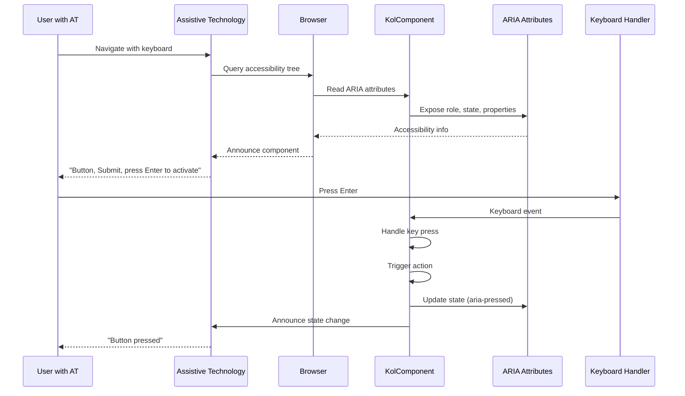

# 6. Runtime View

This section illustrates the dynamic behavior of Public UI - KoliBri through key runtime scenarios. Using sequence diagrams and detailed descriptions, it shows how components interact during common operations such as initialization, rendering, event handling, and theme switching.

## 6.1 Component Registration and Initialization

The component registration process establishes the foundation for all KoliBri components in an application. This critical initialization step must occur before any components are rendered.



### Scenario: Application Startup

**Prerequisites:**

- Application has installed `@public-ui/components` and a theme package
- Application imports registration function

**Steps:**

1. Application imports theme and registration function:

   ```typescript
   import { register } from '@public-ui/components';
   import { defineCustomElements } from '@public-ui/components/loader';
   import { DEFAULT } from '@public-ui/theme-default';
   ```

2. Application calls `register()` with theme and loader:

   ```typescript
   register(DEFAULT, defineCustomElements);
   ```

3. Registration function:
   - Loads theme stylesheets
   - Calls `defineCustomElements()` to register all components
   - Components are defined as custom elements in the browser

4. Components are now available as HTML tags (e.g., `<kol-button>`)

## 6.2 Component Rendering



### Scenario: Component Lifecycle

**When a component is added to the DOM:**

1. **connectedCallback()** - Browser notifies component of DOM insertion
2. **attachShadow()** - Component creates shadow DOM for encapsulation
3. **adoptStyleSheets()** - Theme styles applied via adopted style sheets
4. **componentWillLoad()** - Component initialization logic runs
5. **render()** - Component renders JSX to shadow DOM
6. **componentDidLoad()** - Post-render setup (event listeners, etc.)

**When a component prop changes:**

1. Property setter validates new value
2. **componentWillRender()** - Pre-render hook
3. **render()** - Component re-renders with new data
4. **componentDidRender()** - Post-render hook
5. Shadow DOM updates efficiently (virtual DOM diffing)

## 6.3 Event Handling and Communication



### Scenario: Button Click

**Steps:**

1. User clicks button element
2. Button's internal click handler is triggered
3. Component validates click (not disabled, etc.)
4. Component emits CustomEvent with type information
5. Framework adapter (if used) catches event and calls React/Angular/Vue handler
6. Application executes business logic
7. Application may update component props, triggering re-render

**Event Types:**

- Standard HTML events (click, focus, blur, etc.)
- Custom component events (change, close, select, etc.)
- Events bubble through shadow DOM boundary (composed: true)

## 6.4 Theme Switching



### Scenario: Runtime Theme Change

**Prerequisites:**

- Multiple theme packages installed
- Components already registered

**Steps:**

1. Application loads new theme package
2. Theme manager collects new style sheets
3. For each component instance in the DOM:
   - Replace adopted style sheets with new theme
   - Browser automatically re-renders with new styles
4. Visual appearance changes without component re-initialization

**Benefits:**

- No component remounting required
- Instant visual updates
- Maintains component state
- Efficient - only styles change, not DOM structure

## 6.5 Form Validation



### Scenario: Input Validation

**Steps:**

1. User enters text in input field
2. Input component validates on blur or real-time (depending on configuration)
3. Validation logic checks:
   - Required field
   - Pattern matching (regex)
   - Min/max length
   - Custom validators
4. If valid:
   - Clear error messages
   - Update visual state to valid
   - Emit valid event
5. If invalid:
   - Show error message
   - Update visual state to error
   - Emit invalid event
   - Prevent form submission

## 6.6 Lazy Loading



### Scenario: Component Lazy Loading

**Steps:**

1. Application uses component loader (not direct imports)
2. Browser encounters unknown custom element (e.g., `<kol-table>`)
3. Stencil's lazy loader intercepts
4. Loader fetches component bundle on-demand
5. Component code downloaded and executed
6. Custom element defined in browser
7. Browser "upgrades" the element from unknown to defined
8. Component initializes and renders

**Benefits:**

- Smaller initial bundle size
- Components loaded only when needed
- Automatic code splitting
- Improved performance for large applications

## 6.7 Accessibility Integration



### Scenario: Screen Reader Navigation

**Steps:**

1. User with screen reader navigates page with Tab key
2. Screen reader queries browser's accessibility tree
3. Component exposes:
   - Semantic role (button, textbox, dialog, etc.)
   - State (expanded, selected, checked, etc.)
   - Properties (label, description, required, etc.)
4. Screen reader announces component information to user
5. User interacts via keyboard
6. Component handles keyboard events (Enter, Space, Arrow keys, Escape)
7. Component updates ARIA attributes to reflect state changes
8. Screen reader announces changes to user

**Accessibility Features Built-in:**

- Proper ARIA roles on all interactive elements
- Keyboard navigation support
- Focus management (trap focus in modals, etc.)
- Sufficient color contrast (WCAG 2.2 AAA compliant)
- Minimum touch target sizes (44x44px)
- Semantic HTML structure
- Error message associations
- Live regions for dynamic content
