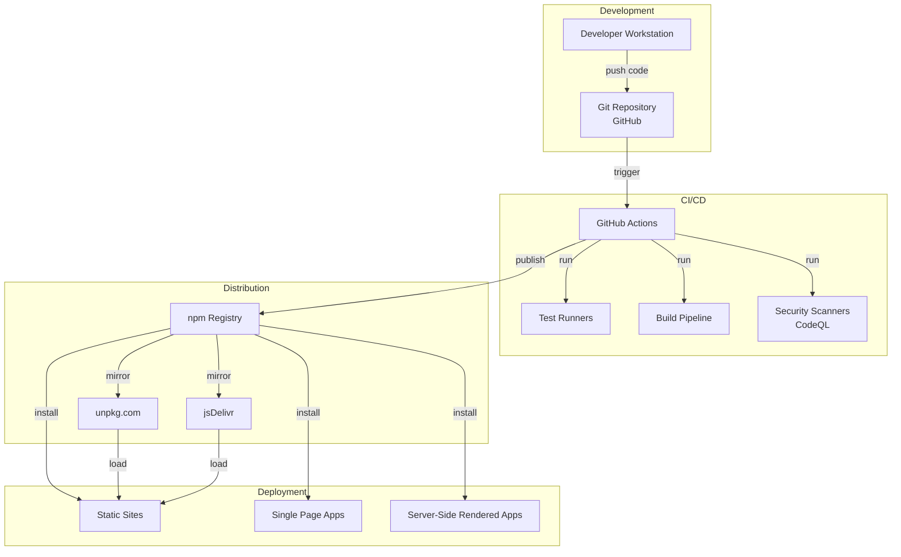
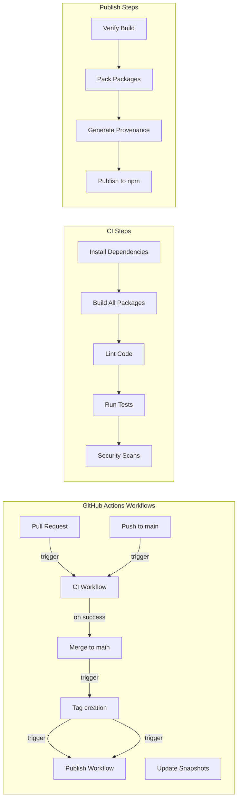
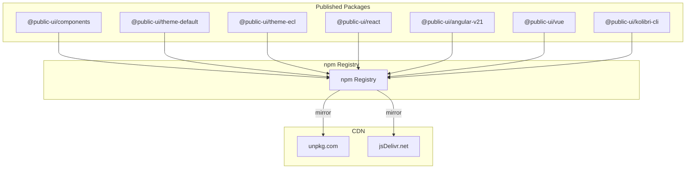
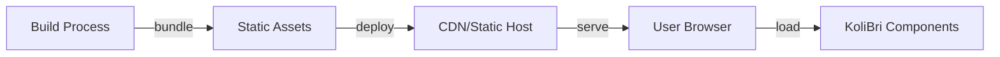
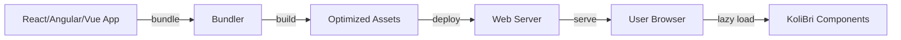
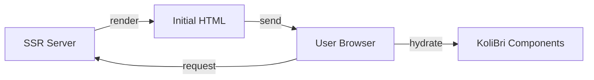
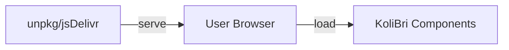
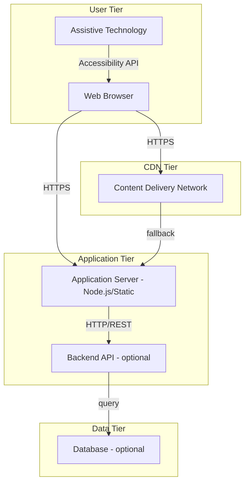

# 7. Deployment View

This section describes the infrastructure and deployment scenarios for Public UI - KoliBri. It covers development environments, CI/CD pipelines, package distribution strategies, and various application deployment patterns that consumers can use when integrating KoliBri components into their projects.

## 7.1 Infrastructure Overview



## 7.2 Development Environment

### Developer Workstation Requirements

| Component            | Requirement                      | Purpose                              |
| -------------------- | -------------------------------- | ------------------------------------ |
| **Operating System** | Windows 10+, macOS 11+, or Linux | Platform-independent development     |
| **Node.js**          | Version 22.x (required)          | Runtime for build tools              |
| **pnpm**             | Version 10.x                     | Package manager                      |
| **Git**              | Version 2.30+                    | Version control                      |
| **IDE**              | VS Code (recommended)            | Code editing with TypeScript support |
| **Browser**          | Chrome/Edge (for testing)        | Development and testing              |

### Local Setup

```bash
# Clone repository
git clone https://github.com/public-ui/kolibri.git
cd kolibri

# Install Node.js 22
# (platform-specific installation)

# Enable pnpm
corepack enable pnpm

# Install dependencies
pnpm i --ignore-scripts

# Build all packages
pnpm -r build

# Start development server
cd packages/samples/react
pnpm start
```

### Development Ports

| Port     | Service            | URL                   |
| -------- | ------------------ | --------------------- |
| 9191     | React sample app   | http://localhost:9191 |
| 4200     | Angular sample app | http://localhost:4200 |
| Variable | Stencil dev server | http://localhost:3333 |

## 7.3 CI/CD Pipeline



### GitHub Actions Workflows

| Workflow                 | Trigger                      | Purpose                                 |
| ------------------------ | ---------------------------- | --------------------------------------- |
| **ci.yml**               | Push, Pull Request           | Run tests, linting, builds              |
| **publish.yml**          | Tag creation                 | Publish packages to npm with provenance |
| **update-pnpm-lock.yml** | Manual trigger               | Refresh `pnpm-lock.yaml` for a branch   |
| **update-snapshots.yml** | Manual trigger               | Update visual regression test snapshots |
| **codeql.yml**           | Push, Pull Request, Schedule | Security scanning with CodeQL           |

### CI Quality Gates

All PRs must pass:

1. **Build**: All packages must build without errors
2. **Linting**: ESLint, Stylelint, TypeScript checks must pass
3. **Unit Tests**: All Jest tests must pass
4. **E2E Tests**: Playwright tests must pass
5. **Security**: CodeQL analysis must pass, no high-severity vulnerabilities
6. **Formatting**: Code must be formatted with Prettier

## 7.4 Package Distribution

### npm Registry

Primary distribution channel for KoliBri packages:



### Package Structure

Each package published to npm includes:

```
@public-ui/components/
├── dist/                   # Compiled JavaScript
│   ├── index.js           # ES module entry
│   ├── index.cjs.js       # CommonJS entry
│   ├── types/             # TypeScript definitions
│   └── esm/               # ES2017 modules
├── loader/                # Lazy loading wrapper
├── assets/                # Static assets (icons, etc.)
├── doc/                   # Generated documentation
├── custom-elements.json   # Custom Elements Manifest
└── package.json           # Package metadata
```

### SLSA Provenance

KoliBri publishes packages with SLSA Build Level 3 provenance:

- Packages built in GitHub Actions with OIDC identity
- Published with `--provenance` flag
- Verifiable attestations for all published artifacts
- Ensures build integrity and supply chain security

Verification:

```bash
# View provenance metadata
pnpm view @public-ui/components dist.provenance

# Verify signatures (if npm client supports)
pnpm audit signatures --package=@public-ui/components@latest
```

## 7.5 Application Deployment Scenarios

### Scenario 1: Static Website



**Deployment:**

- Components bundled with application code
- Deployed to static hosting (Netlify, Vercel, GitHub Pages, S3, etc.)
- No server-side rendering
- All assets cached by CDN

**Example:**

```html
<!DOCTYPE html>
<html>
	<head>
		<script type="module" src="./kolibri-components.js"></script>
		<link rel="stylesheet" href="./theme-default.css" />
	</head>
	<body>
		<kol-button _label="Click me"></kol-button>
	</body>
</html>
```

### Scenario 2: Single Page Application (SPA)



**Deployment:**

- Components imported via framework adapter
- Bundled with application via Webpack/Vite/Rollup
- Lazy loading for code splitting
- Deployed to application server or CDN

**Example (React):**

```typescript
import { KolButton } from '@public-ui/react';
import { register } from '@public-ui/components';
import { defineCustomElements } from '@public-ui/components/loader';
import { DEFAULT } from '@public-ui/theme-default';

await register(DEFAULT, defineCustomElements);

function App() {
	return <KolButton _label="Click me" />;
}
```

### Scenario 3: Server-Side Rendering (SSR)



**Deployment:**

- Components hydrated on client after SSR
- Initial HTML rendered server-side
- Client-side hydration for interactivity
- Deployed to Node.js server or serverless functions

**Considerations:**

- Use hydrate adapter for SSR support
- Components need client-side hydration
- Shadow DOM requires careful SSR handling

### Scenario 4: CDN Only (No Build)



**Deployment:**

- Load components directly from CDN
- No build step required
- Ideal for prototypes and simple sites

**Example:**

```html
<script type="module">
	import { defineCustomElements } from 'https://unpkg.com/@public-ui/components@latest/loader/index.mjs';
	import { register } from 'https://unpkg.com/@public-ui/components@latest/dist/index.js';
	import { DEFAULT } from 'https://unpkg.com/@public-ui/theme-default@latest/index.js';

	await register(DEFAULT, defineCustomElements);
</script>
```

## 7.6 Deployment Topology

### Multi-Tier Architecture



### Component Loading Strategy

1. **Initial Load**:
   - HTML page with component tags
   - Core component loader script
   - Theme CSS

2. **Lazy Loading**:
   - Individual component bundles loaded on-demand
   - Only used components downloaded
   - Browser caching for subsequent loads

3. **Caching Strategy**:
   - Components: Long cache (immutable versions)
   - Themes: Long cache (immutable versions)
   - Application code: Cache with revalidation

## 7.7 Monitoring and Observability

### Client-Side Monitoring

Recommendations for applications using KoliBri:

- **Performance Monitoring**: Web Vitals
- **Error Tracking**: Sentry, Rollbar (application level)
- **Accessibility Monitoring**: axe DevTools, automated scans
- **Bundle Size Tracking**: bundlephobia, webpack-bundle-analyzer

### Build Pipeline Monitoring

- **CI/CD Status**: GitHub Actions status badges
- **Test Coverage**: Jest coverage reports
- **Security Alerts**: GitHub Dependabot, CodeQL alerts
- **Package Health**: npm package health score

### Metrics

Key metrics tracked:

- **Build Time**: Full build duration (~2 minutes)
- **Test Duration**: Unit + E2E test execution (~3 minutes)
- **Package Size**: Individual package sizes
- **Download Stats**: npm download counts
- **Issue Resolution Time**: Time to close issues/PRs
