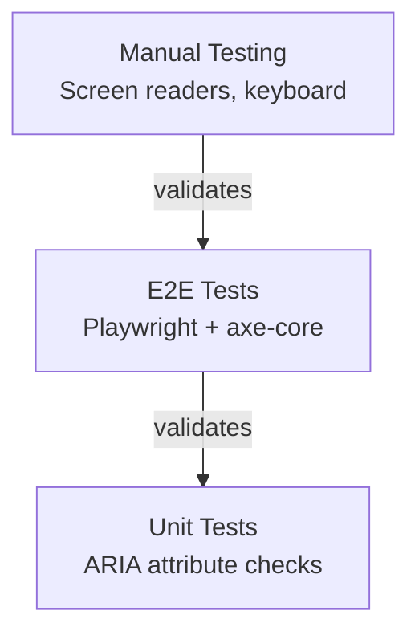
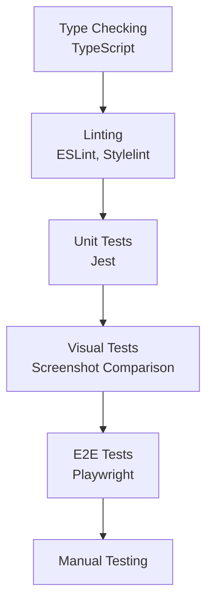
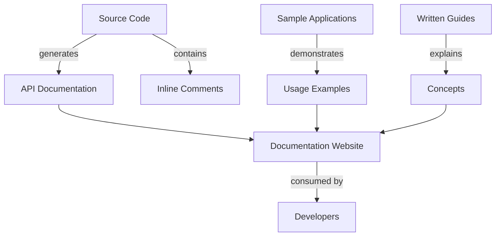
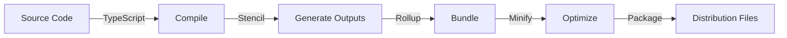

# 8. Cross-cutting Concepts

This section covers architectural principles and patterns that span multiple components and layers of the system. These cross-cutting concerns—accessibility, internationalization, security, performance, and testing—apply consistently throughout Public UI - KoliBri and form the foundation of its design philosophy.

## 8.1 Accessibility (A11y)

Accessibility is the cornerstone of Public UI - KoliBri. Every component is designed and tested to ensure usability for all people, regardless of their abilities or the assistive technologies they use.

### Principles

Public UI - KoliBri follows the **WCAG 2.2 Level AAA** standards and **BITV** requirements as core principles, always implementing the latest version of accessibility standards.

### Implementation Strategy

| Aspect | Implementation | Verification |
|--------|---------------|--------------|
| **Keyboard Navigation** | All interactive elements accessible via keyboard (Tab, Enter, Space, Arrow keys, Escape) | Manual keyboard testing, automated tests |
| **Screen Reader Support** | Proper ARIA roles, labels, and states | Screen reader testing (JAWS, NVDA, VoiceOver) |
| **Color Contrast** | Minimum 4.5:1 for text, 3:1 for UI components | wcag-contrast library validation |
| **Touch Targets** | Minimum 44x44px for interactive elements | Built into component CSS, automated tests |
| **Focus Management** | Visible focus indicators, focus trapping in modals | Visual inspection, automated tests |
| **Semantic HTML** | Use correct HTML elements (button, input, nav, etc.) | HTML validation, manual review |
| **Alternative Text** | Images and icons have text alternatives | Manual review, automated checks |
| **Form Labels** | All form fields have associated labels | Automated accessibility tests |

### Accessibility Testing Pyramid



### Built-in Accessibility Features

Every KoliBri component includes:

1. **Semantic Structure**: Correct HTML elements and ARIA roles
2. **Keyboard Support**: Full keyboard navigation
3. **Focus Management**: Visible focus, logical tab order
4. **ARIA Attributes**: Dynamic state and property updates
5. **Contrast Compliance**: Colors meet WCAG standards
6. **Responsive Text**: Supports browser zoom up to 200%
7. **Error Handling**: Clear error messages with programmatic associations

## 8.2 Internationalization (i18n)

Public UI - KoliBri provides robust internationalization support through browser-based language detection and flexible configuration options.

### Language Support

Components support internationalization based on browser language and locale settings, as well as HTML element attributes:

- **Browser Language Detection**: Automatically uses browser's language settings
- **HTML Attributes**: Respects `lang`, `dir` (for RTL), and locale attributes on the `html` element
- **Translation Management**: Optional key-value language maps configured during bootstrap/register call
- **i18next Integration**: Native support for i18next translation framework

### Implementation

```typescript
// Translation management via register configuration
import { register } from '@public-ui/components';
import { defineCustomElements } from '@public-ui/components/loader';
import { DEFAULT } from '@public-ui/theme-default';

await register(DEFAULT, defineCustomElements, {
	translations: {
		'de': {
			'button.submit': 'Absenden',
			'button.cancel': 'Abbrechen'
		},
		'en': {
			'button.submit': 'Submit',
			'button.cancel': 'Cancel'
		}
	}
});

// Components receive translated strings via props
<KolButton _label="button.submit" />

// Browser locale respected for formatting
<KolInputDate /> // Uses browser locale automatically
```

### Best Practices

- Set `lang` and `dir` attributes on the HTML element for proper localization
- Provide translation keys rather than hard-coded text
- Use i18next integration for complex translation needs
- Components automatically format dates, numbers, and currencies based on browser locale

## 8.3 Security

### Security Principles

| Principle | Implementation |
|-----------|---------------|
| **No XSS Vulnerabilities** | All user input sanitized, Shadow DOM provides isolation |
| **Content Security Policy** | Components work with strict CSP |
| **Dependency Security** | Regular security scans, automated updates |
| **Secure Defaults** | Components configured securely by default |
| **SLSA Provenance** | Build Level 3 attestations for published packages |

### Security Measures

1. **Dependency Scanning**
   - Dependabot alerts for vulnerable dependencies
   - Regular dependency updates
   - License compliance checks

2. **Code Scanning**
   - CodeQL analysis in CI/CD
   - Static security analysis
   - Vulnerability detection

3. **Build Security**
   - SLSA Build Level 3 compliance
   - Signed packages with provenance
   - Reproducible builds

4. **Input Validation**
   - All props validated with TypeScript types
   - Runtime validation for critical values
   - Sanitization of HTML content

### Security Best Practices

- Never trust user input
- Use TypeScript for type safety
- Keep dependencies updated
- Follow OWASP guidelines
- Report security issues responsibly

## 8.4 Performance

### Performance Principles

| Principle | Implementation |
|-----------|---------------|
| **Small Bundle Size** | Tree-shakeable exports, lazy loading |
| **Fast Rendering** | Shadow DOM, virtual DOM diffing |
| **Efficient Styling** | Adopted style sheets, CSS containment |
| **Minimal Dependencies** | Only essential runtime dependencies |
| **Optimal Loading** | Code splitting, lazy component loading |

### Performance Optimization Techniques

1. **Lazy Loading**
   - Components loaded on-demand
   - Reduces initial bundle size
   - Faster page load times

2. **Shadow DOM**
   - Efficient style scoping
   - No global CSS pollution
   - Optimized rendering

3. **Adopted Style Sheets**
   - Shared styles across components
   - Efficient theme switching
   - Memory efficient

4. **Code Splitting**
   - Each component in separate bundle
   - Only load what you use
   - Optimized for HTTP/2

### Performance Metrics

Target metrics for applications using KoliBri:

- **Lighthouse Performance Score**: >90
- **First Contentful Paint**: <1.8s
- **Time to Interactive**: <3.8s
- **Total Blocking Time**: <300ms
- **Cumulative Layout Shift**: <0.1

## 8.5 Testing Strategy



### Testing Levels

1. **Type Checking** (TypeScript)
   - Catch type errors at compile time
   - Ensure API correctness
   - IDE support

2. **Linting** (ESLint, Stylelint)
   - Enforce code quality
   - Consistent code style
   - Best practice compliance

3. **Unit Tests** (Jest)
   - Test component logic
   - Property validation
   - State management
   - Coverage target: >80%

4. **Visual Tests**
   - Screenshot comparison
   - Theme validation
   - Cross-browser appearance

5. **E2E Tests** (Playwright)
   - User workflows
   - Component interactions
   - Accessibility validation (axe-core)

6. **Manual Testing**
   - Screen reader testing
   - Cross-browser testing
   - Exploratory testing

### Test Automation

- **CI/CD Integration**: All tests run in GitHub Actions
- **Pre-commit Hooks**: Linting and formatting
- **Pull Request Checks**: All tests must pass
- **Scheduled Tests**: Regular security and dependency scans

## 8.6 Error Handling

### Error Handling Strategy

| Error Type | Handling Approach |
|-----------|-------------------|
| **Invalid Props** | TypeScript validation, runtime warnings, fallback to defaults |
| **Missing Dependencies** | Clear error messages, documentation links |
| **Browser Support** | Feature detection, graceful degradation, error messages |
| **Theme Errors** | Fallback to accessibility baseline, console warnings |
| **Runtime Errors** | Try-catch blocks, error boundaries (in frameworks), user-friendly messages |

### Error Communication

1. **Developer Errors** (Console)
   - TypeScript type errors
   - Invalid property warnings
   - Missing required props

2. **User Errors** (UI)
   - Form validation errors
   - Required field indicators
   - Inline error messages
   - Error summaries

3. **Accessibility Errors**
   - ARIA live regions for dynamic errors
   - Error messages associated with fields
   - Clear error identification

## 8.7 Documentation

### Documentation Strategy



### Documentation Types

1. **API Documentation**
   - Auto-generated from TypeScript
   - Component properties and methods
   - Event descriptions
   - Type definitions

2. **Usage Examples**
   - Working code samples
   - React sample application
   - Angular sample application
   - Framework integration guides

3. **Conceptual Documentation**
   - Architecture overview
   - Theming guide
   - Accessibility guidelines
   - Migration guides

4. **Inline Documentation**
   - JSDoc comments in code
   - TypeScript type definitions
   - CSS comments explaining styles

### Documentation Principles

- **Keep docs in sync**: Update docs with code changes
- **Examples over explanation**: Show working code
- **Searchable**: Clear structure and naming
- **Multi-level**: From quick start to advanced topics
- **Accessible**: Documentation itself must be accessible

## 8.8 Code Quality

### Quality Enforcement

| Aspect | Tool | Enforcement |
|--------|------|------------|
| **Formatting** | Prettier | Pre-commit hook, CI check |
| **Linting** | ESLint, Stylelint | CI check, no inline disabling |
| **Type Safety** | TypeScript | Compilation step, strict mode |
| **Testing** | Jest, Playwright | CI check, coverage requirements |
| **Security** | CodeQL, Dependabot | Automated scanning |
| **Code Review** | GitHub PR reviews | Required before merge |

### Code Conventions

1. **Naming Conventions**
   - Components: PascalCase with "Kol" prefix (KolButton)
   - Properties: camelCase, prefixed with underscore (_label)
   - CSS classes: BEM methodology
   - Files: kebab-case

2. **File Organization**
   - One component per directory
   - Component, styles, tests together
   - Alphabetical ordering in lists

3. **Code Style**
   - 160 character line width
   - Tabs for indentation
   - Single quotes
   - Trailing commas
   - No semicolons (when optional)

## 8.9 Versioning and Compatibility

### Semantic Versioning

KoliBri strictly follows SemVer 2.0:

- **Major**: Breaking changes
- **Minor**: New features, backwards compatible
- **Patch**: Bug fixes, backwards compatible

### Compatibility Strategy

| Version Type | Support Duration | Purpose |
|-------------|-----------------|---------|
| **LTS** | 3 years | Long-term support for enterprises |
| **STS** | 15 months | Short-term support for rapid innovation |
| **Development** | Until next release | Latest features and improvements |

### Breaking Change Management

1. **Deprecation First**: Mark features as deprecated before removal
2. **Migration Guide**: Provide detailed upgrade instructions
3. **Migration Tool**: CLI tool automates code updates
4. **Parallel Support**: Deprecated features work in one major version
5. **Clear Communication**: Release notes explain all breaking changes

## 8.10 Build and Release

### Build Process



### Build Artifacts

Each package produces:

- ES Modules (modern browsers)
- CommonJS (Node.js, legacy bundlers)
- TypeScript definitions (.d.ts)
- Custom Elements JSON (metadata)
- Lazy loading wrapper
- Source maps (development)

### Release Process

1. **Version Bump**: Update version in all package.json files
2. **Changelog**: Document all changes
3. **Tag Creation**: Create git tag (triggers CI)
4. **Build**: CI builds all packages
5. **Test**: CI runs full test suite
6. **Publish**: CI publishes to npm with provenance
7. **Documentation**: Update documentation site
8. **Announcement**: Release notes, social media

### Release Channels

- **Latest**: Current stable release
- **Next**: Pre-release versions for testing
- **LTS**: Long-term support versions
- **Legacy**: Older versions (security fixes only)
