# 10. Quality Requirements

## 10.1 Quality Tree

```mermaid
graph TB
    Quality[Quality Requirements]
    
    Quality --> Accessibility
    Quality --> Maintainability
    Quality --> Performance
    Quality --> Usability
    Quality --> Compatibility
    Quality --> Security
    
    Accessibility --> A1[WCAG 2.1 AA Compliance]
    Accessibility --> A2[Screen Reader Support]
    Accessibility --> A3[Keyboard Navigation]
    
    Maintainability --> M1[Code Quality]
    Maintainability --> M2[Documentation]
    Maintainability --> M3[Test Coverage]
    
    Performance --> P1[Bundle Size]
    Performance --> P2[Rendering Speed]
    Performance --> P3[Memory Usage]
    
    Usability --> U1[Developer Experience]
    Usability --> U2[Clear Documentation]
    Usability --> U3[Error Messages]
    
    Compatibility --> C1[Framework Support]
    Compatibility --> C2[Browser Support]
    Compatibility --> C3[Version Stability]
    
    Security --> S1[No Vulnerabilities]
    Security --> S2[Secure Defaults]
    Security --> S3[Build Provenance]
```

## 10.2 Quality Scenarios

### Accessibility Scenarios

#### Scenario A1: Screen Reader Navigation

**Quality Goal:** Full accessibility for screen reader users

| Aspect | Details |
|--------|---------|
| **Stimulus** | User with screen reader navigates application |
| **Environment** | Production web application, JAWS/NVDA/VoiceOver |
| **Response** | All components announce correctly, keyboard navigation works |
| **Measure** | 100% of interactive components accessible via screen reader |

**Acceptance Criteria:**

- Screen reader announces component role, name, and state
- User can activate all interactive elements via keyboard
- Focus order is logical and predictable
- Dynamic changes announced via ARIA live regions

#### Scenario A2: Keyboard Navigation

**Quality Goal:** Complete keyboard access to all functionality

| Aspect | Details |
|--------|---------|
| **Stimulus** | User navigates application using only keyboard |
| **Environment** | Any modern browser |
| **Response** | All interactive elements accessible, focus visible |
| **Measure** | 100% of features usable with keyboard alone |

**Acceptance Criteria:**

- Tab key moves focus through all interactive elements
- Enter/Space activates buttons and controls
- Arrow keys navigate within composite widgets (menus, tabs)
- Escape closes modal dialogs and dropdowns
- Focus indicators always visible (3px outline, 3:1 contrast)

#### Scenario A3: Color Contrast

**Quality Goal:** Sufficient contrast for readability

| Aspect | Details |
|--------|---------|
| **Stimulus** | User with low vision views components |
| **Environment** | Any browser, default theme |
| **Response** | All text and UI elements meet contrast requirements |
| **Measure** | 100% of elements meet WCAG AA contrast ratios |

**Acceptance Criteria:**

- Normal text (< 18pt): Minimum 4.5:1 contrast
- Large text (≥ 18pt): Minimum 3:1 contrast
- UI components: Minimum 3:1 contrast
- Focus indicators: Minimum 3:1 contrast
- Automated wcag-contrast library validation

### Performance Scenarios

#### Scenario P1: Initial Load Time

**Quality Goal:** Fast initial page load

| Aspect | Details |
|--------|---------|
| **Stimulus** | User opens application for first time |
| **Environment** | 4G mobile connection, mid-range device |
| **Response** | Page loads and becomes interactive quickly |
| **Measure** | Time to Interactive < 3.8 seconds |

**Acceptance Criteria:**

- First Contentful Paint < 1.8s
- Time to Interactive < 3.8s
- Total Blocking Time < 300ms
- Lighthouse Performance Score > 90

#### Scenario P2: Component Load

**Quality Goal:** Lazy loading efficiency

| Aspect | Details |
|--------|---------|
| **Stimulus** | User encounters new component type |
| **Environment** | Application already loaded |
| **Response** | Component loads without noticeable delay |
| **Measure** | Component appears within 200ms |

**Acceptance Criteria:**

- Individual component bundles < 50KB
- Component loads in < 200ms on 4G
- No layout shift when component appears
- Lazy loading works correctly

#### Scenario P3: Theme Switching

**Quality Goal:** Instant theme changes

| Aspect | Details |
|--------|---------|
| **Stimulus** | User switches theme (dark mode, high contrast) |
| **Environment** | Application with multiple components rendered |
| **Response** | Theme changes instantly across all components |
| **Measure** | Visual change within 16ms (one frame) |

**Acceptance Criteria:**

- Theme switch completes in < 16ms
- No re-rendering of components required
- No layout shifts during theme change
- Memory usage remains stable

### Maintainability Scenarios

#### Scenario M1: Add New Component

**Quality Goal:** Easy addition of new components

| Aspect | Details |
|--------|---------|
| **Stimulus** | Developer adds new component to library |
| **Environment** | Development environment, fresh checkout |
| **Response** | Component works with all themes and frameworks |
| **Measure** | New component integrated in < 8 hours |

**Acceptance Criteria:**

- Component scaffolding available
- Clear documentation for component creation
- Automated tests pass
- Framework adapters generated automatically
- Visual regression tests created

#### Scenario M2: Fix Bug

**Quality Goal:** Quick and safe bug fixes

| Aspect | Details |
|--------|---------|
| **Stimulus** | Bug reported in production component |
| **Environment** | Component with existing tests |
| **Response** | Bug fixed without breaking other features |
| **Measure** | Fix and verification in < 4 hours |

**Acceptance Criteria:**

- Bug reproducible via test
- Fix doesn't break existing tests
- Regression test added
- All automated checks pass
- PR reviewed and merged

#### Scenario M3: Upgrade Major Version

**Quality Goal:** Smooth version upgrades

| Aspect | Details |
|--------|---------|
| **Stimulus** | Application needs to upgrade from v3 to v4 |
| **Environment** | Large application using many components |
| **Response** | Upgrade completed with minimal manual changes |
| **Measure** | 90% of changes automated via migration tool |

**Acceptance Criteria:**

- Migration guide available
- CLI tool automates code changes
- Breaking changes documented
- Deprecated features still work with warnings
- Parallel version support for transition

### Usability Scenarios

#### Scenario U1: First Component Integration

**Quality Goal:** Easy for new developers

| Aspect | Details |
|--------|---------|
| **Stimulus** | New developer integrates first component |
| **Environment** | React/Angular/Vue application |
| **Response** | Component works without issues |
| **Measure** | Working integration in < 15 minutes |

**Acceptance Criteria:**

- Quick start guide available
- Installation with single command
- Example code works copy-paste
- TypeScript types work in IDE
- Clear error messages if misconfigured

#### Scenario U2: Debug Component Issue

**Quality Goal:** Easy debugging

| Aspect | Details |
|--------|---------|
| **Stimulus** | Component doesn't render as expected |
| **Environment** | Browser dev tools |
| **Response** | Developer identifies and fixes issue |
| **Measure** | Issue identified in < 10 minutes |

**Acceptance Criteria:**

- Shadow DOM inspectable in dev tools
- Clear console warnings for invalid props
- Helpful error messages
- Documentation explains common issues
- Component state visible in dev tools

#### Scenario U3: Create Custom Theme

**Quality Goal:** Easy theme customization

| Aspect | Details |
|--------|---------|
| **Stimulus** | Designer wants to apply brand colors |
| **Environment** | SASS/CSS knowledge, design system |
| **Response** | Custom theme created and applied |
| **Measure** | Basic theme in < 2 hours |

**Acceptance Criteria:**

- Theme template available
- Documentation explains theming system
- SASS variables documented
- Example themes as reference
- Visual regression tests provided

### Compatibility Scenarios

#### Scenario C1: Framework Integration

**Quality Goal:** Work with any major framework

| Aspect | Details |
|--------|---------|
| **Stimulus** | Developer uses component in React/Angular/Vue |
| **Environment** | Latest framework version |
| **Response** | Component works naturally in framework |
| **Measure** | 100% of features work in all supported frameworks |

**Acceptance Criteria:**

- Framework adapter available
- Framework-specific patterns supported
- TypeScript types work
- Events integrate with framework event system
- Props follow framework conventions

#### Scenario C2: Browser Support

**Quality Goal:** Work in all modern browsers

| Aspect | Details |
|--------|---------|
| **Stimulus** | User opens application in browser |
| **Environment** | Chrome, Firefox, Safari, Edge (latest 2 versions) |
| **Response** | Components render and function correctly |
| **Measure** | 100% feature parity across browsers |

**Acceptance Criteria:**

- Visual appearance consistent
- All features functional
- Performance acceptable
- No console errors
- Automated cross-browser testing

#### Scenario C3: Version Compatibility

**Quality Goal:** Smooth upgrades between versions

| Aspect | Details |
|--------|---------|
| **Stimulus** | Application uses older component version |
| **Environment** | Production application |
| **Response** | Can upgrade without breaking changes (within major) |
| **Measure** | Zero breaking changes in minor/patch versions |

**Acceptance Criteria:**

- SemVer strictly followed
- Deprecation warnings before removal
- LTS version gets security fixes
- Clear upgrade path documented
- Migration tool available for major versions

### Security Scenarios

#### Scenario S1: No XSS Vulnerabilities

**Quality Goal:** Prevent cross-site scripting

| Aspect | Details |
|--------|---------|
| **Stimulus** | Application passes user input to component |
| **Environment** | Component with text content |
| **Response** | Malicious scripts do not execute |
| **Measure** | Zero XSS vulnerabilities |

**Acceptance Criteria:**

- All user input sanitized
- Shadow DOM provides isolation
- No innerHTML with user content
- CSP compatible
- Automated security scanning passes

#### Scenario S2: Dependency Vulnerabilities

**Quality Goal:** No vulnerable dependencies

| Aspect | Details |
|--------|---------|
| **Stimulus** | Security vulnerability disclosed in dependency |
| **Environment** | Production application |
| **Response** | Vulnerability patched quickly |
| **Measure** | Critical vulnerabilities fixed within 24 hours |

**Acceptance Criteria:**

- Automated vulnerability scanning
- Dependabot alerts enabled
- Regular dependency updates
- Security patches prioritized
- Users notified of security updates

#### Scenario S3: Build Security

**Quality Goal:** Verifiable build provenance

| Aspect | Details |
|--------|---------|
| **Stimulus** | Organization audits dependencies |
| **Environment** | Published npm packages |
| **Response** | Build provenance verifiable |
| **Measure** | SLSA Build Level 3 compliance |

**Acceptance Criteria:**

- Builds in GitHub Actions with OIDC
- Published with npm provenance
- Signed attestations available
- Reproducible builds
- Supply chain security validated

## 10.3 Quality Metrics

| Quality Attribute | Metric | Target | Measurement Method |
|-------------------|--------|--------|-------------------|
| **Accessibility** | WCAG 2.1 AA Compliance | 100% | Manual testing + axe-core |
| **Accessibility** | Keyboard Navigation | 100% | Manual testing |
| **Performance** | Lighthouse Score | > 90 | Automated Lighthouse tests |
| **Performance** | Time to Interactive | < 3.8s | Lighthouse/WebPageTest |
| **Performance** | Bundle Size | < 50KB per component | Bundlephobia analysis |
| **Maintainability** | Test Coverage | > 80% | Jest coverage report |
| **Maintainability** | Code Duplication | < 5% | SonarQube/manual review |
| **Security** | Vulnerabilities | 0 critical/high | Dependabot, CodeQL |
| **Usability** | Time to First Component | < 15 min | User testing |
| **Compatibility** | Browser Support | Latest 2 versions | Automated testing |
| **Quality** | Linting Errors | 0 | ESLint, Stylelint |
| **Quality** | Type Errors | 0 | TypeScript compiler |

## 10.4 Quality Assurance Methods

| Method | Purpose | Frequency | Responsible |
|--------|---------|-----------|-------------|
| **Automated Tests** | Catch regressions | Every commit | CI/CD |
| **Code Review** | Ensure quality | Every PR | Team members |
| **Accessibility Audit** | WCAG compliance | Every component | A11y specialists |
| **Performance Testing** | Monitor performance | Weekly | Automated tests |
| **Security Scanning** | Find vulnerabilities | Every commit | CodeQL, Dependabot |
| **User Testing** | Validate usability | Before major releases | UX team |
| **Visual Regression** | Detect visual changes | Every theme change | Visual tests |
| **Manual Testing** | Exploratory testing | Before releases | QA team |
