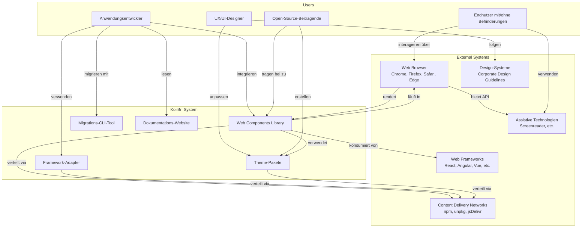
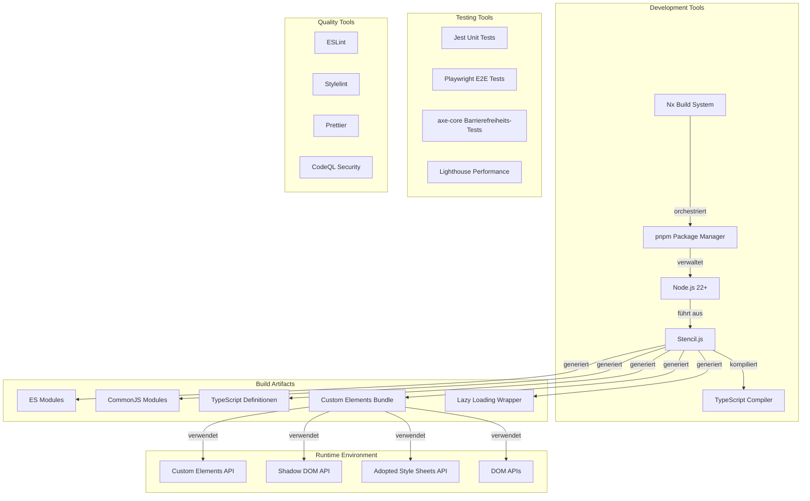

# 3. Kontextabgrenzung

Dieser Abschnitt definiert die Grenzen von Public UI - KoliBri, indem er identifiziert, was innerhalb und außerhalb des Systems liegt. Er klärt die Beziehungen zu externen Systemen, Nutzern und Abhängigkeiten und bietet sowohl geschäftliche als auch technische Perspektiven auf die Systemumgebung.

## 3.1 Fachlicher Kontext

### Beschreibung des fachlichen Kontexts

| Partner/Schnittstelle | Eingabe | Ausgabe | Beschreibung |
|-------------------|-------|--------|-------------|
| **Anwendungsentwickler** | Integrationsanforderungen, Bug-Reports, Feature-Requests | Web-Komponenten, Framework-Adapter, Dokumentation | Hauptnutzer, die KoliBri in ihre Anwendungen integrieren |
| **Web-Frameworks** | Framework-APIs und -Konventionen | Framework-spezifische Adapter (React, Angular, Vue, etc.) | KoliBri bietet native Integrationen für beliebte Frameworks |
| **Web-Browser** | Webstandard-APIs (Custom Elements, Shadow DOM) | Gerenderte barrierefreie Komponenten | KoliBri-Komponenten laufen in modernen Browsern |
| **Assistive Technologien** | ARIA-Attribute, semantisches HTML | Barrierefreie Benutzeroberfläche | Komponenten stellen korrekte Barrierefreiheitsinformationen bereit |
| **Design-Systeme** | Design-Tokens, Style-Guides, Markenrichtlinien | Themenbezogene Komponenten | Organisationen wenden ihr Design-System über Themes an |
| **npm Registry** | Paketverteilungsinfrastruktur | Veröffentlichte npm-Pakete | Primärer Verteilungskanal für Komponenten und Themes |
| **Endnutzer** | Nutzerinteraktionen (Klick, Tastatur, Touch) | Barrierefreie Nutzererfahrung | Letztliche Nutznießer barrierefreier Komponenten |
| **Open-Source-Community** | Beiträge, Bug-Reports, Diskussionen | Verbesserte Komponenten, neue Features | Community treibt Evolution und Qualität voran |

## 3.2 Technischer Kontext

### Technische Schnittstellen

| Schnittstelle | Technologie | Beschreibung |
|-----------|------------|-------------|
| **Komponentendefinition** | Stencil.js, TypeScript | Komponenten werden mit Stencil-Dekoratoren und TypeScript-Klassen definiert |
| **Komponentenregistrierung** | Custom Elements API | Komponenten registrieren sich als benutzerdefinierte HTML-Elemente |
| **Style-Kapselung** | Shadow DOM, Adopted Style Sheets | Styles sind über Shadow DOM auf Komponenten beschränkt |
| **Theme-Anwendung** | CSS, SASS, Adopted Style Sheets | Themes stellen CSS bereit, das als Adopted Style Sheets geladen wird |
| **Framework-Integration** | Framework-spezifische Adapter | Generierte Adapter umhüllen Komponenten für React, Angular, Vue, etc. |
| **Build-System** | pnpm, Nx, Rollup (über Stencil) | Monorepo-Build orchestriert von pnpm und Nx |
| **Modulformate** | ES Modules, CommonJS | Komponenten in mehreren Modulformaten verteilt |
| **Typdefinitionen** | TypeScript .d.ts-Dateien | Vollständige TypeScript-Unterstützung für Entwickler |
| **Testing** | Jest, Playwright, axe-core | Unit-Tests, E2E-Tests und Barrierefreiheitsvalidierung |
| **Paketverteilung** | npm-Registry | Komponenten als npm-Pakete veröffentlicht |

### Kommunikationskanäle

| Kanal | Technologie | Zweck |
|---------|------------|---------|
| **Komponenten-Props** | JavaScript/TypeScript-Objekte | Konfiguration und Datenübergabe |
| **Komponenten-Events** | CustomEvent API | Komponenten-zu-Anwendungs-Kommunikation |
| **CSS Custom Properties** | CSS-Variablen (begrenzt) | Theme-Anpassungspunkte |
| **Slots** | Shadow DOM Slots | Inhaltsprojektion in Komponenten |
| **CSS Parts** | ::part() Pseudo-Element | Externes Styling von Komponenten-Interna (begrenzte Nutzung) |
| **ARIA-Attribute** | HTML-Attribute | Barrierefreiheitsinformationen für assistive Technologien |
