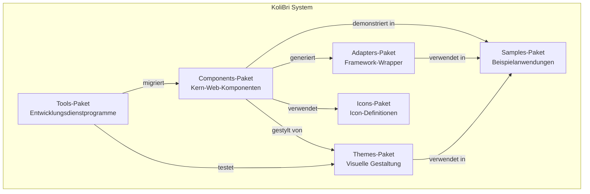
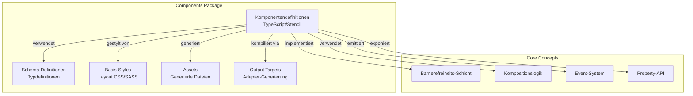
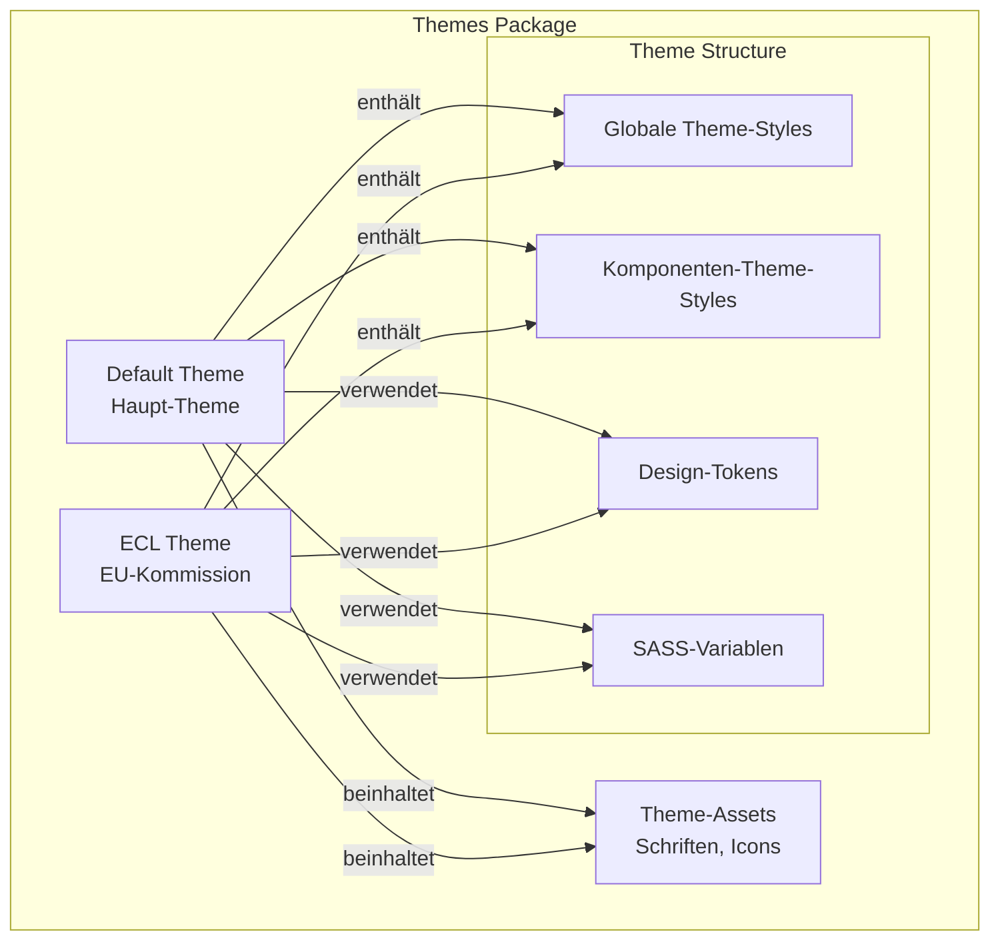
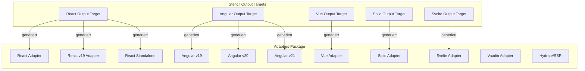
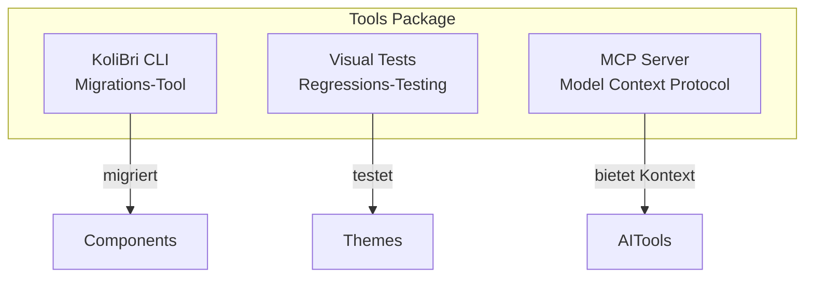

← [4. Lösungsstrategie](04-solution-strategy.md)

# 5. Bausteinsicht

Dieser Abschnitt zerlegt Public UI - KoliBri in seine wichtigsten strukturellen Elemente und zeigt, wie Pakete, Komponenten und Module organisiert sind und wie sie interagieren. Er bietet zunehmend detailliertere Ansichten der statischen Struktur des Systems, von High-Level-Paketen bis hinunter zur individuellen Komponentenorganisation.

## 5.1 Whitebox Gesamtsystem



### Enthaltene Bausteine

| Baustein       | Verantwortlichkeit                                                                   |
| -------------- | ------------------------------------------------------------------------------------ |
| **Components** | Kern-Web-Component-Bibliothek, stellt atomare, barrierefreie HTML-Komponenten bereit |
| **Themes**     | Visuelle Styling-Pakete, trennen Präsentation von Logik                              |
| **Adapters**   | Framework-spezifische Wrapper (React, Angular, Vue, etc.) für native Integration     |
| **Tools**      | Entwicklungs- und Migrations-Utilities (CLI, Visual Testing)                         |
| **Samples**    | Beispielanwendungen, die die Komponentennutzung demonstrieren                        |
| **Icons**      | Icon-Font-Definitionen und Assets                                                    |

### Wichtige Schnittstellen

| Schnittstelle                                                | Beschreibung                            |
| ------------------------------------------------------------ | --------------------------------------- |
| `@public-ui/components`                                      | Hauptexport der Komponentenbibliothek   |
| `@public-ui/theme-*`                                         | Theme-Pakete (default, ecl, etc.)       |
| `@public-ui/react`, `@public-ui/angular-*`, `@public-ui/vue` | Framework-Adapter                       |
| Theme-Registrierungs-API                                     | `register(theme, defineCustomElements)` |

## 5.2 Components-Paket (Ebene 2)



### Komponentenstruktur

Jede Komponente besteht aus:

1. **Komponentenklasse** (`.tsx`-Datei)
   - Stencil-Komponenten-Dekorator
   - Property-Definitionen mit Validatoren
   - Lifecycle-Methoden
   - Render-Methode (JSX)

2. **Schema-Definition** (`schema/`-Ordner)
   - TypeScript-Interfaces für Props
   - Typdefinitionen für internen State
   - Validierungs-Schemas

3. **Basis-Styles** (`.scss`-Dateien)
   - Nur Layout-Styles (keine Farben)
   - Barrierefreiheits-Konformität (Min-Größen, Fokus-Styles)
   - Responsives Verhalten

4. **Tests**
   - Unit-Tests (Jest)
   - E2E-Tests (Playwright)
   - Barrierefreiheits-Tests (axe-core)

### Komponentenkategorien

```
components/
├── @deprecated/        # Veraltete Komponenten (für Kompatibilität gepflegt)
├── @else/             # Utility-Komponenten
├── @shared/           # Geteilte Utilities und Mixins
├── abbr/              # Abkürzungs-Komponente
├── accordion/         # Akkordeon/ausklappbare Abschnitte
├── alert/             # Alarm-/Benachrichtigungsmeldungen
├── avatar/            # Benutzer-Avatar-Anzeige
├── badge/             # Badge-/Label-Komponente
├── breadcrumb/        # Breadcrumb-Navigation
├── button/            # Button-Komponente
├── button-link/       # Button als Link gestylt
├── card/              # Card-Container
├── combobox/          # Combo-Box/Autocomplete
└── ...               # 50+ weitere Komponenten
```

### Schlüsselkomponenten

| Komponente     | Zweck                                                     | Komplexität |
| -------------- | --------------------------------------------------------- | ----------- |
| `KolButton`    | Barrierefreier Button mit Icon- und Label-Unterstützung   | Mittel      |
| `KolInputText` | Texteingabe mit Validierung und Fehlerbehandlung          | Hoch        |
| `KolTable`     | Barrierefreie Datentabelle mit Sortierung und Paginierung | Hoch        |
| `KolModal`     | Barrierefreier Modal-Dialog mit Fokus-Management          | Hoch        |
| `KolIcon`      | Icon-Anzeige aus Icon-Fonts                               | Niedrig     |
| `KolLink`      | Barrierefreier Link mit Icon-Unterstützung                | Niedrig     |

## 5.3 Themes-Paket (Ebene 2)



### Theme-Paketstruktur

```
themes/
├── default/                   # Standard-KoliBri-Theme (primär)
│   ├── src/
│   │   ├── global.scss       # Globale Theme-Styles (Schicht 4)
│   │   ├── components/       # Komponenten-spezifische Styles (Schicht 5)
│   │   └── _variables.scss   # SASS-Variablen und Tokens
│   └── assets/               # Schriften, Icons (kopiert von components)
├── ecl/                      # European Commission Library Theme
├── assets/                   # Geteilte Theme-Assets
│   ├── material-icons/       # Material Icons Font
│   └── material-symbols/     # Material Symbols Font
└── package.json              # Workspace-Paket
```

### Theme-Styling-Schichten

1. **Schicht 1: A11y-Preset** (von `adopted-style-sheets`)
   - Basis-Barrierefreiheits-Styles
   - Mindestgrößen, Fokus-Indikatoren
   - Semantische Defaults

2. **Schicht 2: Basis Global** (von `components`)
   - Globale Layout-Defaults
   - Box-sizing, Font-Size-Baseline
   - Keine Farben oder Abstände

3. **Schicht 3: Basis Komponente** (von `components`)
   - Komponenten-spezifisches Layout
   - Nur strukturelles CSS
   - Keine Farben oder Abstände

4. **Schicht 4: Theme Global** (von `themes`)
   - Farben, Schriften, Abstände
   - Design-Tokens
   - Marken-spezifische Globals

5. **Schicht 5: Theme Komponente** (von `themes`)
   - Komponenten-spezifisches Theming
   - Farben, Rahmen, Schatten
   - Vollständiges visuelles Design

## 5.4 Adapters-Paket (Ebene 2)



### Adapter-Generierung

Alle Adapter werden **automatisch generiert** von Stencil Output Targets. Manuelle Bearbeitung ist verboten.

**Generierungsprozess:**

1. Komponente definiert in `packages/components/src/components/`
2. Stencil baut Komponente
3. Output Targets generieren Framework-spezifische Wrapper
4. Adapter platziert in `packages/adapters/{framework}/`
5. Jeder Adapter erhält eigenes npm-Paket

### Framework-Unterstützung

| Framework   | Paket(e)                                                                     | Zweck                              |
| ----------- | ---------------------------------------------------------------------------- | ---------------------------------- |
| **React**   | `@public-ui/react`, `@public-ui/react-v19`, `@public-ui/react-standalone`    | React 18, 19 und Standalone-Builds |
| **Angular** | `@public-ui/angular-v19`, `@public-ui/angular-v20`, `@public-ui/angular-v21` | Angular-Versionen 19, 20, 21       |
| **Vue**     | `@public-ui/vue`                                                             | Vue.js-Integration                 |
| **Solid**   | `@public-ui/solid`                                                           | SolidJS-Integration                |
| **Svelte**  | `@public-ui/svelte`                                                          | Svelte-Integration                 |
| **Preact**  | `@public-ui/preact`                                                          | Preact-Integration                 |
| **Vaadin**  | `@public-ui/vaadin`                                                          | Vaadin Flow (Java) Integration     |

## 5.5 Tools-Paket (Ebene 2)



### Tool-Komponenten

1. **KoliBri CLI** (`packages/tools/kolibri-cli/`)
   - Komponentenmigration zwischen Versionen
   - Projektanalyse und Abhängigkeitsprüfungen
   - Automatisierte Code-Transformationen
   - Migrations-Test-Framework

2. **Visual Tests** (`packages/tools/visual-tests/`)
   - Visuelle Regressionstests für Themes
   - Screenshot-Vergleich
   - Snapshot-Management
   - Theme-Validierung

3. **MCP Server** (`packages/tools/mcp/`)
   - Model Context Protocol Server
   - Stellt Repository-Kontext für AI-Tools bereit
   - Hilft bei Codegenerierung und Review

## 5.6 Wichtige Schnittstellen und Abhängigkeiten

### Externe Abhängigkeiten

| Paket                  | Zweck                          | Verwendet von                    |
| ---------------------- | ------------------------------ | -------------------------------- |
| `@stencil/core`        | Web-Component-Compiler         | Components                       |
| `adopted-style-sheets` | Style-Sheet-Adoptions-Polyfill | Components, Themes               |
| `@floating-ui/dom`     | Positionierungs-Engine         | Components (Tooltips, Dropdowns) |
| `markdown-it`          | Markdown-Rendering             | Components (Rich Text)           |
| `wcag-contrast`        | Kontrastverhältnis-Validierung | Components (Farbvalidierung)     |

### Interne Abhängigkeiten

```
Components → Icons
Components → Adapters (generiert)
Samples → Components
Samples → Adapters
Samples → Themes
Tools (CLI) → Components (für Migration)
Tools (Visual Tests) → Themes
```

### Build-Reihenfolge

1. **Icons** - Zuerst gebaut, keine Abhängigkeiten
2. **Components** - Hängt von Icons ab, generiert Adapters
3. **Themes** - Unabhängig, kann parallel gebaut werden
4. **Adapters** - Generiert durch Components-Build
5. **Samples** - Hängt von Components, Themes, Adapters ab
6. **Tools** - Meist unabhängig

→ [6. Laufzeitsicht](06-runtime-view.md)
