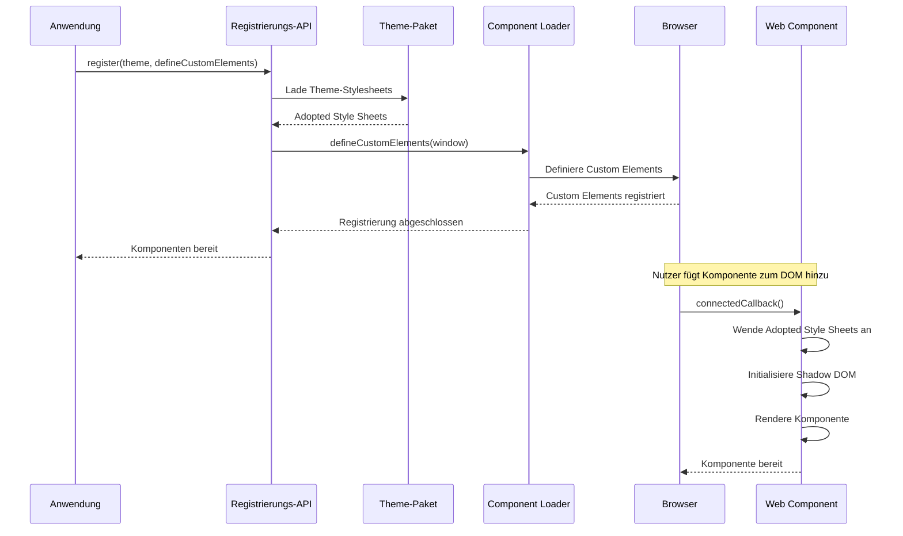
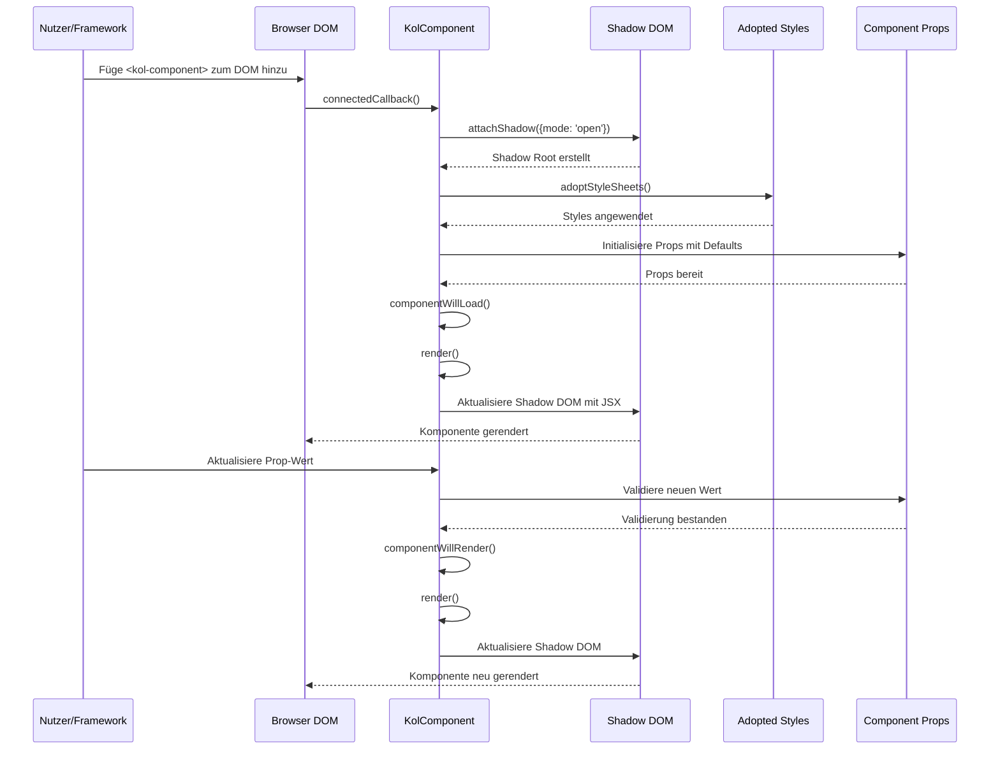
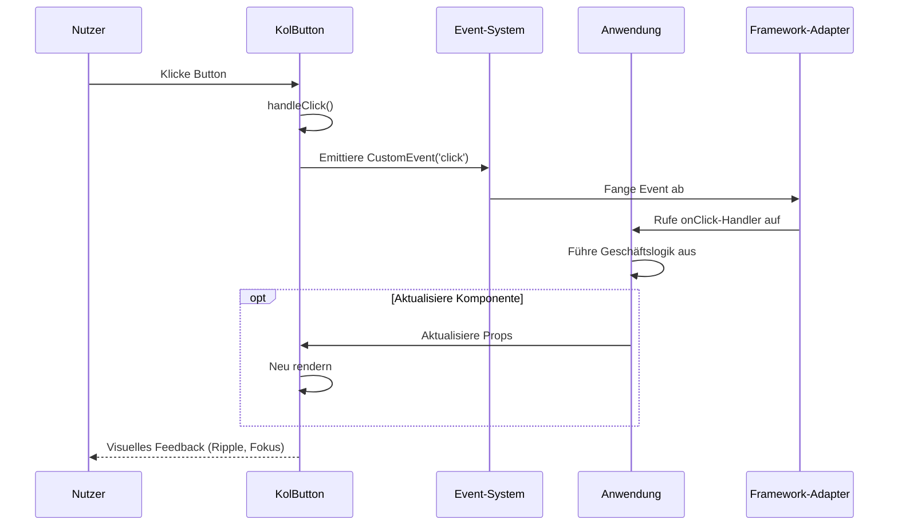
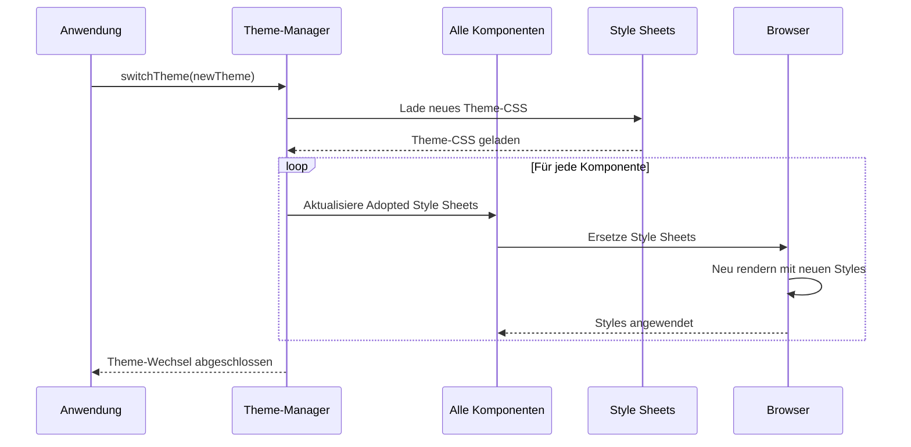
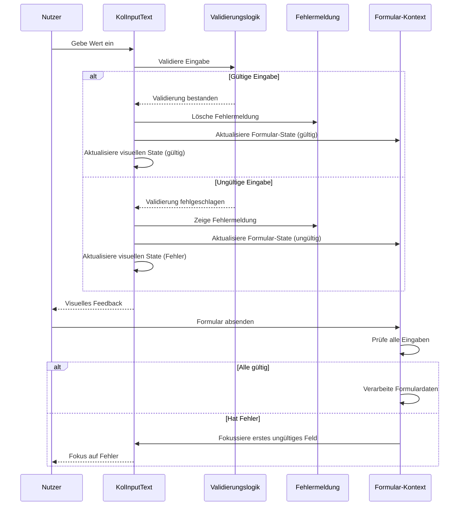
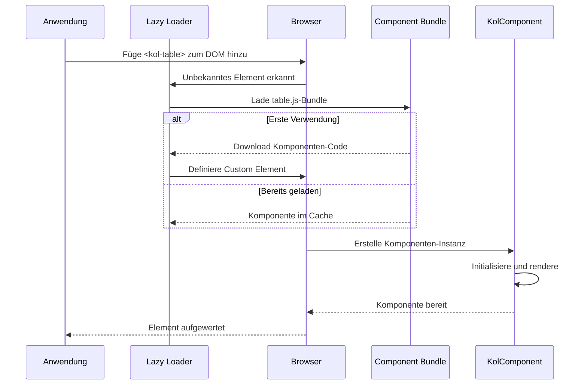
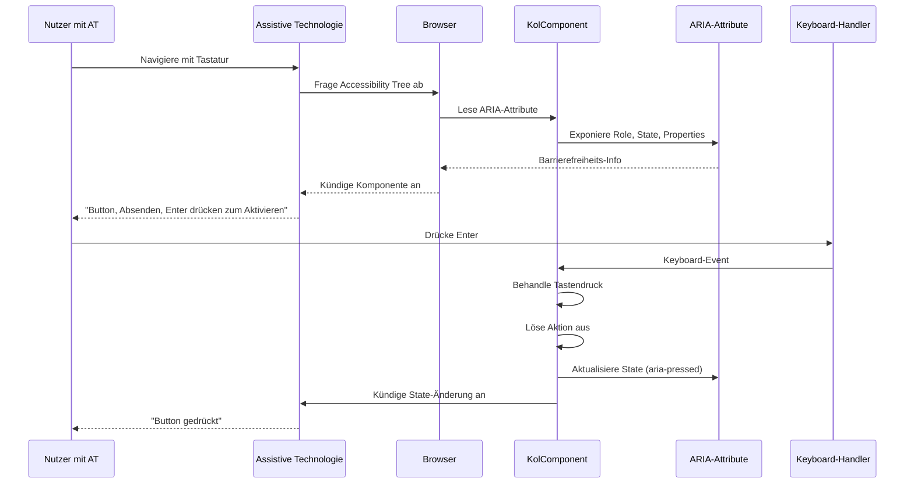

← [5. Bausteinsicht](05-building-block-view.md)

# 6. Laufzeitsicht

Dieser Abschnitt veranschaulicht das dynamische Verhalten von Public UI - KoliBri durch wichtige Laufzeitszenarien. Mithilfe von Sequenzdiagrammen und detaillierten Beschreibungen zeigt er, wie Komponenten während gängiger Operationen wie Initialisierung, Rendering, Event-Handling und Theme-Wechsel interagieren.

## 6.1 Komponentenregistrierung und Initialisierung

Der Komponentenregistrierungsprozess bildet die Grundlage für alle KoliBri-Komponenten in einer Anwendung. Dieser kritische Initialisierungsschritt muss erfolgen, bevor Komponenten gerendert werden.



### Szenario: Anwendungsstart

**Voraussetzungen:**

- Anwendung hat `@public-ui/components` und ein Theme-Paket installiert
- Anwendung importiert Registrierungsfunktion

**Schritte:**

1. Anwendung importiert Theme und Registrierungsfunktion:

   ```typescript
   import { register } from '@public-ui/components';
   import { defineCustomElements } from '@public-ui/components/loader';
   import { DEFAULT } from '@public-ui/theme-default';
   ```

2. Anwendung ruft `register()` mit Theme und Loader auf:

   ```typescript
   register(DEFAULT, defineCustomElements);
   ```

3. Registrierungsfunktion:
   - Lädt Theme-Stylesheets
   - Ruft `defineCustomElements()` auf, um alle Komponenten zu registrieren
   - Komponenten werden als Custom Elements im Browser definiert

4. Komponenten sind nun als HTML-Tags verfügbar (z.B. `<kol-button>`)

## 6.2 Komponenten-Rendering



### Szenario: Komponenten-Lebenszyklus

**Wenn eine Komponente zum DOM hinzugefügt wird:**

1. **connectedCallback()** - Browser benachrichtigt Komponente über DOM-Einfügung
2. **attachShadow()** - Komponente erstellt Shadow DOM zur Kapselung
3. **adoptStyleSheets()** - Theme-Styles über Adopted Style Sheets angewendet
4. **componentWillLoad()** - Komponenten-Initialisierungslogik läuft
5. **render()** - Komponente rendert JSX ins Shadow DOM
6. **componentDidLoad()** - Nachbereitungssetup (Event-Listener, etc.)

**Wenn sich eine Komponenten-Prop ändert:**

1. Property-Setter validiert neuen Wert
2. **componentWillRender()** - Pre-Render-Hook
3. **render()** - Komponente rendert neu mit neuen Daten
4. **componentDidRender()** - Post-Render-Hook
5. Shadow DOM aktualisiert effizient (Virtual DOM Diffing)

## 6.3 Event-Handling und Kommunikation



### Szenario: Button-Klick

**Schritte:**

1. Nutzer klickt Button-Element
2. Button's interner Klick-Handler wird ausgelöst
3. Komponente validiert Klick (nicht deaktiviert, etc.)
4. Komponente emittiert CustomEvent mit Typ-Information
5. Framework-Adapter (falls verwendet) fängt Event ab und ruft React/Angular/Vue-Handler auf
6. Anwendung führt Geschäftslogik aus
7. Anwendung kann Komponenten-Props aktualisieren, was Neu-Rendering auslöst

**Event-Typen:**

- Standard-HTML-Events (click, focus, blur, etc.)
- Benutzerdefinierte Komponenten-Events (change, close, select, etc.)
- Events durchlaufen Shadow DOM-Grenze (composed: true)

## 6.4 Theme-Wechsel



### Szenario: Runtime-Theme-Änderung

**Voraussetzungen:**

- Mehrere Theme-Pakete installiert
- Komponenten bereits registriert

**Schritte:**

1. Anwendung lädt neues Theme-Paket
2. Theme-Manager sammelt neue Style Sheets
3. Für jede Komponenteninstanz im DOM:
   - Ersetze Adopted Style Sheets mit neuem Theme
   - Browser rendert automatisch mit neuen Styles neu
4. Visuelles Erscheinungsbild ändert sich ohne Komponenten-Reinitialisierung

**Vorteile:**

- Kein Komponenten-Remounting erforderlich
- Sofortige visuelle Updates
- Erhält Komponenten-State
- Effizient - nur Styles ändern sich, nicht DOM-Struktur

## 6.5 Formular-Validierung



### Szenario: Eingabe-Validierung

**Schritte:**

1. Nutzer gibt Text in Eingabefeld ein
2. Eingabe-Komponente validiert bei Blur oder Echtzeit (je nach Konfiguration)
3. Validierungslogik prüft:
   - Pflichtfeld
   - Muster-Matching (Regex)
   - Min/Max-Länge
   - Benutzerdefinierte Validatoren
4. Wenn gültig:
   - Lösche Fehlermeldungen
   - Aktualisiere visuellen State auf gültig
   - Emittiere Valid-Event
5. Wenn ungültig:
   - Zeige Fehlermeldung
   - Aktualisiere visuellen State auf Fehler
   - Emittiere Invalid-Event
   - Verhindere Formular-Absendung

## 6.6 Lazy Loading



### Szenario: Komponenten-Lazy-Loading

**Schritte:**

1. Anwendung verwendet Component Loader (nicht direkte Imports)
2. Browser begegnet unbekanntem Custom Element (z.B. `<kol-table>`)
3. Stencil's Lazy Loader fängt ab
4. Loader holt Komponenten-Bundle on-demand
5. Komponenten-Code heruntergeladen und ausgeführt
6. Custom Element im Browser definiert
7. Browser "wertet" Element von unbekannt zu definiert auf
8. Komponente initialisiert und rendert

**Vorteile:**

- Kleinere initiale Bundle-Größe
- Komponenten nur bei Bedarf geladen
- Automatisches Code-Splitting
- Verbesserte Performance für große Anwendungen

## 6.7 Barrierefreiheits-Integration



### Szenario: Screenreader-Navigation

**Schritte:**

1. Nutzer mit Screenreader navigiert Seite mit Tab-Taste
2. Screenreader fragt Accessibility Tree des Browsers ab
3. Komponente exponiert:
   - Semantische Role (button, textbox, dialog, etc.)
   - State (expanded, selected, checked, etc.)
   - Properties (label, description, required, etc.)
4. Screenreader kündigt Komponenten-Informationen dem Nutzer an
5. Nutzer interagiert über Tastatur
6. Komponente behandelt Tastatur-Events (Enter, Space, Pfeiltasten, Escape)
7. Komponente aktualisiert ARIA-Attribute, um State-Änderungen zu reflektieren
8. Screenreader kündigt Änderungen dem Nutzer an

**Eingebaute Barrierefreiheits-Features:**

- Korrekte ARIA-Rollen auf allen interaktiven Elementen
- Tastaturnavigations-Unterstützung
- Fokus-Management (Fokus in Modals einfangen, etc.)
- Ausreichender Farbkontrast (WCAG 2.2 AAA konform)
- Minimale Touch-Target-Größen (44x44px)
- Semantische HTML-Struktur
- Fehlermeldungs-Assoziationen
- Live-Regions für dynamische Inhalte

→ [7. Verteilungssicht](07-deployment-view.md)
