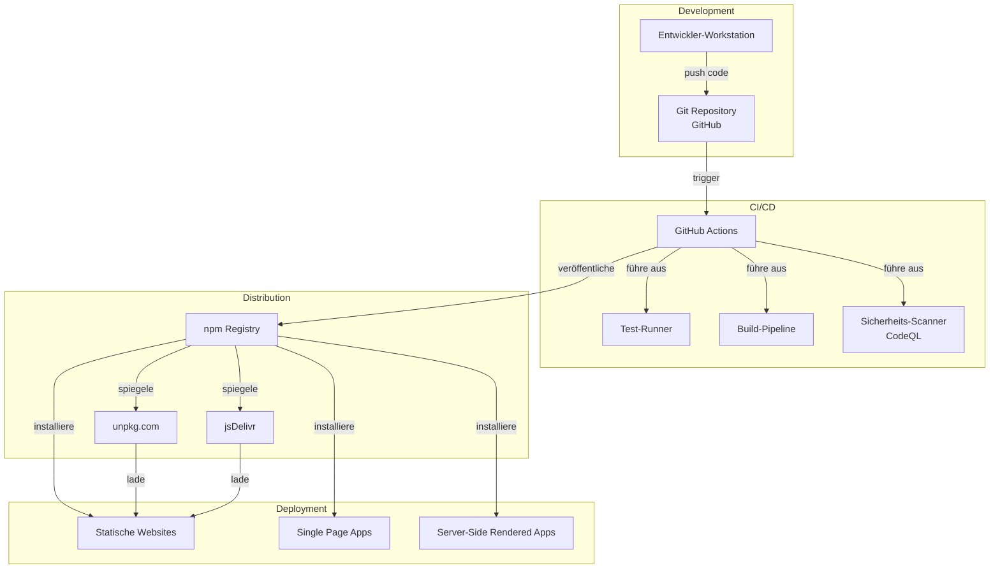
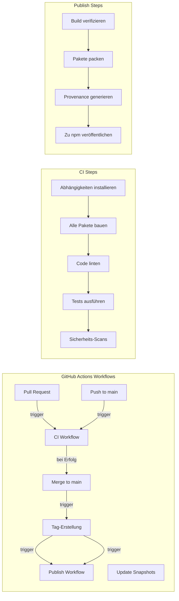
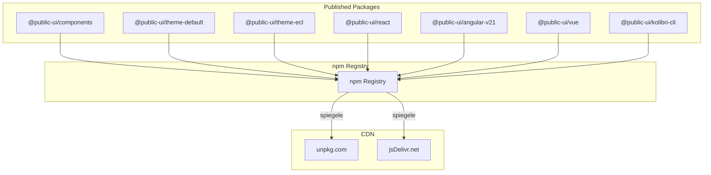
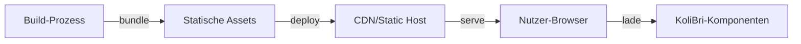
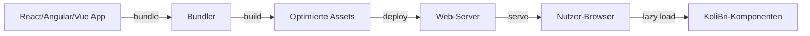
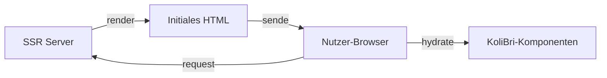
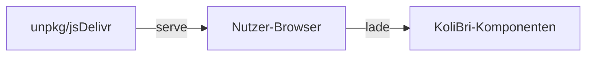
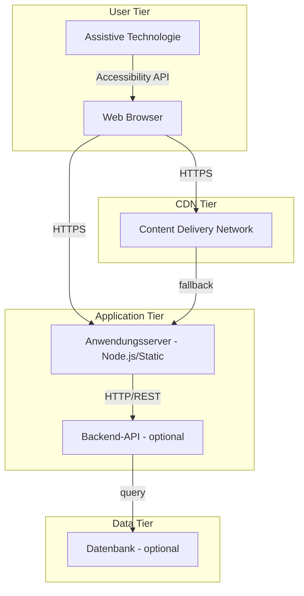

← [6. Laufzeitsicht](06-runtime-view.md)

# 7. Verteilungssicht

Dieser Abschnitt beschreibt die Infrastruktur und Verteilungsszenarien für Public UI - KoliBri. Er umfasst Entwicklungsumgebungen, CI/CD-Pipelines, Paketverteilungsstrategien und verschiedene Anwendungs-Verteilungsmuster, die Konsumenten bei der Integration von KoliBri-Komponenten in ihre Projekte verwenden können.

## 7.1 Infrastrukturübersicht



## 7.2 Entwicklungsumgebung

### Entwickler-Workstation-Anforderungen

| Komponente         | Anforderung                       | Zweck                                         |
| ------------------ | --------------------------------- | --------------------------------------------- |
| **Betriebssystem** | Windows 10+, macOS 11+ oder Linux | Plattformunabhängige Entwicklung              |
| **Node.js**        | Version 22.x (erforderlich)       | Runtime für Build-Tools                       |
| **pnpm**           | Version 10.x                      | Paketmanager                                  |
| **Git**            | Version 2.30+                     | Versionskontrolle                             |
| **IDE**            | VS Code (empfohlen)               | Code-Bearbeitung mit TypeScript-Unterstützung |
| **Browser**        | Chrome/Edge (zum Testen)          | Entwicklung und Testing                       |

### Lokales Setup

```bash
# Repository klonen
git clone https://github.com/public-ui/kolibri.git
cd kolibri

# Node.js 22 installieren
# (plattformspezifische Installation)

# pnpm aktivieren
corepack enable pnpm

# Abhängigkeiten installieren
pnpm i --ignore-scripts

# Alle Pakete bauen
pnpm -r build

# Entwicklungsserver starten
cd packages/samples/react
pnpm start
```

### Entwicklungs-Ports

| Port     | Dienst               | URL                   |
| -------- | -------------------- | --------------------- |
| 9191     | React-Beispiel-App   | http://localhost:9191 |
| 4200     | Angular-Beispiel-App | http://localhost:4200 |
| Variabel | Stencil-Dev-Server   | http://localhost:3333 |

## 7.3 CI/CD-Pipeline



### GitHub Actions Workflows

| Workflow                 | Trigger                      | Zweck                                          |
| ------------------------ | ---------------------------- | ---------------------------------------------- |
| **ci.yml**               | Push, Pull Request           | Tests, Linting, Builds ausführen               |
| **publish.yml**          | Tag-Erstellung               | Pakete zu npm mit Provenance veröffentlichen   |
| **update-pnpm-lock.yml** | Manueller Trigger            | `pnpm-lock.yaml` für einen Branch erneuern     |
| **update-snapshots.yml** | Manueller Trigger            | Visual Regression Test Snapshots aktualisieren |
| **codeql.yml**           | Push, Pull Request, Schedule | Sicherheits-Scanning mit CodeQL                |

### CI Quality Gates

Alle PRs müssen bestehen:

1. **Build**: Alle Pakete müssen ohne Fehler bauen
2. **Linting**: ESLint, Stylelint, TypeScript-Checks müssen bestehen
3. **Unit-Tests**: Alle Jest-Tests müssen bestehen
4. **E2E-Tests**: Playwright-Tests müssen bestehen
5. **Sicherheit**: CodeQL-Analyse muss bestehen, keine kritischen Schwachstellen
6. **Formatierung**: Code muss mit Prettier formatiert sein

## 7.4 Paketverteilung

### npm Registry

Primärer Verteilungskanal für KoliBri-Pakete:



### Paketstruktur

Jedes zu npm veröffentlichte Paket enthält:

```
@public-ui/components/
├── dist/                   # Kompiliertes JavaScript
│   ├── index.js           # ES-Modul-Einstieg
│   ├── index.cjs.js       # CommonJS-Einstieg
│   ├── types/             # TypeScript-Definitionen
│   └── esm/               # ES2017-Module
├── loader/                # Lazy-Loading-Wrapper
├── assets/                # Statische Assets (Icons, etc.)
├── doc/                   # Generierte Dokumentation
├── custom-elements.json   # Custom Elements Manifest
└── package.json           # Paket-Metadaten
```

### SLSA Provenance

KoliBri veröffentlicht Pakete mit SLSA Build Level 3 Provenance:

- Pakete in GitHub Actions mit OIDC-Identität gebaut
- Mit `--provenance`-Flag veröffentlicht
- Verifizierbare Attestierungen für alle veröffentlichten Artefakte
- Gewährleistet Build-Integrität und Supply-Chain-Sicherheit

Verifizierung:

```bash
# Provenance-Metadaten anzeigen
pnpm view @public-ui/components dist.provenance

# Signaturen verifizieren (falls npm-Client unterstützt)
pnpm audit signatures --package=@public-ui/components@latest
```

## 7.5 Anwendungs-Verteilungsszenarien

### Szenario 1: Statische Website



**Verteilung:**

- Komponenten mit Anwendungscode gebündelt
- Zu statischem Hosting deployed (Netlify, Vercel, GitHub Pages, S3, etc.)
- Kein Server-Side Rendering
- Alle Assets von CDN gecacht

**Beispiel:**

```html
<!DOCTYPE html>
<html>
	<head>
		<script type="module" src="./kolibri-components.js"></script>
		<link rel="stylesheet" href="./theme-default.css" />
	</head>
	<body>
		<kol-button _label="Klick mich"></kol-button>
	</body>
</html>
```

### Szenario 2: Single Page Application (SPA)



**Verteilung:**

- Komponenten über Framework-Adapter importiert
- Mit Anwendung über Webpack/Vite/Rollup gebündelt
- Lazy Loading für Code-Splitting
- Zu Anwendungsserver oder CDN deployed

**Beispiel (React):**

```typescript
import { KolButton } from '@public-ui/react';
import { register } from '@public-ui/components';
import { defineCustomElements } from '@public-ui/components/loader';
import { DEFAULT } from '@public-ui/theme-default';

await register(DEFAULT, defineCustomElements);

function App() {
	return <KolButton _label="Klick mich" />;
}
```

### Szenario 3: Server-Side Rendering (SSR)



**Verteilung:**

- Komponenten auf Client nach SSR hydratisiert
- Initiales HTML server-seitig gerendert
- Client-seitige Hydratisierung für Interaktivität
- Zu Node.js-Server oder Serverless-Funktionen deployed

**Überlegungen:**

- Verwende Hydrate-Adapter für SSR-Unterstützung
- Komponenten benötigen client-seitige Hydratisierung
- Shadow DOM erfordert sorgfältiges SSR-Handling

### Szenario 4: Nur CDN (Kein Build)



**Verteilung:**

- Komponenten direkt von CDN laden
- Kein Build-Schritt erforderlich
- Ideal für Prototypen und einfache Websites

**Beispiel:**

```html
<script type="module">
	import { defineCustomElements } from 'https://unpkg.com/@public-ui/components@latest/loader/index.mjs';
	import { register } from 'https://unpkg.com/@public-ui/components@latest/dist/index.js';
	import { DEFAULT } from 'https://unpkg.com/@public-ui/theme-default@latest/index.js';

	await register(DEFAULT, defineCustomElements);
</script>
```

## 7.6 Verteilungstopologie

### Multi-Tier-Architektur



### Komponenten-Lade-Strategie

1. **Initialer Ladevorgang**:
   - HTML-Seite mit Komponenten-Tags
   - Kern-Component-Loader-Skript
   - Theme-CSS

2. **Lazy Loading**:
   - Individuelle Komponenten-Bundles on-demand geladen
   - Nur verwendete Komponenten heruntergeladen
   - Browser-Caching für nachfolgende Ladevorgänge

3. **Caching-Strategie**:
   - Komponenten: Langer Cache (unveränderliche Versionen)
   - Themes: Langer Cache (unveränderliche Versionen)
   - Anwendungscode: Cache mit Revalidierung

## 7.7 Monitoring und Observability

### Client-Side-Monitoring

Empfehlungen für Anwendungen mit KoliBri:

- **Performance-Monitoring**: Web Vitals
- **Fehler-Tracking**: Sentry, Rollbar (Anwendungsebene)
- **Barrierefreiheits-Monitoring**: axe DevTools, automatisierte Scans
- **Bundle-Size-Tracking**: bundlephobia, webpack-bundle-analyzer

### Build-Pipeline-Monitoring

- **CI/CD-Status**: GitHub Actions Status-Badges
- **Test-Abdeckung**: Jest-Coverage-Reports
- **Sicherheits-Warnungen**: GitHub Dependabot, CodeQL-Warnungen
- **Paket-Gesundheit**: npm-Paket-Gesundheits-Score

### Metriken

Wichtige verfolgte Metriken:

- **Build-Zeit**: Vollständige Build-Dauer (~2 Minuten)
- **Test-Dauer**: Unit + E2E-Test-Ausführung (~3 Minuten)
- **Paketgröße**: Individuelle Paketgrößen
- **Download-Statistiken**: npm-Download-Zahlen
- **Issue-Auflösungszeit**: Zeit bis zum Schließen von Issues/PRs

→ [8. Querschnittliche Konzepte](08-cross-cutting-concepts.md)
