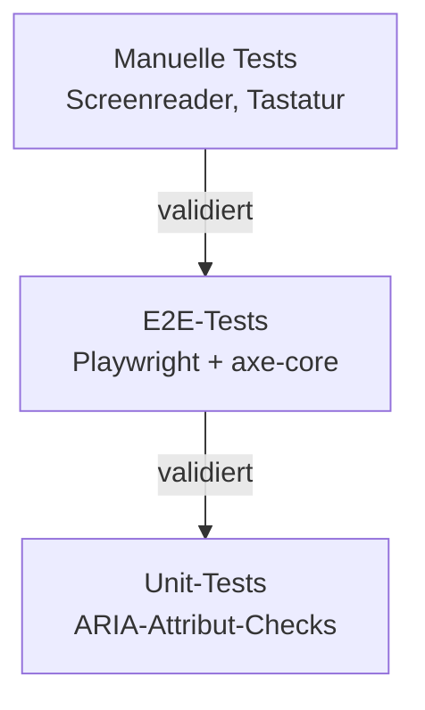
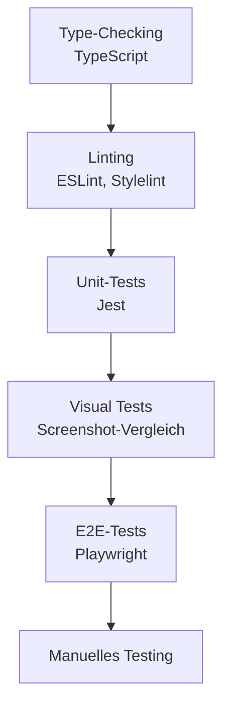
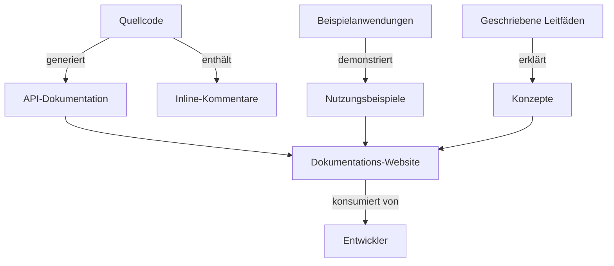
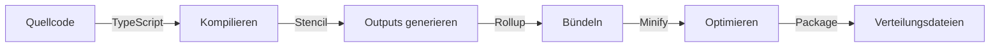

# 8. Querschnittliche Konzepte

Dieser Abschnitt behandelt architektonische Prinzipien und Muster, die mehrere Komponenten und Schichten des Systems überspannen. Diese querschnittlichen Belange – Barrierefreiheit, Internationalisierung, Sicherheit, Performance und Testing – gelten durchgängig in Public UI - KoliBri und bilden die Grundlage seiner Designphilosophie.

## 8.1 Barrierefreiheit (A11y)

Barrierefreiheit ist der Eckpfeiler von Public UI - KoliBri. Jede Komponente ist so designed und getestet, dass sie für alle Menschen nutzbar ist, unabhängig von ihren Fähigkeiten oder den verwendeten assistiven Technologien.

### Prinzipien

Public UI - KoliBri folgt den **WCAG 2.2 Level AAA** Standards und **BITV**-Anforderungen als Kernprinzipien und implementiert stets die neueste Version der Barrierefreiheitsstandards.

### Implementierungsstrategie

| Aspekt | Implementierung | Verifizierung |
|--------|---------------|--------------|
| **Tastaturnavigation** | Alle interaktiven Elemente über Tastatur zugänglich (Tab, Enter, Space, Pfeiltasten, Escape) | Manuelle Tastaturtests, automatisierte Tests |
| **Screenreader-Unterstützung** | Korrekte ARIA-Rollen, Labels und States | Screenreader-Tests (JAWS, NVDA, VoiceOver) |
| **Farbkontrast** | Minimum 4,5:1 für Text, 3:1 für UI-Komponenten | wcag-contrast-Bibliotheksvalidierung |
| **Touch-Targets** | Minimum 44x44px für interaktive Elemente | Eingebaut in Komponenten-CSS, automatisierte Tests |
| **Fokus-Management** | Sichtbare Fokus-Indikatoren, Fokus-Einfangung in Modals | Visuelle Inspektion, automatisierte Tests |
| **Semantisches HTML** | Verwendung korrekter HTML-Elemente (button, input, nav, etc.) | HTML-Validierung, manuelle Überprüfung |
| **Alternativtexte** | Bilder und Icons haben Textalternativen | Manuelle Überprüfung, automatisierte Checks |
| **Formular-Labels** | Alle Formularfelder haben zugeordnete Labels | Automatisierte Barrierefreiheits-Tests |

### Barrierefreiheits-Test-Pyramide



### Eingebaute Barrierefreiheits-Features

Jede KoliBri-Komponente beinhaltet:

1. **Semantische Struktur**: Korrekte HTML-Elemente und ARIA-Rollen
2. **Tastatur-Unterstützung**: Vollständige Tastaturnavigation
3. **Fokus-Management**: Sichtbarer Fokus, logische Tab-Reihenfolge
4. **ARIA-Attribute**: Dynamische State- und Property-Updates
5. **Kontrast-Konformität**: Farben erfüllen WCAG-Standards
6. **Responsiver Text**: Unterstützt Browser-Zoom bis zu 200%
7. **Fehlerbehandlung**: Klare Fehlermeldungen mit programmatischen Assoziationen

## 8.2 Internationalisierung (i18n)

Public UI - KoliBri bietet robuste Internationalisierungsunterstützung durch browserbasierende Spracherkennung und flexible Konfigurationsoptionen.

### Sprachunterstützung

Komponenten unterstützen Internationalisierung basierend auf Browser-Sprach- und Locale-Einstellungen sowie HTML-Element-Attributen:

- **Browser-Spracherkennung**: Verwendet automatisch Browser-Spracheinstellungen
- **HTML-Attribute**: Respektiert `lang`, `dir` (für RTL) und Locale-Attribute auf dem `html`-Element
- **Übersetzungsverwaltung**: Optionale Key-Value-Sprachkarten, konfiguriert während des Bootstrap-/Register-Aufrufs
- **i18next-Integration**: Native Unterstützung für i18next-Übersetzungs-Framework

### Implementierung

```typescript
// Übersetzungsverwaltung via Register-Konfiguration für komponenten-interne Texte
import { register } from '@public-ui/components';
import { defineCustomElements } from '@public-ui/components/loader';
import { DEFAULT } from '@public-ui/theme-default';

await register(DEFAULT, defineCustomElements, {
	translations: {
		'de': {
			'kol.button.close': 'Schließen',
			'kol.modal.close': 'Schließen'
		},
		'en': {
			'kol.button.close': 'Close',
			'kol.modal.close': 'Close'
		}
	}
});

// Für Anwendungstext, übergebe übersetzte Strings direkt via Props
<KolButton _label={t('app.button.submit')} />

// Browser-Locale wird für Datums-/Zahlenformatierung respektiert
<KolInputDate /> // Verwendet automatisch Browser-Locale für Formatierung
```

### Best Practices

- Setze `lang`- und `dir`-Attribute auf dem HTML-Element für korrekte Lokalisierung
- Komponenten-interne Texte können über Übersetzungsschlüssel in der Register-Konfiguration angepasst werden
- Anwendungsspezifischer Text sollte extern übersetzt und via Komponenten-Props übergeben werden
- Verwende i18next-Integration für komplexe Übersetzungsanforderungen
- Komponenten formatieren automatisch Datums-, Zahlen- und Währungswerte basierend auf Browser-Locale

## 8.3 Sicherheit

### Sicherheitsprinzipien

| Prinzip | Implementierung |
|-----------|---------------|
| **Keine XSS-Schwachstellen** | Alle Nutzereingaben bereinigt, Shadow DOM bietet Isolation |
| **Content Security Policy** | Komponenten funktionieren mit strikter CSP |
| **Abhängigkeitssicherheit** | Regelmäßige Sicherheits-Scans, automatisierte Updates |
| **Sichere Standards** | Komponenten standardmäßig sicher konfiguriert |
| **SLSA Provenance** | Build Level 3 Attestierungen für veröffentlichte Pakete |

### Sicherheitsmaßnahmen

1. **Abhängigkeits-Scanning**
   - Dependabot-Warnungen für verwundbare Abhängigkeiten
   - Regelmäßige Abhängigkeits-Updates
   - Lizenz-Compliance-Checks

2. **Code-Scanning**
   - CodeQL-Analyse in CI/CD
   - Statische Sicherheitsanalyse
   - Schwachstellenerkennung

3. **Build-Sicherheit**
   - SLSA Build Level 3 Konformität
   - Signierte Pakete mit Provenance
   - Reproduzierbare Builds

4. **Eingabevalidierung**
   - Alle Props mit TypeScript-Typen validiert
   - Runtime-Validierung für kritische Werte
   - Bereinigung von HTML-Inhalten

### Sicherheits-Best-Practices

- Niemals Nutzereingaben vertrauen
- TypeScript für Typsicherheit verwenden
- Abhängigkeiten aktuell halten
- OWASP-Richtlinien folgen
- Sicherheitsprobleme verantwortungsvoll melden

## 8.4 Performance

### Performance-Prinzipien

| Prinzip | Implementierung |
|-----------|---------------|
| **Kleine Bundle-Größe** | Tree-shakeable Exports, Lazy Loading |
| **Schnelles Rendering** | Shadow DOM, Virtual DOM Diffing |
| **Effizientes Styling** | Adopted Style Sheets, CSS Containment |
| **Minimale Abhängigkeiten** | Nur essenzielle Runtime-Abhängigkeiten |
| **Optimales Laden** | Code-Splitting, Lazy Component Loading |

### Performance-Optimierungstechniken

1. **Lazy Loading**
   - Komponenten on-demand geladen
   - Reduziert initiale Bundle-Größe
   - Schnellere Seitenladezeiten

2. **Shadow DOM**
   - Effizientes Style-Scoping
   - Keine globale CSS-Verschmutzung
   - Optimiertes Rendering

3. **Adopted Style Sheets**
   - Geteilte Styles über Komponenten hinweg
   - Effizienter Theme-Wechsel
   - Memory-effizient

4. **Code-Splitting**
   - Jede Komponente in separatem Bundle
   - Nur laden, was verwendet wird
   - Optimiert für HTTP/2

### Performance-Metriken

Zielmetriken für Anwendungen mit KoliBri:

- **Lighthouse Performance Score**: >90
- **First Contentful Paint**: <1,8s
- **Time to Interactive**: <3,8s
- **Total Blocking Time**: <300ms
- **Cumulative Layout Shift**: <0,1

## 8.5 Test-Strategie



### Test-Ebenen

1. **Type-Checking** (TypeScript)
   - Typfehler zur Compile-Zeit abfangen
   - API-Korrektheit sicherstellen
   - IDE-Unterstützung

2. **Linting** (ESLint, Stylelint)
   - Code-Qualität durchsetzen
   - Konsistenter Code-Stil
   - Best-Practice-Konformität

3. **Unit-Tests** (Jest)
   - Komponenten-Logik testen
   - Property-Validierung
   - State-Management
   - Coverage-Ziel: >80%

4. **Visual Tests**
   - Screenshot-Vergleich
   - Theme-Validierung
   - Cross-Browser-Erscheinungsbild

5. **E2E-Tests** (Playwright)
   - Nutzer-Workflows
   - Komponenten-Interaktionen
   - Barrierefreiheits-Validierung (axe-core)

6. **Manuelle Tests**
   - Screenreader-Tests
   - Cross-Browser-Tests
   - Exploratives Testing

### Test-Automatisierung

- **CI/CD-Integration**: Alle Tests laufen in GitHub Actions
- **Pre-Commit-Hooks**: Linting und Formatierung
- **Pull-Request-Checks**: Alle Tests müssen bestehen
- **Geplante Tests**: Regelmäßige Sicherheits- und Abhängigkeits-Scans

## 8.6 Fehlerbehandlung

### Fehlerbehandlungs-Strategie

| Fehlertyp | Behandlungsansatz |
|-----------|-------------------|
| **Ungültige Props** | TypeScript-Validierung, Runtime-Warnungen, Fallback auf Defaults |
| **Fehlende Abhängigkeiten** | Klare Fehlermeldungen, Dokumentationslinks |
| **Browser-Unterstützung** | Feature-Detection, Graceful Degradation, Fehlermeldungen |
| **Theme-Fehler** | Fallback auf Barrierefreiheits-Baseline, Konsolen-Warnungen |
| **Runtime-Fehler** | Try-Catch-Blöcke, Error Boundaries (in Frameworks), nutzerfreundliche Nachrichten |

### Fehler-Kommunikation

1. **Entwickler-Fehler** (Konsole)
   - TypeScript-Typfehler
   - Ungültige Property-Warnungen
   - Fehlende erforderliche Props

2. **Nutzer-Fehler** (UI)
   - Formular-Validierungsfehler
   - Pflichtfeld-Indikatoren
   - Inline-Fehlermeldungen
   - Fehler-Zusammenfassungen

3. **Barrierefreiheits-Fehler**
   - ARIA-Live-Regions für dynamische Fehler
   - Fehlermeldungen mit Feldern assoziiert
   - Klare Fehler-Identifikation

## 8.7 Dokumentation

### Dokumentations-Strategie



### Dokumentationstypen

1. **API-Dokumentation**
   - Auto-generiert aus TypeScript
   - Komponenten-Properties und -Methoden
   - Event-Beschreibungen
   - Typdefinitionen

2. **Nutzungsbeispiele**
   - Funktionierende Code-Samples
   - React-Beispielanwendung
   - Angular-Beispielanwendung
   - Framework-Integrationsleitfäden

3. **Konzeptionelle Dokumentation**
   - Architekturübersicht
   - Theming-Leitfaden
   - Barrierefreiheits-Richtlinien
   - Migrations-Leitfäden

4. **Inline-Dokumentation**
   - JSDoc-Kommentare im Code
   - TypeScript-Typdefinitionen
   - CSS-Kommentare, die Styles erklären

### Dokumentations-Prinzipien

- **Docs synchron halten**: Dokumentation mit Code-Änderungen aktualisieren
- **Beispiele über Erklärung**: Funktionierenden Code zeigen
- **Durchsuchbar**: Klare Struktur und Benennung
- **Multi-Level**: Von Schnellstart bis zu fortgeschrittenen Themen
- **Barrierefrei**: Dokumentation selbst muss barrierefrei sein

## 8.8 Code-Qualität

### Qualitätsdurchsetzung

| Aspekt | Tool | Durchsetzung |
|--------|------|------------|
| **Formatierung** | Prettier | Pre-Commit-Hook, CI-Check |
| **Linting** | ESLint, Stylelint | CI-Check, keine Inline-Deaktivierung |
| **Typsicherheit** | TypeScript | Kompilierungsschritt, Strict-Modus |
| **Testing** | Jest, Playwright | CI-Check, Coverage-Anforderungen |
| **Sicherheit** | CodeQL, Dependabot | Automatisiertes Scanning |
| **Code-Review** | GitHub PR Reviews | Erforderlich vor Merge |

### Code-Konventionen

1. **Benennungskonventionen**
   - Komponenten: PascalCase mit "Kol"-Präfix (KolButton)
   - Properties: camelCase, mit Unterstrich präfixiert (_label)
   - CSS-Klassen: BEM-Methodologie
   - Dateien: kebab-case

2. **Datei-Organisation**
   - Eine Komponente pro Verzeichnis
   - Komponente, Styles, Tests zusammen
   - Alphabetische Sortierung in Listen

3. **Code-Stil**
   - 160 Zeichen Zeilenlänge
   - Tabs zur Einrückung
   - Einfache Anführungszeichen
   - Trailing Commas
   - Keine Semikolons (wenn optional)

## 8.9 Versionierung und Kompatibilität

### Semantische Versionierung

KoliBri folgt strikt SemVer 2.0:

- **Major**: Breaking Changes
- **Minor**: Neue Features, rückwärtskompatibel
- **Patch**: Bugfixes, rückwärtskompatibel

### Kompatibilitäts-Strategie

| Versionstyp | Support-Dauer | Zweck |
|-------------|-----------------|---------|
| **LTS** | 3 Jahre | Langzeitunterstützung für Unternehmen |
| **STS** | 15 Monate | Kurzzeitunterstützung für schnelle Innovation |
| **Development** | Bis zur nächsten Freigabe | Neueste Features und Verbesserungen |

### Breaking-Change-Management

1. **Zunächst Deprecation**: Features als deprecated markieren vor Entfernung
2. **Migrations-Leitfaden**: Detaillierte Upgrade-Anweisungen bereitstellen
3. **Migrations-Tool**: CLI-Tool automatisiert Code-Updates
4. **Parallele Unterstützung**: Deprecated Features funktionieren in einer Hauptversion
5. **Klare Kommunikation**: Release-Notes erklären alle Breaking Changes

## 8.10 Build und Release

### Build-Prozess



### Build-Artefakte

Jedes Paket produziert:

- ES Modules (moderne Browser)
- CommonJS (Node.js, Legacy-Bundler)
- TypeScript-Definitionen (.d.ts)
- Custom Elements JSON (Metadaten)
- Lazy-Loading-Wrapper
- Source Maps (Entwicklung)

### Release-Prozess

1. **Versions-Bump**: Version in allen package.json-Dateien aktualisieren
2. **Changelog**: Alle Änderungen dokumentieren
3. **Tag-Erstellung**: Git-Tag erstellen (löst CI aus)
4. **Build**: CI baut alle Pakete
5. **Test**: CI führt vollständige Test-Suite aus
6. **Publish**: CI veröffentlicht zu npm mit Provenance
7. **Dokumentation**: Dokumentations-Website aktualisieren
8. **Ankündigung**: Release-Notes, Social Media

### Release-Kanäle

- **Latest**: Aktuelle stabile Freigabe
- **Next**: Pre-Release-Versionen zum Testen
- **LTS**: Langzeitunterstützungs-Versionen
- **Legacy**: Ältere Versionen (nur Sicherheitsfixes)
