← [9. Architekturentscheidungen](09-architecture-decisions.md)

# 10. Qualitätsanforderungen

Dieser Abschnitt definiert die konkreten Qualitätsziele für Public UI - KoliBri durch messbare Szenarien und Akzeptanzkriterien. Er übersetzt die abstrakten Qualitätsziele aus Abschnitt 1 in spezifische, testbare Anforderungen, die Entwicklungs- und Validierungsbemühungen leiten.

## 10.1 Qualitätsbaum

```mermaid
graph TB
    Quality[Qualitätsanforderungen]

    Quality --> Accessibility
    Quality --> Maintainability
    Quality --> Performance
    Quality --> Usability
    Quality --> Compatibility
    Quality --> Security

    Accessibility --> A1[WCAG 2.1 AA Konformität]
    Accessibility --> A2[Screenreader-Unterstützung]
    Accessibility --> A3[Tastaturnavigation]

    Maintainability --> M1[Code-Qualität]
    Maintainability --> M2[Dokumentation]
    Maintainability --> M3[Test-Abdeckung]

    Performance --> P1[Bundle-Größe]
    Performance --> P2[Rendering-Geschwindigkeit]
    Performance --> P3[Speichernutzung]

    Usability --> U1[Entwicklererfahrung]
    Usability --> U2[Klare Dokumentation]
    Usability --> U3[Fehlermeldungen]

    Compatibility --> C1[Framework-Unterstützung]
    Compatibility --> C2[Browser-Unterstützung]
    Compatibility --> C3[Versionsstabilität]

    Security --> S1[Keine Schwachstellen]
    Security --> S2[Sichere Standards]
    Security --> S3[Build-Provenance]
```

## 10.2 Qualitätsszenarien

### Barrierefreiheits-Szenarien

#### Szenario A1: Screenreader-Navigation

**Qualitätsziel:** Vollständige Barrierefreiheit für Screenreader-Nutzer

| Aspekt       | Details                                                               |
| ------------ | --------------------------------------------------------------------- |
| **Stimulus** | Nutzer mit Screenreader navigiert Anwendung                           |
| **Umgebung** | Produktions-Webanwendung, JAWS/NVDA/VoiceOver                         |
| **Reaktion** | Alle Komponenten kündigen korrekt an, Tastaturnavigation funktioniert |
| **Messung**  | 100% der interaktiven Komponenten über Screenreader zugänglich        |

**Akzeptanzkriterien:**

- Screenreader kündigt Komponenten-Rolle, Name und State an
- Nutzer kann alle interaktiven Elemente über Tastatur aktivieren
- Fokus-Reihenfolge ist logisch und vorhersagbar
- Dynamische Änderungen über ARIA-Live-Regions angekündigt

#### Szenario A2: Tastaturnavigation

**Qualitätsziel:** Vollständiger Tastaturzugriff auf alle Funktionalität

| Aspekt       | Details                                               |
| ------------ | ----------------------------------------------------- |
| **Stimulus** | Nutzer navigiert Anwendung nur mit Tastatur           |
| **Umgebung** | Jeder moderne Browser                                 |
| **Reaktion** | Alle interaktiven Elemente zugänglich, Fokus sichtbar |
| **Messung**  | 100% der Features mit Tastatur allein nutzbar         |

**Akzeptanzkriterien:**

- Tab-Taste bewegt Fokus durch alle interaktiven Elemente
- Enter/Space aktiviert Buttons und Controls
- Pfeiltasten navigieren innerhalb zusammengesetzter Widgets (Menüs, Tabs)
- Escape schließt Modale Dialoge und Dropdowns
- Fokus-Indikatoren immer sichtbar (3px Outline, 3:1 Kontrast)

#### Szenario A3: Farbkontrast

**Qualitätsziel:** Ausreichender Kontrast für Lesbarkeit

| Aspekt       | Details                                                   |
| ------------ | --------------------------------------------------------- |
| **Stimulus** | Nutzer mit Sehschwäche betrachtet Komponenten             |
| **Umgebung** | Jeder Browser, Standard-Theme                             |
| **Reaktion** | Alle Texte und UI-Elemente erfüllen Kontrastanforderungen |
| **Messung**  | 100% der Elemente erfüllen WCAG AA Kontrastverhältnisse   |

**Akzeptanzkriterien:**

- Normaler Text (< 18pt): Minimum 4,5:1 Kontrast
- Großer Text (≥ 18pt): Minimum 3:1 Kontrast
- UI-Komponenten: Minimum 3:1 Kontrast
- Fokus-Indikatoren: Minimum 3:1 Kontrast
- Automatisierte wcag-contrast-Bibliotheksvalidierung

### Performance-Szenarien

#### Szenario P1: Initiale Ladezeit

**Qualitätsziel:** Schneller initialer Seitenladevorgang

| Aspekt       | Details                                |
| ------------ | -------------------------------------- |
| **Stimulus** | Nutzer öffnet Anwendung zum ersten Mal |
| **Umgebung** | 4G Mobilverbindung, Mittelklasse-Gerät |
| **Reaktion** | Seite lädt und wird schnell interaktiv |
| **Messung**  | Time to Interactive < 3,8 Sekunden     |

**Akzeptanzkriterien:**

- First Contentful Paint < 1,8s
- Time to Interactive < 3,8s
- Total Blocking Time < 300ms

#### Szenario P2: Komponenten-Laden

**Qualitätsziel:** Lazy-Loading-Effizienz

| Aspekt       | Details                                    |
| ------------ | ------------------------------------------ |
| **Stimulus** | Nutzer begegnet neuem Komponententyp       |
| **Umgebung** | Anwendung bereits geladen                  |
| **Reaktion** | Komponente lädt ohne merkliche Verzögerung |
| **Messung**  | Komponente erscheint innerhalb von 200ms   |

**Akzeptanzkriterien:**

- Individuelle Komponenten-Bundles < 50KB
- Komponente lädt in < 200ms auf 4G
- Kein Layout-Shift wenn Komponente erscheint
- Lazy Loading funktioniert korrekt

#### Szenario P3: Theme-Wechsel

**Qualitätsziel:** Sofortige Theme-Änderungen

| Aspekt       | Details                                           |
| ------------ | ------------------------------------------------- |
| **Stimulus** | Nutzer wechselt Theme (Dark Mode, hoher Kontrast) |
| **Umgebung** | Anwendung mit mehreren gerenderten Komponenten    |
| **Reaktion** | Theme ändert sich sofort über alle Komponenten    |
| **Messung**  | Visuelle Änderung innerhalb von 16ms (ein Frame)  |

**Akzeptanzkriterien:**

- Theme-Wechsel abgeschlossen in < 16ms
- Kein Neu-Rendering von Komponenten erforderlich
- Keine Layout-Shifts während Theme-Änderung
- Speichernutzung bleibt stabil

### Wartbarkeits-Szenarien

#### Szenario M1: Neue Komponente hinzufügen

**Qualitätsziel:** Einfaches Hinzufügen neuer Komponenten

| Aspekt       | Details                                                 |
| ------------ | ------------------------------------------------------- |
| **Stimulus** | Entwickler fügt neue Komponente zur Bibliothek hinzu    |
| **Umgebung** | Entwicklungsumgebung, frisches Checkout                 |
| **Reaktion** | Komponente funktioniert mit allen Themes und Frameworks |
| **Messung**  | Neue Komponente integriert in < 8 Stunden               |

**Akzeptanzkriterien:**

- Komponenten-Scaffolding verfügbar
- Klare Dokumentation für Komponentenerstellung
- Automatisierte Tests bestehen
- Framework-Adapter automatisch generiert
- Visual-Regression-Tests erstellt

#### Szenario M2: Bug beheben

**Qualitätsziel:** Schnelle und sichere Bugfixes

| Aspekt       | Details                                     |
| ------------ | ------------------------------------------- |
| **Stimulus** | Bug in Produktions-Komponente gemeldet      |
| **Umgebung** | Komponente mit existierenden Tests          |
| **Reaktion** | Bug behoben ohne andere Features zu brechen |
| **Messung**  | Fix und Verifizierung in < 4 Stunden        |

**Akzeptanzkriterien:**

- Bug reproduzierbar via Test
- Fix bricht keine existierenden Tests
- Regressions-Test hinzugefügt
- Alle automatisierten Checks bestehen
- PR reviewed und gemerged

#### Szenario M3: Major-Version-Upgrade

**Qualitätsziel:** Reibungslose Versions-Upgrades

| Aspekt       | Details                                                  |
| ------------ | -------------------------------------------------------- |
| **Stimulus** | Anwendung muss von v3 auf v4 upgraden                    |
| **Umgebung** | Große Anwendung mit vielen Komponenten                   |
| **Reaktion** | Upgrade mit minimalen manuellen Änderungen abgeschlossen |
| **Messung**  | 90% der Änderungen via Migrations-Tool automatisiert     |

**Akzeptanzkriterien:**

- Migrations-Leitfaden verfügbar
- CLI-Tool automatisiert Code-Änderungen
- Breaking Changes dokumentiert
- Deprecated Features funktionieren noch mit Warnungen
- Parallele Versionsunterstützung für Übergang

### Benutzbarkeits-Szenarien

#### Szenario U1: Erste Komponenten-Integration

**Qualitätsziel:** Einfach für neue Entwickler

| Aspekt       | Details                                      |
| ------------ | -------------------------------------------- |
| **Stimulus** | Neuer Entwickler integriert erste Komponente |
| **Umgebung** | React/Angular/Vue-Anwendung                  |
| **Reaktion** | Komponente funktioniert ohne Probleme        |
| **Messung**  | Funktionierende Integration in < 15 Minuten  |

**Akzeptanzkriterien:**

- Schnellstart-Leitfaden verfügbar
- Installation mit einzelnem Befehl
- Beispiel-Code funktioniert Copy-Paste
- TypeScript-Typen funktionieren in IDE
- Klare Fehlermeldungen bei Fehlkonfiguration

#### Szenario U2: Komponenten-Problem debuggen

**Qualitätsziel:** Einfaches Debugging

| Aspekt       | Details                                     |
| ------------ | ------------------------------------------- |
| **Stimulus** | Komponente rendert nicht wie erwartet       |
| **Umgebung** | Browser-Dev-Tools                           |
| **Reaktion** | Entwickler identifiziert und behebt Problem |
| **Messung**  | Problem identifiziert in < 10 Minuten       |

**Akzeptanzkriterien:**

- Shadow DOM in Dev Tools inspizierbar
- Klare Konsolen-Warnungen für ungültige Props
- Hilfreiche Fehlermeldungen
- Dokumentation erklärt häufige Probleme
- Komponenten-State in Dev Tools sichtbar

#### Szenario U3: Benutzerdefiniertes Theme erstellen

**Qualitätsziel:** Einfache Theme-Anpassung

| Aspekt       | Details                                           |
| ------------ | ------------------------------------------------- |
| **Stimulus** | Designer möchte Markenfarben anwenden             |
| **Umgebung** | SASS/CSS-Kenntnisse, Design-System                |
| **Reaktion** | Benutzerdefiniertes Theme erstellt und angewendet |
| **Messung**  | Basis-Theme in < 2 Stunden                        |

**Akzeptanzkriterien:**

- Theme-Template verfügbar
- Dokumentation erklärt Theming-System
- SASS-Variablen dokumentiert
- Beispiel-Themes als Referenz
- Visual-Regression-Tests bereitgestellt

### Kompatibilitäts-Szenarien

#### Szenario C1: Framework-Integration

**Qualitätsziel:** Funktioniert mit jedem großen Framework

| Aspekt       | Details                                                           |
| ------------ | ----------------------------------------------------------------- |
| **Stimulus** | Entwickler verwendet Komponente in React/Angular/Vue              |
| **Umgebung** | Neueste Framework-Version                                         |
| **Reaktion** | Komponente funktioniert natürlich im Framework                    |
| **Messung**  | 100% der Features funktionieren in allen unterstützten Frameworks |

**Akzeptanzkriterien:**

- Framework-Adapter verfügbar
- Framework-spezifische Muster unterstützt
- TypeScript-Typen funktionieren
- Events integrieren mit Framework-Event-System
- Props folgen Framework-Konventionen

#### Szenario C2: Browser-Unterstützung

**Qualitätsziel:** Funktioniert in allen modernen Browsern

| Aspekt       | Details                                             |
| ------------ | --------------------------------------------------- |
| **Stimulus** | Nutzer öffnet Anwendung im Browser                  |
| **Umgebung** | Chrome, Firefox, Safari, Edge (neueste 2 Versionen) |
| **Reaktion** | Komponenten rendern und funktionieren korrekt       |
| **Messung**  | 100% Feature-Parität über Browser hinweg            |

**Akzeptanzkriterien:**

- Visuelles Erscheinungsbild konsistent
- Alle Features funktional
- Performance akzeptabel
- Keine Konsolen-Fehler
- Automatisierte Cross-Browser-Tests

#### Szenario C3: Versionskompatibilität

**Qualitätsziel:** Reibungslose Upgrades zwischen Versionen

| Aspekt       | Details                                               |
| ------------ | ----------------------------------------------------- |
| **Stimulus** | Anwendung verwendet ältere Komponentenversion         |
| **Umgebung** | Produktions-Anwendung                                 |
| **Reaktion** | Kann ohne Breaking Changes upgraden (innerhalb Major) |
| **Messung**  | Null Breaking Changes in Minor/Patch-Versionen        |

**Akzeptanzkriterien:**

- SemVer strikt befolgt
- Deprecation-Warnungen vor Entfernung
- LTS-Version erhält Sicherheitsfixes
- Klarer Upgrade-Pfad dokumentiert
- Migrations-Tool für Hauptversionen verfügbar

### Sicherheits-Szenarien

#### Szenario S1: Keine XSS-Schwachstellen

**Qualitätsziel:** Cross-Site-Scripting verhindern

| Aspekt       | Details                                        |
| ------------ | ---------------------------------------------- |
| **Stimulus** | Anwendung übergibt Nutzereingabe an Komponente |
| **Umgebung** | Komponente mit Textinhalt                      |
| **Reaktion** | Bösartige Scripts werden nicht ausgeführt      |
| **Messung**  | Null XSS-Schwachstellen                        |

**Akzeptanzkriterien:**

- Alle Nutzereingaben bereinigt
- Shadow DOM bietet Isolation
- Kein innerHTML mit Nutzerinhalt
- CSP-kompatibel
- Automatisiertes Sicherheits-Scanning besteht

#### Szenario S2: Abhängigkeits-Schwachstellen

**Qualitätsziel:** Keine verwundbaren Abhängigkeiten

| Aspekt       | Details                                                   |
| ------------ | --------------------------------------------------------- |
| **Stimulus** | Sicherheitsschwachstelle in Abhängigkeit offengelegt      |
| **Umgebung** | Produktions-Anwendung                                     |
| **Reaktion** | Schwachstelle schnell gepatcht                            |
| **Messung**  | Kritische Schwachstellen innerhalb von 24 Stunden behoben |

**Akzeptanzkriterien:**

- Automatisiertes Schwachstellen-Scanning
- Dependabot-Warnungen aktiviert
- Regelmäßige Abhängigkeits-Updates
- Sicherheits-Patches priorisiert
- Nutzer über Sicherheitsupdates informiert

#### Szenario S3: Build-Sicherheit

**Qualitätsziel:** Verifizierbare Build-Provenance

| Aspekt       | Details                               |
| ------------ | ------------------------------------- |
| **Stimulus** | Organisation auditiert Abhängigkeiten |
| **Umgebung** | Veröffentlichte npm-Pakete            |
| **Reaktion** | Build-Provenance verifizierbar        |
| **Messung**  | SLSA Build Level 3 Konformität        |

**Akzeptanzkriterien:**

- Builds in GitHub Actions mit OIDC
- Mit npm Provenance veröffentlicht
- Signierte Attestierungen verfügbar
- Reproduzierbare Builds
- Supply-Chain-Sicherheit validiert

## 10.3 Qualitätsmetriken

| Qualitätsattribut    | Metrik                         | Ziel                  | Messmethode                    |
| -------------------- | ------------------------------ | --------------------- | ------------------------------ |
| **Barrierefreiheit** | WCAG 2.1 AA Konformität        | 100%                  | Manuelles Testing + axe-core   |
| **Barrierefreiheit** | Tastaturnavigation             | 100%                  | Manuelles Testing              |
| **Performance**      | Time to Interactive            | < 3,8s                | WebPageTest                    |
| **Performance**      | Bundle-Größe                   | < 50KB pro Komponente | Bundlephobia-Analyse           |
| **Wartbarkeit**      | Test-Abdeckung                 | > 80%                 | Jest-Coverage-Report           |
| **Wartbarkeit**      | Code-Duplizierung              | < 5%                  | SonarQube/manuelle Überprüfung |
| **Sicherheit**       | Schwachstellen                 | 0 kritisch/hoch       | Dependabot, CodeQL             |
| **Benutzbarkeit**    | Zeit bis zur ersten Komponente | < 15 min              | Nutzer-Testing                 |
| **Kompatibilität**   | Browser-Unterstützung          | Neueste 2 Versionen   | Automatisiertes Testing        |
| **Qualität**         | Linting-Fehler                 | 0                     | ESLint, Stylelint              |
| **Qualität**         | Typ-Fehler                     | 0                     | TypeScript-Compiler            |

## 10.4 Qualitätssicherungs-Methoden

| Methode                     | Zweck                        | Frequenz            | Verantwortlich       |
| --------------------------- | ---------------------------- | ------------------- | -------------------- |
| **Automatisierte Tests**    | Regressionen abfangen        | Jeder Commit        | CI/CD                |
| **Code-Review**             | Qualität sicherstellen       | Jeder PR            | Team-Mitglieder      |
| **Barrierefreiheits-Audit** | WCAG-Konformität             | Jede Komponente     | A11y-Spezialisten    |
| **Performance-Testing**     | Performance überwachen       | Wöchentlich         | Automatisierte Tests |
| **Sicherheits-Scanning**    | Schwachstellen finden        | Jeder Commit        | CodeQL, Dependabot   |
| **Nutzer-Testing**          | Benutzbarkeit validieren     | Vor Major-Releases  | UX-Team              |
| **Visual Regression**       | Visuelle Änderungen erkennen | Jede Theme-Änderung | Visual Tests         |
| **Manuelle Tests**          | Exploratives Testing         | Vor Releases        | QA-Team              |

→ [11. Risiken und technische Schulden](11-risks-and-technical-debt.md)
