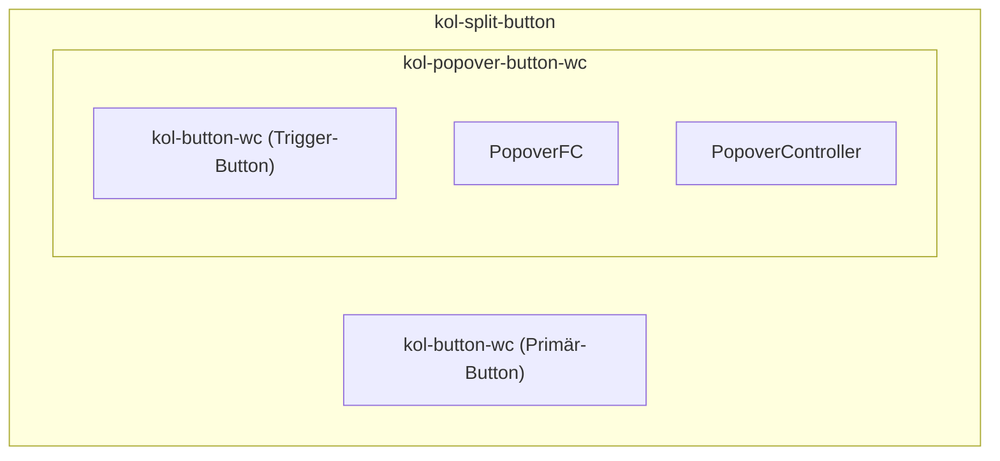

# Komponentenabhängigkeiten: Split-Button

## Abhängigkeitsdiagramm

## Beschreibung

| Komponente              | Rolle                                    | Abhängigkeiten                                    |
| ----------------------- | ---------------------------------------- | ------------------------------------------------- |
| `kol-split-button`      | Primärer Einstiegspunkt                  | `kol-button-wc`, `kol-popover-button-wc`          |
| `kol-popover-button-wc` | Dropdown-Logik                           | `kol-button-wc`, `PopoverFC`, `PopoverController` |
| `kol-button-wc`         | Button (Primär & Trigger)                | –                                                 |
| `PopoverFC`             | Internes Functional Component            | –                                                 |
| `PopoverController`     | Steuerung (öffnen/schließen/Ausrichtung) | –                                                 |
