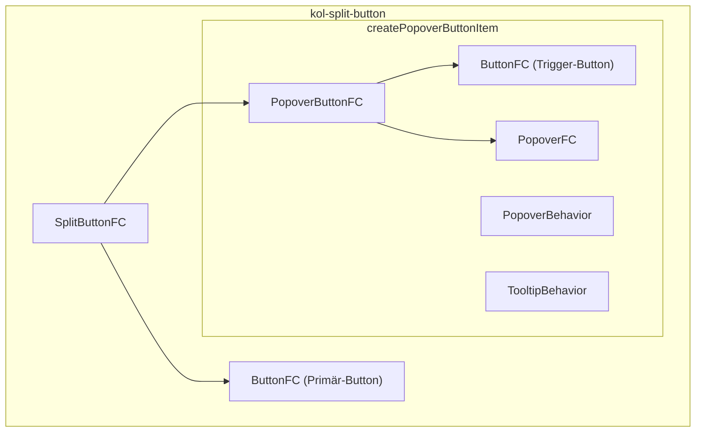

# Komponentenabhängigkeiten: Split-Button

## Abhängigkeitsdiagramm

```mermaid
graph TB
    subgraph SB["kol-split-button"]
        SBFC["SplitButtonFC"]
        BTN1["ButtonFC (Primär-Button)"]
        subgraph ITEM["createPopoverButtonItem"]
            PBFC["PopoverButtonFC"]
            BTN2["ButtonFC (Trigger-Button)"]
            PFC["PopoverFC"]
            PB["PopoverBehavior"]
            TB["TooltipBehavior"]
        end
    end
    SBFC --> BTN1
    SBFC --> PBFC
    PBFC --> BTN2
    PBFC --> PFC
```

## Beschreibung

| Baustein                  | Rolle                                                                   | Abhängigkeiten                                          |
| ------------------------- | ----------------------------------------------------------------------- | ------------------------------------------------------- |
| `kol-split-button`        | Primärer Einstiegspunkt                                                 | `SplitButtonFC`, `createPopoverButtonItem`              |
| `createPopoverButtonItem` | Orchestriert den Trigger-Button samt Popover (Props, Refs, Listener)    | `PopoverButtonFC`, `PopoverBehavior`, `TooltipBehavior` |
| `PopoverButtonFC`         | Trigger-Button und Popover                                              | `ButtonFC`, `PopoverFC`                                 |
| `PopoverFC`               | Natives Popover-Element (`popover="auto"`) mit Pfeil                    | –                                                       |
| `PopoverBehavior`         | Öffnen, Schließen und Ausrichten am Trigger (auch `kol-popover-button`) | –                                                       |
