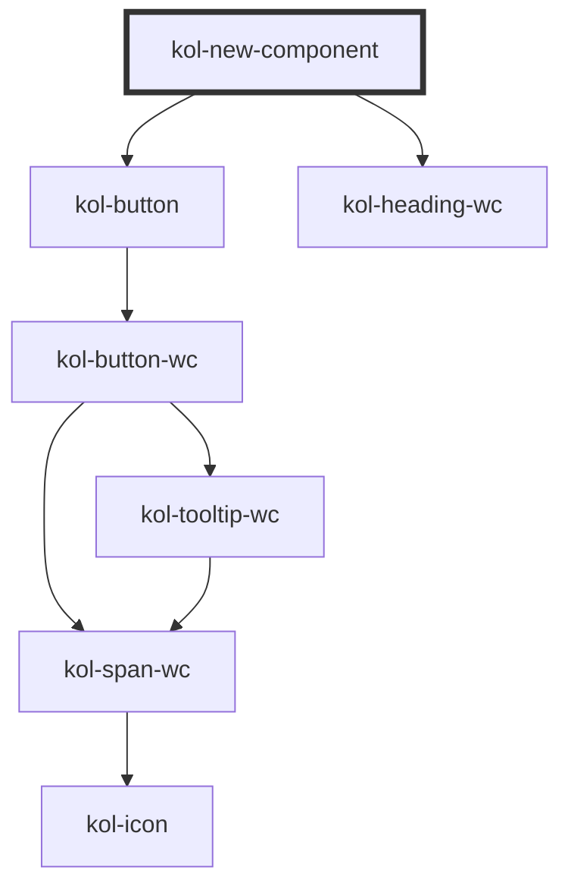

# New-Component

> kurze Beschreibung der gerenderten Komponente (nicht technisch)

> wann diese Komponente einzusetzen ist

## Konstruktion

### Code

> Beispielcode, wird als Code in der Dokumentation angezeigt

```html
<kol-new-component _heading="Element 1">
	<div slot="content">
		Lorem ipsum dolor sit amet, consetetur sadipscing elitr, sed diam nonumy eirmod tempor invidunt ut labore et dolore magna aliquyam erat, sed diam voluptua.
		At vero eos et accusam et justo duo dolores et ea rebum. Stet clita kasd gubergren, no sea takimata sanctus est Lorem ipsum dolor sit amet. Lorem ipsum
		dolor sit amet, consetetur sadipscing elitr, sed diam nonumy eirmod tempor invidunt ut labore et dolore magna aliquyam erat, sed diam voluptua. At vero eos
		et accusam et justo duo dolores et ea rebum. Stet clita kasd gubergren, no sea takimata sanctus est Lorem ipsum dolor sit amet.
	</div>
	<div slot="header">Inhalt eines Header</div>
</kol-new-component>
```

### Beispiel

> Beispiel, wird gerendert; Empfehlung: selber code wie oben, eventuell mit Wrapper

<div class="grid gap-2">
  <kol-new-component _heading="Element 1">
    <div slot="content">Lorem ipsum dolor sit amet, consetetur sadipscing elitr, sed diam nonumy eirmod tempor invidunt ut labore et dolore magna aliquyam erat, sed diam voluptua. At vero eos et accusam et justo duo dolores et ea rebum. Stet clita kasd gubergren, no sea takimata sanctus est Lorem ipsum dolor sit amet. Lorem ipsum dolor sit amet, consetetur sadipscing elitr, sed diam nonumy eirmod tempor invidunt ut labore et dolore magna aliquyam erat, sed diam voluptua. At vero eos et accusam et justo duo dolores et ea rebum. Stet clita kasd gubergren, no sea takimata sanctus est Lorem ipsum dolor sit amet.</div>
    <div slot="header">Inhalt eines Header</div>
  </kol-new-component>
</div>

## Verwendung

> Erläuterungen der Attribute und Slots

### Best practices

- so soll man das verwenden
- das sollte man beachten
- das sollte man vermeiden

### Anwendungsfälle

- für welchen Fall die Komponente gedacht ist

## Barrierefreiheit

### Tastatursteuerung

| Taste   | Funktion                           |
| ------- | ---------------------------------- |
| `Tab`   | Springt die einzelnen Elemente an. |
| `Enter` | Tut Dinge.                         |

## Links und Referenzen

- Liste von hilfreichen Links

> Der folgende Teil wird automatisch beim build generiert. Die Überschriften sind als Hilfe, was man nicht manuell einfügen muss.

<!-- Auto Generated Below -->

## Properties

| Property                | Attribute  | Description                                               | Type                                                                                 | Default     |
| ----------------------- | ---------- | --------------------------------------------------------- | ------------------------------------------------------------------------------------ | ----------- |
| `_heading` _(required)_ | `_heading` | Gibt die Überschrift des NewComponents an.                | `string`                                                                             | `undefined` |
| `_level`                | `_level`   | Gibt an, welchen H-Level von 1 bis 6 die Überschrift hat. | `0 \| 1 \| 2 \| 3 \| 4 \| 5 \| 6 \| undefined`                                       | `1`         |
| `_on`                   | --         | Gibt die EventCallback-Funktionen an.                     | `undefined \| { onClick?: EventValueOrEventCallback<Event, boolean> \| undefined; }` | `undefined` |
| `_open`                 | `_open`    | Gibt an, ob das NewComponent geöffnet ist.                | `boolean \| undefined`                                                               | `false`     |

## Slots

| Slot        | Description                                                                                                                                             |
| ----------- | ------------------------------------------------------------------------------------------------------------------------------------------------------- |
| `"content"` | Ermöglicht das Einfügen beliebigen HTML's in den Inhaltsbereich des NewComponents. (wenn nur ein slot verwendet wird, kann der Name weggelassen werden) |

## Dependencies

### Depends on

- [kol-button](../button)
- [kol-heading-wc](../heading)

### Graph



---
