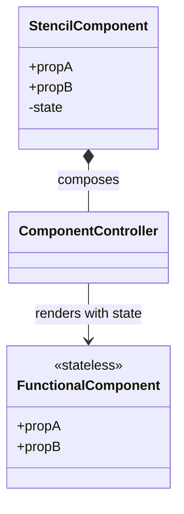

# Agent Instructions

This package contains the Stencil based web component library for KoliBri.

Use `pnpm --filter @public-ui/components build` to build the library or `pnpm start` for development.

## Structure

- `src/components` – Each component lives in its own folder. The usual files are:
  - `component.tsx` – component logic (optional, some components implement everything directly in `shadow.tsx`).
  - `shadow.tsx` – entry point registered with the `@Component` decorator.
  - `controller.ts` – helper functions used by the component (optional).
  - `style.scss` – SCSS styles for the component.
  - `*.e2e.ts` – Playwright end-to-end tests.
  - `test/` – Jest snapshot tests.
- `src/schema` – TypeScript schema describing the API of every component. For each component there is a file in `src/schema/components`. Shared enums, props and types are in the neighbouring folders.
- other folders like `src/assets`, `src/locales` and `src/utils` contain shared assets, translations and helpers.

## Coding Rules

Observe the following coding rules when making changes to this project.

### General Rules

- Never use the title-Attribute to add tooltips. Always use the `KolTooltip` component.

### Conditional Rendering Rule

Use the `condition && <Element />` pattern to render JSX elements only when a condition is true. This approach avoids unnecessary DOM nodes and keeps the code concise and readable.

```jsx
{
	isVisible && <div>This is shown only when isVisible is true</div>;
}
```

Avoid using `hidden={condition}` unless the element should always be present in the DOM but visually hidden.

### Language texts

All UI texts must be stored in `src/locales/en.ts` and `src/locales/de.ts`.
New translations get the prefix `kol-` and are referenced in the code using the
`translate()` helper, e.g. `translate('kol-example')`.
Call `translate()` once when the component instance is created (e.g. in a field
initializer) and reuse the result. This prevents unnecessary work while still
updating texts when the component is rerendered. Cache the value in a class
property whose name starts with `translate` followed by the translation
identifier, for example `translateSort` for `kol-sort` or `translateOrderBy`
for `kol-order-by`.

### Properties

To make the components easier to learn, property names and their descriptions should be consistent across components. Therefore you should:

- Use the same property name for attributes that serve the same purpose.
- Whenever possible, use identical descriptions for identical property names.
- Whenever possible, keep the types of identical property names the same.
- Minimize the number of different properties, descriptions and types.

#### Open vs Show

Use `_open` when the component renders an element on demand, for example a drawer or popover that appears from nothing. Use `_show` when the element already exists in the DOM and you only toggle its visibility.

#### Alignment properties

The `align` prop controls the orientation of the component itself. When aligning an inner element, such as a tooltip or popover inside a component, specialized props like `tooltipAlign` or `popoverAlign` may be used instead of `align`.

### BEM

#### BEM styling concept

We rely on **typed-bem** to manage class names for all functional components.
Each component maintains a `bem.ts` file describing its block, elements and
allowed modifiers. A small helper generated by `generateBemClassNames` creates
the BEM class names in a type‑safe manner and should be used instead of hard-
coded strings.

For example `src/functional-components/Alert/bem.ts` defines `BEM_ALERT` and the
`genBemAlert` helper. Inside `Alert.tsx` these helpers build dynamic class names
such as `BEM_CLASS_ROOT` and `BEM_CLASS__HEADING`.

#### Export BEM schema for the CLI

The CLI can generate SCSS files from the BEM schema. Export each `BEM_*`
constant from `src/index.ts` so the `generate-scss` command can process them:

```ts
export { BEM_ALERT } from './functional-components/Alert/bem';
export { BEM_ICON } from './components/icon/bem';
```

When refactoring or adding a component:

1. Create a `bem.ts` describing the full BEM schema.
2. Replace class strings with calls to the generated `bem` helper.
3. Export the schema constant via `src/index.ts` to enable SCSS generation.

### Component architecture

The following guidelines define how we structure component state and properties:

- Create a state variable only when a property has a direct and atomic effect on rendering.
- When several properties form one logical state, combine them into a single state variable, either as a primitive value or an object.
- Each property may implement `normalizeProperty` and `validateProperty`; call these from the property's `Watch` method.
- Stateless internal functional components receive props that mirror the web component's state.
- Complex interactions can be handled inside a component controller. The controller follows the composition pattern and is created by the component.

The following class diagram shows how a Stencil component exposes public
properties while maintaining its state in private variables. It passes this
state to a stateless functional component for rendering.


