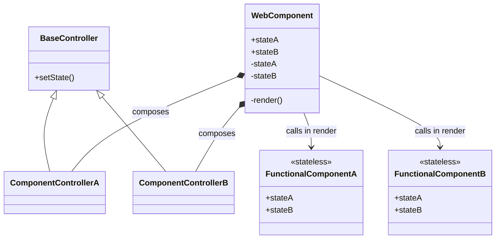

# Overview

This folder provides a minimal but fully functional example component. It shows
how a Stencil web component in KoliBri is organised and can be used as a
blueprint when implementing new components.

## Todos

- [x] `@Component` - the web component's main class
- [x] `@Element` - the web component's host element
- [x] `@Prop` - a property of the web component
- [x] `@State` - a state variable of the web component and part of the props of the functional component
- [x] `@Event` - an event emitted by the web component
- [x] `@Listen` - a decorator to listen to events
- [x] `@Method` - a method exposed by the web component
- [x] `@Watch` - a watch for changes of properties of the web component
- [x] `FunctionalComponent` - a stateless functional component that receives props and renders the template
- [x] `Callbacks` - a set of callback functions to handle actions in the functional component

## Architecture overview

The example is split into three layers:

1. **web-components/** – public Stencil classes (`kol-skeleton`, `kol-click-button`) declaring the component API.
2. **internal/functional-components/** – stateless React-like components and their controllers. Each controller extends `BaseController` and updates the web component via `setRenderPropsOrStates()`.
3. **internal/schema/** – prop definitions with `normalize*` and `validate*` helpers used by the watchers.

The file `internal/functional-components/generic-types.ts` defines helper types which generate the names for props, events, refs and watchers. Web components implement `WebComponentInterface`, controllers implement `ControllerInterface`, and functional components use `FunctionalComponentProps`.

To keep the API concise, these helpers provide default type parameters. Only the delegated props must be specified – all other generic parameters default to an empty object. For example:

```ts
type Interface = WebComponentInterface<MyProps>;
class MyController implements ControllerInterface<MyDelegatedProps> {}
```

If your controller exposes callbacks or refs, pass them as additional parameters. This optionality keeps the types lightweight and easier to read.

## Public properties and render props

Web components expose their API through `@Prop` decorated properties prefixed with `_`. These values are immutable from within the component. The controller normalises them and copies the result into so‑called render props without the underscore. Render props are regular class properties that Stencil watches through the controller's `setRenderPropsOrStates()` method. Functional components receive these render props together with callbacks and event emitters.

## Component architecture

The following guidelines define how we structure component state and properties:

- Create a state variable only when a property has a direct and atomic effect on rendering.
- When several properties form one logical state, combine them into a single state variable, either as a primitive value or an object.
- Each property may implement `normalizeProperty` and `validateProperty`; call these from the property's `Watch` method.
- Stateless internal functional components receive props that mirror the web component's state. These props use the same names as the state variables (e.g., `stateA`). They are invoked from the web component's private `render()` method and never inherit from the web component.
- Complex interactions can be handled inside a component controller. The controller follows the composition pattern and is created by the component.
- All controllers inherit from a common `BaseController` that exposes a `setState()` helper mirroring Stencil's state mechanism. After normalizing and validating incoming props, a controller updates the web component by calling this method, which triggers a rerender.
- A minimal implementation looks like this:

```ts
export abstract class BaseController<State, Host extends ComponentInterface<State> = ComponentInterface<State>> {
	protected constructor(protected readonly component: Host) {}

	public setState<K extends keyof State>(prop: K, value: State[K]): void {
		this.component[prop] = value;
	}
}
```

When instantiating a controller, type the `Host` parameter with
`WebComponentInterface<...>` so `componentWillLoad` can read underscored props
without redeclaring them. Simply pass the web component class as the generic.

- A web component (e.g. `kol-skeleton`) may compose only one functional components (e.g. `SkeletonFC`). A functional component can compose multiple internal functional components, each with its own controller for handling logic. The controllers and functional components share an interface describing the state they operate on. All rendering happens inside the functional components which receive the state via props.
- Each functional component receives an immutable instance of its state controller. If the controller exposes several independent values, you may also pass those states individually to the functional component instead of the whole controller.
- Functional component props combine the component state with callback refs. The controller exposes ref setter functions that connect DOM elements back to the controller.

```ts
export type SkeletonRefs = {
       setSpanRef: (el?: HTMLSpanElement) => void;
};

export type SkeletonEmitter = {
       onLoadedEmitter: EventEmitter<void>;
};

export const SkeletonFC: FC<SkeletonState & SkeletonRefs & SkeletonEmitter> = ({
       nameState,
       showState,
       setSpanRef,
       onLoadedEmitter,
}) => {
       if (showState) {
               setTimeout(() => onLoadedEmitter.emit(), 2000);
               return <span ref={setSpanRef}>{nameState}</span>;
       }
       return null;
};
```

```ts
export type ClickButtonRefs = {
       setButtonRef: (el?: HTMLButtonElement) => void;
};

export type ClickButtonCallbacks = {
       onClick: () => void;
};

export const ClickButtonFC: FC<ClickButtonRefs & ClickButtonCallbacks> = ({ setButtonRef, onClick }) => (
       <button
               ref={setButtonRef}
               onClick={onClick}
               onKeyDown={(event): void => {
                       if (event.key === 'Enter' || event.key === ' ') {
                               onClick();
                       }
               }}
       >
               Toggle
       </button>
);
```

The following class diagram shows how a web component exposes public
properties while maintaining its state in private variables. Every web
component in KoliBri always attaches a ShadowRoot. The component passes its
state to a stateless functional component for rendering.



### File layout

- `component.tsx` – Stencil web component managing state and watchers.
- `internal/functional-components` – stateless React-like component and its controller.
  - `component.tsx` – functional component rendering the template and declaring the shared `SkeletonState` interface.
  - `controller.ts` – logic for normalizing, validating and updating state via `BaseController`.
  - `schema/props` – property types with `normalize*` and `validate*` helpers.
  - `click-button/` – standalone button component handling the click interaction.

### Implementation pattern

1. Declare public properties with `@Prop()` and prefix their names with an underscore, for example `_name`. For each property create a matching render prop without the underscore. These render props are updated by the controller via `setRenderPropsOrStates()`.
2. Implement a `@Watch` method on the web component for every render prop. The watcher simply forwards the value to the controller where it is normalised and validated.
3. Implement `componentWillLoad` in the controller. Inside this method call the watchers with the underscored property values so the render props are initialised before the first render.
4. A web component's own `componentWillLoad` simply delegates to `controller.componentWillLoad()`.
5. The controller updates render props only through `setRenderPropsOrStates()` and exposes methods like `watchName()` or `handleClick()` that the web component delegates to.
6. `render()` only delegates to the functional component, passing the current render props, event emitters and ref callbacks.
7. Refs are forwarded via callback functions. Define a method like `setSpanRef` on the controller and pass it directly from `render()` so the controller can access DOM elements.
8. Events are emitted from the functional component. Forward the `EventEmitter` via a prop like `onLoadedEmitter` and call `.emit()` inside the functional component logic.
9. `SkeletonController` instantiates a `ClickButtonController` for the `ClickButton` subcomponent which toggles the `show` state.
10. All rendering happens in the functional components which must remain stateless.
11. Define the functional component's render prop interface next to the component and implement it in the web component class so TypeScript knows which properties are available.

All watcher methods share a generic `WatchCallback<T>` type defined as `(value?: T) => void`.
Use the helper types `ComponentDelegateWatchers<Props>` and `ComponentOwnWatchers<Props>` from `generic-types.ts` to type the watcher methods of the web component and its controller.

### Example usage

```html
<kol-skeleton onLoaded="{(event) => console.log('Skeleton loaded', event.detail)}"></kol-skeleton>
```
