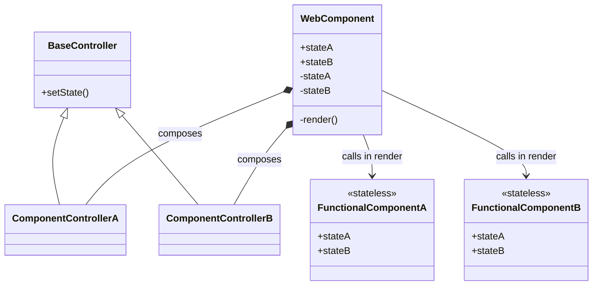

### Component architecture

The following guidelines define how we structure component state and properties:

- Create a state variable only when a property has a direct and atomic effect on rendering.
- When several properties form one logical state, combine them into a single state variable, either as a primitive value or an object.
- Each property may implement `normalizeProperty` and `validateProperty`; call these from the property's `Watch` method.
- Stateless internal functional components receive props that mirror the web component's state. These props use the same names as the state variables (e.g., `stateA`). They are invoked from the web component's private `render()` method and never inherit from the web component.
- Complex interactions can be handled inside a component controller. The controller follows the composition pattern and is created by the component.
- All controllers inherit from a common `BaseController` that exposes a `setState()` helper mirroring Stencil's state mechanism. After normalizing and validating incoming props, a controller updates the web component by calling this method, which triggers a rerender.
- A minimal implementation looks like this:

```ts
import type { Generic } from 'adopted-style-sheets';
import { setState } from './schema';

export abstract class BaseController<State> {
	protected readonly component: Generic.Element.Component & State;

	protected constructor(component: Generic.Element.Component & State) {
		this.component = component;
	}

	protected setState<K extends keyof State>(prop: K, value: State[K]) {
		setState(this.component, prop as string, value);
	}
}
```

- A web component may compose multiple functional components, each with its own controller for handling logic. The controllers and functional components share an interface describing the state they operate on. All rendering happens inside the functional components which receive the state via props.
- Each functional component receives an immutable instance of its state controller. If the controller exposes several independent values, you may also pass those states individually to the functional component instead of the whole controller.

The following class diagram shows how a web component exposes public
properties while maintaining its state in private variables. Every web
component in KoliBri always attaches a ShadowRoot. The component passes its
state to a stateless functional component for rendering.


