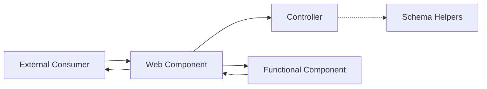
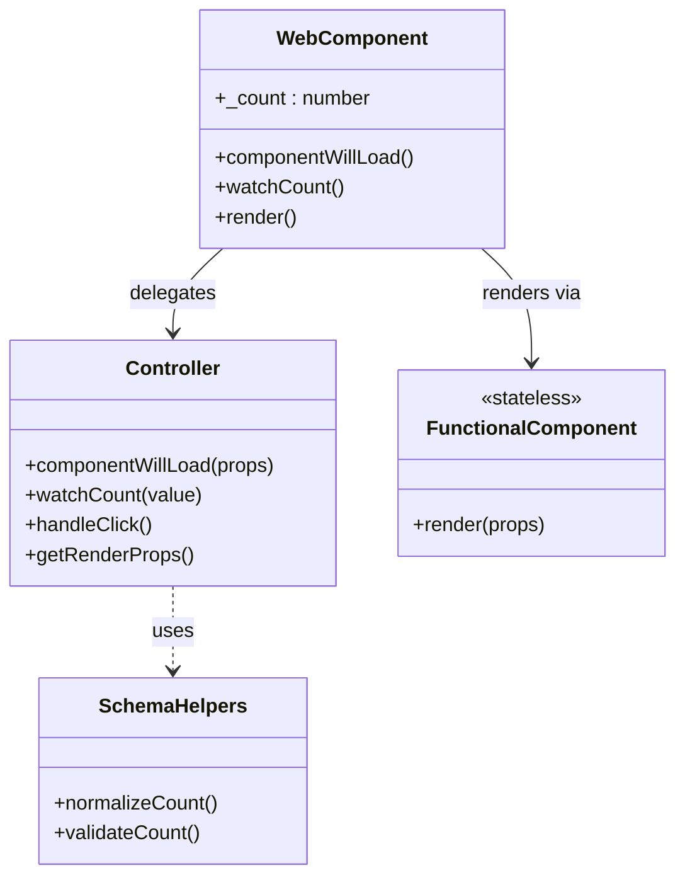
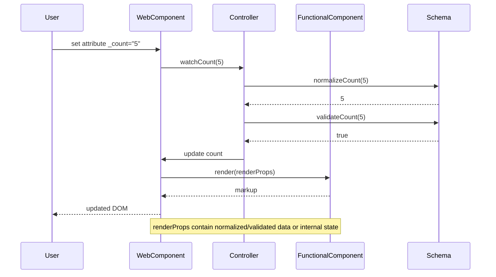

# Skeleton Blueprint Architecture (arc42)

## 1. Introduction and Goals

The `kol` skeleton component blueprint demonstrates how KoliBri web components can be built in a highly maintainable and decoupled fashion. It is designed as a minimal, yet complete, reference implementation for new components.

Representative code artifacts for each layer:

- [Web component](./web-components/skeleton/component.tsx) – public API and watchers
- [Controller](./internal/functional-components/skeleton/controller.ts) – business logic
- [Renderer](./internal/functional-components/skeleton/component.tsx) – stateless view
- [Schema helpers](./internal/schema/props) – prop types and validation

Primary goals:

- illustrate separation of concerns for long-term maintainability
- enable replacement or extension of layers without cascading changes
- enforce consistent validation and type-safety boundaries

### Usage Example

```html
<kol-skeleton _count="42" _name="Example"></kol-skeleton>
```

## 2. Architecture Constraints

- **Stencil** is used for authoring web components.
- Components must compile to framework-agnostic Custom Elements.
- Public API properties use an underscored naming convention (e.g. `_count`) to separate external inputs from internal state.
- Documentation and code follow the `KoliBri` casing and repository conventions.

## 3. Context and Scope

The skeleton lives inside `packages/components` and does not depend on runtime frameworks. External consumers interact through HTML attributes or DOM APIs.



The external consumer interacts solely with the custom element. The web component
delegates normalization and state transitions to the controller, which in turn
consults the schema helpers. Rendering is handed off to the stateless functional
component, and the resulting DOM is patched back into the web component before it
is presented to the consumer.

## 4. Solution Strategy

The blueprint enforces unidirectional data flow and delegates responsibilities to isolated layers:

- **Controller** – encapsulates business logic and state transitions. It coordinates prop watchers, updates render props and can compose other controllers for additional behaviour.
- **Functional component** – pure, stateless renderer that receives the current state snapshot together with callbacks, emitters and refs. It never mutates data and communicates through events.
- **Schema helpers** – prop type declarations plus `normalize*/validate*` helpers that keep domain rules close to the data model.
- **Web component** – public API surface. Incoming `@Prop` values are exposed with a leading `_` (e.g. `_count`). `@Watch` decorators must observe the underscored props to normalise and validate external values before delegating to the controller. Render props are accessed via `controller.getRenderProps()` instead of mirroring them locally.

### Props Pattern

A critical design principle is that **functional components always render using Props**, which are either:

1. **Normalized and validated external props** - incoming props that have been processed through schema helpers
2. **Internal component state** - derived or computed values managed by the controller

This ensures that the renderer never works with raw, unvalidated data. All values passed to the functional component have been through the controller's validation pipeline, maintaining type safety and data integrity throughout the rendering process.

**Props must always be initialized** before being passed to the functional component. This prevents rendering with undefined or uninitialized values and ensures that the component can safely render at any point in its lifecycle without encountering unexpected undefined states.

This strategy yields strong decoupling so that each layer can evolve independently.

### Watcher Example

Incoming props are normalised in dedicated watchers before reaching the controller:

```ts
@Watch('_count')
public watchCount(value?: CountPropType): void {
  this.controller.watchCount(value);
}
```

See the [controller](./internal/functional-components/skeleton/controller.ts) for the corresponding validation logic.

### Controller Initialization

Web components must initialise controllers by passing the current render props to ensure proper state setup:

```ts
public componentWillLoad(): void {
  this.controller.componentWillLoad({
    count: this._count,
    name: this._name,
  });
}
```

This ensures controllers receive the complete current state before any external prop changes occur.

## 5. Building Block View



The web component owns public props and lifecycle hooks, delegating all
normalization and state changes to the controller. The controller exposes only
render-ready props via `getRenderProps()` and never touches the DOM directly.
The functional component consumes these props and returns markup, keeping the
view free of side effects, while schema helpers centralize validation logic.

## 6. Runtime View

The following sequence demonstrates how an external update is normalised and validated before it propagates through the layers.



This runtime view highlights how watchers pass external values to the controller
for normalization and validation before any rendering occurs. Only after the
controller updates internal state does the web component invoke the functional
component, patch the returned markup and expose the updated DOM to the user.

## 7. Deployment View

The skeleton ships as part of the `@public-ui/components` package. During build the Stencil compiler produces framework-agnostic bundles ready for distribution via npm or CDN.

## 8. Cross-cutting Concepts

- **Composition over inheritance**: Controllers compose behaviour rather than relying on inheritance.
- **Declarative rendering**: Functional components are pure and stateless.
- **Decoupling**: Each layer only knows its direct neighbours. Controllers can be reused or replaced without altering renderers or schemas.
- **Event-driven communication**: User interaction is emitted as DOM events rather than calling functions across layers.
- **Props Pattern**: Functional components exclusively receive Props that contain either normalized/validated external data or internal component state. Props must always be initialized to prevent rendering with undefined values. This guarantees that rendering logic never operates on raw, unvalidated inputs and maintains data integrity throughout the component lifecycle.
- **State ownership**: Web components own state, controllers manage transitions and functional components consume state.
- **Template Method Pattern**: The WebComponent defines the overall component lifecycle and structure (template), while the Controller implements the specific business logic steps. The WebComponent provides itself as a reference to the Controller, allowing the Controller to modify the component's state during the execution of the template.
- **Type safety**: Generics enforce compile-time contracts between components and controllers.
- **Watcher placement**: Attach `@Watch` only to underscored public props; internal state fields remain undecorated.

## 9. Design Decisions

1. **Underscored public props**
   - _Alternative_: mirror external props directly without underscores.
   - _Reason_: underscores make the separation between public API and internal state explicit.
2. **Centralised validation in the controller**
   - _Alternative_: perform validation inside prop watchers.
   - _Reason_: keeping validation in the controller makes testing and reuse easier.
3. **Functional component rendering**
   - _Alternative_: render JSX directly inside the web component class.
   - _Reason_: a pure renderer improves testability and eliminates side effects.

## 10. Quality Requirements

- Maintainability: isolated layers and type-safety reduce the cost of change.
- Reliability: schema helpers validate every external value before it mutates state.
- Testability: controllers and functional components can be unit tested in isolation.
- Performance: **Optimized re-rendering strategy** - public props (with underscore) are normalized and validated, then assigned to internal fields (without underscore). This ensures only one re-render is triggered per prop change. State changes also trigger explicit re-rendering only when necessary, minimizing unnecessary render cycles. **Stencil's batching mechanism** automatically batches multiple prop or state changes that occur "simultaneously" into a single re-render, further optimizing performance even when multiple values change at once.
- Accessibility: follow repository-wide a11y presets and avoid title attributes in favour of `KolTooltip`.
- Security: avoid direct DOM injection; rely on typed props and controller validation to prevent XSS.

## 11. Risks and Technical Debt

- Over-engineering for simple components may increase boilerplate.
- Controllers may grow complex if multiple concerns are mixed; composition patterns should be followed strictly.

## 12. Glossary

- **Controller** – orchestrates state transitions and validation.
- **Functional Component** – pure renderer without side effects that exclusively works with Props.
- **Props** – normalized and validated props or internal state passed to functional components for rendering. Must always be initialized before use.
- **Schema Helper** – utility providing normalization and validation functions.
- **Watch Decorator** – Stencil decorator that observes prop changes.
- **Stencil** – compiler for building framework-agnostic web components.
- **BEM** – Block Element Modifier naming convention for CSS class names.
