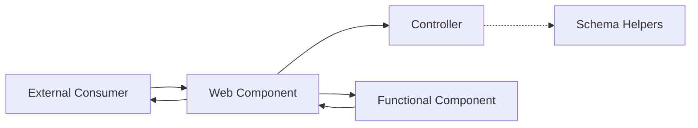
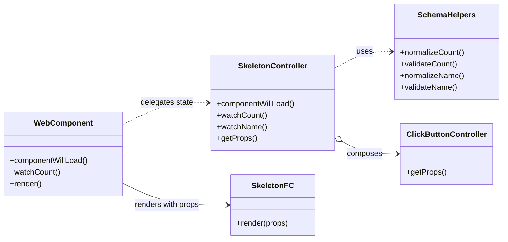
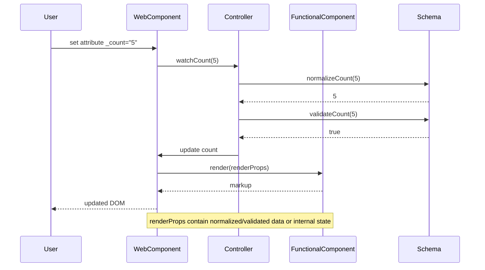

# Skeleton Blueprint Architecture (arc42)

## 1. Introduction and Goals

The `kol` skeleton component blueprint demonstrates how KoliBri web components can be built in a highly maintainable and decoupled fashion. It is designed as a minimal, yet complete, reference implementation for new components.

Representative code artifacts for each layer and their responsibilities:

- [Web component](./web-components/skeleton/component.tsx) – defines the public API, owns lifecycle hooks and bridges DOM events to controller callbacks.
- [Controller](./internal/functional-components/skeleton/controller.ts) – implements state transitions, validation orchestration and exposes render props.
- [Renderer](./internal/functional-components/skeleton/component.tsx) – stateless view that renders solely based on the controller-provided props.
- [Schema helpers](./internal/schema/props) – house prop types, normalisation and validation helpers shared across layers.

Primary goals:

- illustrate separation of concerns for long-term maintainability
- enable replacement or extension of layers without cascading changes
- enforce consistent validation and type-safety boundaries
- document an end-to-end implementation pipeline that teams can replicate when bootstrapping new components

### Blueprint Layout

The skeleton mirrors the structure recommended for production-ready components. Each folder holds a single responsibility to make the pipeline explicit:

- `web-components/skeleton` – custom element definition, prop watchers and lifecycle management.
- `internal/functional-components/skeleton` – controller and stateless functional component.
- `internal/schema` – prop schema definitions shared with other layers.
- Supporting `internal` subfolders – building blocks (e.g. reusable button controller) that can be composed from other components.

This modular layout is the backbone for the architectural patterns described in the following chapters.

### Usage Example

```html
<kol-skeleton _count="42" _name="Example"></kol-skeleton>
```

## 2. Architecture Constraints

- **Stencil** is used for authoring web components.
- Components must compile to framework-agnostic Custom Elements.
- Public API properties use an underscored naming convention (e.g. `_count`) to separate external inputs from internal state.
- Documentation and code follow the `KoliBri` casing and repository conventions.

## 3. Context and Scope

The skeleton lives inside `packages/components` and does not depend on runtime frameworks. External consumers interact through HTML attributes or DOM APIs.



The external consumer interacts solely with the custom element. The web component delegates normalisation and state transitions
to the controller, which in turn consults the schema helpers. Rendering is handed off to the stateless functional component, the
resulting DOM is patched back into the web component and finally exposed to the consumer. Each arrow in the diagram corresponds
to an explicit TypeScript contract, ensuring that integration points are discoverable and type safe.

## 4. Solution Strategy

The blueprint enforces unidirectional data flow and delegates responsibilities to isolated layers. Implementation-wise, each layer exposes a narrow API so that downstream code can be reasoned about in isolation.

### Web Component Layer

- Declares the public API using underscored props (e.g. `_count`).
- Hosts lifecycle hooks and ties DOM events to controller callbacks.
- Owns the Stencil-specific decorators (`@Prop`, `@Event`, `@Watch`). Watchers normalise incoming values and forward them to the controller.
- Holds normalised data in simple fields (`count`, `name`) instead of `@State` to keep Stencil re-rendering efficient.
- Mirrors validated props into these simple fields from the corresponding `@Watch` handlers so that the renderer and controller can rely on readily available, normalised values on the component instance.
- Delegates rendering to the controller output via `controller.getProps()`.

### Controller Layer

- Encapsulates business rules, validation orchestration and derived state.
- Implements `componentWillLoad` to bootstrap its internal state from the current prop snapshot.
- Exposes watcher entry points (`watchCount`, `watchName`, …) that receive raw values, request normalisation/validation from the schema helpers and update internal state accordingly.
- Provides render props via `getProps()` so the view layer operates on a single immutable snapshot.
- Composes other controllers (e.g. the click button behaviour) to reuse established logic across components.

### Functional Component Layer

- Is a pure renderer that receives props, callbacks, emitters and refs from the controller.
- Avoids any side effects or state mutation. User interactions are signalled via DOM events which bubble back to the web component.
- Maps controller props to accessible markup and wires refs for imperative access when required.

### Schema Helper Layer

- Co-locates type definitions, normalisation and validation rules for every prop.
- Provides `normalize*` and `validate*` helpers that are consumed by controllers so data contracts stay consistent across the stack.

The contracts between layers are formalized through TypeScript interfaces defined in [`generic-types.ts`](./internal/functional-components/generic-types.ts). These generics (`WebComponentInterface`, `ControllerInterface` and `FunctionalComponentProps`) guarantee that components share a consistent shape for props, callbacks, emitters and refs, enabling safe refactoring and reuse across the monorepo.

### Implementation Flow

1. **Initialisation** – `componentWillLoad` forwards the current prop snapshot to the controller, ensuring that internal state reflects external values before the first render.
2. **Prop updates** – `@Watch` handlers receive raw values, delegate normalisation/validation to schema helpers via the controller and update the controller state.
3. **Rendering** – The web component retrieves the immutable render props from the controller and feeds them into the functional component.
4. **User interaction** – The functional component emits DOM events (for example button clicks). The web component wires these events back into controller callbacks so state transitions remain encapsulated.

This pipeline makes the execution order explicit and provides guardrails for future contributors.

### Props Pattern

A critical design principle is that **functional components always render using Props**, which are either:

1. **Normalized and validated external props** - incoming props that have been processed through schema helpers
2. **Internal component state** - derived or computed values managed by the controller

This ensures that the renderer never works with raw, unvalidated data. All values passed to the functional component have been through the controller's validation pipeline, maintaining type safety and data integrity throughout the rendering process.

**Props must always be initialized** before being passed to the functional component. This prevents rendering with undefined or uninitialized values and ensures that the component can safely render at any point in its lifecycle without encountering unexpected undefined states.

This strategy yields strong decoupling so that each layer can evolve independently. New components can adopt the same structure by copying the skeleton and replacing the domain-specific pieces while keeping the architectural seams intact.

### Watcher Example

Incoming props are normalised in dedicated watchers before reaching the controller:

```ts
@Watch('_count')
public watchCount(value?: CountPropType): void {
  this.controller.watchCount(value);
}
```

See the [controller](./internal/functional-components/skeleton/controller.ts) for the corresponding validation logic.

### Controller Initialization

Web components must initialise controllers by passing the current render props to ensure proper state setup:

```ts
public componentWillLoad(): void {
  this.controller.componentWillLoad({
    count: this._count,
    name: this._name,
  });
}
```

This ensures controllers receive the complete current state before any external prop changes occur.

## 5. Building Block View



**Web component** – implements `WebComponentInterface`, owns the lifecycle and keeps normalised state fields. It simply passes watcher updates and render requests through to the controller.

**SkeletonController** – implements `ControllerInterface`, coordinates validation through the schema helpers and exposes immutable render props.

**SkeletonFC** – implements `FunctionalComponentProps`, receives the render props and produces JSX without touching state.

**Schema helpers** – provide deterministic data normalisation and validation functions that can be reused by other controllers as well.

**ClickButtonController** – exemplifies composition. Its props are merged into the skeleton controller so common behaviour (e.g. button handling) can be reused without inheritance.

## 6. Runtime View

The following sequence demonstrates how an external update is normalised and validated before it propagates through the layers.



This runtime view highlights how watchers pass external values to the controller
for normalization and validation before any rendering occurs. Only after the
controller updates internal state does the web component invoke the functional
component, patch the returned markup and expose the updated DOM to the user.

## 7. Deployment View

The skeleton ships as part of the `@public-ui/components` package. During build the Stencil compiler produces framework-agnostic bundles ready for distribution via npm or CDN.

## 8. Cross-cutting Concepts

- **Composition over inheritance**: Controllers compose behaviour rather than relying on inheritance.
- **Declarative rendering**: Functional components are pure and stateless.
- **Decoupling**: Each layer only knows its direct neighbours. Controllers can be reused or replaced without altering renderers or schemas.
- **Event-driven communication**: User interaction is emitted as DOM events rather than calling functions across layers.
- **Props Pattern**: Functional components exclusively receive Props that contain either normalized/validated external data or internal component state. Props must always be initialized to prevent rendering with undefined values. This guarantees that rendering logic never operates on raw, unvalidated inputs and maintains data integrity throughout the component lifecycle.
- **State ownership**: Web components own state, controllers manage transitions and functional components consume state.
- **Template Method Pattern**: The WebComponent defines the overall component lifecycle and structure (template), while the Controller implements the specific business logic steps. The WebComponent provides itself as a reference to the Controller, allowing the Controller to modify the component's state during the execution of the template.
- **Type safety and interface contracts**: `WebComponentInterface`, `ControllerInterface` and `FunctionalComponentProps` encode compile-time contracts between layers, enforcing consistent APIs and preventing accidental drift.
- **Watcher placement**: Attach `@Watch` only to underscored public props; internal state fields remain undecorated.

## 9. Design Decisions

1. **Underscored public props**
   - _Alternative_: mirror external props directly without underscores.
   - _Reason_: underscores make the separation between public API and internal state explicit.
2. **Centralised validation in the controller**
   - _Alternative_: perform validation inside prop watchers.
   - _Reason_: keeping validation in the controller makes testing and reuse easier.
3. **Functional component rendering**
   - _Alternative_: render JSX directly inside the web component class.
   - _Reason_: a pure renderer improves testability and eliminates side effects.
4. **Generic interface contracts**
   - _Alternative_: rely on ad-hoc typing per component.
   - _Reason_: shared interfaces keep props, callbacks, emitters and refs uniform across components, making controllers and renderers interchangeable.
5. **Stateful controllers over stateless proxies**
   - _Alternative_: instantiate a single stateless controller and provide proxy functions in the web component layer for each business function so the web component instance can be passed into the controller rather than the other way round.
   - _Reason_: every business function would need such a proxy, creating significant boilerplate and reducing readability when implementing multiple components. The marginal benefit of reusing a single controller instance does not justify this complexity, so controllers remain stateful.
6. **Direct assignment instead of prop-to-state mapping**
   - _Alternative_: map validated props to `@State` fields and read from there.
   - _Reason_: mapping to `@State` triggers two re-renderings in Stencil. Assigning props to plain fields after validation and handing them to the functional component results in at most one batched re-render per change.

## 10. Quality Requirements

- Maintainability: isolated layers and type-safety reduce the cost of change.
- Reliability: schema helpers validate every external value before it mutates state.
- Testability: controllers and functional components can be unit tested in isolation.
- Performance: **Optimized re-rendering strategy** - public props (with underscore) are normalized and validated, then assigned to internal fields (without underscore). This ensures only one re-render is triggered per prop change. State changes also trigger explicit re-rendering only when necessary, minimizing unnecessary render cycles. **Stencil's batching mechanism** automatically batches multiple prop or state changes that occur "simultaneously" into a single re-render, further optimizing performance even when multiple values change at once.
- Accessibility: follow repository-wide a11y presets and avoid title attributes in favour of `KolTooltip`.
- Security: avoid direct DOM injection; rely on typed props and controller validation to prevent XSS.

## 11. Risks and Technical Debt

- Over-engineering for simple components may increase boilerplate.
- Controllers may grow complex if multiple concerns are mixed; composition patterns should be followed strictly.

## 12. Glossary

- **Controller** – orchestrates state transitions and validation.
- **Functional Component** – pure renderer without side effects that exclusively works with Props.
- **Props** – normalized and validated props or internal state passed to functional components for rendering. Must always be initialized before use.
- **Schema Helper** – utility providing normalization and validation functions.
- **Watch Decorator** – Stencil decorator that observes prop changes.
- **Stencil** – compiler for building framework-agnostic web components.
- **BEM** – Block Element Modifier naming convention for CSS class names.
