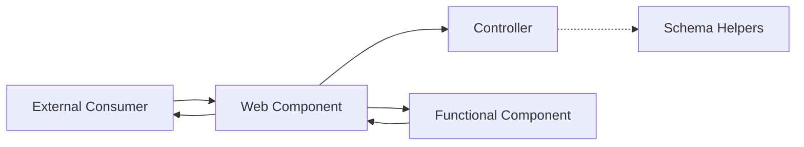
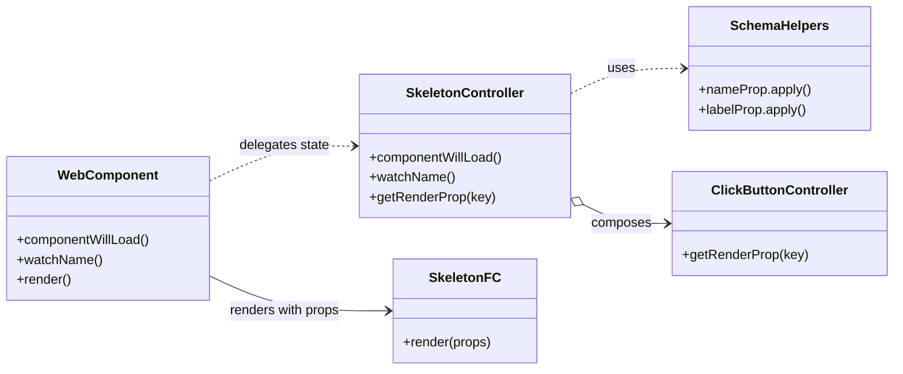
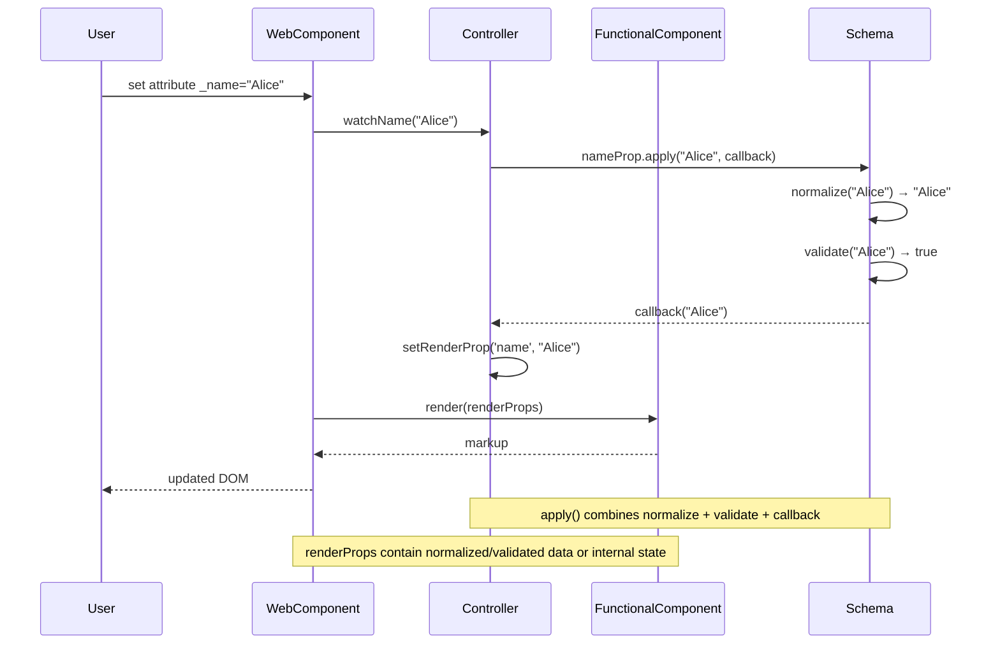

# Skeleton Blueprint Architecture (arc42)

## 1. Introduction and Goals

The `kol-skeleton` component blueprint demonstrates how KoliBri web components can be built in a highly maintainable and decoupled fashion. It is designed as a minimal, yet complete, reference implementation for new components.

Representative code artifacts for each layer and their responsibilities:

- [Web component](./web-components/skeleton/component.tsx) – defines the public API, owns lifecycle hooks and bridges DOM events to controller callbacks.
- [Controller](../../internal/functional-components/skeleton/controller.ts) – implements state transitions, validation orchestration and exposes render props.
- [Renderer](../../internal/functional-components/skeleton/component.tsx) – stateless view that renders solely based on the controller-provided props.
- [Schema helpers](../../internal/props/) – house prop types, normalisation and validation helpers shared across layers.

Primary goals:

- illustrate separation of concerns for long-term maintainability
- enable replacement or extension of layers without cascading changes
- enforce consistent validation and type-safety boundaries
- document an end-to-end implementation pipeline that teams can replicate when bootstrapping new components

### Blueprint Layout

The skeleton mirrors the structure recommended for production-ready components. The web component definitions live inside `_skeleton/`, while reusable internals (controllers, functional components, prop schemas) reside in the shared `src/internal/` directory. Each folder holds a single responsibility to make the pipeline explicit:

```text
src/
├── components/
│   └── _skeleton/                     # Blueprint directory
│       ├── web-components/
│       │   ├── skeleton/              # Skeleton custom element
│       │   │   ├── component.tsx      # Prop watchers and lifecycle management
│       │   │   └── snapshot.spec.tsx  # Snapshot test (Jest) — co-located
│       │   └── click-button/          # Click-button custom element
│       │       ├── component.tsx
│       │       ├── interaction.e2e.ts  # Interaction test (Playwright)
│       │       └── snapshot.spec.tsx
│       ├── AGENTS.md                  # Agent instructions for this blueprint
│       ├── ARC42.md                   # This document
│       └── PERFORMANCE_ANALYSIS.md    # Controller pattern performance analysis
└── internal/                          # Shared internals (not inside _skeleton/)
    ├── functional-components/
    │   ├── skeleton/                  # Skeleton-specific logic
    │   │   ├── api.tsx                # Type definitions
    │   │   ├── component.tsx          # Stateless functional component
    │   │   └── controller.ts          # State transitions and validation
    │   ├── click-button/              # Reusable button behaviour
    │   │   ├── api.tsx
    │   │   ├── component.tsx
    │   │   └── controller.ts
    │   ├── base-controller.ts         # Shared controller logic
    │   └── generic-types.ts           # Interface contracts
    └── props/                         # Prop types, normalisation and validation
        ├── helpers/
        │   ├── factory.ts             # Prop, SimpleProp, PropDefinition, apply()
        │   └── normalizers.ts         # normalizeString, normalizeInteger, etc.
        ├── label.ts                   # LabelProp
        ├── name.ts                    # NameProp
        ├── show.ts                    # ShowProp
        └── index.ts                   # Re-exports
```

This modular layout is the backbone for the architectural patterns described in the following chapters.

### Usage Example

```html
<kol-skeleton _name="Example"></kol-skeleton>
```

## 2. Architecture Constraints

- **Stencil** is used for authoring web components with **shadow: true** only (Shadow DOM enabled for style isolation).
- Components without Shadow DOM (`shadow: false`) are implemented as **Functional Components** instead of web components to avoid style conflicts and reduce maintainability burden.
- Components must compile to framework-agnostic Custom Elements.
- **Public API properties (Web Component Props/Attributes) use an underscored naming convention** (e.g. `_name`) to separate external inputs from internal state. This convention applies **only at the Web Component boundary** (Props in `@Prop()` decorators). Internally, controller state, render props, and functional component parameters do **not** use underscore prefixes — they use clear, self-describing names (`visible`, `count`, `label`). The underscore signals "this is a managed property exposed to HTML consumers," not "this is internal."
- Documentation and code follow the `KoliBri` casing and repository conventions.

### Naming Conventions Across Layers

The underscore naming convention is **scoped to the Web Component public API boundary**. Here's how naming changes across layers:

| Layer                                   | Example                             | Purpose                                                            |
| --------------------------------------- | ----------------------------------- | ------------------------------------------------------------------ |
| **Web Component (Public API)**          | `_name`, `_visible`, `_label`       | Signals managed properties exposed to HTML consumers via `@Prop()` |
| **Controller (Internal State)**         | `name`, `visible`, `label`, `count` | Clear, self-describing state names — no underscore prefix needed   |
| **Functional Component (Render Props)** | `visible`, `align`, `count`         | Parameters passed from controller — no underscore prefix           |
| **Schema Helpers**                      | `nameProp`, `visibleProp`           | Prop definitions for validation and normalization                  |

**Rule of thumb**: Use underscore (`_`) **only** where consumers interact with the component via HTML (Web Component `@Prop()` decorators). Everywhere else — controllers, state, derived values, render props — use natural, descriptive names.

## 3. Context and Scope

The skeleton lives inside `packages/components` and does not depend on runtime frameworks. External consumers interact through HTML attributes or DOM APIs.

**Shadow DOM Strategy**: KoliBri exclusively uses Web Components with Shadow DOM enabled (`shadow: true`). This ensures:

- **Style Isolation**: Component styles cannot leak into host page styles and vice versa
- **Encapsulation**: Components maintain consistent appearance regardless of host environment
- **Maintainability**: Clear boundaries prevent unintended style interactions

**Shadow DOM is mandatory for all KoliBri Web Components.** Components with `shadow: false` (historically suffixed `-wc`) are considered legacy and will be fully replaced and removed. The migration target is the Skeleton Pattern: each such component is rewritten as a proper Shadow DOM Web Component paired with a Functional Component for internal composition. No new `shadow: false` components will be introduced. The `-wc` variants are not a supported architecture going forward.



The external consumer interacts solely with the custom element. The web component delegates normalisation and state transitions
to the controller, which in turn consults the schema helpers. Rendering is handed off to the stateless functional component, the
resulting DOM is patched back into the web component and finally exposed to the consumer. Each arrow in the diagram corresponds
to an explicit TypeScript contract, ensuring that integration points are discoverable and type safe.

## 4. Solution Strategy

The blueprint enforces unidirectional data flow and delegates responsibilities to isolated layers. Implementation-wise, each layer exposes a narrow API so that downstream code can be reasoned about in isolation.

### Web Component Layer

- Extends `BaseWebComponent<Api>`, which provides the type-safe `setState` arrow property pre-bound to the component instance. This property is passed to the controller constructor so the controller can trigger Stencil re-renders.
- Declares the public API using underscored props (e.g. `_name`).
- Hosts lifecycle hooks and ties DOM events to controller callbacks.
- Owns the Stencil-specific decorators (`@Prop`, `@Event`, `@Watch`). Watchers normalise incoming values and forward them to the controller.
- Normalised public props (from `@Watch` handlers) are stored in the controller and accessed via `getRenderProp(key)` to pass them to the functional component, minimizing re-renders.
- Internal UI state managed by the controller (like `label`, `show`, `count` when they're derived or managed state) uses `@State` for reactivity — changes to these fields trigger re-renders.
- Delegates rendering to the controller output via `controller.getRenderProp(key)`.
- Renders the functional component always wrapped in a bare `<Host>` element without redundant class attributes (no `<Host class="kol-component-name">`). **All web components use shadow DOM (shadow: true) to ensure style isolation and prevent CSS conflicts** with host page styles. The shadow DOM handles styling isolation; the host tag name itself is sufficient for component identification.
- **Components that should not use Shadow DOM are implemented as Functional Components instead** (not web components), avoiding complexity and ensuring clean style boundaries.

### Controller Layer

- Encapsulates business rules, validation orchestration and derived state.
- Extends `BaseController<Api>`, which receives a `PropsConfigShape` (runtime props configuration containing `required` and `optional` arrays of prop definitions), a `SetStateFn<Api>` and a `GetStateFn<Api>` callback. `BaseController` derives default render props automatically from the config.
- `BaseController` provides `setRenderProp(key, value)` to store normalized props internally and exposes `setState` to write back to the web component's `@State` fields (triggering Stencil re-renders) and `getState` to read current `@State` values without holding a reference to the component instance.
- Implements `componentWillLoad` to bootstrap its internal state from the current prop snapshot.
- Exposes watcher entry points (e.g. `watchName`) that receive raw values, request normalisation/validation from the schema helpers and update internal state accordingly.
- Provides render props via `getRenderProp(key)` so the view layer accesses individual values in a type-safe manner.
- Composes other controllers (e.g. the click button behaviour) to reuse established logic across components.

#### Constructor Pattern

All controllers receive `setState` and `getState` from the web component, regardless of whether their `Api` declares `States`.

The web component passes both `this.setState` and `this.getState` so the controller can trigger Stencil re-renders and read back current state:

```ts
// Web Component — passes this.setState and this.getState to the controller
export class KolSkeleton extends BaseWebComponent<SkeletonApi> implements WebComponentInterface<SkeletonApi> {
  private readonly ctrl = new SkeletonController(this.setState, this.getState);
}

// Controller — accepts and forwards setState and getState to BaseController
public constructor(setState: SetStateFn<SkeletonApi>, getState: GetStateFn<SkeletonApi>) {
  super(skeletonPropsConfig, setState, getState);
}
```

All controllers receive `setState` and `getState` regardless of whether their `Api` declares `States`. `BaseController` always requires both parameters. The `PropsConfigShape` passed to `super()` contains arrays of prop definitions from which `BaseController` derives the initial render props automatically via `buildDefaultPropsFromConfig()`.

Composition inside other controllers forwards the same callbacks:

```ts
// Skeleton controller — composes ClickButtonController, forwarding setState/getState
this.clickButtonCtrl = new ClickButtonController(setState, getState);
```

#### State Reader (`getState`)

`BaseController` requires a `getState: GetStateFn<Api>` parameter alongside `setState`. This lets the controller read back current `@State` values from the web component without holding a direct reference to the component instance.

Both `setState` and `getState` are provided as pre-bound arrow properties by `BaseWebComponent`, ensuring type-safe access to reactive state:

```ts
// Controller — reading state back from the web component
const currentCount = this.getState('count');
this.setState('count', currentCount + 1);
```

The web component passes both `this.setState` and `this.getState`:

```ts
// Web Component — passes both setState and getState
private readonly ctrl = new SkeletonController(this.setState, this.getState);

// Controller — constructor declares both as required
public constructor(setState: SetStateFn<SkeletonApi>, getState: GetStateFn<SkeletonApi>) {
  super(skeletonPropsConfig, setState, getState);
}
```

#### Event Handler Policy

Controller methods follow a clear convention based on their usage pattern:

- **Callbacks, event handlers, and ref setters** are declared as **arrow class properties** (`handleClick = () => { … }`). This auto-binds them to the instance, so they can be safely passed as references without `.bind(this)` or wrapper arrows.
- **Lifecycle methods, watchers, and public API methods** (`componentWillLoad`, `watchName`, `focus`, `toggle`) remain **prototype methods** shared across all instances for memory efficiency.

Because callbacks are already arrow properties, both of these render patterns are valid:

```tsx
// Pattern A: Pass arrow property directly (used in ClickButton)
<ClickButtonFC handleClick={this.ctrl.handleClick} refButton={this.ctrl.setButtonRef} />

// Pattern B: Wrap in arrow for explicit forwarding (used in Skeleton)
<SkeletonFC handleClick={() => this.ctrl.handleClick()} refButton={(el) => this.ctrl.setButtonRef(el)} />
```

Both are functionally equivalent. Pattern A is more concise; Pattern B allows adding intermediate logic.

### Functional Component Layer

- Is a pure renderer that receives props, callbacks, emitters and refs from the controller.
- Avoids any side effects or state mutation. User interactions are signalled via DOM events which bubble back to the web component.
- Maps controller props to accessible markup and wires refs for imperative access when required.

### Schema Helper Layer

Web components receive dynamic values from HTML attributes, but internal rendering requires statically typed data. The schema helper layer bridges that gap through **graceful degradation**: attempt minimal type conversion, then validate, but never force invalid data into types.

Design principles:

- **Fail gracefully**: Invalid data is ignored rather than causing errors
- **Minimal conversion**: Only obvious transformations (string numbers → numbers)
- **Type guarantees**: Once validated, types are guaranteed throughout the component lifecycle
- **Single source of truth for defaults**: Default values are defined explicitly in shared prop/schema helpers and consumed by components, avoiding duplicated or drifting defaults

#### Dual-Type Props

Each prop can define an **external** (Web Component API) and an **internal** (Controller/FC) type. The external type may be more permissive to support shorthand values from HTML attributes, while the internal type is always the normalized form.

`Prop<K, TExternal, TInternal>` encodes both external and internal types in a single generic via phantom keys (`__input_${K}` carries the external type, `__propInternal__` carries the internal type). `SimpleProp<K, T>` is a shorthand when both types are identical:

```typescript
// Different external and internal types:
type ColorProp = Prop<'color', ColorPair | string, ColorPair>;
//                     └─ Key  └─ Web Component     └─ Controller/FC

// Same external and internal type (shorthand):
type MaxProp = SimpleProp<'max', number>;
//                        └─ Key └─ Both types
```

#### `PropDefinition<TInternal>`

`PropDefinition<TInternal>` defines `normalize` (unknown → TInternal), `validate` (TInternal → boolean), `getDefaultValue()` (→ TInternal) and `apply(value, callback)`. The normalize function accepts `unknown` because HTML attributes can arrive as any type.

`createPropDefinition<P>` is generic over the full `Prop<K, TExternal, TInternal>` type (e.g. `createPropDefinition<NameProp>(...)`). It infers `TInternal` via `InternalPropValue<P>`, so the normalize and validate signatures are automatically typed:

```typescript
// SimpleProp — same type in and out, with validation
const maxProp = createPropDefinition<MaxProp>(
	'max',
	0, // default value
	normalizeNumber, // (value: unknown) → number (throws on invalid)
	(v) => v > 0, // (value: number) → boolean
);

// Dual-Type Prop — external string is normalized to ColorPair
const colorProp = createPropDefinition<ColorProp>(
	'color',
	{ backgroundColor: '#d3d3d3', foregroundColor: '#3f3f3f' },
	normalizer, // (value: unknown) → ColorPair (throws on invalid)
	validator, // (value: ColorPair) → boolean
);
```

Each `PropDefinition` provides an `apply(value, callback)` method that combines normalization, validation and fallback handling into a single call. If the value is `undefined` or `null`, the built-in default value is used. Otherwise, the value is normalized and validated before being passed to the callback — ensuring callbacks only receive type-safe internal values:

```typescript
maxProp.apply(value, (normalized) => {
	// normalized is number, type-safe and validated (> 0)
	this.setRenderProp('max', normalized);
});
```

#### `DependentPropDefinition<TInternal, TDeps>`

Some props require context from other props to normalize or validate correctly. `createDependentPropDefinition` extends the pattern with a `TDeps` parameter that is passed through to both `normalize` and `validate`:

```typescript
type ClampedNumberValueProp = SimpleProp<'value', number>;

type ClampedNumberValueDeps = {
	min: number;
	max: number;
};

const clampedNumberValueProp = createDependentPropDefinition<ClampedNumberValueProp, ClampedNumberValueDeps>(
	'value',
	0,
	(value, deps) => {
		const normalized = normalizeNumber(value);
		if (normalized < deps.min) return deps.min;
		if (normalized > deps.max) return deps.max;
		return normalized;
	},
	(v) => v >= 0,
);
```

The `apply` method for dependent props takes the deps object as a third argument:

```typescript
clampedNumberValueProp.apply(
	value,
	(normalized) => {
		this.setRenderProp('value', normalized);
	},
	{ min: 0, max: this.getRenderProp('max') },
);
```

#### Type Extraction

`InternalOf<P>` and `ExternalOf<P>` utility types extract the correct type for each architectural layer automatically:

| Layer                      | Type Extractor | Example (`ColorProp`) |
| -------------------------- | -------------- | --------------------- |
| Web Component `@Prop`      | `ExternalOf`   | `ColorPair \| string` |
| `@Watch` handler           | `ExternalOf`   | `ColorPair \| string` |
| Controller `setRenderProp` | `InternalOf`   | `ColorPair`           |
| Controller `getRenderProp` | `InternalOf`   | `ColorPair`           |
| Functional Component       | `InternalOf`   | `ColorPair`           |

#### Available Properties

- **alt** – Alternative text (`string`)
- **color** – Color values (accepts `ColorPair | string` externally, normalized to `ColorPair`)
- **href** – URL references (`string`)
- **icons** – Icon identifiers (`string`)
- **label** – Text content (`string`, validated: 2–80 characters)
- **loading** – Loading indicator type (`LoadingType`)
- **max** – Maximum value (`number`, validated: > 0)
- **name** – Identifiers (`string`)
- **quote** – Quotation text (`string`)
- **show** – Boolean visibility states (`boolean`)
- **sizes** – Responsive sizes attribute (`string`)
- **src** – Source URL (`string`)
- **srcset** – Responsive image sources (`string`)
- **unit** – Unit suffix (`string`)
- **value** – Numeric value (`number`, validated: ≥ 0)
- **value (clamped)** – Clamped numeric value with `DependentPropDefinition` (depends on `min`/`max`)
- **variant-progress** – Progress variant type (`ProgressVariantType`)
- **variant-quote** – Quote variant type (`QuoteVariantType`)

### API Definition with `PropsConfigShape` and `ApiFromConfig`

Component APIs are defined using a runtime props config object (`PropsConfigShape`) that groups prop definitions into `required` and `optional` arrays. The `ApiFromConfig<Config, Extra>` utility type derives the full `ComponentApi` type from this config:

```ts
// API definition (api.tsx)
import { nameProp } from '../../props';
import type { ApiFromConfig, PropsConfigShape } from '../generic-types';

export const skeletonPropsConfig = {
	required: [nameProp],
} as const satisfies PropsConfigShape;

export type SkeletonApi = ApiFromConfig<
	typeof skeletonPropsConfig,
	{
		Callbacks: { click: () => void };
		Emitters: { loaded: number; rendered: void };
		Methods: { focus: () => void; toggle: () => void };
		States: { count: number; label: string; show: boolean };
	}
>;
```

`ApiFromConfig` automatically merges the phantom prop types from the config arrays into the `Props.Required` and `Props.Optional` fields, making the props config the single source of truth for both runtime behaviour (normalization, validation, defaults) and compile-time types.

The same `propsConfig` object is also passed to the `BaseController` constructor, which uses it to derive the initial render props via `buildDefaultPropsFromConfig()`.

The contracts between layers are formalized through TypeScript interfaces defined in [`generic-types.ts`](../../internal/functional-components/generic-types.ts). These generics (`WebComponentInterface`, `ControllerInterface` and `FunctionalComponentProps`) guarantee that components share a consistent shape for props, callbacks, emitters and refs, enabling safe refactoring and reuse across the monorepo.

### Methods and Automatic Promise Wrapping

Stencil requires that all public `@Method()` decorated methods return a `Promise`. To keep API definitions concise and focused on business semantics, `ComponentApi` allows method signatures to be defined with plain return types:

```ts
// API definition — simple, no Promise required
Methods: {
  focus: () => void;
  getValue: () => number;
};
```

The `PromiseMethod<Methods>` utility type in `generic-types.ts` automatically wraps each method's return type in `Promise<T>`. This transformation is applied directly in `WebComponentInterface` via `PromiseMethod<ExtractMethods<T>>`, so the resolved web component type correctly requires:

```ts
// Resolved in WebComponentInterface — automatically Promise-wrapped
focus: () => Promise<void>;
getValue: () => Promise<number>;
```

`ControllerInterface` intentionally does **not** apply `PromiseMethod` wrapping. Controllers implement methods with their plain return types (`void`, `number`, etc.) since the `async`/`Promise.resolve()` wrapping happens at the web component layer:

```ts
// Controller — plain return type
public focus(): void {
  this.buttonRef?.focus();
}

// Web Component — wraps the controller call
@Method()
public async focus(): Promise<void> {
  return Promise.resolve(this.ctrl.focus());
}
```

This separation ensures that:

- API definitions remain clean and declarative
- Controllers stay synchronous and testable
- Web components satisfy the Stencil `@Method()` Promise requirement automatically
- `Awaited<R>` is used internally for idempotency — writing `() => Promise<void>` in the API still resolves to `Promise<void>`, not `Promise<Promise<void>>`

### Implementation Flow

1. **Initialisation** – `componentWillLoad` forwards the current prop snapshot to the controller, ensuring that internal state reflects external values before the first render.
2. **Prop updates** – `@Watch` handlers receive raw values, delegate normalisation/validation to schema helpers via the controller and update the controller state.
3. **Rendering** – The web component retrieves the immutable render props from the controller and feeds them into the functional component.
4. **User interaction** – The functional component emits DOM events (for example button clicks). The web component wires these events back into controller callbacks so state transitions remain encapsulated.

This pipeline makes the execution order explicit and provides guardrails for future contributors.

### Props Pattern

A critical design principle is that **functional components always render using Props**, which are either:

1. **Normalized and validated external props** - incoming props that have been processed through schema helpers
2. **Internal component state** - derived or computed values managed by the controller

This ensures that the renderer never works with raw, unvalidated data. All values passed to the functional component have been through the controller's validation pipeline, maintaining type safety and data integrity throughout the rendering process.

**Props must always be initialized** before being passed to the functional component. This prevents rendering with undefined or uninitialized values and ensures that the component can safely render at any point in its lifecycle without encountering unexpected undefined states.

This strategy yields strong decoupling so that each layer can evolve independently. New components can adopt the same structure by copying the skeleton and replacing the domain-specific pieces while keeping the architectural seams intact.

### Watcher Example

Incoming props are normalised in dedicated watchers before reaching the controller.
When external and internal types are identical, `SimpleProp<K, T>` is used. For different
types, `Prop<K, TExternal, TInternal>` encodes both (see `ColorProp` in `color.ts` for an example).
The controller always works with the normalized internal type:

```ts
// Prop definition (internal/props/name.ts)
type NameProp = SimpleProp<'name', string>;
const nameProp = createPropDefinition<NameProp>('name', '', normalizeString);
```

```ts
// Web Component (web-components/skeleton/component.tsx)
@Prop()
public _name!: string;

@Watch('_name')
public watchName(value?: string): void {
  this.ctrl.watchName(value);
}
```

```ts
// Controller (internal/functional-components/skeleton/controller.ts)
public watchName(value?: string): void {
  nameProp.apply(value, (v) => {
    this.setRenderProp('name', v);
  });
}
```

The `apply()` method uses the default value built into `nameProp` when the incoming value is `undefined` or `null`.

### Controller State Management

Controllers manage state in two distinct ways:

**Normalized Props** (via `setRenderProp()`):

- Stored as plain class fields after validation
- Updated by watcher methods (e.g. `watchName`)
- Never trigger Stencil re-renders on their own
- Retrieved via `getRenderProp(key)` for rendering

**Derived/Managed State** (via `setState()`):

- Stored in web component `@State` fields
- Used for computed or UI state (e.g., `ariaCurrent`, `show`, `label`)
- Each `setState()` call triggers a Stencil re-render
- Simplifies component logic by centralizing state transitions

**Rule**: A prop watcher should call `setRenderProp()` to store the normalized value. If the controller also derives or manages internal state from that prop, add a corresponding `setState()` call only for fields that require reactive updates. This minimizes re-renders while maintaining code clarity:

```ts
public watchName(value?: string): void {
  nameProp.apply(value, (v) => {
    this.setRenderProp('name', v);       // Store normalized prop (no re-render)
    // this.setState('name', v);         // Add only if 'name' is also an @State field
  });
}
```

### Controller Initialization

Web components must initialise controllers by passing the current props to ensure proper state setup.
The `componentWillLoad` method receives `ResolvedInputProps`, which uses the **external** types:

```ts
// Web Component
public componentWillLoad(): void {
  this.ctrl.componentWillLoad({
    name: this._name,
  });

  // Set up the callback for emitting loaded events
  this.ctrl.setOnLoadedCallback((count: number) => {
    this.loaded.emit(count);
  });
}
```

```ts
// Controller
public componentWillLoad(props: ResolvedInputProps<SkeletonApi>): void {
  const { name } = props;
  this.watchName(name);
  this.clickButtonCtrl.componentWillLoad({
    label: 'Click me',
  });
}
```

This ensures controllers receive the complete current state before any external prop changes occur.

## 5. Building Block View



**Web component** – implements `WebComponentInterface`, owns the lifecycle and keeps normalised state fields. It simply passes watcher updates and render requests through to the controller.

**SkeletonController** – implements `ControllerInterface`, coordinates validation through the schema helpers and exposes immutable render props.

**SkeletonFC** – implements `FunctionalComponentProps`, receives the render props and produces JSX without touching state.

**Schema helpers** – provide deterministic data normalisation and validation functions that can be reused by other controllers as well.

**ClickButtonController** – exemplifies composition. Its props are merged into the skeleton controller so common behaviour (e.g. button handling) can be reused without inheritance.

## 6. Runtime View

The following sequence demonstrates how an external update is normalised and validated before it propagates through the layers.



This runtime view highlights how watchers pass external values to the controller
for normalization and validation before any rendering occurs. Only after the
controller updates internal state does the web component invoke the functional
component, patch the returned markup and expose the updated DOM to the user.

## 7. Deployment View

The skeleton ships as part of the `@public-ui/components` package. During build the Stencil compiler produces framework-agnostic bundles ready for distribution via npm or CDN.

## 8. Cross-cutting Concepts

| Concept                          | Description                                                                                                                                                           |
| -------------------------------- | --------------------------------------------------------------------------------------------------------------------------------------------------------------------- |
| **Composition over inheritance** | Controllers compose behaviour (e.g. `ClickButtonController`) rather than relying on inheritance.                                                                      |
| **Declarative rendering**        | Functional components are pure and stateless.                                                                                                                         |
| **Decoupling**                   | Each layer only knows its direct neighbours. Controllers can be reused or replaced without altering renderers or schemas.                                             |
| **Event-driven communication**   | User interaction is emitted as DOM events rather than calling functions across layers.                                                                                |
| **Props Pattern**                | Functional components exclusively receive Props that contain either normalized/validated external data or internal component state. Props must always be initialized. |
| **Shadow DOM First**             | All web components use `shadow: true`. Components that should not use Shadow DOM are implemented as Functional Components instead.                                    |
| **State ownership**              | Web components own state (`@State`), controllers manage transitions, functional components consume state.                                                             |
| **Template Method Pattern**      | The WebComponent defines the lifecycle structure, while the Controller implements specific business logic steps.                                                      |
| **Type safety**                  | `WebComponentInterface`, `ControllerInterface` and `FunctionalComponentProps` encode compile-time contracts between layers.                                           |
| **Watcher placement**            | Attach `@Watch` only to underscored public props (e.g. `_name`); internal state fields use `@State`.                                                                  |

## 9. Design Decisions

1. **Underscored public props**
   - _Alternative_: mirror external props directly without underscores.
   - _Reason_: underscores make the separation between public API and internal state explicit.
2. **Shadow DOM enabled for all web components (shadow: true)**
   - _Alternative_: allow some components to have `shadow: false`.
   - _Reason_: Shadow DOM ensures consistent style isolation and prevents CSS conflicts from host page styles. This eliminates a category of hard-to-debug styling issues and maintains strong encapsulation boundaries.
3. **Functional Components for non-Shadow-DOM use cases**
   - _Alternative_: implement components without Shadow DOM as web components with `shadow: false`.
   - _Reason_: Components without Shadow DOM requirements are cleaner and more maintainable as pure Functional Components. This avoids the complexity of managing style pollution in web components while maintaining consistent architecture for components that do require Shadow DOM.
4. **Centralised validation in the controller**
   - _Alternative_: perform validation inside prop watchers.
   - _Reason_: keeping validation in the controller makes testing and reuse easier.
5. **Functional component rendering**
   - _Alternative_: render JSX directly inside the web component class.
   - _Reason_: a pure renderer improves testability and eliminates side effects.
6. **Generic interface contracts**
   - _Alternative_: rely on ad-hoc typing per component.
   - _Reason_: shared interfaces keep props, callbacks, emitters and refs uniform across components, making controllers and renderers interchangeable.
7. **Stateful controllers over stateless proxies**
   - _Alternative_: instantiate a single stateless controller and provide proxy functions in the web component layer for each business function so the web component instance can be passed into the controller rather than the other way round.
   - _Reason_: every business function would need such a proxy, creating significant boilerplate and reducing readability when implementing multiple components. The marginal benefit of reusing a single controller instance does not justify this complexity, so controllers remain stateful.
8. **@State for managed UI state, plain fields for normalized props**
   - _Pattern_: public props (e.g. \_name) are normalized by the controller and stored in plain fields within the controller. UI state that is managed but not exposed as props (like count, label, show) uses `@State` to trigger reactive re-renders.
   - _Reason_: normalized props coming from external inputs do not need `@State` — they're held in the controller and accessed via `getRenderProp(key)` to pass to the functional component. This avoids unnecessary re-rendering. Internal UI state (like visibility toggles) that the controller manages should use `@State` for reactivity. This strategy minimizes renders while maintaining clarity about which state is reactive.
9. **Host element without redundant class attribute**
   - _Alternative_: add component name as class attribute to `<Host>` (e.g. `<Host class="kol-skeleton">`).
   - _Reason_: the tag name alone (e.g. `<kol-skeleton>`) is sufficient for styling and component identification. Shadow DOM already provides style isolation. Redundant classes add noise and complicate selectors in theme files without additional benefit. The functional component is always wrapped inside the bare `<Host>` element.
10. **Omit unused API fields in ComponentApi definitions**
    - _Pattern_: All fields in `ComponentApi` are optional (`Props`, `States`, `Emitters`, `Methods`, `Callbacks`, `Refs`, `Listeners`). Only define the fields that the component actually uses. If a component has no events, omit `Emitters`. If it has no internal state, omit `States`. If it has no methods, omit `Methods`. This applies uniformly to every field — no exceptions.
    - _Alternative_: define all fields explicitly, using empty records for unused ones (e.g. `States: Record<string, never>`).
    - _Reason_: empty records add noise to the API definition and clutter the type contract. The generic type extraction logic in `generic-types.ts` safely handles missing fields by defaulting to empty records, so omitting them is both safe and preferred. A minimal API definition is easier to read, easier to maintain, and accurately conveys what the component actually does.
11. **Test co-location — all tests live next to the component**
    - _Pattern_: All test files are placed directly alongside `component.tsx` in the same directory — **not** in a separate `test/` subdirectory. Two test categories exist:
      - **Snapshot tests** (`snapshot.spec.tsx`) — Jest-based DOM snapshot tests that render the component with various prop combinations via `executeSnapshotTests` and compare against stored snapshots (`__snapshots__/`). Snapshot files are likewise stored in the component directory.
      - **Interaction tests** (`interaction.e2e.ts`) — Playwright-based end-to-end tests that verify user interactions (clicks, keyboard input, focus management, event emission) against the rendered component in a real browser.
    - Both file names are **uniform** across all components — no component-specific prefixes.
    - _Alternative_: group all tests into a dedicated `test/` subdirectory per component.
    - _Reason_: co-located tests are easier to discover, eliminate unnecessary directory nesting, and keep related files visible side-by-side. This reduces cognitive overhead when navigating the codebase and aligns with common industry conventions.

## 10. Quality Requirements

- Maintainability: isolated layers and type-safety reduce the cost of change.
- Reliability: schema helpers validate every external value before it mutates state.
- Testability: controllers and functional components can be unit tested in isolation. Snapshot tests (Jest) verify DOM output; interaction tests (Playwright) verify user-facing behaviour.
- Performance: **Optimized re-rendering strategy** - public props (with underscore) are normalized and validated, then assigned to internal fields (without underscore). This ensures only one re-render is triggered per prop change. State changes also trigger explicit re-rendering only when necessary, minimizing unnecessary render cycles. **Stencil's batching mechanism** automatically batches multiple prop or state changes that occur "simultaneously" into a single re-render, further optimizing performance even when multiple values change at once.
- Accessibility: follow repository-wide a11y presets and avoid title attributes in favour of `KolTooltip`.
- Security: avoid direct DOM injection; rely on typed props and controller validation to prevent XSS.

## 11. Risks and Technical Debt

- Over-engineering for simple components may increase boilerplate.
- Controllers may grow complex if multiple concerns are mixed; composition patterns should be followed strictly.

## 12. Glossary

| Term                     | Definition                                                                                                                                     |
| ------------------------ | ---------------------------------------------------------------------------------------------------------------------------------------------- |
| **BEM**                  | Block Element Modifier naming convention for CSS class names.                                                                                  |
| **Controller**           | Orchestrates state transitions and validation; extends `BaseController`.                                                                       |
| **Functional Component** | Pure renderer without side effects that exclusively works with Props.                                                                          |
| **Props**                | Normalized and validated props or internal state passed to functional components. Must always be initialized.                                  |
| **Schema Helper**        | Utility providing `normalize` (unknown → TInternal), `validate` (TInternal → boolean) and `apply` (normalize + validate + callback) for props. |
| **Stencil**              | Compiler for building framework-agnostic web components.                                                                                       |
| **Watch Decorator**      | Stencil decorator (`@Watch`) that observes prop changes.                                                                                       |
