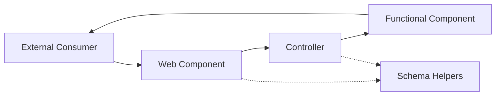
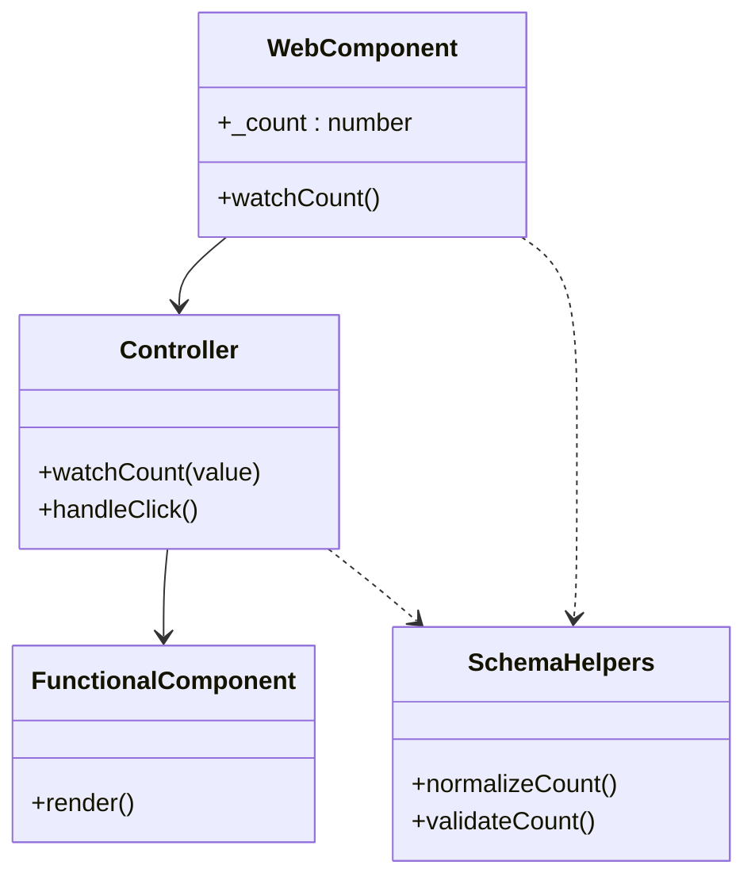
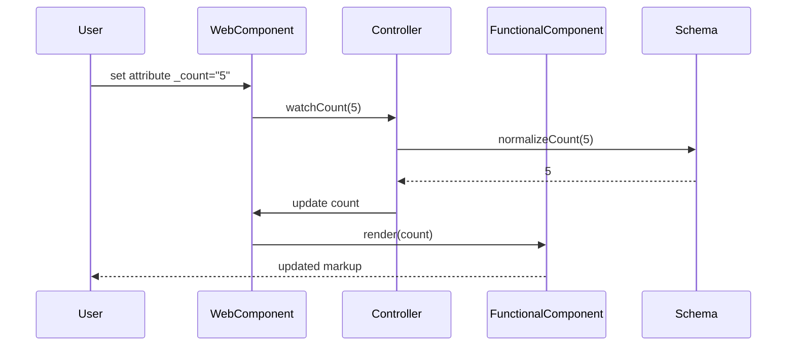

# Skeleton Blueprint Architecture (arc42)

## 1. Introduction and Goals

The `kol` skeleton component blueprint demonstrates how KoliBri web components can be built in a highly maintainable and decoupled fashion. It is designed as a minimal, yet complete, reference implementation for new components.

Primary goals:

- illustrate separation of concerns for long-term maintainability
- enable replacement or extension of layers without cascading changes
- enforce consistent validation and type-safety boundaries

## 2. Architecture Constraints

- **Stencil** is used for authoring web components.
- Components must compile to framework-agnostic Custom Elements.
- Public API properties use an underscored naming convention (e.g. `_count`) to separate external inputs from internal state.
- Documentation and code follow the `KoliBri` casing and repository conventions.

## 3. Context and Scope

The skeleton lives inside `packages/components` and does not depend on runtime frameworks. External consumers interact through HTML attributes or DOM APIs.

## 4. Solution Strategy

The blueprint enforces unidirectional data flow and delegates responsibilities to isolated layers:

- Web components expose a stable public API and mirror underscored props to private fields.
- Controllers own business logic, normalization and validation.
- Functional components render pure JSX based on provided props.
- Schema helpers define canonical prop types and validation rules close to the data model.

This strategy yields strong decoupling so that each layer can evolve independently.

## 5. Building Block View

## 6. Runtime View

The following sequence demonstrates how an external update propagates through the layers.

## 7. Deployment View

The skeleton ships as part of the `@public-ui/components` package. During build the Stencil compiler produces framework-agnostic bundles ready for distribution via npm or CDN.

## 8. Cross-cutting Concepts

- **Decoupling**: Each layer only knows its direct neighbours. Controllers can be reused or replaced without altering renderers or schemas.
- **Event-driven communication**: User interaction is emitted as DOM events rather than calling functions across layers.
- **Type safety**: Generics enforce compile-time contracts between components and controllers.

## 9. Design Decisions

1. Use underscored public props to clearly separate external inputs from internal state.
2. Delegate all normalization and validation to the controller to keep renderers pure.
3. Use functional components for rendering to avoid side effects.

## 10. Quality Requirements

- Maintainability: isolated layers and type-safety reduce the cost of change.
- Reliability: schema helpers validate every external value before it mutates state.
- Testability: controllers and functional components can be unit tested in isolation.

## 11. Risks and Technical Debt

- Over-engineering for simple components may increase boilerplate.
- Controllers may grow complex if multiple concerns are mixed; composition patterns should be followed strictly.

## 12. Glossary

- **Controller** – orchestrates state transitions and validation.
- **Functional Component** – pure renderer without side effects.
- **Schema Helper** – utility providing normalization and validation functions.
- **Watch Decorator** – Stencil decorator that observes prop changes.
