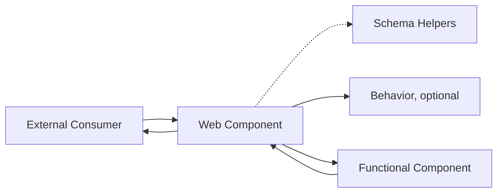
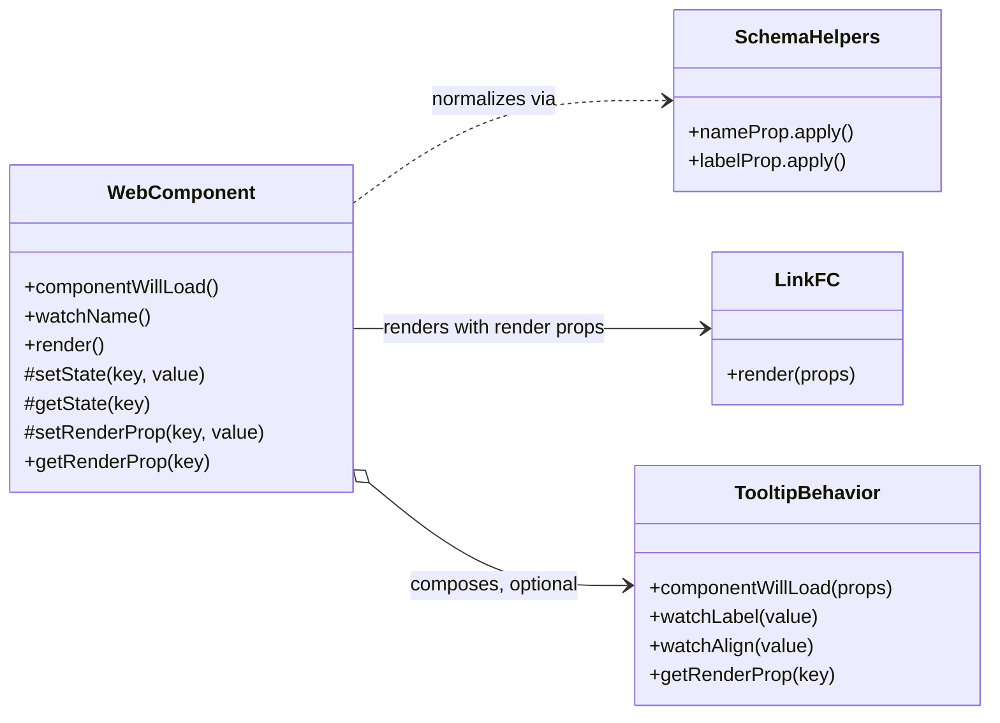
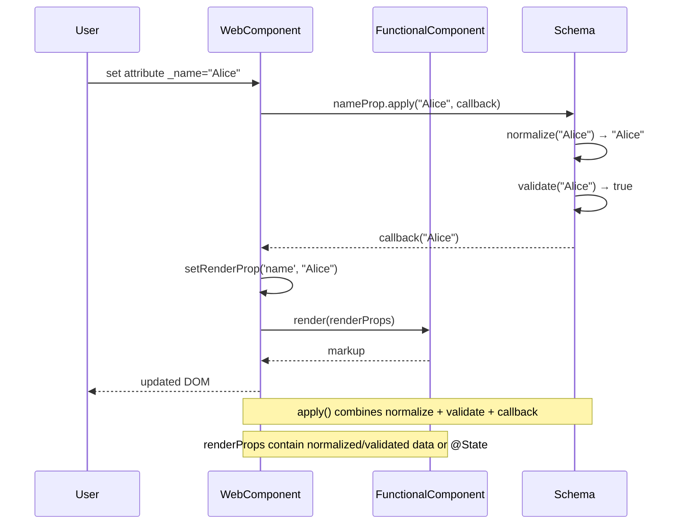

# Skeleton Blueprint Architecture (arc42)

## 1. Introduction and Goals

The `kol-skeleton` component blueprint demonstrates how KoliBri web components can be built in a highly maintainable and decoupled fashion. It is designed as a minimal, yet complete, reference implementation for new components.

The architecture is organized into **two layers** plus an optional reusable unit of logic:

- **[Web Component (WC)](./web-components/skeleton/component.tsx)** — the orchestrator. It owns the Stencil lifecycle (`@Prop`/`@State`/`@Watch`/`@Method`), normalizes incoming props, manages reactive state, composes optional Behaviors, and feeds fully resolved render props to the Functional Component.
- **[Behaviors](../../internal/functional-components/base-behavior.ts)** — optional, composable logic modules (e.g. `TooltipBehavior`). A WC may compose zero or more Behaviors. They manage their own render props but receive state access from their host WC.
- **[Functional Component (FC)](../../internal/functional-components/skeleton/component.tsx)** — a pure, stateless renderer. It renders solely from the props handed to it and never mutates state.
- **[Schema helpers](../../internal/props/)** — house prop types, normalization and validation helpers shared across layers.

Primary goals:

- illustrate a minimal separation of concerns for long-term maintainability
- keep the WC as the single orchestrator — no indirection layer between the custom element and the renderer
- factor out only genuinely reusable cross-component logic into Behaviors
- enforce consistent validation and type-safety boundaries
- document an end-to-end implementation pipeline that teams can replicate when bootstrapping new components

### Blueprint Layout

The skeleton mirrors the structure recommended for production-ready components. The web component definitions live inside `_skeleton/`, while reusable internals (functional components, behaviors, prop schemas) reside in the shared `src/internal/` directory. Each folder holds a single responsibility to make the pipeline explicit:

```text
src/
├── components/
│   └── _skeleton/                     # Blueprint directory
│       ├── web-components/
│       │   ├── skeleton/              # Skeleton custom element
│       │   │   ├── component.tsx      # Orchestrator: props, watchers, lifecycle, render
│       │   │   └── snapshot.spec.tsx  # Snapshot test (Jest) — co-located
│       │   └── click-button/          # Click-button custom element
│       │       ├── component.tsx
│       │       ├── interaction.e2e.ts  # Interaction test (Playwright)
│       │       └── snapshot.spec.tsx
│       ├── AGENTS.md                  # Agent instructions for this blueprint
│       └── ARC42.md                   # This document
└── internal/                          # Shared internals (not inside _skeleton/)
    ├── functional-components/
    │   ├── skeleton/                  # Skeleton-specific logic
    │   │   ├── api.tsx                # Type definitions + props config
    │   │   └── component.tsx          # Stateless functional component
    │   ├── click-button/              # Reusable button FC
    │   │   ├── api.tsx
    │   │   └── component.tsx
    │   ├── tooltip/                   # Tooltip behavior + FC
    │   │   ├── api.tsx
    │   │   ├── behavior.ts            # TooltipBehavior
    │   │   └── component.tsx
    │   ├── bem-root-node/             # Single-root BEM wrapper FC
    │   │   └── component.tsx
    │   ├── base-behavior.ts           # Shared behavior base class
    │   ├── base-web-component.ts      # Shared WC base class (orchestrator helpers)
    │   └── generic-types.ts           # Interface contracts
    └── props/                         # Prop types, normalisation and validation
        ├── helpers/
        │   ├── factory.ts             # Prop, SimpleProp, PropDefinition, apply()
        │   └── normalizers.ts         # normalizeString, normalizeInteger, etc.
        ├── label.ts                   # LabelProp
        ├── name.ts                    # NameProp
        ├── show.ts                    # ShowProp
        └── index.ts                   # Re-exports
```

This modular layout is the backbone for the architectural patterns described in the following chapters.

### Usage Example

```html
<kol-skeleton _name="Example"></kol-skeleton>
```

## 2. Architecture Constraints

- **Stencil** is used for authoring web components with **shadow: true** only (Shadow DOM enabled for style isolation).
- Components without Shadow DOM (`shadow: false`) exist only as a **transitional pattern** for legacy composition (see §4 Transitional Pattern), or are implemented as **Functional Components** to avoid style conflicts and reduce the maintainability burden.
- Components must compile to framework-agnostic Custom Elements.
- Public API properties use an underscored naming convention (e.g. `_name`) to separate external inputs from internal state.
- Documentation and code follow the `KoliBri` casing and repository conventions.

## 3. Context and Scope

The skeleton lives inside `packages/components` and does not depend on runtime frameworks. External consumers interact through HTML attributes or DOM APIs.

**Shadow DOM Strategy**: KoliBri uses Web Components with Shadow DOM enabled (`shadow: true`) by default. This ensures:

- **Style Isolation**: Component styles cannot leak into host page styles and vice versa
- **Encapsulation**: Components maintain consistent appearance regardless of host environment
- **Maintainability**: Clear boundaries prevent unintended style interactions



The external consumer interacts solely with the custom element. The WC is the orchestrator: it normalizes
incoming values (consulting the schema helpers), composes optional Behaviors, and hands the resulting render
props to the stateless functional component. The resulting DOM is patched back into the WC and finally
exposed to the consumer. Each arrow corresponds to an explicit TypeScript contract, ensuring that
integration points are discoverable and type safe.

## 4. Solution Strategy

The blueprint enforces unidirectional data flow. The WC owns the full lifecycle: it normalizes props, manages reactive state, composes Behaviors, and renders. There is no controller/aspect class between the custom element and the FC.

### Web Component Layer

The WC **is** the orchestrator. It extends `BaseWebComponent<Api>`, which provides:

- `initRenderProps(config)` — call once in `componentWillLoad` to seed the render-prop store with defaults from the props config.
- `setRenderProp(key, value)` / `getRenderProp(key)` — store and read normalized render props.
- `setRawProp(key, value)` / `getRawProp(key)` — store/read the last raw (unprocessed) `@Prop` value, useful for change detection in watchers.
- `stateAccess` — a `{ setState, getState }` bundle passed to composed Behaviors.
- `stateLess` — a frozen sentinel for Behaviors that use no `@State`.

Responsibilities of the WC:

- Declares the public API using underscored props (e.g. `_name`).
- Owns the Stencil-specific decorators (`@Prop`, `@Event`, `@Watch`, `@State`, `@Listen`). Watchers normalize incoming values via schema helpers and store them with `setRenderProp`.
- Manages derived/UI state on `@State` fields, updated through `setState`/`getState` for reactivity.
- Composes optional Behaviors (e.g. `private readonly tooltipBehavior = new TooltipBehavior(this.stateAccess)`).
- Renders the FC inside a bare `<Host>` (shadow DOM). No `<Host class="kol-…">` — the tag name plus Shadow DOM are sufficient.

A WC has **exactly one orchestrator (itself)** plus zero or more Behaviors. A WC may compose Behaviors, never other WCs.

```tsx
// WC — the orchestrator (KolLink, reference implementation)
export class KolLink extends BaseWebComponent<LinkApi> implements WebComponentInterface<LinkApi> {
	private readonly tooltipBehavior = new TooltipBehavior(this.stateAccess);

	public componentWillLoad(): void {
		this.initRenderProps(linkPropsConfig);
		hrefProp.apply(this._href, (v) => this.setRenderProp('href', v));
		labelWithExpertSlotProp.apply(this._label, (v) => this.setRenderProp('label', v));
		// …all other props…
		this.tooltipBehavior.componentWillLoad({ label: this.getTooltipLabel(), align: this.getRenderProp('tooltipAlign') });
	}

	@Watch('_href')
	public watchHref(value?: string): void {
		hrefProp.apply(value, (v) => this.setRenderProp('href', v));
	}

	public render(): JSX.Element {
		return (
			<Host>
				<LinkFC
					href={this.getRenderProp('href')}
					label={this.getRenderProp('label')}
					refTooltip={this.tooltipBehavior.setTooltipElementRef}
					// …all other render props…
				/>
			</Host>
		);
	}
}
```

### Public API Contract (Migration Parity)

The public API of a web component is exactly its set of `@Prop`/`@Method` members — for KoliBri
the underscored props (`_href`, `_label`, …) plus the public methods (`focus()`, `click()`, …) —
**including** their JSDoc comments, their types, their defaults and any `@deprecated` markers.

**Migration rule: the public API of a migrated component must be identical to its predecessor.**
When refactoring a legacy component to the skeleton architecture, the migrated WC must expose the
same public members, with the same types (schema aliases, not downgraded primitives), the same
defaults and the same documentation. It must not add, remove, rename, retype or undocumented any
public member. A behavioural difference behind an unchanged member is a separate, consciously
reviewed decision — never a side effect of the migration.

**The FC's props are internal, not public API.** The functional component is an internal renderer
contract: it may offer more (or differently typed) props than the WC exposes. The WC is the API
gate — it decides which render props are fed from public props and which stay at their internal
defaults. Never derive the public API from the FC's props, and never add a public `@Prop` "because
the FC has one". Conversely, internal-only capabilities (e.g. `ariaOwns`, `customClass`, `tabIndex`
on `LinkFC`) may stay unreachable from the outside when the predecessor component did not expose
them either.

**Why the JSDoc is part of the contract:** `stencil build --docs` generates `docs-vscode`,
`docs-readme` and — via `generateCustomElementsJson` — the `custom-elements.json` descriptors
directly from `prop.docs` / `method.docs`. A `@Prop` without a JSDoc comment silently loses
IntelliSense and generated documentation for every adapter package. The same applies to
`@deprecated` markers, which announce planned removals to consumers.

**Compile-time enforcement:** the WC implements the schema interface from `src/schema` (e.g.
`implements LinkProps`) **in addition to** `WebComponentInterface<Api>`. The generic
`WebComponentInterface` alone derives its prop types from the internal prop definitions
(primitives like `string`/`boolean`), which would allow the public types to silently drift away
from the schema. The schema alias types (`HrefPropType`, `LabelWithExpertSlotPropType`,
`AlternativeButtonLinkRolePropType`, …) are structurally identical to the internal external types,
so both `implements` clauses can coexist. Legacy state-shape requirements of `*API` types (e.g.
`InternalLinkAPI`'s `state` member) are replaced by the render-prop store; implement the `*Props`
interface instead.

**Verification (mandatory before merging a migration):** extract every `@Prop`/`@Method`
declaration with its preceding JSDoc block from the predecessor file (`git show <base>:<path>`)
and from the migrated file, and diff the two member lists. Any difference is a finding that needs
an explicit justification in the PR description.

This is enforced continuously by the skeleton contract test
[`_skeleton/public-api.spec.ts`](./public-api.spec.ts): it extracts the `@Prop`/`@Method` members
(including JSDoc, types, defaults and requiredness) from the component sources and compares them
against a hand-written pinned contract. **Extend the spec with a pinned contract for every newly
migrated component** — the pin makes any future public API change fail the build, which is exactly
the point: such a change is a breaking change and must be an explicit, reviewable edit.

### Behavior Layer

A Behavior is a reusable unit of logic that lives **inside** a WC. It extends `BaseBehavior<Api>` and:

- Manages its own render props (`setRenderProp`/`getRenderProp`), seeded from its own props config in the `BaseBehavior` constructor.
- Receives `StateAccess<Api>` from its host WC — either a real bundle or `BaseWebComponent.stateLess` when it manages no `@State`.
- Exposes watcher entry points and lifecycle hooks (`componentWillLoad`) that the WC delegates to.
- Must never instantiate other Behaviors directly — only the WC composes them.

Rule of thumb: a Behavior exists only when the same logic is genuinely shared across multiple components. The sole current example is `TooltipBehavior`, composed by link, button, and similar components.

```tsx
// Inside a WC
private readonly tooltipBehavior = new TooltipBehavior(this.stateAccess);

// delegating to the behavior from a watcher
private applyTooltipAlign(value?: string): void {
	tooltipAlignProp.apply(value, (v) => {
		this.setRenderProp('tooltipAlign', v);
		this.tooltipBehavior.watchAlign(v);
	});
}
```

For a Behavior that has no `@State` fields, pass `BaseWebComponent.stateLess`:

```tsx
private readonly someStatelessBehavior = new SomeBehavior(BaseWebComponent.stateLess);
```

### Functional Component Layer

The FC is a pure renderer. It:

- Receives normalized render props, callbacks, emitters and refs from the WC.
- Avoids any side effects or state mutation. User interactions are signalled via DOM events/callbacks back to the WC.
- Maps props to accessible markup and wires refs for imperative access when required.
- May call stateless utility functions (e.g. `translate()`, formatters) directly — the `Callbacks` bucket in `ComponentApi` is reserved for event-driven callbacks only, not data accessors.

#### BemRootNodeFC Pattern

FCs use `BemRootNodeFC` to produce a single-root BEM structure. It renders exactly one `<div>` root node (enforcing a single-root FC), accepts a typed `block` name and `modifiers`, and merges an optional forwarded `class`:

```tsx
export const LinkFC: FC<FunctionalComponentProps<LinkApi>> = (props) => {
	const { disabled, inline, hideLabel, customClass, variant } = props;
	// …
	return (
		<BemRootNodeFC
			block="kol-link"
			class={clsx({ [customClass]: variant.includes('custom'), [classNameFromVariant(variant, 'link')]: variant.length > 0 })}
			modifiers={{
				disabled: disabled === true,
				'hide-label': hideLabel === true,
				inline: inline === true,
				standalone: inline === false,
			}}
		>
			<a class="kol-link__anchor" /* … */>…</a>
		</BemRootNodeFC>
	);
};
```

The `block` and `modifiers` keys are validated against `KoliBriComponentsBemSchema`, so `block="kol-link"` is type-checked and `modifiers={{ disabled: true }}` only accepts registered modifier keys. The output is `<div class="kol-link kol-link--disabled …">`; inner elements use plain BEM element classes (`kol-link__anchor`, `kol-link__text`).

**Registration requirement:** before using `BemRootNodeFC block="kol-xxx"`, the block must be registered in `src/schema/bem-registry.ts` in **both** places — the exported `KoliBriComponentsBemSchema` type (required for compilation) and the runtime `BEM` const (consumed by the `kolibri-cli` SCSS generator). Type-only registration compiles and renders, but silently breaks theme SCSS generation.

**When not to use it:** `BemRootNodeFC` always renders a `<div>` root. For FCs whose semantic root is another element (e.g. `ClickButtonFC` renders a `<button>`), build the root manually with `bem.forBlock('kol-xxx')(modifiers)` instead — the same typed schema applies. Currently only `LinkFC` uses `BemRootNodeFC`; `SkeletonFC` and `ClickButtonFC` use direct `bem.forBlock` calls for this reason.

### Transitional Pattern (shadow:false)

When a legacy consumer renders an internal WC inside its own shadow DOM and needs to reach the inner `.kol-…` CSS classes from its stylesheets, a `shadow:true` element would encapsulate those classes behind a shadow boundary and break consumer styling. The solution is a **transitional `shadow:false` WC** that renders the FC directly into the light DOM:

```tsx
@Component({
	tag: 'kol-link-wc',
	shadow: false,
})
export class KolLinkWc extends BaseWebComponent<LinkApi> implements WebComponentInterface<LinkApi> {
	// Same orchestrator logic as KolLink, but render() returns <LinkFC …/> directly
	// (no <Host> wrapper) so the inner DOM is reachable by consumer CSS.
}
```

This is temporary scaffolding. When the consumer migrates to the Skeleton pattern, it should render `LinkFC` directly (inline JSX) instead of instantiating `kol-link-wc`. Once all consumers have migrated, the transitional component is deleted.

### Schema Helper Layer

Web components receive dynamic values from HTML attributes, but internal rendering requires statically typed data. The schema helper layer bridges that gap through **graceful degradation**: attempt minimal type conversion, then validate, but never force invalid data into types.

Design principles:

- **Fail gracefully**: Invalid data is ignored rather than causing errors
- **Minimal conversion**: Only obvious transformations (string numbers → numbers)
- **Type guarantees**: Once validated, types are guaranteed throughout the component lifecycle
- **Single source of truth for defaults**: Default values are defined explicitly in shared prop/schema helpers and consumed by components, avoiding duplicated or drifting defaults

#### Dual-Type Props

Each prop can define an **external** (Web Component API) and an **internal** (FC) type. The external type may be more permissive to support shorthand values from HTML attributes, while the internal type is always the normalized form.

`Prop<K, TExternal, TInternal>` encodes both via phantom keys (`__input_${K}` carries the external type, `__propInternal__` carries the internal type). `SimpleProp<K, T>` is a shorthand when both types are identical:

```typescript
// Different external and internal types:
type ColorProp = Prop<'color', ColorPair | string, ColorPair>;
//                     └─ Key  └─ Web Component     └─ FC

// Same external and internal type (shorthand):
type MaxProp = SimpleProp<'max', number>;
//                        └─ Key └─ Both types
```

#### `PropDefinition<TInternal>`

`PropDefinition<TInternal>` defines `normalize` (unknown → TInternal), `validate` (TInternal → boolean), `getDefaultValue()` (→ TInternal) and `apply(value, callback)`. The normalize function accepts `unknown` because HTML attributes can arrive as any type.

Each `PropDefinition` provides an `apply(value, callback)` method that combines normalization, validation and fallback handling into a single call. If the value is `undefined` or `null`, the built-in default is used. Otherwise, the value is normalized and validated before being passed to the callback — ensuring callbacks only receive type-safe internal values:

```typescript
maxProp.apply(value, (normalized) => {
	// normalized is number, type-safe and validated (> 0)
	this.setRenderProp('max', normalized);
});
```

#### `DependentPropDefinition<TInternal, TDeps>`

Some props require context from other props to normalize or validate correctly. `createDependentPropDefinition` extends the pattern with a `TDeps` parameter passed through to both `normalize` and `validate`. Its `apply` method takes the deps object as a third argument:

```typescript
clampedNumberValueProp.apply(
	value,
	(normalized) => {
		this.setRenderProp('value', normalized);
	},
	{ min: 0, max: this.getRenderProp('max') },
);
```

#### Type Extraction

`InternalOf<P>` and `ExternalOf<P>` utility types extract the correct type for each architectural layer automatically:

| Layer                | Type Extractor | Example (`ColorProp`) |
| -------------------- | -------------- | --------------------- |
| WC `@Prop`           | `ExternalOf`   | `ColorPair \| string` |
| `@Watch` handler     | `ExternalOf`   | `ColorPair \| string` |
| WC `setRenderProp`   | `InternalOf`   | `ColorPair`           |
| WC `getRenderProp`   | `InternalOf`   | `ColorPair`           |
| Functional Component | `InternalOf`   | `ColorPair`           |

### API Definition with `PropsConfigShape` and `ApiFromConfig`

Component APIs are defined using a runtime props config object (`PropsConfigShape`) that groups prop definitions into `required` and `optional` arrays. The `ApiFromConfig<Config, Extra>` utility type derives the full `ComponentApi` type from this config, making the props config the single source of truth for both runtime behaviour (normalization, validation, defaults) and compile-time types:

```ts
export const skeletonPropsConfig = {
	required: [nameProp],
} as const satisfies PropsConfigShape;

export type SkeletonApi = ApiFromConfig<
	typeof skeletonPropsConfig,
	{
		Callbacks: { click: () => void };
		Emitters: { loaded: number; rendered: void };
		Methods: { focus: () => void; toggle: () => void };
		States: { count: number; label: string; show: boolean };
	}
>;
```

`ApiFromConfig` automatically merges the phantom prop types from the config arrays into the `Props.Required` and `Props.Optional` fields. The same config object is passed to `initRenderProps(config)` in the WC, which derives the initial render-prop defaults.

The contracts between layers are formalized through TypeScript interfaces in [`generic-types.ts`](../../internal/functional-components/generic-types.ts). These generics (`WebComponentInterface`, `BehaviorInterface` and `FunctionalComponentProps`) guarantee that components share a consistent shape for props, callbacks, emitters and refs.

### Methods and Automatic Promise Wrapping

Stencil requires that all public `@Method()` decorated methods return a `Promise`. To keep API definitions concise, `ComponentApi` allows method signatures to be defined with plain return types. The `PromiseMethod<Methods>` utility type automatically wraps each method's return type in `Promise<T>` via `WebComponentInterface`:

```ts
// API definition — simple, no Promise required
Methods: {
  focus: () => void;
  getValue: () => number;
};
```

```ts
// Resolved in WebComponentInterface — automatically Promise-wrapped
focus: () => Promise<void>;
getValue: () => Promise<number>;
```

`BehaviorInterface` intentionally does **not** apply `PromiseMethod` wrapping — Behaviors stay synchronous and testable, and the `async`/`Promise.resolve()` wrapping happens at the WC layer.

### Event Handler Policy

WC and Behavior methods follow a clear convention based on their usage pattern:

- **Callbacks, event handlers, and ref setters** are declared as **arrow class properties** (`handleClick = () => { … }`). This auto-binds them to the instance, so they can be safely passed as references without `.bind(this)` or wrapper arrows.
- **Lifecycle methods, watchers, and public API methods** (`componentWillLoad`, `watchName`, `focus`, `toggle`) remain **prototype methods** shared across all instances for memory efficiency.

Because callbacks are already arrow properties, both render patterns are valid:

```tsx
// Pattern A: Pass arrow property directly (concise)
<ClickButtonFC handleClick={this.handleClick} refButton={this.setButtonRef} />

// Pattern B: Wrap in arrow for explicit forwarding (allows intermediate logic)
<SkeletonFC handleClick={() => this.handleClick()} refButton={(el) => this.setButtonRef(el)} />
```

#### ⚠️ Never use `.bind(this)` with `addEventListener`/`removeEventListener`

Arrow function properties automatically bind `this` at definition time. **Never** create new bound instances with `.bind(this)` in DOM event registration, as this causes listener accumulation and memory leaks — `addEventListener` and `removeEventListener` must receive the **exact same function reference** to match. Use an arrow property, or a ref callback that removes the old listener before adding the new one (see `src/components/popover-button/component.tsx`, `handleToggle` + `componentDidRender`/`disconnectedCallback`).

### Implementation Flow

1. **Initialisation** – `componentWillLoad` calls `initRenderProps(config)` and applies the current prop snapshot, ensuring render props reflect external values before the first render. Composed Behaviors are initialized here too.
2. **Prop updates** – `@Watch` handlers receive raw values, normalize/validate them via schema helpers, and store the result with `setRenderProp`.
3. **Rendering** – the WC reads render props via `getRenderProp` and feeds them into the FC.
4. **User interaction** – the FC emits DOM events / calls callbacks. The WC wires these back into its own handlers (or Behavior methods) so state transitions remain encapsulated.

### Props Pattern

A critical design principle is that **functional components always render using Props**, which are either:

1. **Normalized and validated external props** — incoming props processed through schema helpers
2. **Internal component state** — derived or computed values managed by the WC via `@State`

This ensures the renderer never works with raw, unvalidated data. Props must always be initialized before being passed to the FC (`initRenderProps` guarantees this).

### Watcher Example

Incoming props are normalized in dedicated watchers directly inside the WC:

```ts
// Prop definition (internal/props/name.ts)
type NameProp = SimpleProp<'name', string>;
const nameProp = createPropDefinition<NameProp>('name', '', normalizeString);
```

```tsx
// Web Component (web-components/skeleton/component.tsx)
@Prop() public _name!: string;

@Watch('_name')
public watchName(value?: string): void {
	nameProp.apply(value, (v) => this.setRenderProp('name', v));
}
```

The `apply()` method uses the default value built into `nameProp` when the incoming value is `undefined` or `null`.

### WC State Management

The WC manages two kinds of state directly:

**Normalized Props** (via `setRenderProp()`):

- Stored in the render-prop map after validation
- Updated by watchers (e.g. `watchName`)
- Never trigger Stencil re-renders on their own
- Retrieved via `getRenderProp(key)` for rendering

**Derived/Managed State** (via `@State` + `setState()`/`getState()`):

- Stored in `@State` fields on the WC
- Used for computed or UI state (e.g. `count`, `show`, `ariaCurrent`)
- Each `setState()` assignment triggers a Stencil re-render
- Read back with `getState(key)`

**Rule**: a prop watcher should call `setRenderProp()` to store the normalized value. Add a `setState()` call only for `@State` fields that require reactive updates. This minimizes re-renders while keeping code clear:

```tsx
@Watch('_name')
public watchName(value?: string): void {
	nameProp.apply(value, (v) => {
		this.setRenderProp('name', v);     // Store normalized prop (no re-render)
		// this.setState('name', v);       // Add only if 'name' is also an @State field
	});
}
```

### WC Initialization

`componentWillLoad` seeds render props from the config, then applies the current prop values. It also initializes composed Behaviors:

```tsx
// Web Component
public componentWillLoad(): void {
	this.initRenderProps(skeletonPropsConfig);
	nameProp.apply(this._name, (v) => this.setRenderProp('name', v));
	this.tooltipBehavior.componentWillLoad({ label: this.getTooltipLabel(), align: this.getRenderProp('tooltipAlign') });
}
```

## 5. Building Block View



**Web Component** — implements `WebComponentInterface`, owns the lifecycle, normalizes props, manages reactive state, composes optional Behaviors, and renders the FC.

**TooltipBehavior** — implements `BehaviorInterface`, encapsulates a single reusable concern (tooltip show/hide, listener syncing, positioning). Composed by any WC that needs it.

**LinkFC** — implements `FunctionalComponentProps`, receives the render props and produces JSX without touching state.

**Schema helpers** — provide deterministic data normalization and validation functions reused across all WCs.

## 6. Runtime View

The following sequence demonstrates how an external update is normalized and validated before it propagates to the renderer. The WC handles normalization directly — there is no intermediate layer.



This runtime view highlights how the WC normalizes and validates external values before any rendering occurs. Only after the WC updates its render props does it invoke the functional component, patch the returned markup and expose the updated DOM to the user.

## 7. Deployment View

The skeleton ships as part of the `@public-ui/components` package. During build the Stencil compiler produces framework-agnostic bundles ready for distribution via npm or CDN.

## 8. Cross-cutting Concepts

| Concept                                       | Description                                                                                                                                                                                                                                                                                                                                                                                                                                                                                                                                                                        |
| --------------------------------------------- | ---------------------------------------------------------------------------------------------------------------------------------------------------------------------------------------------------------------------------------------------------------------------------------------------------------------------------------------------------------------------------------------------------------------------------------------------------------------------------------------------------------------------------------------------------------------------------------- |
| **Composition over inheritance**              | WCs compose Behaviors (e.g. `TooltipBehavior`) for reusable logic rather than relying on inheritance.                                                                                                                                                                                                                                                                                                                                                                                                                                                                              |
| **Orchestrator WC**                           | The WC is the single orchestrator: it normalizes props, manages state, and renders. No controller/aspect class sits between the element and the FC.                                                                                                                                                                                                                                                                                                                                                                                                                                |
| **BemRootNodeFC pattern**                     | FCs render a single root `<div>` via `BemRootNodeFC`, with a type-checked `block` and `modifiers`. Produces `<div class="kol-block kol-block--…">`; inner elements use BEM element classes.                                                                                                                                                                                                                                                                                                                                                                                        |
| **Transitional shadow:false pattern**         | Legacy consumers that render an internal WC inside their own shadow DOM and need to reach inner `.kol-…` classes use a `shadow:false` transitional WC (`kol-link-wc`). Migrating consumers render the FC directly instead.                                                                                                                                                                                                                                                                                                                                                         |
| **Declarative rendering**                     | Functional components are pure and stateless.                                                                                                                                                                                                                                                                                                                                                                                                                                                                                                                                      |
| **Event-driven communication**                | User interaction is emitted as DOM events/callbacks rather than calling functions across layers.                                                                                                                                                                                                                                                                                                                                                                                                                                                                                   |
| **Props Pattern**                             | Functional components exclusively receive Props that contain either normalized/validated external data or internal component state. Props must always be initialized.                                                                                                                                                                                                                                                                                                                                                                                                              |
| **Shadow DOM First**                          | WCs use `shadow: true`; `shadow: false` is reserved for the transitional pattern. Components that never need an element wrapper are plain FCs.                                                                                                                                                                                                                                                                                                                                                                                                                                     |
| **ARIA ID Uniqueness via readable nonce IDs** | Any DOM `id` referenced by ARIA attributes (e.g. `aria-controls`, `aria-labelledby`) must be unique per component instance and follow the pattern `readable-identifier-<nonce>`. Use `private readonly someId = createUniqueId('readable-identifier')` from `utils/dev.utils`. This prevents ID collisions when components are composed inside a shared DOM scope (e.g. multiple WC instances within one shadow root, or direct light-DOM usage). Shadow DOM alone is not sufficient when a shadow component renders multiple instances of an internal WC in the same shadow root. |
| **State ownership**                           | The WC owns reactive state (`@State`) and render props; the FC consumes them.                                                                                                                                                                                                                                                                                                                                                                                                                                                                                                      |
| **Type safety**                               | `WebComponentInterface`, `BehaviorInterface` and `FunctionalComponentProps` encode compile-time contracts between layers.                                                                                                                                                                                                                                                                                                                                                                                                                                                          |
| **Watcher placement**                         | Attach `@Watch` only to underscored public props (e.g. `_name`); internal state fields use `@State`.                                                                                                                                                                                                                                                                                                                                                                                                                                                                               |

## 9. Design Decisions

1. **Eliminate the Aspect layer**
   - _Previous architecture_: a separate `BaseAspect` class sat between the WC and the FC (`WC → Aspect → FC`).
   - _Reason_: the relationship was strictly 1 WC : 1 Aspect, so the Aspect was pure indirection — every watcher and render-prop access was a pass-through. The WC can manage render props directly (`initRenderProps`/`setRenderProp`/`getRenderProp` on `BaseWebComponent`). Removing the layer halves the number of classes per component, removes a constructor/`StateAccess` handoff, and keeps the data flow in one place. Only genuinely composable, cross-component logic survives as a `Behavior`.
2. **Behaviors for genuinely shared logic only**
   - _Alternative_: also extract per-component logic into a dedicated behavior/controller.
   - _Reason_: a Behavior earns its existence only when the same logic is reused across multiple components (e.g. `TooltipBehavior`). Single-use logic stays as private methods on the WC.
3. **Underscored public props**
   - _Alternative_: mirror external props directly without underscores.
   - _Reason_: underscores make the separation between public API and internal state explicit.
4. **Shadow DOM enabled for web components (shadow: true)**
   - _Alternative_: allow some components to have `shadow: false`.
   - _Reason_: Shadow DOM ensures consistent style isolation and prevents CSS conflicts from host page styles, eliminating a category of hard-to-debug styling issues.
5. **Transitional shadow:false WCs for legacy composition**
   - _Alternative_: force all consumers to migrate before any refactor lands.
   - _Reason_: a `shadow:false` WC (`kol-link-wc`) lets legacy consumers keep reaching inner `.kol-…` classes while the consumer is migrated incrementally. Once a consumer renders the FC directly, the transitional element is deleted.
6. **Centralised validation in the WC**
   - _Alternative_: perform validation scattered inside prop watchers without schema helpers.
   - _Reason_: routing all external values through `PropDefinition.apply()` keeps validation, defaults and normalization in one reusable, testable place.
7. **Functional component rendering**
   - _Alternative_: render JSX directly inside the web component class.
   - _Reason_: a pure renderer improves testability and eliminates side effects.
8. **Generic interface contracts**
   - _Alternative_: rely on ad-hoc typing per component.
   - _Reason_: shared interfaces keep props, callbacks, emitters and refs uniform across components, making WCs, Behaviors and renderers interchangeable.
9. **@State for managed UI state, render props for normalized props**
   - _Pattern_: public props (e.g. `_name`) are normalized and stored as render props. UI state that is managed but not exposed as props (like `count`, `show`, `ariaCurrent`) uses `@State` to trigger reactive re-renders.
   - _Reason_: normalized props do not need `@State` — they are held as render props and accessed via `getRenderProp(key)`. This avoids unnecessary re-rendering while keeping reactive state explicit.
10. **Host element without redundant class attribute**
    - _Alternative_: add the component name as a class attribute to `<Host>` (e.g. `<Host class="kol-skeleton">`).
    - _Reason_: the tag name alone (e.g. `<kol-skeleton>`) plus Shadow DOM are sufficient for styling and identification. The BEM root class is emitted by `BemRootNodeFC` inside the FC, not on `<Host>`.
11. **Omit unused API fields in ComponentApi definitions**
    - _Pattern_: all fields in `ComponentApi` are optional except `States` (`Props`, `Emitters`, `Methods`, `Callbacks`, `Refs`, `Listeners` — `States` is required and defaults to `Record<never, never>` via `ApiFromConfig`). Only define the fields the component actually uses. The generic type extraction in `generic-types.ts` safely defaults missing fields to empty records.
    - _Alternative_: define all fields explicitly, using empty records for unused ones.
    - _Reason_: a minimal API definition is easier to read and accurately conveys what the component does.
12. **ARIA ID uniqueness via `createUniqueId()`**
    - _Pattern_: any `id` referenced by an ARIA relation attribute must be unique per instance. Declare stable base ids as `private readonly xId = createUniqueId('x')` and derive related ids with `createRelatedUniqueId(baseId, 'control')`.
    - _Alternative_: hardcode a static string.
    - _Reason_: Shadow DOM scopes IDs per shadow root, but a parent may render multiple instances of an internal WC in the same shadow root, colliding IDs. `createUniqueId()` is cheap and eliminates this category of bug, and also covers direct light-DOM usage.
13. **No `data-testid` — use BEM class selectors in tests**
    - _Pattern_: do not add `data-testid` attributes. Tests select elements via their BEM class names (`page.locator('.kol-component__element')`).
    - _Alternative_: add `data-testid` and use `getByTestId()`.
    - _Reason_: BEM class names are already present, stable, and semantically tied to the component. Using them keeps production markup clean of test-only concerns.
14. **Test co-location — all tests live next to the component**
    - _Pattern_: all test files sit directly alongside `component.tsx` — snapshot tests (`snapshot.spec.tsx`, Jest) and interaction tests (`interaction.e2e.ts`, Playwright). File names are uniform across components.
    - _Alternative_: group tests into a dedicated `test/` subdirectory.
    - _Reason_: co-located tests are easier to discover and keep related files visible side-by-side.
15. **Public API parity during migration — the FC face is not the public face**
    - _Pattern_: a skeleton migration keeps the WC's public `@Prop`/`@Method` set byte-identical to the predecessor: same members, same schema-alias types, same defaults, same JSDoc (including `@deprecated`). The WC implements the schema `*Props` interface alongside `WebComponentInterface<Api>` so drift fails the build. Internal FC props without a public predecessor prop stay internal (fed from defaults, no public `@Prop` added).
    - _Alternative_: expose every FC prop 1:1 as a public `@Prop` and declare props with the internal primitive types.
    - _Reason_: the public API is a compatibility contract (adapters, IntelliSense, `custom-elements.json` are generated from `prop.docs`/`method.docs`). Growing it silently (e.g. link gained `_ariaOwns`, `_customClass`, `_tabIndex`, `click()`) or dropping its documentation is a breaking change disguised as a refactor. See [§4 Public API Contract](#public-api-contract-migration-parity).

## 10. Quality Requirements

- Maintainability: the WC is the single orchestrator, reducing the number of classes and the cost of change.
- Reliability: schema helpers validate every external value before it mutates state.
- Testability: the FC is a pure renderer and can be unit tested in isolation; Behaviors can be tested standalone. Snapshot tests (Jest) verify DOM output; interaction tests (Playwright) verify user-facing behaviour.
- Performance: **optimized re-rendering** — public props are normalized and stored as render props (no re-render); only `@State` changes trigger re-renders. Stencil batches simultaneous prop/state changes into a single re-render.
- Accessibility: follow repository-wide a11y presets and prefer `KolTooltip` over `title` attributes.
- Security: avoid direct DOM injection; rely on typed props and validation to prevent XSS.

## 11. Risks and Technical Debt

- The transitional `shadow:false` WCs are temporary scaffolding; they should be removed as consumers migrate to render FCs directly.
- WCs with many props can accumulate verbose watcher boilerplate; the `PropDefinition.apply()` pattern keeps each watcher to one line, but a component with dozens of props still produces dozens of watchers.
- Behaviors that hold listener references must clean up in `disconnectedCallback` to avoid leaks (see the Event Handler Policy warning).

## 12. Glossary

| Term                     | Definition                                                                                                                                     |
| ------------------------ | ---------------------------------------------------------------------------------------------------------------------------------------------- |
| **BEM**                  | Block Element Modifier naming convention for CSS class names.                                                                                  |
| **BemRootNodeFC**        | Single-root BEM wrapper FC. Renders one `<div class="kol-block kol-block--…">` from a type-checked `block` and `modifiers`.                    |
| **Behavior**             | Optional, composable unit of reusable logic living inside a WC; extends `BaseBehavior`. Example: `TooltipBehavior`.                            |
| **Orchestrator (WC)**    | The web component, which directly owns lifecycle, prop normalization, state management, Behavior composition and rendering.                    |
| **Functional Component** | Pure renderer without side effects that exclusively works with Props.                                                                          |
| **Props**                | Normalized and validated props or internal state passed to functional components. Must always be initialized.                                  |
| **Render props**         | Validated, normalized prop values stored on the WC via `setRenderProp` and read via `getRenderProp` for rendering.                             |
| **Schema Helper**        | Utility providing `normalize` (unknown → TInternal), `validate` (TInternal → boolean) and `apply` (normalize + validate + callback) for props. |
| **StateAccess**          | `{ setState, getState }` bundle a WC passes to a Behavior; `BaseWebComponent.stateLess` is the no-op sentinel for stateless Behaviors.         |
| **Stencil**              | Compiler for building framework-agnostic web components.                                                                                       |
| **Transitional WC**      | A `shadow:false` WC that renders an FC into the light DOM so legacy consumers can reach inner BEM classes; deleted once consumers migrate.     |
| **Watch Decorator**      | Stencil decorator (`@Watch`) that observes prop changes.                                                                                       |
