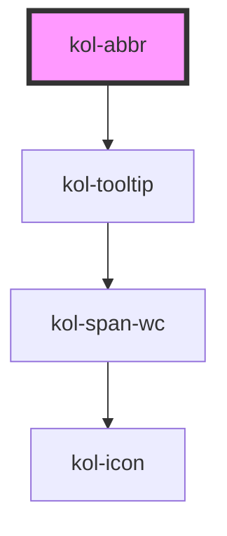

# Abbr

Die **Abbr**-Komponente implementiert den HTML-Tag `abbr`, wobei hier jedoch der Tooltip barrierefrei ist.
Der Tooltip für die Beschreibung wird bei Focus oder Hover der **Abbr**-Komponente angezeigt und vorgelesen.

## Konstruktion

### Code

```html
<p>Ich bin eine <kol-abbr _title="Abkürzung" _tooltip-align="top">Abbr</kol-abbr> mit Tooltip oben.</p>
<p>Ich bin eine <kol-abbr _title="Abkürzung" _tooltip-align="right">Abbr</kol-abbr> mit Tooltip rechts.</p>
<p>Ich bin eine <kol-abbr _title="Abkürzung" _tooltip-align="bottom">Abbr</kol-abbr> mit Tooltip unten.</p>
<p>Ich bin eine <kol-abbr _title="Abkürzung" _tooltip-align="left">Abbr</kol-abbr> mit Tooltip links.</p>
```

### Beispiel

<p>Ich bin eine <kol-abbr _title="Abkürzung" _tooltip-align="top">Abbr</kol-abbr> mit Tooltip oben.</p>
<p>Ich bin eine <kol-abbr _title="Abkürzung" _tooltip-align="right">Abbr</kol-abbr> mit Tooltip rechts.</p>
<p>Ich bin eine <kol-abbr _title="Abkürzung" _tooltip-align="bottom">Abbr</kol-abbr> mit Tooltip unten.</p>
<p>Ich bin eine <kol-abbr _title="Abkürzung" _tooltip-align="left">Abbr</kol-abbr> mit Tooltip links.</p>

## Verwendung

### Angabe der Beschreibung zur Abkürzung

Der Begriff bzw. die Erklärung wird über das Attribut **`_title`** übergeben, die Abkürzung bzw. der erklärungswürdige Begriff kommt zwischen die Tags im HTML.

### Ausrichtung des Tooltip

Über das Attribut **`_tooltip-align`** wird die Positionierung des ToolTip, relativ zur Abkürzung, festgelegt.

<!--### Best practices

### Anwendungsfälle-->

## Barrierefreiheit

Die Abbr-Komponente wurde von KoliBri umgesetzt, weil der Standard-Tooltip nicht barrierefrei bzgl. der Skalierung ist.
Der KoliBri Tooltip kann von Screenreadern vorgelesen werden und verändert seine Größe beim Zoomen korrekt.

## Links und Referenzen

- https://developer.mozilla.org/de/docs/Web/HTML/Element/abbr

<!-- Auto Generated Below -->


## Properties

| Property              | Attribute        | Description                                                                            | Type                                                  | Default     |
| --------------------- | ---------------- | -------------------------------------------------------------------------------------- | ----------------------------------------------------- | ----------- |
| `_title` _(required)_ | `_title`         | Dieses Property gibt die Beschreibung oder Erläuterung der Abkürzung an.               | `string`                                              | `undefined` |
| `_tooltipAlign`       | `_tooltip-align` | Gibt an, ob der Tooltip entweder oben, rechts, unten oder links angezeigt werden soll. | `"bottom" \| "left" \| "right" \| "top" \| undefined` | `'top'`     |


## Dependencies

### Depends on

- [kol-tooltip](../tooltip)

### Graph


----------------------------------------------


