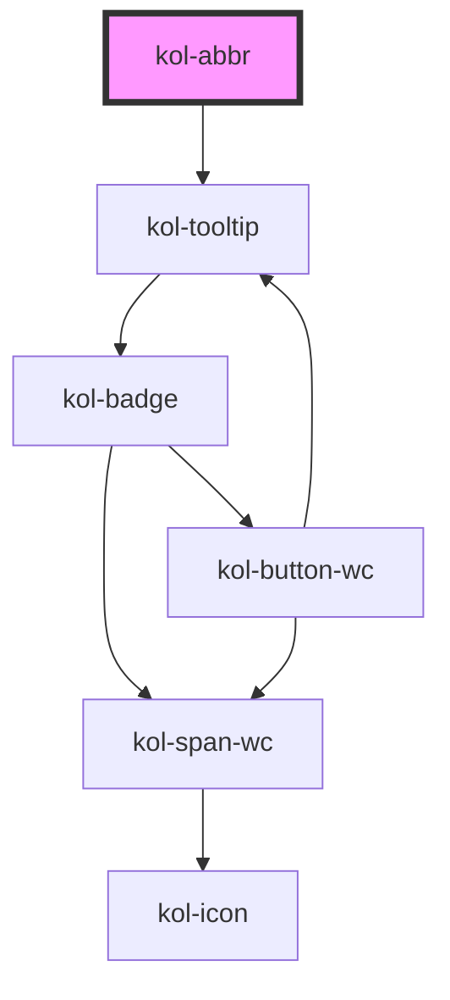

# Abbr

Die **Abbr**-Komponente implementiert den HTML-Tag `abbr`, wobei hier jedoch der Tooltip barrierefrei ist.
Der Tooltip für die Beschreibung wird bei Focus oder Hover der **Abbr**-Komponente angezeigt und vorgelesen.

## Konstruktion

### Code

```html
<kol-abbr _title="Abkürzung" _tooltip-align="top"> Abbr </kol-abbr>
```

### Beispiel

<p>Ich bin eine <kol-abbr _title="Abkürzung" _tooltip-align="top">Abbr</kol-abbr> mit Tooltip oben.</p>
<p>Ich bin eine <kol-abbr _title="Abkürzung" _tooltip-align="right">Abbr</kol-abbr> mit Tooltip rechts.</p>
<p>Ich bin eine <kol-abbr _title="Abkürzung" _tooltip-align="bottom">Abbr</kol-abbr> mit Tooltip unten.</p>
<p>Ich bin eine <kol-abbr _title="Abkürzung" _tooltip-align="left">Abbr</kol-abbr> mit Tooltip links.</p>

## Verwendung

### Angabe der Beschreibung zur Abkürzung

Die eigentliche Beschreibung wird über das Attribut **`_title`** übergeben.

### Ausrichtung des Tooltip

Über das Attribut **`_tooltip-align`** wird die Positionierung des ToolTip, relativ zur Abkürzung, festgelegt.

<!--### Best practices

### Anwendungsfälle-->

## Barrierefreiheit

Die Abbr-Komponente wurde von KoliBri umgesetzt, weil der Standard-Tooltip nicht barrierefrei bzgl. der Skalierung ist. Mittels der KoliBri-Komponente zoomt der Tooltip proportional zu seinem Text mit und wird vorgelesen.

## Links und Referenzen

- https://developer.mozilla.org/de/docs/Web/HTML/Element/abbr

<!-- Auto Generated Below -->

## Properties

| Property              | Attribute        | Description                                                                            | Type                                                  | Default     |
| --------------------- | ---------------- | -------------------------------------------------------------------------------------- | ----------------------------------------------------- | ----------- |
| `_title` _(required)_ | `_title`         | Dieses Property gibt die Beschreibung oder Erläuterung der Abkürzung an.               | `string`                                              | `undefined` |
| `_tooltipAlign`       | `_tooltip-align` | Gibt an, ob der Tooltip entweder oben, rechts, unten oder links angezeigt werden soll. | `"bottom" \| "left" \| "right" \| "top" \| undefined` | `'top'`     |

## CSS Custom Properties

| Name                        | Description                     |
| --------------------------- | ------------------------------- |
| `--kolibri-border-color`    | Default color of the border.    |
| `--kolibri-border-radius`   | Default radius of the border.   |
| `--kolibri-border-width`    | Default width of the border.    |
| `--kolibri-color-black`     | Default color of black (dark).  |
| `--kolibri-color-danger`    | Default color of the danger.    |
| `--kolibri-color-disabled`  | Default color of the disabled.  |
| `--kolibri-color-error`     | Default color of the error.     |
| `--kolibri-color-ghost`     | Default color of the ghost.     |
| `--kolibri-color-info`      | Default color of the info.      |
| `--kolibri-color-normal`    | Default color of the normal.    |
| `--kolibri-color-primary`   | Default color of the primary.   |
| `--kolibri-color-secondary` | Default color of the secondary. |
| `--kolibri-color-success`   | Default color of the success.   |
| `--kolibri-color-text`      | Default color of the text.      |
| `--kolibri-color-visited`   | Default color of the visited.   |
| `--kolibri-color-warning`   | Default color of the warning.   |
| `--kolibri-color-white`     | Default color of white (light). |
| `--kolibri-font-family`     | Default font family.            |
| `--kolibri-font-size`       | Default font size.              |

## Dependencies

### Depends on

- [kol-tooltip](../tooltip)

### Graph



---
