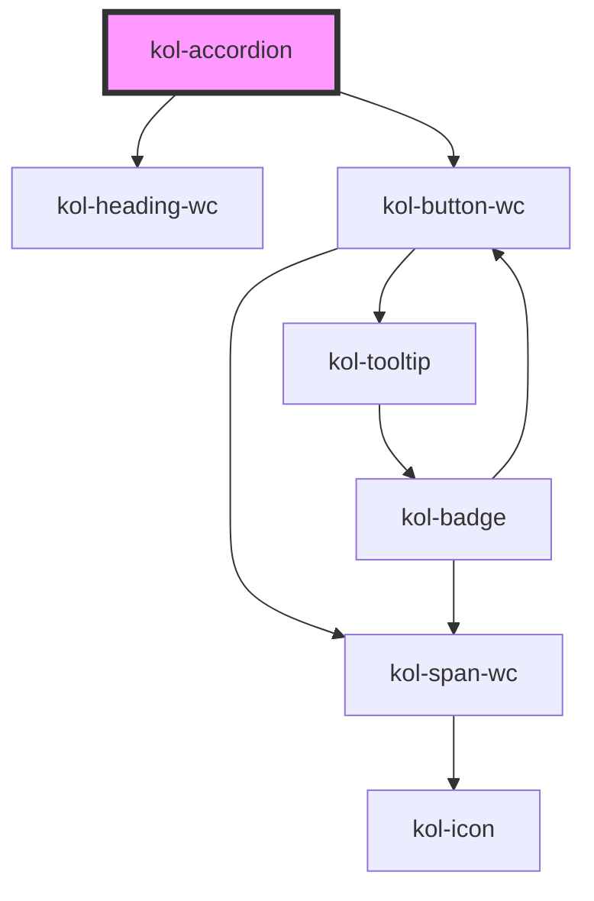

# Accordion

Die **Accordion**-Komponente ist ein Aufklapp-Menü. Klickt man auf den Kopfbereich, bestehend aus Icon und Überschrift, öffnet sich ein Textfeld mit zusätzlichen Informationen. Somit ist es ein interaktives Navigationselement, welches dazu dient, umfangreiche Inhalte platzsparend darzustellen.

Accordions kommen immer dann zum Einsatz, wenn einem thematischen Oberbegriff zugeordnete Inhalte angezeigt oder verborgen werden sollen. Sie erlauben umfangreichere Detailinformationen zu einem Oberbegriff, als es aus Gründen der Übersichtlichkeit eigentlich sinnvoll wäre. Sie überlassen es den Besucher:innen selbst, ob sie sich diese Informationen anzeigen lassen möchten.

## Konstruktion

### Code

```html
<kol-accordion _heading="Überschrift" _level="1" _open>
	<div slot="content">Beispieltext</div>
</kol-accordion>
```

### Beispiel

<div class="grid gap-2">
  <kol-accordion _heading="Element 1">
    <div slot="content">Lorem ipsum dolor sit amet, consetetur sadipscing elitr, sed diam nonumy eirmod tempor invidunt ut labore et dolore magna aliquyam erat, sed diam voluptua. At vero eos et accusam et justo duo dolores et ea rebum. Stet clita kasd gubergren, no sea takimata sanctus est Lorem ipsum dolor sit amet. Lorem ipsum dolor sit amet, consetetur sadipscing elitr, sed diam nonumy eirmod tempor invidunt ut labore et dolore magna aliquyam erat, sed diam voluptua. At vero eos et accusam et justo duo dolores et ea rebum. Stet clita kasd gubergren, no sea takimata sanctus est Lorem ipsum dolor sit amet.</div>
    <div slot="header">Inhalt eines Header</div>
  </kol-accordion>
  <kol-accordion _heading="Element 2">
    <div slot="content">Lorem ipsum dolor sit amet, consetetur sadipscing elitr, sed diam nonumy eirmod tempor invidunt ut labore et dolore magna aliquyam erat, sed diam voluptua. At vero eos et accusam et justo duo dolores et ea rebum. Stet clita kasd gubergren, no sea takimata sanctus est Lorem ipsum dolor sit amet. Lorem ipsum dolor sit amet, consetetur sadipscing elitr, sed diam nonumy eirmod tempor invidunt ut labore et dolore magna aliquyam erat, sed diam voluptua. At vero eos et accusam et justo duo dolores et ea rebum. Stet clita kasd gubergren, no sea takimata sanctus est Lorem ipsum dolor sit amet.</div>
  </kol-accordion>
  <kol-accordion _heading="Element 3">
    <div slot="content">Lorem ipsum dolor sit amet, consetetur sadipscing elitr, sed diam nonumy eirmod tempor invidunt ut labore et dolore magna aliquyam erat, sed diam voluptua. At vero eos et accusam et justo duo dolores et ea rebum. Stet clita kasd gubergren, no sea takimata sanctus est Lorem ipsum dolor sit amet. Lorem ipsum dolor sit amet, consetetur sadipscing elitr, sed diam nonumy eirmod tempor invidunt ut labore et dolore magna aliquyam erat, sed diam voluptua. At vero eos et accusam et justo duo dolores et ea rebum. Stet clita kasd gubergren, no sea takimata sanctus est Lorem ipsum dolor sit amet.</div>
    <div slot="header">Inhalt eines Header</div>
  </kol-accordion>
</div>

## Verwendung

### Überschrift im Accordion-Tab

Der Text, der als Überschrift im Accordion-Tab angezeigt werden soll, wird durch das Attribut **\_heading** übergeben. Der Text kann neben Sonderzeichen auch Umlaute oder Leerzeichen enthalten.

### Größe der Überschrift

Die Schriftgröße, mit der die Überschrift im Accordion-Tab angezeigt wird, wird durch das Attribut **\_level** übergeben. Möglich sind die Level **1** bis **6**

### Inhalt im Kopfbereich des Accordion

Ein optisch abgetrennter Inhalt im Kopfbereich des Accordions wird über einen eigenen Slot übergeben. Gibt es diesen Slot nicht oder wird er leer übergeben, ist der Kopfbereich nicht sichtbar.

**`<div slot="header">Inhalt im Kopfbereich</div>`**

### Inhalt des Accordion

Der Hauptinhalt des Accordions wird über einen eigenen Slot übergeben.

**`<div slot="content">Inhalt im Kopfbereich</div>`**

### Accordion geöffnet anzeigen

Standardmäßig wird das Accordion nach dem Laden der Seite im geschlossenen Zustand angezeigt. Soll das Accordion geöffnet angezeigt werden, setzen Sie das Attribut **\_open** zusätzlich ein.

### Best practices

- Verwenden Sie ein Accordion, um lange Textabschnitte unter einem thematischen Oberbegriff zusammenzufassen
- Verwenden Sie ein Accordion, um weniger wichtige Informationen, als Ergänzung zu Hauptinformationen, zur Verfügung zu stellen.
- Mit einem Accordion können Sie die Länge Ihrer Webseite deutlich reduzieren und stellen gleichzeitig die Erreichbarkeit aller Informationen für die Nutzer:innen sicher.
- Verwenden Sie eindeutige Überschriften, um die Nutzer:innen auf die weiteren Informationen des Accordions hinzuweisen.
- Vermeiden Sie, wichtige `Call-To-Action`-Elemente innerhalb eines Accordions zu verbergen.
- Lassen Sie Fehlermeldungen nicht innerhalb des Accordions anzeigen, um zu vermeiden, dass Nutzer:innen wichtige Informationen übersehen.
- Verwenden Sie ein Accordion nicht als Auswahl-Element für Nutzer:innen.
- Verwenden Sie ein Accordion nicht, um wichtige Informationen zu rechtlichen Angaben oder zum Datenschutz anzuzeigen.

### Anwendungsfälle

- Häufig gestellte Fragen (FAQ)

## Barrierefreiheit

In der **Accordion**-Komponente wird das Öffnen-/Schließen-Icon links ausgerichtet, um Nutzer:innen mit eingeschränktem Sichtfeld eine bessere Bedienbarkeit zu ermöglichen.

Es wurde bewusst auf die Verwendung von Icons, wie z.B. `<` oder `>` verzichtet. Die Verwendung der Icons `+` und `-` gewährleistet eine bessere Sicht- und Erkennbarkeit bezüglich des Geöffnet- und Geschlossen-Status.

Bei der farblichen Gestaltung wurde besonders Wert auf einen höchstmöglichen Kontrast in der
Standardansicht gelegt.

### Tastatursteuerung

| Taste   | Funktion                                             |
| ------- | ---------------------------------------------------- |
| `Tab`   | Springt die einzelnen Accordion-Tabs an.             |
| `Enter` | Öffnet bzw. schließt den fokussierten Accordion-Tab. |

## Links und Referenzen

- https://www.w3.org/TR/wai-aria-practices/#accordion

<!-- Auto Generated Below -->

## Properties

| Property                | Attribute  | Description                                               | Type                                                                                 | Default     |
| ----------------------- | ---------- | --------------------------------------------------------- | ------------------------------------------------------------------------------------ | ----------- |
| `_heading` _(required)_ | `_heading` | Gibt die Überschrift des Accordions an.                   | `string`                                                                             | `undefined` |
| `_level`                | `_level`   | Gibt an, welchen H-Level von 1 bis 6 die Überschrift hat. | `0 \| 1 \| 2 \| 3 \| 4 \| 5 \| 6 \| undefined`                                       | `1`         |
| `_on`                   | --         | Gibt die EventCallback-Funktionen an.                     | `undefined \| { onClick?: EventValueOrEventCallback<Event, boolean> \| undefined; }` | `undefined` |
| `_open`                 | `_open`    | Gibt an, ob das Accordion geöffnet ist.                   | `boolean \| undefined`                                                               | `false`     |

## Slots

| Slot        | Description                                                                     |
| ----------- | ------------------------------------------------------------------------------- |
| `"content"` | Ermöglicht das Einfügen beliebigen HTML's in den Inhaltsbereich des Accordions. |
| `"header"`  | Ermöglicht das Einfügen beliebigen HTML's in den Kopfbereich des Accordions.    |

## Shadow Parts

| Part          | Description                                                 |
| ------------- | ----------------------------------------------------------- |
| `"accordion"` | Ermöglicht das Stylen des äußeren Container des Accordions. |
| `"close"`     | Ermöglicht das Stylen des geschlossenen Zustands und Icons. |
| `"content"`   | Ermöglicht das Stylen des Inhaltsbereichs.                  |
| `"header"`    | Ermöglicht das Stylen des Kopfbereichs.                     |
| `"icon"`      | Ermöglicht das Stylen der Icons.                            |
| `"open"`      | Ermöglicht das Stylen des geöffneten Zustands und Icons.    |

## CSS Custom Properties

| Name                        | Description                     |
| --------------------------- | ------------------------------- |
| `--kolibri-border-color`    | Default color of the border.    |
| `--kolibri-border-radius`   | Default radius of the border.   |
| `--kolibri-border-width`    | Default width of the border.    |
| `--kolibri-color-black`     | Default color of black (dark).  |
| `--kolibri-color-danger`    | Default color of the danger.    |
| `--kolibri-color-disabled`  | Default color of the disabled.  |
| `--kolibri-color-error`     | Default color of the error.     |
| `--kolibri-color-ghost`     | Default color of the ghost.     |
| `--kolibri-color-info`      | Default color of the info.      |
| `--kolibri-color-normal`    | Default color of the normal.    |
| `--kolibri-color-primary`   | Default color of the primary.   |
| `--kolibri-color-secondary` | Default color of the secondary. |
| `--kolibri-color-success`   | Default color of the success.   |
| `--kolibri-color-text`      | Default color of the text.      |
| `--kolibri-color-visited`   | Default color of the visited.   |
| `--kolibri-color-warning`   | Default color of the warning.   |
| `--kolibri-color-white`     | Default color of white (light). |
| `--kolibri-font-family`     | Default font family.            |
| `--kolibri-font-size`       | Default font size.              |

## Dependencies

### Depends on

- [kol-heading-wc](../heading)
- kol-button-wc

### Graph



---
