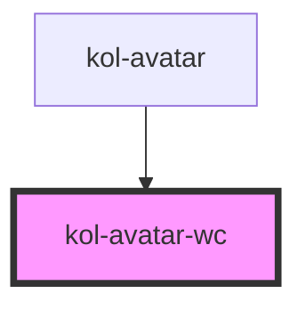

# Avatar

Die **Avatar**-Komponente zeigt entweder ein kleines Bild des Users oder dessen Initialen an, falls kein Bild vorhanden ist.

## Konstruktion

### Code

```html
<kol-avatar _label="Erika Maria Mustermann"></kol-avatar>
<kol-avatar _label="Erika"></kol-avatar>
<kol-avatar _src="https://www.w3schools.com/howto/img_avatar.png" _label="Erika Maria Mustermann"></kol-avatar>
```

### Beispiele

<kol-avatar _label="Erika Maria Mustermann"></kol-avatar>
<kol-avatar _label="Erika"></kol-avatar>
<kol-avatar _src="https://www.w3schools.com/howto/img_avatar.png" _label="Erika Maria Mustermann"></kol-avatar>

## Verwendung

### Mit Bild

In der Standard-Ansicht zeigt die **Avatar**-Komponente ein Avatar-Bild. Hierzu muss das Attribut `_src` mit einer URL zum Bild angegeben werden.  
Zusätzlich ist es notwendig, das `_label`-Attribut mit dem Namen des Benutzers anzugeben, damit ein Alternativtext ausgezeichnet werden kann.

### Ohne Bild

Die **Avatar**-Komponente kann auch ohne `_src`-Attribut verwendet werden und zeigt in diesem Fall die Initialen des Benutzers, basierend auf dem
`_label`-Attribut.

### Anwendungsfälle

Verwenden Sie die **Avatar**-Komponente, um das Bild eines Users anzuzeigen.

## Barrierefreiheit

Bei der **Avatar**-Komponente wurden insbesondere folgende Punkte der Barrierefreiheit betrachtet:

- Die Komponente ist mit einem Beschreibungstext, der den Namen des Users beinhaltet, als aria-label ausgezeichnet.
- Die Initialen, die alternativ zum Avatar-Bild gezeigt werden, werden als rein visuelles, semantisch nicht relevantes Element betrachtet und für Screenreader
  entsprechend versteckt.

<!-- Auto Generated Below -->

## Properties

| Property              | Attribute | Description                                                                                                                 | Type                  | Default     |
| --------------------- | --------- | --------------------------------------------------------------------------------------------------------------------------- | --------------------- | ----------- |
| `_label` _(required)_ | `_label`  | Setzt die sichtbare oder semantische Beschriftung der Komponente (z.B. Aria-Label, Label, Headline, Caption, Summary usw.). | `string`              | `undefined` |
| `_src`                | `_src`    | Defines the image source to render                                                                                          | `string \| undefined` | `undefined` |

## Dependencies

### Used by

- [kol-avatar](.)

### Graph



---
