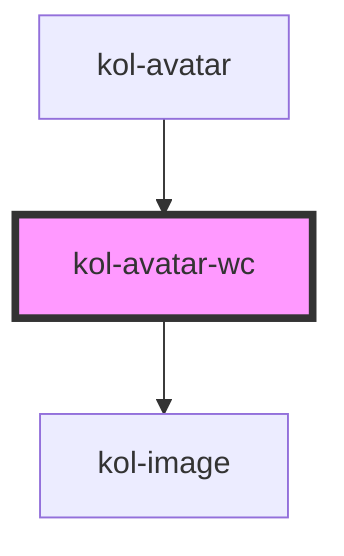

# kol-avatar-wc

<!-- Auto Generated Below -->

## Properties

| Property              | Attribute | Description                                                                                           | Type                  | Default     |
| --------------------- | --------- | ----------------------------------------------------------------------------------------------------- | --------------------- | ----------- |
| `_label` _(required)_ | `_label`  | Defines the label, usually the name of the person, to render as alt text and to compute initials from | `string`              | `undefined` |
| `_src`                | `_src`    | Defines the image source to render                                                                    | `string \| undefined` | `undefined` |

## Dependencies

### Used by

- [kol-avatar](.)

### Depends on

- [kol-image](../image)

### Graph

---
