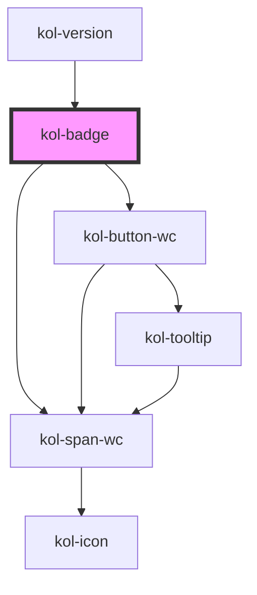

# Badge

Mit **Badges** können Sie bestimmte Informationen auf Ihrer Webseite optisch hervorheben.
KoliBri bietet neben der Angabe der Hintergrundfarbe und automatischer Berechnung der Textfarbe auch die Möglichkeit, einem Badge ein Icon und/oder einen anderen Schriftschnitt mitzugeben.

## Konstruktion

### Code

```html
<kol-badge _label="Beispieltext" _color="#b7e4b4" _icon="home" _icon-align="right"></kol-badge>
<kol-badge _label="Beispieltext" _color="#0c8703" _icon="home" _icon-align="right"></kol-badge>
```

### Beispiel

<kol-badge _label="Beispieltext" _color="#b7e4b4" _icon="home" _icon-align="right"></kol-badge>
<kol-badge _label="Beispieltext" _color="#0c8703" _icon="home" _icon-align="right"></kol-badge>

## Verwendung

### Label im Badge

Der Text, der im Badge angezeigt werden soll, wird über das Attribut **\_label** übergeben. Der Text kann neben Sonderzeichen auch Umlaute oder Leerzeichen enthalten.
Das Element `<kol-badge></kol-badge>` beinhaltet selbst keinen Text.

### Hintergrundfarbe des Badge

Ein Badge, ohne weitere Angaben zur Hintergrundfarbe, wird standardmäßig mit hellgrauer Schriftfarbe auf schwarzem Hintergrund angezeigt. Über das Attribut **\_color** können andere Hintergrundfarben gewählt werden.

Die Angabe der gewünschten Hintergrundfarbe erfolgt in hexadezimaler Schreibweise, z.B. **\_color="#000000"** für schwarz.

Die Textfarbe wird automatisch als Kontrastfarbe zur gewählten Hintergrundfarbe errechnet.

### Icon

Ein Icon (**`_icon`**) kann entweder als String angegeben werden, oder als Objekt.
Als String übergeben Sie die Iconklasse (z.B.: `_icon="codicon codicon-home`), das Icon wird links vom Text angezeigt.
Das Objekt ist vom Typ `KoliBriAllIcon`, kann also einen oder mehrere der Schlüssel `top`, `right`, `bottom` und `left` besitzen. Diese sind dann entweder String (siehe oben) oder ein Objekt vom Typ `KoliBriCustomIcon`, welches aus `icon` (String, siehe oben) und `style` (optional, Styleobjekt) besteht.

<kol-link _href="https://microsoft.github.io/vscode-codicons/dist/codicon.html" _label="Übersicht Codicons"></kol-link>

### Nur Icon anzeigen

Mit dem Attribut **`_icon-only`** kann festgelegt werden, dass nur das mit dem Attribut **`_icon`** gewählte Icon angezeigt wird. Der Wert im Attribut **`_label`** wird in diesem Fall ignoriert.

### Schriftschnitt

Der Schriftschnitt wird vom Host übernommen, kann also via CSS von außen gesetzt werden.

### Best practices

- Verwenden Sie Badges, um wichtige Informationen in unmittelbarer Nähe des jeweiligen Elements anzuzeigen.
- Verwenden Sie Badges, um auf geänderte Werte oder einen geänderten Status aufmerksam zu machen.
- Ein Badge weist den Benutzer darauf hin, dass etwas neu erzeugt oder aktualisiert wurde, z. B. ein „ungelesener Bericht“ oder eine Aktivitätsbenachrichtigung.
- Behalten Sie in gleichen Anwendungsfällen immer die gleiche Position des Badges bei, um ein einheitliches Erscheinungsbild zu gewährleisten.

## Anwendungsfälle

### Badge als Aufzählungszeichen verwenden

<ul class="m-0 p-0">
  <li class="flex gap-2">
    <kol-badge _label="1" _color="#0747a6"></kol-badge>
    <kol-heading _level="2" _headline="Auswahl Anliegen"></kol-heading>
  </li>
  <li class="flex gap-2">
    <kol-badge _label="2" _color="#0747a6"></kol-badge>
    <kol-heading _level="2" _headline="Auswahl Amtsstelle"></kol-heading>
  </li>
  <li class="flex gap-2">
    <kol-badge _label="3" _color="#0747a6"></kol-badge>
    <kol-heading _level="2" _headline="Terminauswahl"></kol-heading>
  </li>
</ul>

## Barrierefreiheit

Für die Einhaltung der Regeln zur Barrierefreiheit, ist ein optimaler Kontrast zwischen der Hintergrundfarbe und Textfarbe des Badge zwingend erforderlich. KoliBri bietet daher eine automatische Berechnung der Textfarbe aus der gewählten Hintergrundfarbe heraus. Möglich sind die Textfarben **schwarz** und **weiß**, die in Abhängigkeit zur Hintergrundfarbe ausgegeben werden.

Die zusätzliche Ausgabe eines **Icon** gewährleistet, dass der Nutzer auch hierüber die Art der Information erfassen kann.

<kol-alert _type="info">Eine explizite Angabe der Textfarbe ist nicht möglich.</kol-alert>

<!--## Links und Referenzen

<!-- Auto Generated Below -->

## Properties

| Property              | Attribute       | Description                                                                                              | Type                                                                                                                                                                                                                                                                                                                                                                                                                                                                                                                                                                                                                                                                                                                                                                                            | Default     |
| --------------------- | --------------- | -------------------------------------------------------------------------------------------------------- | ----------------------------------------------------------------------------------------------------------------------------------------------------------------------------------------------------------------------------------------------------------------------------------------------------------------------------------------------------------------------------------------------------------------------------------------------------------------------------------------------------------------------------------------------------------------------------------------------------------------------------------------------------------------------------------------------------------------------------------------------------------------------------------------------- | ----------- |
| `_color`              | `_color`        | Setzt die Hintergrundfarbe.                                                                              | `string \| undefined \| { backgroundColor: string; color: string; } \| { backgroundColor: string; foregroundColor: Stringified<CharacteristicColors>; }`                                                                                                                                                                                                                                                                                                                                                                                                                                                                                                                                                                                                                                        | `'#000'`    |
| `_icon`               | `_icon`         | Iconklasse (z.B.: "codicon codicon-home")                                                                | `KoliBriHorizontalIcon & KoliBriVerticalIcon \| string \| undefined`                                                                                                                                                                                                                                                                                                                                                                                                                                                                                                                                                                                                                                                                                                                            | `undefined` |
| `_iconOnly`           | `_icon-only`    | Gibt an, ob nur das Icon angezeigt wird.                                                                 | `boolean \| undefined`                                                                                                                                                                                                                                                                                                                                                                                                                                                                                                                                                                                                                                                                                                                                                                          | `false`     |
| `_label` _(required)_ | `_label`        | Setzt den sichtbaren Text des Elements.                                                                  | `string`                                                                                                                                                                                                                                                                                                                                                                                                                                                                                                                                                                                                                                                                                                                                                                                        | `undefined` |
| `_smartButton`        | `_smart-button` | Ermöglicht einen Schalter ins das Eingabefeld mit einer beliebigen Aktion zu einzufügen (nur Icon-Only). | `string \| undefined \| { _label: string; } & { _ariaControls?: string \| undefined; _ariaLabel?: string \| undefined; _icon?: Stringified<KoliBriIconProp> \| undefined; _iconAlign?: Alignment \| undefined; _iconOnly?: boolean \| undefined; _role?: AlternativButtonLinkRole \| undefined; _tabIndex?: number \| undefined; _tooltipAlign?: Alignment \| undefined; _ariaCurrent?: AriaCurrent \| undefined; _ariaExpanded?: boolean \| undefined; _ariaSelected?: boolean \| undefined; _disabled?: boolean \| undefined; _accessKey?: string \| undefined; _id?: string \| undefined; _on?: KoliBriButtonCallbacks<unknown> \| undefined; _type?: KoliBriButtonType \| undefined; _value?: unknown; _variant?: KoliBriButtonVariant \| undefined; _customClass?: string \| undefined; }` | `undefined` |

## Dependencies

### Used by

- [kol-version](../version)

### Depends on

- kol-span-wc
- kol-button-wc

### Graph



---
