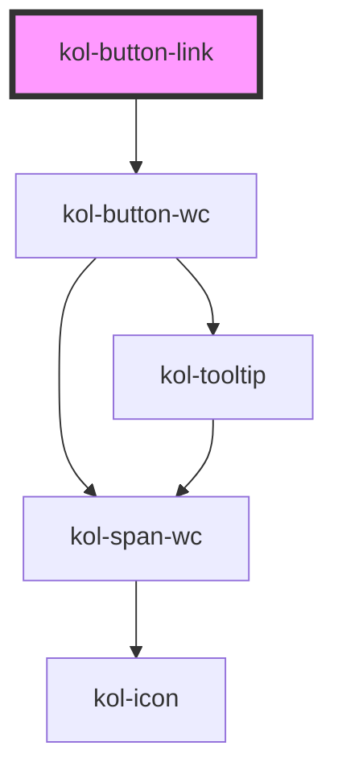

# ButtonLink

Der ButtonLink ist semantisch ein Button und hat das Design eines Links. Hierzu werden alle relevanten Properties der Button-Komponente übernommen und um die Design-bestimmenden Properties des Links erweitert.

Einen Button kann man deaktivieren und daher gibt es bei einem ButtonLink das Property `_disabled`. Wie das optisch ausgestaltet wird, entscheidet die UX-Designer:in.

Statt, wie bei einem Link, `_href` zu verwenden, wird bei einem ButtonLink das Property über den `Click-Callback` gesteuert. Hierzu wird das `_on`-Property verwendet.

Bei einem Link gibt es das Property `target`, welches ggf. den Link in einem neuen Fenster/Tab öffnet. Das Verhalten ist aktuell noch nicht umgesetzt.

Da der Link, nicht wie der Button, in mehrere Varianten (`primary` oder `secondary` usw.) angeboten wird, stehen die Properties `_customClass` und `_variant` nicht zur Verfügung.

## Konstruktion

### Code

```html
<kol-button-link _on="" _label="Schalter sieht wie ein Link aus"></kol-button-link>
```

### Beispiel

<div class="flex gap-2">
  <kol-button-link _on="" _label="Schalter sieht wie ein Link aus"></kol-button-link>
</div>

<!-- Auto Generated Below -->

## Properties

| Property              | Attribute        | Description                                                                                                                                                                                              | Type                                                                                                                                            | Default     |
| --------------------- | ---------------- | -------------------------------------------------------------------------------------------------------------------------------------------------------------------------------------------------------- | ----------------------------------------------------------------------------------------------------------------------------------------------- | ----------- |
| `_accessKey`          | `_access-key`    | Gibt an, mit welcher Tastenkombination man das interaktive Element der Komponente auslösen oder fokussieren kann.                                                                                        | `string \| undefined`                                                                                                                           | `undefined` |
| `_ariaControls`       | `_aria-controls` | Gibt an, welche Elemente kontrolliert werden. (https://developer.mozilla.org/en-US/docs/Web/Accessibility/ARIA/Attributes/aria-controls)                                                                 | `string \| undefined`                                                                                                                           | `undefined` |
| `_ariaCurrent`        | `_aria-current`  | Gibt an, welchen aktuellen Auswahlstatus das interaktive Element der Komponente hat. (https://developer.mozilla.org/en-US/docs/Web/Accessibility/ARIA/Attributes/aria-current)                           | `"date" \| "location" \| "page" \| "step" \| "time" \| boolean \| undefined`                                                                    | `undefined` |
| `_ariaExpanded`       | `_aria-expanded` | Gibt an, ob durch das interaktive Element in der Komponente etwas aufgeklappt wurde. (https://developer.mozilla.org/en-US/docs/Web/Accessibility/ARIA/Attributes/aria-expanded)                          | `boolean \| undefined`                                                                                                                          | `undefined` |
| `_ariaLabel`          | `_aria-label`    | <span style="color:red">**[DEPRECATED]**</span> use \_label instead<br/><br/>Setzt die sichtbare oder semantische Beschriftung der Komponente (z.B. Aria-Label, Label, Headline, Caption, Summary usw.). | `string \| undefined`                                                                                                                           | `undefined` |
| `_ariaSelected`       | `_aria-selected` | Gibt an, ob interaktive Element in der Komponente ausgewählt ist (z.B. role=tab). (https://developer.mozilla.org/en-US/docs/Web/Accessibility/ARIA/Attributes/aria-selected)                             | `boolean \| undefined`                                                                                                                          | `undefined` |
| `_disabled`           | `_disabled`      | Deaktiviert das interaktive Element in der Komponente und erlaubt keine Interaktion mehr damit.                                                                                                          | `boolean \| undefined`                                                                                                                          | `false`     |
| `_hideLabel`          | `_hide-label`    | Blendet die Beschriftung (Label) aus und zeigt sie stattdessen mittels eines Tooltips an.                                                                                                                | `boolean \| undefined`                                                                                                                          | `false`     |
| `_icon`               | `_icon`          | Setzt die Iconklasse (z.B.: `_icon="codicon codicon-home`).                                                                                                                                              | `KoliBriHorizontalIcon & KoliBriVerticalIcon \| string \| undefined`                                                                            | `undefined` |
| `_iconOnly`           | `_icon-only`     | <span style="color:red">**[DEPRECATED]**</span> use \_hide-label<br/><br/>Blendet die Beschriftung (Label) aus und zeigt sie stattdessen mittels eines Tooltips an.                                      | `boolean \| undefined`                                                                                                                          | `undefined` |
| `_id`                 | `_id`            | Gibt die interne ID des primären Elements in der Komponente an.                                                                                                                                          | `string \| undefined`                                                                                                                           | `undefined` |
| `_label` _(required)_ | `_label`         | Setzt die sichtbare oder semantische Beschriftung der Komponente (z.B. Aria-Label, Label, Headline, Caption, Summary usw.).                                                                              | `boolean \| string`                                                                                                                             | `undefined` |
| `_on`                 | --               | Gibt die EventCallback-Funktionen für die Button-Events an.                                                                                                                                              | `undefined \| { onClick?: EventValueOrEventCallback<MouseEvent, unknown> \| undefined; onMouseDown?: EventCallback<MouseEvent> \| undefined; }` | `undefined` |
| `_role`               | `_role`          | Gibt die Rolle des primären Elements in der Komponente an.                                                                                                                                               | `"button" \| "link" \| "tab" \| undefined`                                                                                                      | `undefined` |
| `_tabIndex`           | `_tab-index`     | Gibt an, welchen Tab-Index das primäre Element in der Komponente hat. (https://developer.mozilla.org/en-US/docs/Web/HTML/Global_attributes/tabindex)                                                     | `number \| undefined`                                                                                                                           | `undefined` |
| `_tooltipAlign`       | `_tooltip-align` | Gibt an, ob der Tooltip bevorzugt entweder oben, rechts, unten oder links angezeigt werden soll.                                                                                                         | `"bottom" \| "left" \| "right" \| "top" \| undefined`                                                                                           | `'top'`     |
| `_type`               | `_type`          | Setzt den Typ der Komponente oder des interaktiven Elements in der Komponente an.                                                                                                                        | `"button" \| "reset" \| "submit" \| undefined`                                                                                                  | `'button'`  |
| `_value`              | --               | Gibt einen Wert an, den der Schalter bei einem Klick zurückgibt.                                                                                                                                         | `unknown`                                                                                                                                       | `undefined` |

## Dependencies

### Depends on

- kol-button-wc

### Graph



---
