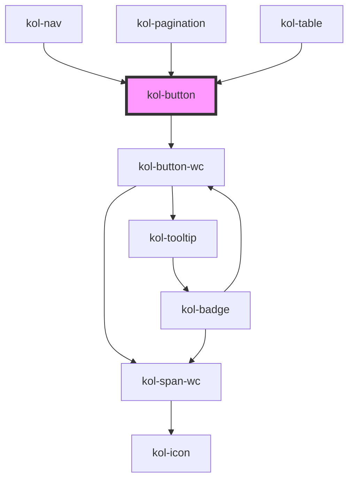

# Button

**Buttons** dienen dazu, Benutzer:innen Auswahlmöglichkeiten für Aktionen anzuzeigen und diese in einer klaren Hierarchie anzuordnen. Sie helfen Nutzer:innen, die wichtigsten Aktionen einer Seite oder innerhalb eines Viewports zu finden und ermöglichen es ihnen, diese Aktionen auszuführen. Die Beschriftung des Buttons wird verwendet, um Nutzer:innen klar anzuzeigen, welche Aktion ausgelöst wird. Buttons ermöglichen es Nutzer:innen, eine Änderung zu bestätigen, Schritte in einer Aufgabe abzuschließen oder Entscheidungen zu treffen.

## Konstruktion

### Code

```html
<kol-button class="clickme" _label="Primary" _variant="primary"></kol-button>
<kol-button class="clickme" _label="Secondary" _variant="secondary"></kol-button>
<kol-button class="clickme" _label="Normal" _variant="normal"></kol-button>
<kol-button class="clickme" _label="Danger" _variant="danger"></kol-button>
<kol-button class="clickme" _label="Ghost" _variant="ghost"></kol-button>
<kol-button class="clickme" _label="Custom" _variant="custom" _custom-class="myClass"></kol-button>
<script>
	document.querySelectorAll('.clickme').forEach((b) => (b._on = { onClick: console.log }));
</script>
```

### Beispiel

Default

<div class="flex gap-2">
  <kol-button class="clickme" _label="Primary" _variant="primary"></kol-button>
  <kol-button class="clickme" _label="Secondary" _variant="secondary"></kol-button>
  <kol-button class="clickme" _label="Normal" _variant="normal"></kol-button>
  <kol-button class="clickme" _label="Danger" _variant="danger"></kol-button>
  <kol-button class="clickme" _label="Ghost" _variant="ghost"></kol-button>
  <kol-button class="clickme" _label="Custom" _variant="custom" _custom-class="myClass"></kol-button>
</div>
<script>
  document.querySelectorAll('.clickme').forEach(b => b._on = { onClick: console.log });
</script>

Disabled

<div class="flex gap-2">
  <kol-button _label="Primary" _variant="primary" _disabled></kol-button>
  <kol-button _label="Secondary" _variant="secondary" _disabled></kol-button>
  <kol-button _label="Normal" _variant="normal" _disabled></kol-button>
  <kol-button _label="Danger" _variant="danger" _disabled></kol-button>
  <kol-button _label="Ghost" _variant="ghost" _disabled></kol-button>
  <kol-button _label="Custom" _variant="custom" _custom-class="myClass" _disabled></kol-button>
</div>

## Verwendung

### Beschriftung

Für die eindeutige Beschriftung des Buttons nutzen Sie das Attribut **`_label`**.
`_label="Schaltflächenbeschriftung"`

### Icon

Ein Icon (**`_icon`**) kann entweder als String angegeben werden, oder als Objekt.
Als String übergeben Sie die Iconklasse (z.B.: `_icon="codicon codicon-home`), das Icon wird links vom Text angezeigt.
Das Objekt ist vom Typ `KoliBriAllIcon`, kann also einen oder mehrere der Schlüssel `top`, `right`, `bottom` und `left` besitzen. Diese sind dann entweder String (siehe oben) oder ein Objekt vom Typ `KoliBriCustomIcon`, welches aus `icon` (String, siehe oben) und `style` (optional, Styleobjekt) besteht.

<kol-link _href="https://microsoft.github.io/vscode-codicons/dist/codicon.html" _label="Übersicht Codicons"></kol-link>

### Schaltfläche ohne Text

Mittels **`_iconOnly`** wird die Schaltfläche nur das icon anzeigen (<kol-link _href="#icon" _label="siehe icon"></kol-link>)

<kol-alert _type="info">Beachten Sie, dass das Attribut **`_label`** auch dann gesetzt werden muss, wenn nur ein Icon angezeigt werden soll, dieses wird von Screenreadern vorgelesen und in den Tooltip gesetzt.</kol-alert>

### Darstellung angeben

Zur Steuerung der Darstellung verwenden Sie das Attribut **`_variant`**. Der Standardwert ist `primary`, alternativ kann auch `primary`, `secondary`, `normal`, `danger`, `ghost`, oder `custom` gesetzt werden.<br/>

Über die Verwendung des Wertes `custom` kann eine eigene Darstellung gewählt werden. Verpflichtend ist in diesem Fall das Setzen des Attribut **`_custom-class`**, damit die Schaltfläche im Shadow-Dom mittels CSS selektiert werden kann.

### Best practices

- Verwenden Sie eine primäre Schaltfläche für die nächstbeste Aktion. Verbleibende Calls-to-Action sollten als sekundäre Schaltfläche dargestellt werden.
- Verwenden Sie Schaltflächen an einheitlichen Stellen in der Benutzeroberfläche, um die Benutzererfahrung zu verbessern.
- Verwenden Sie nur eine primäre Schaltfläche je Viewport. Auf der gesamten Seite kann ein Button-Style beliebig oft auftreten.
- Die Beschriftung des Button muss die Aktion beschreiben, die die Schaltfläche ausführt. Sie sollte ein Verb enthalten (z.B. Speichern). Verwenden Sie prägnante, spezifische, selbsterklärende Beschriftungen.
- Schaltflächenbeschriftungen sollten immer dann auch ein Nomen enthalten, wenn es Raum für Interpretationen darüber gibt, wofür das Verb zuständig ist. Verwenden Sie keine generischen Bezeichnungen wie "OK", insbesondere nicht im Fehlerfall. Fehler sind nie "OK".
- Verwenden Sie nicht mehrere Buttons im Style "primär" innerhalb einer Gruppierung.
- Verwenden Sie Buttons nicht als Link oder als Navigationselement.

## Barrierefreiheit

Für Menschen mit einem eingeschränkten Sichtfeld ist die Positionierung des **Icons** im Button links von der Beschriftung optimal.

Probleme mit Disabled-Status

- Darstellung Kontraste
- Möglichkeit des Nutzerfeedbacks

### Tastatursteuerung

| Taste   | Funktion                                                     |
| ------- | ------------------------------------------------------------ |
| `Tab`   | Springt den einzelnen Button an und fokussiert ihn.          |
| `Enter` | Führt die onClick-Methode der fokussierten Schaltfläche aus. |

## Links und Referenzen

- https://www.w3.org/TR/wai-aria-practices/#button

<!-- Auto Generated Below -->

## Properties

| Property              | Attribute        | Description                                                                                                                                        | Type                                                                                                                                            | Default     |
| --------------------- | ---------------- | -------------------------------------------------------------------------------------------------------------------------------------------------- | ----------------------------------------------------------------------------------------------------------------------------------------------- | ----------- |
| `_accessKey`          | `_access-key`    | Gibt an, mit welcher Tastenkombination man den Button auslösen oder fokussieren kann.                                                              | `string \| undefined`                                                                                                                           | `undefined` |
| `_ariaControls`       | `_aria-controls` | Gibt an, welche Elemente kontrolliert werden. (https://developer.mozilla.org/en-US/docs/Web/Accessibility/ARIA/Attributes/aria-controls)           | `string \| undefined`                                                                                                                           | `undefined` |
| `_ariaCurrent`        | `_aria-current`  | Gibt an, welchen aktuellen Auswahlstatus der Button hat. (https://developer.mozilla.org/en-US/docs/Web/Accessibility/ARIA/Attributes/aria-current) | `"date" \| "location" \| "page" \| "step" \| "time" \| boolean \| undefined`                                                                    | `undefined` |
| `_ariaExpanded`       | `_aria-expanded` | Gibt an, ob durch den Button etwas aufgeklappt wurde. (https://developer.mozilla.org/en-US/docs/Web/Accessibility/ARIA/Attributes/aria-expanded)   | `boolean \| undefined`                                                                                                                          | `undefined` |
| `_ariaLabel`          | `_aria-label`    | Gibt einen beschreibenden Text des Buttons an. (https://developer.mozilla.org/en-US/docs/Web/Accessibility/ARIA/Attributes/aria-label)             | `string \| undefined`                                                                                                                           | `undefined` |
| `_ariaSelected`       | `_aria-selected` | Gibt an, ob Element ausgewählt ist (role=tab). (https://developer.mozilla.org/en-US/docs/Web/Accessibility/ARIA/Attributes/aria-selected)          | `boolean \| undefined`                                                                                                                          | `undefined` |
| `_customClass`        | `_custom-class`  | Gibt an, welche Custom-Class übergeben werden soll, wenn \_variant="custom" gesetzt ist.                                                           | `string \| undefined`                                                                                                                           | `undefined` |
| `_disabled`           | `_disabled`      | Gibt an, ob der Button deaktiviert ist.                                                                                                            | `boolean \| undefined`                                                                                                                          | `false`     |
| `_icon`               | `_icon`          | Gibt den Class-Identifier eines Icons eine eingebunden Icofont an. (z.B. https://icofont.com/)                                                     | `KoliBriHorizontalIcon & KoliBriVerticalIcon \| string \| undefined`                                                                            | `undefined` |
| `_iconAlign`          | `_icon-align`    | <span style="color:red">**[DEPRECATED]**</span> <br/><br/>Gibt an, ob das Icon links oder rechts dargestellt werden soll.                          | `"bottom" \| "left" \| "right" \| "top" \| undefined`                                                                                           | `undefined` |
| `_iconOnly`           | `_icon-only`     | Gibt an, ob nur das Icon angezeigt wird.                                                                                                           | `boolean \| undefined`                                                                                                                          | `false`     |
| `_id`                 | `_id`            | Gibt die ID der Schaltfläche an. (Selection, Testing)                                                                                              | `string \| undefined`                                                                                                                           | `undefined` |
| `_label` _(required)_ | `_label`         | Gibt den Label für die Beschriftung der Schaltfläche an.                                                                                           | `string`                                                                                                                                        | `undefined` |
| `_on`                 | --               | Gibt die EventCallback-Funktionen für die Button-Events an.                                                                                        | `undefined \| { onClick?: EventValueOrEventCallback<MouseEvent, unknown> \| undefined; onMouseDown?: EventCallback<MouseEvent> \| undefined; }` | `undefined` |
| `_role`               | `_role`          | Gibt an, welche Role der Schalter hat.                                                                                                             | `"button" \| "link" \| "tab" \| undefined`                                                                                                      | `undefined` |
| `_tabIndex`           | `_tab-index`     | Gibt an, welchen Tab-Index der Button hat. (https://developer.mozilla.org/en-US/docs/Web/HTML/Global_attributes/tabindex)                          | `number \| undefined`                                                                                                                           | `undefined` |
| `_tooltipAlign`       | `_tooltip-align` | Gibt an, ob der Tooltip oben, rechts, unten oder links angezeigt werden soll.                                                                      | `"bottom" \| "left" \| "right" \| "top" \| undefined`                                                                                           | `'top'`     |
| `_type`               | `_type`          | Gibt an, welche Typ der Button hat.                                                                                                                | `"button" \| "reset" \| "submit" \| undefined`                                                                                                  | `'button'`  |
| `_value`              | --               | Gibt einen Wert an, den der Schalter bei einem Klick zurückgibt.                                                                                   | `unknown`                                                                                                                                       | `undefined` |
| `_variant`            | `_variant`       | Gibt an, welche Ausprägung der Button hat.                                                                                                         | `"custom" \| "danger" \| "ghost" \| "normal" \| "primary" \| "secondary" \| undefined`                                                          | `'normal'`  |

## Dependencies

### Used by

- [kol-nav](../nav)
- [kol-pagination](../pagination)
- [kol-table](../table)

### Depends on

- kol-button-wc

### Graph



---
