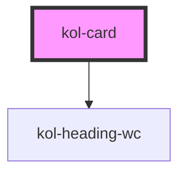

# Card

Um einzelne Bereiche Ihrer Webseite optisch hervorzuheben, bietet sich die **Card**-Komponente an. Mit ihrer Hilfe können Sie Ihre Inhalte sehr einfach strukturieren.

Die **Card**-Komponente besteht aus einem **_Titel-Bereich_**, einem **_Inhalts-Bereich_** und einem **_Fuß-Bereich_**.

Der **Titel-Bereich** wird in einer größeren Schrift dargestellt. Der **Inhalts-Bereich** ist optisch durch eine horizontale Trennlinie unterhalb des Titel-Bereichs abgetrennt und wird in der Standardschrift ausgegeben.
Der **Fuß-Bereich** wird optional durch ein Attribut aktiviert und stellt dann Platz für weitere Inhalte, z.B. eine **Button**-Komponente bereit. Der Fuß-Bereich ist optisch durch eine horizontale Trennlinie vom Inhalts-Bereich abgetrennt.

## Konstruktion

### Code

```html
<kol-card _heading="Testtitel" _has-footer _max-height="vh2">
	<div slot="header">Text im Header-Bereich</div>
	<div slot="content">
		Lorem ipsum dolor sit amet, consetetur sadipscing elitr, sed diam nonumy eirmod tempor invidunt ut labore et dolore magna aliquyam erat, sed diam voluptua.
		At vero eos et accusam et justo duo dolores et ea rebum. Stet clita kasd gubergren, no sea takimata sanctus est Lorem ipsum dolor sit amet. Lorem ipsum
		dolor sit amet, consetetur sadipscing elitr, sed diam nonumy eirmod tempor invidunt ut labore et dolore magna aliquyam erat, sed diam voluptua. At vero eos
		et accusam et justo duo dolores et ea rebum. Stet clita kasd gubergren, no sea takimata sanctus est Lorem ipsum dolor sit amet.
	</div>
	<div slot="footer">Weiterer Beispieltext im Fuß-Bereich</div>
</kol-card>
```

### Beispiel

<kol-card _heading="Testtitel" _has-footer _max-height="vh2">
<div slot="header">Text im Header-Bereich</div>
  <div slot="content">
    Lorem ipsum dolor sit amet, consetetur sadipscing elitr, sed diam nonumy eirmod tempor invidunt ut labore et dolore
    magna aliquyam erat, sed diam voluptua. At vero eos et accusam et justo duo dolores et ea rebum. Stet clita kasd
    gubergren, no sea takimata sanctus est Lorem ipsum dolor sit amet. Lorem ipsum dolor sit amet, consetetur sadipscing
    elitr, sed diam nonumy eirmod tempor invidunt ut labore et dolore magna aliquyam erat, sed diam voluptua. At vero
    eos et accusam et justo duo dolores et ea rebum. Stet clita kasd gubergren, no sea takimata sanctus est Lorem ipsum
    dolor sit amet.
  </div>
  <div slot="footer">Weiterer Beispieltext im Fuß-Bereich</div>
</kol-card>

## Verwendung

### Einfache Standard-Card

In der Standardansicht besteht eine **Card** aus einem Titel-Bereich, der ohne setzen des Attributs **\_heading** mit drei Punkten angezeigt wird, und einem leeren Inhalts-Bereich.
Die horizontale Trennlinie zwischen beiden Bereichen setzt KoliBri automatisch.

### Titel der Card-Komponente

Den Titel der Card bestimmen Sie durch Setzen des Attributs **\_heading="Ihr Titel"**. Hier können Sie beliebigen Text, auch Sonderzeichen und Umlaute, eingeben.
Beachten Sie, dass **HTML-Code** nicht erlaubt ist.

### Größe des Titels

Der **Titel** der Card kann als H1-H6 ausgegeben werden. Die Größe wird über das Attribut `_level`übergeben. Erlaubt sind die Werte 1 - 6.

### Inhalt im Header-Bereich der Card-Komponente

Den Inhalt im Header-Bereich der Card bestimmen Sie durch Einfügen eines **Inhalts-Containers** innerhalb des `<kol-card></kol-card>-Elements`. Der Container muss als Attribut **slot="header"** enthalten. Hier können Sie beliebigen Text, auch Sonderzeichen und Umlaute, eingeben.
Auch **HTML-Code** können sie hier einfügen. Dieser wird ausgewertet und anschließend als normaler Text ausgegeben. Sie können im Fuß-Bereich aber auch andere KoliBri-Komponenten einfügen, wie z.B. die **Button**-Komponente.

Bitte beachten Sie, dass Sie zwar ein beliebiges HTML-Tag als Inhalts-Container verwenden können, es aber empfohlen wird ein `<div></div>`-Tag zu verwenden.

```html
<kol-card _heading="Beispiel" _level="1">
	<div slot="header">Text im Header-Bereich</div>
</kol-card>
```

### Inhalt der Card-Komponente

Den Inhalt der Card bestimmen Sie durch Einfügen eines **Inhalts-Containers** innerhalb des `<kol-card></kol-card>-Elements`. Der Container muss als Attribut **slot="content"** enthalten. Hier können Sie beliebigen Text, auch Sonderzeichen und Umlaute, eingeben.
Auch **HTML-Code** können sie hier einfügen. Dieser wird ausgewertet und anschließend als normaler Text ausgegeben.

Bitte beachten Sie, dass Sie zwar ein beliebiges HTML-Tag als Inhalts-Container verwenden können, es aber empfohlen wird ein `<div></div>`-Tag zu verwenden.

```html
<kol-card _heading="Beispiel" _level="1">
	<div slot="content">Text im Inhalts-Bereich</div>
</kol-card>
```

### Inhalt im Fuß-Bereich der Card-Komponente

Den Inhalt im Fuß-Bereich der Card bestimmen Sie durch Einfügen eines **Inhalts-Containers** innerhalb des `<kol-card></kol-card>-Elements`. Der Container muss als Attribut **slot="footer"** enthalten. Hier können Sie beliebigen Text, auch Sonderzeichen und Umlaute, eingeben.
Auch **HTML-Code** können sie hier einfügen. Dieser wird ausgewertet und anschließend als normaler Text ausgegeben. Sie können im Fuß-Bereich aber auch andere KoliBri-Komponenten einfügen, wie z.B. die **Button**-Komponente.

Bitte beachten Sie, dass Sie zwar ein beliebiges HTML-Tag als Inhalts-Container verwenden können, es aber empfohlen wird ein `<div></div>`-Tag zu verwenden.

Wenn Sie den Fuß-Bereich der Card-Komponente nutzen möchten, achten Sie darauf das Attribut **\_has-footer** im Element `<kol-card>` zu setzen

```html
<kol-card _heading="Beispiel" _level="1" _has-footer>
	<div slot="footer">Text im Fuß-Bereich</div>
</kol-card>
```

### Best practices

- Verwenden Sie die **Card**-Komponente, um in sich geschlossene Themenbereiche optisch zu kapseln.
- Verwenden Sie die **Card**-Komponente, um Ihre Inhalte semantisch zu strukturieren.
- Vermeiden Sie, zu viele Cards auf einer Inhaltsseite zu verwenden.
- Vermeiden Sie, wichtige Inhalte innerhalb der Card-Komponente zu platzieren, wenn sich die zugehörigen Aktions-Elemente (Buttons, Links, etc.) nicht innerhalb der gleichen Card befinden.

### Anwendungsfälle

Hierzu sind unter **\*Beispiele** einige exemplarische Anwendungsfälle dargestellt..

#### Einfügen weiterer KoliBri-Komponenten in die Card-Komponente

Es ist auch möglich andere Komponenten der KoliBri-Bibliothek innerhalb der **Card**-Komponente zu verwenden. Hierzu ist unter **Beispiele** ein exemplarisches

## Barrierefreiheit

<!--## Links und Referenzen

<!-- Auto Generated Below -->

## Properties

| Property                | Attribute     | Description                                                                                                                             | Type                                           | Default     |
| ----------------------- | ------------- | --------------------------------------------------------------------------------------------------------------------------------------- | ---------------------------------------------- | ----------- |
| `_hasFooter`            | `_has-footer` | Gibt an, ob die Card einen Footer-Bereich hat.                                                                                          | `boolean \| undefined`                         | `false`     |
| `_heading` _(required)_ | `_heading`    | Gibt die Überschrift der Card an.                                                                                                       | `string`                                       | `undefined` |
| `_headline`             | `_headline`   | <span style="color:red">**[DEPRECATED]**</span> Verwende stattdessen das Property \_heading.<br/><br/>Gibt die Überschrift der Card an. | `string \| undefined`                          | `undefined` |
| `_level`                | `_level`      | Gibt an, welchen H-Level von 1 bis 6 die Überschrift hat.                                                                               | `0 \| 1 \| 2 \| 3 \| 4 \| 5 \| 6 \| undefined` | `1`         |

## Slots

| Slot        | Description                                                                                      |
| ----------- | ------------------------------------------------------------------------------------------------ |
| `"content"` | Ermöglicht das Einfügen beliebigen HTML's in den Inhaltsbereich der Card.                        |
| `"footer"`  | Ermöglicht das Einfügen beliebigen HTML's in den Fußbereich der Card.                            |
| `"header"`  | Ermöglicht das Einfügen beliebigen HTML's in den Kopfbereich unterhalb der Überschrift der Card. |

## Dependencies

### Depends on

- [kol-heading-wc](../heading)

### Graph



---
