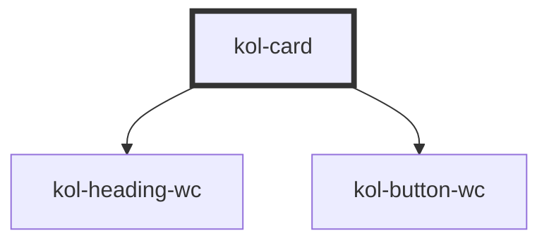

# Card

Um einzelne Bereiche Ihrer Webseite optisch hervorzuheben, bietet sich die **Card**-Komponente an. Mit ihrer Hilfe können Sie Ihre Inhalte sehr einfach strukturieren.

Die **Card**-Komponente besteht aus einem **_Titel-Bereich_**, einem **_Inhalts-Bereich_**.

Der **Titel-Bereich** wird in einer größeren Schrift dargestellt. Der **Inhalts-Bereich** ist optisch durch eine horizontale Trennlinie unterhalb des Titel-Bereichs abgetrennt und wird in der Standardschrift ausgegeben.

## Konstruktion

### Code

```html
<kol-card _label="Testtitel">
	<div>
		Lorem ipsum dolor sit amet, consetetur sadipscing elitr, sed diam nonumy eirmod tempor invidunt ut labore et dolore magna aliquyam erat, sed diam voluptua.
		At vero eos et accusam et justo duo dolores et ea rebum. Stet clita kasd gubergren, no sea takimata sanctus est Lorem ipsum dolor sit amet. Lorem ipsum
		dolor sit amet, consetetur sadipscing elitr, sed diam nonumy eirmod tempor invidunt ut labore et dolore magna aliquyam erat, sed diam voluptua. At vero eos
		et accusam et justo duo dolores et ea rebum. Stet clita kasd gubergren, no sea takimata sanctus est Lorem ipsum dolor sit amet.
	</div>
</kol-card>
```

### Beispiel

<kol-card _label="Testtitel">
	<div>
		Lorem ipsum dolor sit amet, consetetur sadipscing elitr, sed diam nonumy eirmod tempor invidunt ut labore et dolore magna aliquyam erat, sed diam voluptua.
		At vero eos et accusam et justo duo dolores et ea rebum. Stet clita kasd gubergren, no sea takimata sanctus est Lorem ipsum dolor sit amet. Lorem ipsum
		dolor sit amet, consetetur sadipscing elitr, sed diam nonumy eirmod tempor invidunt ut labore et dolore magna aliquyam erat, sed diam voluptua. At vero eos
		et accusam et justo duo dolores et ea rebum. Stet clita kasd gubergren, no sea takimata sanctus est Lorem ipsum dolor sit amet.
	</div>
</kol-card>

## Verwendung

### Einfache Standard-Card

In der Standardansicht besteht eine **Card** aus einem Titel-Bereich, und einem leeren Inhalts-Bereich.
Die horizontale Trennlinie zwischen beiden Bereichen setzt KoliBri automatisch.

### Titel der Card-Komponente

Den Titel der Card bestimmen Sie durch Setzen des Attributs **`_label`**. Hier können Sie beliebigen Text, auch Sonderzeichen und Umlaute, eingeben.
Beachten Sie, dass **HTML-Code** nicht erlaubt ist. Sofern nicht gesetzt werden drei Punkte dargestellt.
Die Überschriftenebene des Titels wird durch das Attribut **`_level`** übergeben. Möglich sind die Level **1** bis **6**

### Inhalts-Container

Die Inhalte im Content-Bereich der Card bestimmen Sie durch Einfügen eines **Inhalts-Containers** innerhalb des `<kol-card></kol-card>-Elements`. Hier können Sie beliebigen **HTML-Code** einfügen.

Bitte beachten Sie, dass Sie zwar ein beliebiges HTML-Tag als Inhalts-Container verwenden können, es aber empfohlen wird ein `<div></div>`-Tag zu verwenden.

```html
<kol-card _label="Beispiel" _level="1">
	<div>Text im Inhalts-Bereich</div>
</kol-card>
```

### Best practices

- Verwenden Sie die **Card**-Komponente, um in sich geschlossene Themenbereiche optisch zu kapseln.
- Verwenden Sie die **Card**-Komponente, um Ihre Inhalte semantisch zu strukturieren.
- Vermeiden Sie, zu viele Cards auf einer Inhaltsseite zu verwenden.
- Vermeiden Sie, wichtige Inhalte innerhalb der Card-Komponente zu platzieren, wenn sich die zugehörigen Aktions-Elemente (Buttons, Links, etc.) nicht innerhalb der gleichen Card befinden.

<!-- Auto Generated Below -->

## Properties

| Property              | Attribute     | Description                                                                                                        | Type                                                            | Default     |
| --------------------- | ------------- | ------------------------------------------------------------------------------------------------------------------ | --------------------------------------------------------------- | ----------- |
| `_hasCloser`          | `_has-closer` | Defines whether the element can be closed.                                                                         | `boolean \| undefined`                                          | `false`     |
| `_label` _(required)_ | `_label`      | Defines the visible or semantic label of the component (e.g. aria-label, label, headline, caption, summary, etc.). | `string`                                                        | `undefined` |
| `_level`              | `_level`      | Defines which H-level from 1-6 the heading has. 0 specifies no heading and is shown as bold text.                  | `0 \| 1 \| 2 \| 3 \| 4 \| 5 \| 6 \| undefined`                  | `1`         |
| `_on`                 | --            | Defines the event callback functions for the component.                                                            | `undefined \| { onClose?: EventCallback<Event> \| undefined; }` | `undefined` |

## Slots

| Slot | Description                                                               |
| ---- | ------------------------------------------------------------------------- |
|      | Ermöglicht das Einfügen beliebigen HTML's in den Inhaltsbereich der Card. |

## Dependencies

### Depends on

- [kol-heading-wc](../heading)
- kol-button-wc

### Graph



---
