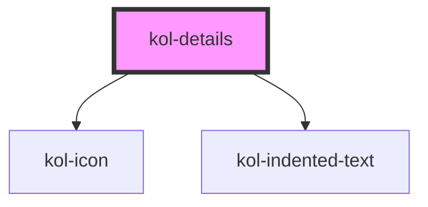

# Details

Mit Hilfe der **Detail**-Komponente können weiterführende Informationen zunächst mit einem kurzen Einleitungstext angezeigt werden, die erst nach Klick
durch die Nutzer:innen auf ein Pfeil-Icon in voller Größe aufgeklappt werden.

Die **Detail**-Komponente stellt sich standardmäßig als einzeiliges Layout-Element dar, das aus einem Pfeil-Icon und einem nachfolgenden,
kurzen Einleitungstext gebildet wird. Der eigentliche Inhalt der Komponente wird erst nach Klick auf den Kopfbereich nach unten hin geöffnet. Das Pfeil-Icon ändert dabei
seine Ausrichtung von **_rechts_** nach **_unten_**.
Analog lässt sich die Komponente auch wieder schließen und der Inhalt damit verbergen.

## Konstruktion

### Code

```html
<kol-details _summary="Nach Laden der Seite geschlossen">
	Lorem ipsum dolor sit amet, consetetur sadipscing elitr, sed diam nonumy eirmod tempor invidunt ut labore et dolore magna aliquyam erat, sed diam voluptua. At
	vero eos et accusam et justo duo dolores et ea rebum. Stet clita kasd gubergren, no sea takimata sanctus est Lorem ipsum dolor sit amet. Lorem ipsum dolor sit
	amet, consetetur sadipscing elitr, sed diam nonumy eirmod tempor invidunt.
</kol-details>
```

### Beispiel

<kol-details _summary="Nach Laden der Seite geschlossen">
  Lorem ipsum dolor sit amet, consetetur sadipscing elitr, sed diam nonumy eirmod tempor invidunt ut labore et
  dolore magna aliquyam erat, sed diam voluptua. At vero eos et accusam et justo duo dolores et ea rebum. Stet clita
  kasd gubergren, no sea takimata sanctus est Lorem ipsum dolor sit amet. Lorem ipsum dolor sit amet, consetetur
  sadipscing elitr, sed diam nonumy eirmod tempor invidunt.
</kol-details>

## Verwendung

### Geöffnet anzeigen

Verwenden Sie das Attribut **`_open`**, um die Komponente geöffnet darzustellen.

### Einleitungstext

Verwenden Sie das Attribut **`_summary`**, um den Text zu definieren, der als Überschrift angezeigt werden soll.

### Best practices

- Verwenden Sie die **Detail**-Komponente, um ergänzende Inhalte zu einem Hauptthema platzsparend anzuordnen.
- Die **Detail**-Komponente eignet sich gut für die Realisierung einer FAQ-Seite, wobei die Frage über das Attribut **`_summary`** und die Antwort im Inhaltsbereich ausgegeben werden kann.
- Vermeiden Sie es, wichtige Informationen, die z.B. rechtliche Aspekte betreffen, in einem verborgenen Bereich auszugeben. Es kann nicht sichergestellt werden, dass der Benutzer diese Informationen auch sicher liest.
- Vermeiden Sie es, zu viele **Detail**-Komponenten zu verwenden, da die Übersichtlichkeit der Seite hierunter leiden kann.

### Anwendungsfälle

#### Details-Komponente innerhalb eines Fließtextes

<div>
    <p>
      Lorem ipsum dolor sit amet, consetetur sadipscing elitr, sed diam nonumy eirmod tempor invidunt ut labore et
      dolore magna aliquyam erat, sed diam voluptua. At vero eos et accusam et justo duo dolores et ea rebum. Stet clita
      kasd gubergren, no sea takimata sanctus est Lorem ipsum dolor sit amet. Lorem ipsum dolor sit amet, consetetur
      sadipscing elitr, sed diam nonumy eirmod tempor invidunt.
    </p>
    <kol-details _summary="Erst nach Klick offen">
      Lorem ipsum dolor sit amet, consetetur sadipscing elitr, sed diam nonumy eirmod tempor invidunt ut labore et
      dolore magna aliquyam erat, sed diam voluptua. At vero eos et accusam et justo duo dolores et ea rebum. Stet clita
      kasd gubergren, no sea takimata sanctus est Lorem ipsum dolor sit amet. Lorem ipsum dolor sit amet, consetetur
      sadipscing elitr, sed diam nonumy eirmod tempor invidunt.
    </kol-details>
    <p>
      Lorem ipsum dolor sit amet, consetetur sadipscing elitr, sed diam nonumy eirmod tempor invidunt ut labore et
      dolore magna aliquyam erat, sed diam voluptua. At vero eos et accusam et justo duo dolores et ea rebum. Stet clita
      kasd gubergren, no sea takimata sanctus est Lorem ipsum dolor sit amet. Lorem ipsum dolor sit amet, consetetur
      sadipscing elitr, sed diam nonumy eirmod tempor invidunt.
    </p>
  </div>

## Barrierefreiheit

- Die **Details**-Komponente bietet sich an, um eine Kontext-sensitive Hilfe für die Barrierefreiheit umzusetzen.

### Tastatursteuerung

| Taste   | Funktion                                        |
| ------- | ----------------------------------------------- |
| `Tab`   | Fokussiert die Details-Komponente.              |
| `Enter` | Öffnet bzw. schließt den Inhalt der Komponente. |

## Links und Referenzen

- https://www.w3.org/TR/UNDERSTANDING-WCAG20/minimize-error-context-help.html

<!-- Auto Generated Below -->

## Properties

| Property                | Attribute  | Description                                                       | Type                   | Default     |
| ----------------------- | ---------- | ----------------------------------------------------------------- | ---------------------- | ----------- |
| `_open`                 | `_open`    | Gibt an, ob die Detailbeschreibung geöffnet oder geschlossen ist. | `boolean \| undefined` | `false`     |
| `_summary` _(required)_ | `_summary` | Gibt die Zusammenfassung der Detailbeschreibung an.               | `string`               | `undefined` |

## Dependencies

### Depends on

- [kol-icon](../icon)
- [kol-indented-text](../indented-text)

### Graph



---
