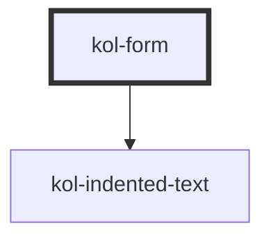

# Form

Die **Form**-Komponente dient dazu alle Eingabefelder zu umschließen, den Hinweistext für Pflichtfelder korrekt zu positionieren und die Events `submit` und `reset` weiterzuleiten.

## Konstruktion

### Code

```html
<kol-form _requiredText="Sternchen heißt Pflichtfeld.">
	<kol-input-text _label="Vorname"></kol-input-text>
	<kol-input-text _label="Nachname"></kol-input-text>
</kol-form>
```

### Beispiel

<kol-form _requiredText="Sternchen heißt Pflichtfeld.">
	<kol-input-text _label="Vorname"></kol-input-text>
	<kol-input-text _label="Nachname"></kol-input-text>
</kol-form>

<!-- Auto Generated Below -->

## Properties

| Property        | Attribute        | Description                                                                                     | Type                                                                                                          | Default     |
| --------------- | ---------------- | ----------------------------------------------------------------------------------------------- | ------------------------------------------------------------------------------------------------------------- | ----------- |
| `_on`           | --               | Gibt die EventCallback-Funktionen für die Form-Events an.                                       | `undefined \| { onSubmit?: EventCallback<Event> \| undefined; onReset?: EventCallback<Event> \| undefined; }` | `undefined` |
| `_requiredText` | `_required-text` | Defines whether the mandatory-fields-hint should be shown. A string overrides the default text. | `boolean \| string \| undefined`                                                                              | `true`      |

## Slots

| Slot | Description      |
| ---- | ---------------- |
|      | Inhalt der Form. |

## Dependencies

### Depends on

- [kol-indented-text](../indented-text)

### Graph



---
