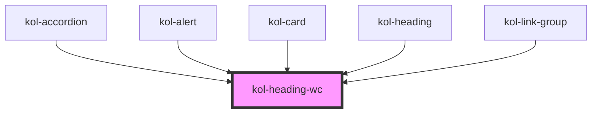

# Heading

Die **Heading**-Komponente kann überall dort verwendet werden, wo eine Überschrift angezeigt werden soll. Durch die Verwendung der unterschiedlichen Größen, lassen sich Inhalte klar strukturieren und Seiten wirkungsvoll und abwechslungsreich präsentieren. Sie trennt Styling von Semantik und ermöglicht Flexibilität.

## Konstruktion

### Code

```html
<div>
	<kol-heading _level="1">Inhalt einer H1-Überschrift</kol-heading>
</div>
```

### Beispiel

<kol-heading _level="1">Inhalt einer H1-Überschrift</kol-heading>

## Verwendung

Geben Sie mit dem Attribut `_level` das H-Element an, das Sie ausgeben möchten. Möglich sind H1 bis H6.

### Best practices

- Achten Sie bei der Verwendung von Headings auf die empfohlene Semantik für die Suchmaschinenoptimierung.
- Setzen Sie Headings in verschiedenen Größen ein, um eine sinnvolle Struktur Ihrer Inhalte zu erzeugen.
- Kombinieren Sie die **Heading**-Komponente mit allen anderen **KoliBri**-Komponenten. Setzen Sie sie im Inhaltsbereich der Komponenten ein.

## Barrierefreiheit

<!--## Links und Referenzen

<!-- Auto Generated Below -->

## Properties

| Property                 | Attribute             | Description                                                                                                            | Type                                           | Default     |
| ------------------------ | --------------------- | ---------------------------------------------------------------------------------------------------------------------- | ---------------------------------------------- | ----------- |
| `_headline` _(required)_ | `_headline`           | Gibt den Text der Überschrift an.                                                                                      | `string`                                       | `undefined` |
| `_level`                 | `_level`              | Gibt an, welchen H-Level von 1 bis 6 die Überschrift hat. Oder ob es keine Überschrift ist, sondern nur fett gedruckt. | `0 \| 1 \| 2 \| 3 \| 4 \| 5 \| 6 \| undefined` | `1`         |
| `_secondaryHeadline`     | `_secondary-headline` | Gibt den Text der zusätzlichen Überschrift an.                                                                         | `string \| undefined`                          | `undefined` |

## Dependencies

### Used by

- [kol-accordion](../accordion)
- [kol-alert](../alert)
- [kol-card](../card)
- [kol-heading](.)
- [kol-link-group](../link-group)

### Graph



---
