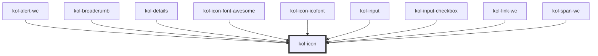

# Icon

Mit Hilfe der **Icon**-Komponente können Icons aus eingebundenen Icon-Fonts an beliebigen Positionen dargestellt werden. Die Ausgabe des Icon kann über das Attribut **`_icon`** gesteuert werden und erfolgt durch das Attribut **`_label`** barrierefrei. Die Ausgabe erfolgt standardmäßig als _`inline`_-Element.

Aktuell werden die Icons von <kol-link _href="https://microsoft.github.io/vscode-codicons/dist/codicon.html" _label="https://microsoft.github.io/vscode-codicons/dist/codicon.html" _target="_blank" _label="Codicons"></kol-link> unterstützt.

<kol-alert _heading="Hinweis" _type="info">Es ist wichtig, dass in der Rahmenseite (`index.html`) die CSS-Dateie(n) der Icon-Font(s) eingebunden ist/sind.</kol-alert>

## Konstruktion

Die Komponente **Icon** wird über das HTML-Tag `kol-icon` erzeugt.

### Code

```html
<kol-icon _label="Zu Hause" _icon="codicon codicon-home"></kol-icon>
```

### Beispiel

<kol-icon _label="Zu Hause" _icon="codicon codicon-home"></kol-icon>

### Icon

Das Icon (**`_icon`**) kann entweder als String angegeben werden, oder als Objekt.
Als String übergeben Sie die Iconklasse (z.B.: `_icon="codicon codicon-home`), das Icon wird links vom Text angezeigt.
Das Objekt ist vom Typ `KoliBriAllIcon`, kann also einen oder mehrere der Schlüssel `top`, `right`, `bottom` und `left` besitzen. Diese sind dann entweder String (siehe oben) oder ein Objekt vom Typ `KoliBriCustomIcon`, welches aus `icon` (String, siehe oben) und `style` (optional, Styleobjekt) besteht.

<kol-link _href="https://microsoft.github.io/vscode-codicons/dist/codicon.html" _label="https://microsoft.github.io/vscode-codicons/dist/codicon.html" _target="_blank" _label="Übersicht Codicons"></kol-link>

## Barrierefreiheit

Wichtig ist bei Kontext-relevanten Grafiken, dass sie beschriftet werden.

- <kol-link _href="" _label=""></kol-link>https://www.w3.org/WAI/ARIA/apg/practices/names-and-descriptions/

### Aria-Label

Mittels der Auszeichnung `aria-label` muss ein Kontext-relevantes Icon beschriftet werden.

## Links und Referenzen

- <kol-link _href="https://github.com/microsoft/vscode-codicons" _label="https://github.com/microsoft/vscode-codicons" _target="_blank" _label="Codicons"></kol-link>
- <kol-link _href="https://fontawesome.com" _label="https://fontawesome.com" _target="_blank" _label="Font-Awesome"></kol-link>
- <kol-link _href="https://icofont.com" _label="https://icofont.com" _target="_blank" _label="Icofont"></kol-link>

<!-- Auto Generated Below -->

## Properties

| Property     | Attribute     | Description                                                                                                                                                                                                                                       | Type                  | Default     |
| ------------ | ------------- | ------------------------------------------------------------------------------------------------------------------------------------------------------------------------------------------------------------------------------------------------- | --------------------- | ----------- |
| `_ariaLabel` | `_aria-label` | <span style="color:red">**[DEPRECATED]**</span> use \_label instead<br/><br/>Deprecated: Setzt die semantische Beschriftung der Komponente.                                                                                                       | `string \| undefined` | `undefined` |
| `_icon`      | `_icon`       | <span style="color:red">**[DEPRECATED]**</span> Use \_icons.<br/><br/>                                                                                                                                                                            | `string \| undefined` | `undefined` |
| `_icons`     | `_icons`      | Defines the icon classnames (e.g. `_icons="fa-solid fa-user"`).                                                                                                                                                                                   | `string \| undefined` | `undefined` |
| `_label`     | `_label`      | Defines the visible or semantic label of the component (e.g. aria-label, label, headline, caption, summary, etc.).                                                                                                                                | `string \| undefined` | `undefined` |
| `_part`      | `_part`       | <span style="color:red">**[DEPRECATED]**</span> Das Styling sollte stets über CSS erfolgen.<br/><br/>Deprecated: Gibt den Identifier für den CSS-Part an, um das Icon von Außen ändern zu können. (https://meowni.ca/posts/part-theme-explainer/) | `string \| undefined` | `undefined` |

## Shadow Parts

| Part     | Description                               |
| -------- | ----------------------------------------- |
| `"icon"` | Ermöglicht das Styling des inneren Icons. |

## Dependencies

### Used by

- [kol-alert-wc](../alert)
- [kol-breadcrumb](../breadcrumb)
- [kol-details](../details)
- [kol-icon-font-awesome](../icon-font-awesome)
- [kol-icon-icofont](../icon-icofont)
- kol-input
- [kol-input-checkbox](../input-checkbox)
- kol-link-wc
- kol-span-wc

### Graph



---
