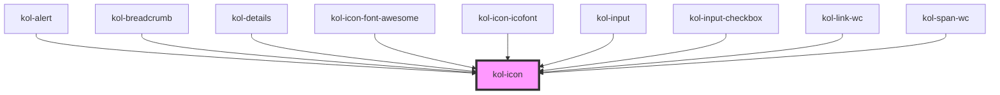

# Icon

Mit Hilfe der **Icon**-Komponente können Icons aus eingebundenen Icon-Fonts an beliebigen Positionen dargestellt werden. Die Ausgabe des Icon kann über das Attribut `_icon` gesteuert werden und erfolgt durch das Attribut `_aria-label` barrierefrei. Die Ausgabe erfolgt standardmäßig als _`inline`_-Element.

Folgende Icon-Fonts werden _`out-of-the-box`_ unterstützt.

- [Codicons]
- [Font-Awesome]
- [Icofont]

<kol-alert _heading="Hinweis" _type="info">Es ist wichtig, dass in der Rahmenseite (`index.html`) die CSS-Dateien der Icon-Fonts eingebunden sind.</kol-alert>

## Konstruktion

Die Komponente **Icon** wird über das HTML-Tag `kol-icon` erzeugt.

### Code

```html
<kol-icon _aria-label="Zu Hause" _icon="codicon codicon-home"></kol-icon>
```

### Beispiel

<kol-icon _aria-label="Zu Hause" _icon="codicon codicon-home"></kol-icon>

## Verwendung

### Best practices

## Barrierefreiheit

Wichtig ist bei Kontext-relevanten Grafiken, dass sie beschriftet werden.

- https://www.w3.org/WAI/ARIA/apg/practices/names-and-descriptions/

### Aria-Hidden

Die Auszeichnung `aria-hidden` ist eigentlich nicht erforderlich, da die aktuellen Screenreader, wie NVDA und JAWS, es auch ohne `aria-hidden` nicht vorlesen.

### Aria-Label

Mittels der Auszeichnung `aria-label` muss ein Kontext-relevantes Icon beschriftet werden.

## Links und Referenzen

[Codicons]: https://github.com/microsoft/vscode-codicons
[Font-Awesome]: https://fontawesome.com
[Icofont]: https://icofont.com

<!-- Auto Generated Below -->

## Properties

| Property                  | Attribute     | Description                                                                                                                                                                                                                           | Type                  | Default     |
| ------------------------- | ------------- | ------------------------------------------------------------------------------------------------------------------------------------------------------------------------------------------------------------------------------------- | --------------------- | ----------- |
| `_ariaLabel` _(required)_ | `_aria-label` | Gibt das Aria-Label am Icon an.                                                                                                                                                                                                       | `string`              | `undefined` |
| `_icon` _(required)_      | `_icon`       | Gibt einen Identifier eines Icons aus den Icon's an.                                                                                                                                                                                  | `string`              | `undefined` |
| `_part`                   | `_part`       | <span style="color:red">**[DEPRECATED]**</span> Das Styling sollte stets über CSS erfolgen.<br/><br/>Gibt den Identifier für den CSS-Part an, um das Icon von Außen ändern zu können. (https://meowni.ca/posts/part-theme-explainer/) | `string \| undefined` | `undefined` |

## Shadow Parts

| Part     | Description                               |
| -------- | ----------------------------------------- |
| `"icon"` | Ermöglicht das Styling des inneren Icons. |

## Dependencies

### Used by

- [kol-alert](../alert)
- [kol-breadcrumb](../breadcrumb)
- [kol-details](../details)
- [kol-icon-font-awesome](../icon-font-awesome)
- [kol-icon-icofont](../icon-icofont)
- kol-input
- [kol-input-checkbox](../input-checkbox)
- kol-link-wc
- kol-span-wc

### Graph



---
