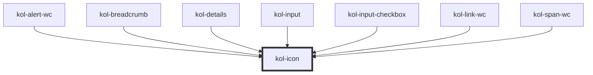

# Icon

Mit Hilfe der **Icon**-Komponente können Icons aus eingebundenen Icon-Fonts an beliebigen Positionen dargestellt werden. Die Ausgabe des Icon kann über das Attribut **`_icon`** gesteuert werden und erfolgt durch das Attribut **`_label`** barrierefrei. Die Ausgabe erfolgt standardmäßig als _`inline`_-Element.

Aktuell werden die Icons von <kol-link _href="https://microsoft.github.io/vscode-codicons/dist/codicon.html" _target="_blank" _label="Codicons"></kol-link> unterstützt.

<kol-alert _heading="Hinweis" _type="info">Es ist wichtig, dass in der Rahmenseite (`index.html`) die CSS-Dateie(n) der Icon-Font(s) eingebunden ist/sind.</kol-alert>

## Konstruktion

Die Komponente **Icon** wird über das HTML-Tag `kol-icon` erzeugt.

### Code

```html
<kol-icon _label="Zu Hause" _icons="codicon codicon-home"></kol-icon>
```

### Beispiel

<kol-icon _label="Zu Hause" _icons="codicon codicon-home"></kol-icon>

### Icons

Die Property `_icons` erwartet einen String mit den Klassennamen der zu zeigenden Icons (z.B.: `_icons="codicon codicon-home`).

<kol-link _href="https://microsoft.github.io/vscode-codicons/dist/codicon.html" _target="_blank" _label="Übersicht Codicons"></kol-link>

## Barrierefreiheit

Wichtig ist bei Kontext-relevanten Grafiken, dass sie beschriftet werden.

- <kol-link _href="https://www.w3.org/WAI/ARIA/apg/practices/names-and-descriptions/"></kol-link>

### Label

Mittels der Property `_label` muss ein Kontext-relevantes Icon beschriftet werden.

## Links und Referenzen

- <kol-link _href="https://github.com/microsoft/vscode-codicons" _target="_blank" _label="Codicons"></kol-link>
- <kol-link _href="https://fontawesome.com" _target="_blank" _label="Font-Awesome"></kol-link>
- <kol-link _href="https://icofont.com"  _target="_blank" _label="Icofont"></kol-link>

<!-- Auto Generated Below -->

## Properties

| Property              | Attribute | Description                                                                                                        | Type     | Default     |
| --------------------- | --------- | ------------------------------------------------------------------------------------------------------------------ | -------- | ----------- |
| `_icons` _(required)_ | `_icons`  | Defines the icon classnames (e.g. `_icons="fa-solid fa-user"`).                                                    | `string` | `undefined` |
| `_label` _(required)_ | `_label`  | Defines the visible or semantic label of the component (e.g. aria-label, label, headline, caption, summary, etc.). | `string` | `undefined` |

## Shadow Parts

| Part     | Description                               |
| -------- | ----------------------------------------- |
| `"icon"` | Ermöglicht das Styling des inneren Icons. |

## Dependencies

### Used by

- [kol-alert-wc](../alert)
- [kol-breadcrumb](../breadcrumb)
- [kol-details](../details)
- kol-input
- [kol-input-checkbox](../input-checkbox)
- kol-link-wc
- kol-span-wc

### Graph



---
