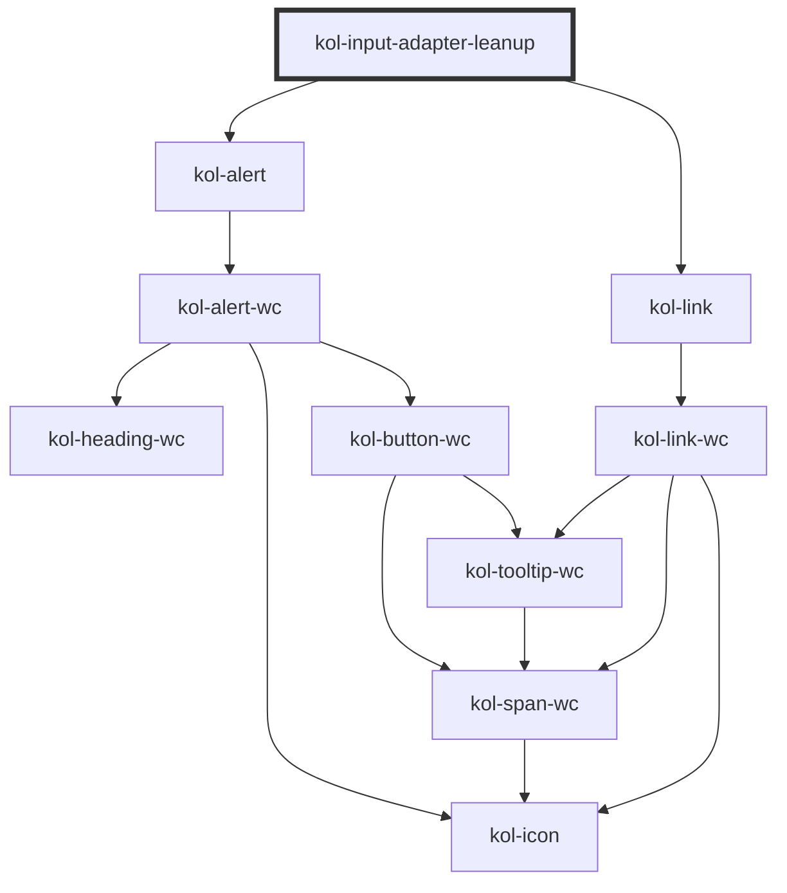

# InputAdapterLeanup

<!-- Auto Generated Below -->

> **[DEPRECATED]** Use the separated lean-input-adapter from the `@leanup/kolibri-components` package.

## Dependencies

### Depends on

- [kol-alert](../alert)
- [kol-link](../link)

### Graph

---
