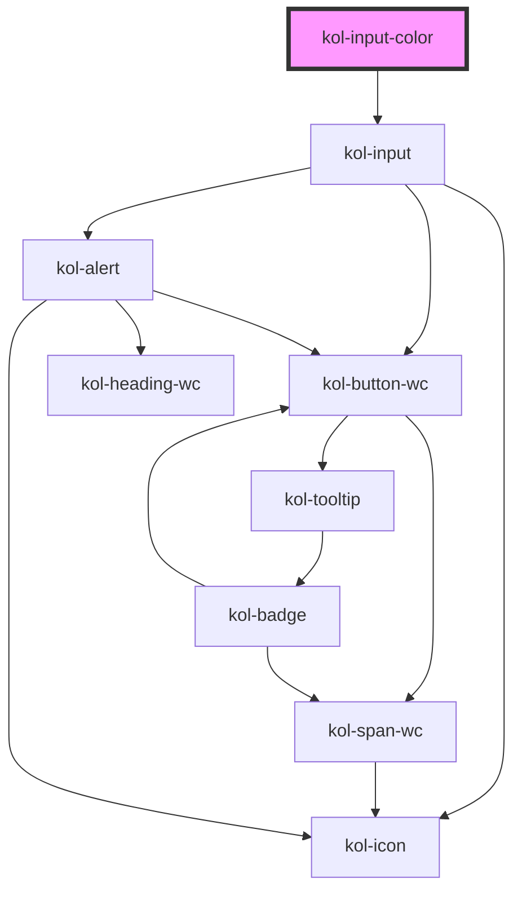

# InputColor

Der Input-Typ **Color** erzeugt ein Auswahlfeld für die Definition einer beliebigen Farbe. Die Angabe der Farbe kann in hexadezimaler Schreibweise, in RGB-Schreibweise oder in HSL-Schreibweise erfolgen. Möglich ist die Auswahl einer Farbe über einen Picker oder auch die exakte Eingabe von Farbwerten.

## Konstruktion

### Code

```html
<kol-input-color _id="meine_farbe" _name="meine_farbe" _value="#ff0000"> Hintergrundfarbe </kol-input-color>
```

### Beispiel

<kol-input-color  _id="meine_farbe" _name="meine_farbe" _value="#ff0000">Hintergrundfarbe</kol-input-color>

## Verwendung

Stellen Sie die Default-Farbe über das Attribut `_value` ein. Verwenden Sie hierfür eine hexadezimale Schreibweise (#xxxxxx).

### Best practices

- Achten Sie darauf, die Pflichtfelder `id` und `name` korrekt zu setzen.

## Barrierefreiheit

Beachten Sie, dass die **InputColor**-Komponente nicht vollständig barrierefrei ist. Die Auswahl einer Farbe ist über Tastatursteuerung möglich. Die Ausgabe der gewählten Farbe über Screenreader ist jedoch technisch eingeschränkt.

Für eine vollständige Barrierefreiheit prüfen Sie die Verwendung einer vorgefertigten Farbauswahlliste, z.B. über Checkboxen oder Select-Felder.

Achten Sie darauf, jeder Checkbox ein Label zuzuweisen, da dieses von Screenreadern vorgelesen wird und so eine eindeutige Identifikation des Eingabefeldes ermöglicht.

### Tastatursteuerung

| Taste                 | Funktion                                                                                                                                    |
| --------------------- | ------------------------------------------------------------------------------------------------------------------------------------------- | ---------------------------------------------------------------------- |
| `Tab`                 | Fokussiert das Eingabefeld. Bei geöffnetem Dialogfeld kann mit der Tab-Taste zwischen den Steuerfeldern gewechselt werden.                  |
| `Enter`               | Öffnet bzw. schließt das Dialogfeld der Komponente. Bei fokussierter Pipette wird mit der Enter-Taste die Funktion **_Pipette_** gestartet. |
| `ESC`                 | Beendet die Pipetten-Funktion. .                                                                                                            |
| `Pfeil-Tasten (rechts | links)`                                                                                                                                     | Verschieben bei fokussiertem Feld **_Farbspektrum_** den Auswahlpunkt. |
| `Pfeil-Tasten (oben   | unten)`                                                                                                                                     | Ändert bei fokussiertem Feld **_Farbsystem_** die Auswahl.             |

## Links und Referenzen

- https://medium.com/@gavyn/til-autofocus-inputs-are-an-accessibility-problem-32ced60c3109
- https://www.jotform.com/blog/html5-datalists-what-you-need-to-know-78024/

<!-- Auto Generated Below -->

## Properties

| Property           | Attribute        | Description                                                                                              | Type                                                                                                                                                                                                                                                                                                                                                                                                                                                                                                                                                                                                                                                                                                                                                                                  | Default     |
| ------------------ | ---------------- | -------------------------------------------------------------------------------------------------------- | ------------------------------------------------------------------------------------------------------------------------------------------------------------------------------------------------------------------------------------------------------------------------------------------------------------------------------------------------------------------------------------------------------------------------------------------------------------------------------------------------------------------------------------------------------------------------------------------------------------------------------------------------------------------------------------------------------------------------------------------------------------------------------------- | ----------- |
| `_accessKey`       | `_access-key`    | Gibt an, mit welcher Tastenkombination man das Input auslösen oder fokussieren kann.                     | `string \| undefined`                                                                                                                                                                                                                                                                                                                                                                                                                                                                                                                                                                                                                                                                                                                                                                 | `undefined` |
| `_alert`           | `_alert`         | Gibt an, ob die Fehlermeldung vorgelesen werden soll, wenn es eine gibt.                                 | `boolean \| undefined`                                                                                                                                                                                                                                                                                                                                                                                                                                                                                                                                                                                                                                                                                                                                                                | `true`      |
| `_autoComplete`    | `_auto-complete` | Gibt an, ob das Eingabefeld autovervollständigt werden kann.                                             | `"off" \| "on" \| undefined`                                                                                                                                                                                                                                                                                                                                                                                                                                                                                                                                                                                                                                                                                                                                                          | `undefined` |
| `_disabled`        | `_disabled`      | Gibt an, ob das Eingabefeld aktiviert oder deaktiviert ist.                                              | `boolean \| undefined`                                                                                                                                                                                                                                                                                                                                                                                                                                                                                                                                                                                                                                                                                                                                                                | `undefined` |
| `_error`           | `_error`         | Gibt den Text für eine Fehlermeldung an.                                                                 | `string \| undefined`                                                                                                                                                                                                                                                                                                                                                                                                                                                                                                                                                                                                                                                                                                                                                                 | `undefined` |
| `_hideLabel`       | `_hide-label`    | Gibt an, ob das Eingabefeld kein sichtbares Label haben soll.                                            | `boolean \| undefined`                                                                                                                                                                                                                                                                                                                                                                                                                                                                                                                                                                                                                                                                                                                                                                | `undefined` |
| `_hint`            | `_hint`          | Gibt den Text für eine Hinweistext an.                                                                   | `string \| undefined`                                                                                                                                                                                                                                                                                                                                                                                                                                                                                                                                                                                                                                                                                                                                                                 | `''`        |
| `_icon`            | `_icon`          | Ermöglicht das Anzeigen von Icons links und/oder rechts am Rand des Eingabefeldes.                       | `string \| undefined \| { right: string \| KoliBriCustomIcon; left?: string \| KoliBriCustomIcon \| undefined; } \| { right?: string \| KoliBriCustomIcon \| undefined; left: string \| KoliBriCustomIcon; }`                                                                                                                                                                                                                                                                                                                                                                                                                                                                                                                                                                         | `undefined` |
| `_id` _(required)_ | `_id`            | Gibt die technische ID des Eingabefeldes an.                                                             | `string`                                                                                                                                                                                                                                                                                                                                                                                                                                                                                                                                                                                                                                                                                                                                                                              | `undefined` |
| `_list`            | `_list`          | Gibt die Liste der Vorschlagswörter an.                                                                  | `string \| string[] \| undefined`                                                                                                                                                                                                                                                                                                                                                                                                                                                                                                                                                                                                                                                                                                                                                     | `undefined` |
| `_name`            | `_name`          | Gibt den technischen Namen des Eingabefeldes an.                                                         | `string \| undefined`                                                                                                                                                                                                                                                                                                                                                                                                                                                                                                                                                                                                                                                                                                                                                                 | `undefined` |
| `_on`              | --               | Gibt die EventCallback-Funktionen für das Input-Event an.                                                | `InputTypeOnBlur & InputTypeOnClick & InputTypeOnChange & InputTypeOnFocus \| undefined`                                                                                                                                                                                                                                                                                                                                                                                                                                                                                                                                                                                                                                                                                              | `undefined` |
| `_smartButton`     | --               | Ermöglicht einen Schalter ins das Eingabefeld mit einer beliebigen Aktion zu einzufügen (nur Icon-Only). | `undefined \| { _label: string; } & { _ariaControls?: string \| undefined; _ariaCurrent?: AriaCurrent \| undefined; _ariaExpanded?: boolean \| undefined; _ariaLabel?: string \| undefined; _ariaSelected?: boolean \| undefined; _disabled?: boolean \| undefined; _icon?: Stringified<KoliBriIconProp> \| undefined; _iconAlign?: Alignment \| undefined; _iconOnly?: boolean \| undefined; _role?: AlternativButtonLinkRole \| undefined; _tabIndex?: number \| undefined; _tooltipAlign?: Alignment \| undefined; _accessKey?: string \| undefined; _id?: string \| undefined; _on?: KoliBriButtonCallbacks<unknown> \| undefined; _type?: KoliBriButtonType \| undefined; _value?: unknown; _variant?: KoliBriButtonVariant \| undefined; _customClass?: string \| undefined; }` | `undefined` |
| `_tabIndex`        | `_tab-index`     | Gibt an, welchen Tab-Index dieses Input hat.                                                             | `number \| undefined`                                                                                                                                                                                                                                                                                                                                                                                                                                                                                                                                                                                                                                                                                                                                                                 | `undefined` |
| `_touched`         | `_touched`       | Gibt an, ob dieses Eingabefeld von Nutzer:innen einmal besucht/berührt wurde.                            | `boolean \| undefined`                                                                                                                                                                                                                                                                                                                                                                                                                                                                                                                                                                                                                                                                                                                                                                | `false`     |
| `_value`           | `_value`         | Gibt den Wert des Eingabefeldes an.                                                                      | `string \| undefined`                                                                                                                                                                                                                                                                                                                                                                                                                                                                                                                                                                                                                                                                                                                                                                 | `undefined` |

## CSS Custom Properties

| Name                        | Description                     |
| --------------------------- | ------------------------------- |
| `--kolibri-border-color`    | Default color of the border.    |
| `--kolibri-border-radius`   | Default radius of the border.   |
| `--kolibri-border-width`    | Default width of the border.    |
| `--kolibri-color-danger`    | Default color of the danger.    |
| `--kolibri-color-disabled`  | Default color of the disabled.  |
| `--kolibri-color-error`     | Default color of the error.     |
| `--kolibri-color-ghost`     | Default color of the ghost.     |
| `--kolibri-color-info`      | Default color of the info.      |
| `--kolibri-color-normal`    | Default color of the normal.    |
| `--kolibri-color-primary`   | Default color of the primary.   |
| `--kolibri-color-secondary` | Default color of the secondary. |
| `--kolibri-color-success`   | Default color of the success.   |
| `--kolibri-color-text`      | Default color of the text.      |
| `--kolibri-color-visited`   | Default color of the visited.   |
| `--kolibri-color-warning`   | Default color of the warning.   |
| `--kolibri-font-family`     | Default font family.            |
| `--kolibri-font-size`       | Default font size.              |

## Dependencies

### Depends on

- kol-input

### Graph



---
