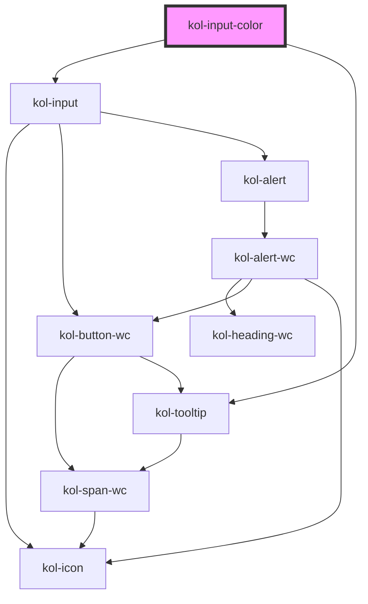

# InputColor

Der Input-Typ **Color** erzeugt ein Auswahlfeld für die Definition einer beliebigen Farbe. Die Eingabe der Farbe kann in hexadezimaler Schreibweise, in RGB-Schreibweise oder in HSL-Schreibweise erfolgen. Möglich ist die Auswahl einer Farbe über einen Picker oder auch die exakte Eingabe von Farbwerten.

## Konstruktion

### Code

```html
<kol-input-color _id="meine_farbe" _name="meine_farbe" _value="#d4fcf4" _icon='{ "right": "codicon codicon-symbol-color"}'> Hintergrundfarbe </kol-input-color>
```

### Beispiel

<kol-input-color  _id="meine_farbe" _name="meine_farbe" _value="#d4fcf4" _icon='{ "right": "codicon codicon-symbol-color"}'>Hintergrundfarbe</kol-input-color>

## Verwendung

Stellen Sie die Default-Farbe über das Attribut `_value` ein. Verwenden Sie hierfür eine hexadezimale Schreibweise (#xxxxxx).

### Best practices

- Achten sie darauf `id` und `name` korrekt zu setzen, damit die Daten beim Formular Absenden mitgesendet werden.

## Barrierefreiheit

Beachten Sie, dass die **InputColor**-Komponente nicht vollständig barrierefrei ist. Die Auswahl einer Farbe ist über Tastatursteuerung möglich. Die Ausgabe der gewählten Farbe über Screenreader ist jedoch technisch eingeschränkt.

Für eine vollständige Barrierefreiheit prüfen Sie die Verwendung einer vorgefertigten Farbauswahlliste, z.B. über Checkboxen oder Select-Felder.

### Tastatursteuerung

| Taste                           | Funktion                                                                                                                                    |
| ------------------------------- | ------------------------------------------------------------------------------------------------------------------------------------------- |
| `Tab`                           | Fokussiert das Eingabefeld. Bei geöffnetem Dialogfeld kann mit der Tab-Taste zwischen den Steuerfeldern gewechselt werden.                  |
| `Enter`                         | Öffnet bzw. schließt das Dialogfeld der Komponente. Bei fokussierter Pipette wird mit der Enter-Taste die Funktion **_Pipette_** gestartet. |
| `ESC`                           | Beendet die Pipettenfunktion. Schließt das Dialogfeld, wenn die Pipettenfunktion nicht aktiv ist.                                           |
| `Pfeil-Tasten (rechts / links)` | Verschieben bei fokussiertem Feld **_Farbspektrum_** den Auswahlpunkt.                                                                      |
| `Pfeil-Tasten (oben   / unten)` | Ändert bei fokussiertem Feld **_Farbsystem_** die Auswahl.                                                                                  |

## Links und Referenzen

- <kol-link _href="https://medium.com/@gavyn/til-autofocus-inputs-are-an-accessibility-problem-32ced60c3109" _label="https://medium.com/@gavyn/til-autofocus-inputs-are-an-accessibility-problem-32ced60c3109" _target="_blank"></kol-link>

<!-- Auto Generated Below -->

## Properties

| Property              | Attribute        | Description                                                                                                                                          | Type                                                                                                                                                                                                                                                                                                                                                                                                                                                                                                                                                                                                                                                                                                                                                                                                                                                                                                                                                                    | Default     |
| --------------------- | ---------------- | ---------------------------------------------------------------------------------------------------------------------------------------------------- | ----------------------------------------------------------------------------------------------------------------------------------------------------------------------------------------------------------------------------------------------------------------------------------------------------------------------------------------------------------------------------------------------------------------------------------------------------------------------------------------------------------------------------------------------------------------------------------------------------------------------------------------------------------------------------------------------------------------------------------------------------------------------------------------------------------------------------------------------------------------------------------------------------------------------------------------------------------------------- | ----------- |
| `_accessKey`          | `_access-key`    | Gibt an, mit welcher Tastenkombination man das interaktive Element der Komponente auslösen oder fokussieren kann.                                    | `string \| undefined`                                                                                                                                                                                                                                                                                                                                                                                                                                                                                                                                                                                                                                                                                                                                                                                                                                                                                                                                                   | `undefined` |
| `_alert`              | `_alert`         | Gibt an, ob der Screenreader die Meldung aktiv vorlesen soll.                                                                                        | `boolean \| undefined`                                                                                                                                                                                                                                                                                                                                                                                                                                                                                                                                                                                                                                                                                                                                                                                                                                                                                                                                                  | `true`      |
| `_autoComplete`       | `_auto-complete` | Gibt an, ob das Eingabefeld autovervollständigt werden kann.                                                                                         | `"off" \| "on" \| undefined`                                                                                                                                                                                                                                                                                                                                                                                                                                                                                                                                                                                                                                                                                                                                                                                                                                                                                                                                            | `undefined` |
| `_disabled`           | `_disabled`      | Makes the element not focusable and ignore all events. TODO: Change type back to `DisabledPropType` after Stencil#4663 has been resolved             | `boolean \| undefined`                                                                                                                                                                                                                                                                                                                                                                                                                                                                                                                                                                                                                                                                                                                                                                                                                                                                                                                                                  | `undefined` |
| `_error`              | `_error`         | Gibt den Text für eine Fehlermeldung an.                                                                                                             | `string \| undefined`                                                                                                                                                                                                                                                                                                                                                                                                                                                                                                                                                                                                                                                                                                                                                                                                                                                                                                                                                   | `undefined` |
| `_hideLabel`          | `_hide-label`    | Tells the element to hide the label. TODO: Change type back to `HideLabelPropType` after Stencil#4663 has been resolved.                             | `boolean \| undefined`                                                                                                                                                                                                                                                                                                                                                                                                                                                                                                                                                                                                                                                                                                                                                                                                                                                                                                                                                  | `undefined` |
| `_hint`               | `_hint`          | Gibt den Hinweistext an.                                                                                                                             | `string \| undefined`                                                                                                                                                                                                                                                                                                                                                                                                                                                                                                                                                                                                                                                                                                                                                                                                                                                                                                                                                   | `''`        |
| `_icon`               | `_icon`          | Setzt die Iconklasse (z.B.: `_icon="codicon codicon-home`).                                                                                          | `string \| undefined \| { right?: IconOrIconClass \| undefined; left?: IconOrIconClass \| undefined; }`                                                                                                                                                                                                                                                                                                                                                                                                                                                                                                                                                                                                                                                                                                                                                                                                                                                                 | `undefined` |
| `_id`                 | `_id`            | Defines the internal ID of the primary component element.                                                                                            | `string \| undefined`                                                                                                                                                                                                                                                                                                                                                                                                                                                                                                                                                                                                                                                                                                                                                                                                                                                                                                                                                   | `undefined` |
| `_label` _(required)_ | `_label`         | Setzt die sichtbare oder semantische Beschriftung der Komponente (z.B. Aria-Label, Label, Headline, Caption, Summary usw.).                          | `boolean \| string`                                                                                                                                                                                                                                                                                                                                                                                                                                                                                                                                                                                                                                                                                                                                                                                                                                                                                                                                                     | `undefined` |
| `_list`               | `_list`          | <span style="color:red">**[DEPRECATED]**</span> Use \_suggestions instead.<br/><br/>Gibt die Liste der Vorschlagswörter an.                          | `W3CInputValue[] \| string \| undefined`                                                                                                                                                                                                                                                                                                                                                                                                                                                                                                                                                                                                                                                                                                                                                                                                                                                                                                                                | `undefined` |
| `_name`               | `_name`          | Defines the technical name of an input field.                                                                                                        | `string \| undefined`                                                                                                                                                                                                                                                                                                                                                                                                                                                                                                                                                                                                                                                                                                                                                                                                                                                                                                                                                   | `undefined` |
| `_on`                 | --               | Gibt die EventCallback-Funktionen für das Input-Event an.                                                                                            | `InputTypeOnBlur & InputTypeOnClick & InputTypeOnChange & InputTypeOnFocus \| undefined`                                                                                                                                                                                                                                                                                                                                                                                                                                                                                                                                                                                                                                                                                                                                                                                                                                                                                | `undefined` |
| `_smartButton`        | `_smart-button`  | Ermöglicht eine Schaltfläche ins das Eingabefeld mit einer beliebigen Aktion zu einzufügen (ohne label).                                             | `string \| undefined \| { _label: LabelWithExpertSlotPropType; } & { _tabIndex?: number \| undefined; _value?: Stringified<StencilUnknown>; _accessKey?: string \| undefined; _iconAlign?: AlignPropType \| undefined; _iconOnly?: boolean \| undefined; _role?: AlternativeButtonLinkRolePropType \| undefined; _ariaControls?: string \| undefined; _ariaCurrent?: AriaCurrentPropType \| undefined; _ariaExpanded?: boolean \| undefined; _ariaLabel?: string \| undefined; _ariaSelected?: boolean \| undefined; _on?: ButtonCallbacksPropType<StencilUnknown> \| undefined; _type?: ButtonTypePropType \| undefined; _variant?: ButtonVariantPropType \| undefined; _customClass?: string \| undefined; _disabled?: boolean \| undefined; _hideLabel?: boolean \| undefined; _icon?: IconPropType \| undefined; _id?: string \| undefined; _name?: string \| undefined; _syncValueBySelector?: string \| undefined; _tooltipAlign?: AlignPropType \| undefined; }` | `undefined` |
| `_suggestions`        | `_suggestions`   | Suggestions to provide for the input.                                                                                                                | `W3CInputValue[] \| string \| undefined`                                                                                                                                                                                                                                                                                                                                                                                                                                                                                                                                                                                                                                                                                                                                                                                                                                                                                                                                | `undefined` |
| `_tabIndex`           | `_tab-index`     | Gibt an, welchen Tab-Index das primäre Element in der Komponente hat. (https://developer.mozilla.org/en-US/docs/Web/HTML/Global_attributes/tabindex) | `number \| undefined`                                                                                                                                                                                                                                                                                                                                                                                                                                                                                                                                                                                                                                                                                                                                                                                                                                                                                                                                                   | `undefined` |
| `_tooltipAlign`       | `_tooltip-align` | Defines where to show the Tooltip preferably: top, right, bottom or left.                                                                            | `"bottom" \| "left" \| "right" \| "top" \| undefined`                                                                                                                                                                                                                                                                                                                                                                                                                                                                                                                                                                                                                                                                                                                                                                                                                                                                                                                   | `'top'`     |
| `_touched`            | `_touched`       | Shows if the input was touched by a user. TODO: Change type back to `TouchedPropType` after Stencil#4663 has been resolved                           | `boolean \| undefined`                                                                                                                                                                                                                                                                                                                                                                                                                                                                                                                                                                                                                                                                                                                                                                                                                                                                                                                                                  | `false`     |
| `_value`              | `_value`         | Gibt den Wert des Eingabefeldes an.                                                                                                                  | `string \| undefined`                                                                                                                                                                                                                                                                                                                                                                                                                                                                                                                                                                                                                                                                                                                                                                                                                                                                                                                                                   | `undefined` |

## Slots

| Slot | Description                         |
| ---- | ----------------------------------- |
|      | Die Beschriftung des Eingabefeldes. |

## Dependencies

### Depends on

- kol-input
- [kol-tooltip](../tooltip)

### Graph



---
