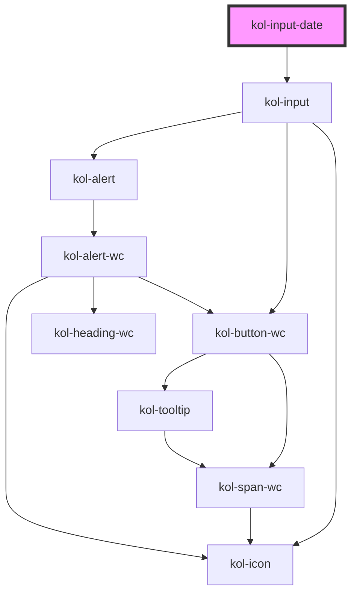

# InputDate

Der Input-Typ **Date** erzeugt ein Eingabefeld für Datumswerte. Diese können konkrete Daten sein, aber auch Wochen, Monate oder Zeitangaben.

## Konstruktion

### Code

```html
<kol-input-date _id="mein_datum" _name="mein_datum" _type="date" _icon='{ "right": "codicon codicon-calendar"}'>Erstellungsdatum</kol-input-date>
```

### Beispiel

<kol-input-date _id="mein_datum" _name="mein_datum" _type="date" _icon='{ "right": "codicon codicon-calendar"}'>Erstellungsdatum</kol-input-date>

## Verwendung

Die **InputDate**-Komponente kann für die Erfassung von Daten verwendet werden. Es verwendet intern die InputNumber-Komponente.

<kol-alert _type="info">Beachten Sie, dass im **Firefox** nicht alle **`_types`** der **InputDate**-Komponente funktional sind. Es werden bei den Typen `month`, `time` und `week` keine Auswahldialoge angezeigt.</kol-alert>

Die Komponente zeichnet sich dadurch aus, dass sie zahlreiche Ziffern-basierte Eingabemuster unterstützt. Hierbei ist es wichtig zu beachten, dass sich das Verhalten bei der Eingabe von Browser zu Browser und Geräte zu Gerät unterscheiden kann. Beispielsweise ist es möglich beim Datum, 01.01.999999 einzugeben, auch wenn max=2022-02-02 ist. Der Feldwert ist aber trotzdem 2022-02-02.

### Best practices

- Achten sie darauf `id` und `name` korrekt zu setzen, damit die Daten beim Formular Absenden mitgesendet werden.

## Barrierefreiheit

Die Icons in der Komponente sind per Tab-Taste nicht erreichbar. Die Auswahlhilfen der Komponente werden über die **Leertaste** geöffnet. So erhalten Sie beispielsweise beim Typ **date** ein Kalendermodul, über das per Maus oder über die Tastatur das gewünschte Datum ausgewählt werden kann. Die manuelle Eingabe der Werte ist alternativ möglich.

### Tastatursteuerung

Das Eingabefeld für Zeitangaben gibt es in unterschiedlichen Ausprägungen (Datum, Uhrzeit u.a). Mit der `Tab`-Taste wird der Fokus auf das Eingabefeld gesetzt. Anschließend kann mittels der `Leer`-Taste das gerätespezifische Auswahldialog geöffent werden.

> Hinweis: Wir haben in unseren Tests festgestellt, dass es je nach Browser-Version manchmal möglich ist, das Kalender-Icon anzufokusieren und mal nicht. Ohne das sich die Implementierung der Komponente geändert hat. Warum das so ist ist uns noch nicht bekannt. Nichtsdestotrotz ist das Öffnen des Auswahldialogs immer mittels der `Leer`-Taste möglich.

| Taste                           | Funktion                                                                                                                                                                                                                                                        |
| ------------------------------- | --------------------------------------------------------------------------------------------------------------------------------------------------------------------------------------------------------------------------------------------------------------- |
| `Tab`                           | Fokussiert das Eingabefeld. Nach erhalt des Fokus wechselt die `Tab`-Taste durch die Eingabebereiche. Danach erst wechselt die `Tab`-Taste zum nächsten Eingabefeld.                                                                                            |
| `Leer`                          | Wenn das Eingabefeld fokussiert ist, kann im Browser mit der `Leer`-Taste ein Auswahldialog aufgerufen bzw. geschlossen werden. Die Navigation und Auswahl erfolgt hier mit Hilfe der `Tab`-Taste, der `Pfeil`-Tasten und der Bestätigung mittes `Enter`-Taste. |
| `Pfeil-Tasten (links / rechts)` | Wenn das Eingabefeld fokussiert ist, kann mit den `Pfeil`-Tasten zwischen den Eingabebereichen gewechselt werden.                                                                                                                                               |
| `Pfeil-Tasten (oben / unten)`   | Wenn ein Eingabebereich aktiviert ist, können mit den `Pfeil`-Tasten oben und unten die Werte verändert werden.                                                                                                                                                 |
| `Esc`                           | Ist ein Auswahldialog verfügbar, kann dieser alternativ zur `Leer`-Taste oder auch mit der `Esc`-Taste geschlossen werden.                                                                                                                                      |

## Links und Referenzen

- https://www.w3.org/TR/2012/WD-html-markup-20120329/input.date.html
- https://www.hassellinclusion.com/blog/input-type-date-ready-for-use/
- https://a11ysupport.io/tech/html/input(type-date)_element
- https://medium.com/@gavyn/til-autofocus-inputs-are-an-accessibility-problem-32ced60c3109

<!-- Auto Generated Below -->

## Properties

| Property              | Attribute        | Description                                                                                                                                          | Type                                                                                                                                                                                                                                                                                                                                                                                                                                                                                                                                                                                                                                                                                                                                                                                                                                                                                     | Default     |
| --------------------- | ---------------- | ---------------------------------------------------------------------------------------------------------------------------------------------------- | ---------------------------------------------------------------------------------------------------------------------------------------------------------------------------------------------------------------------------------------------------------------------------------------------------------------------------------------------------------------------------------------------------------------------------------------------------------------------------------------------------------------------------------------------------------------------------------------------------------------------------------------------------------------------------------------------------------------------------------------------------------------------------------------------------------------------------------------------------------------------------------------- | ----------- |
| `_accessKey`          | `_access-key`    | Gibt an, mit welcher Tastenkombination man das interaktive Element der Komponente auslösen oder fokussieren kann.                                    | `string \| undefined`                                                                                                                                                                                                                                                                                                                                                                                                                                                                                                                                                                                                                                                                                                                                                                                                                                                                    | `undefined` |
| `_alert`              | `_alert`         | Gibt an, ob der Screenreader die Meldung aktiv vorlesen soll.                                                                                        | `boolean \| undefined`                                                                                                                                                                                                                                                                                                                                                                                                                                                                                                                                                                                                                                                                                                                                                                                                                                                                   | `true`      |
| `_autoComplete`       | `_auto-complete` | Gibt an, ob das Eingabefeld autovervollständigt werden kann.                                                                                         | `"off" \| "on" \| undefined`                                                                                                                                                                                                                                                                                                                                                                                                                                                                                                                                                                                                                                                                                                                                                                                                                                                             | `undefined` |
| `_disabled`           | `_disabled`      | Deaktiviert das interaktive Element in der Komponente und erlaubt keine Interaktion mehr damit.                                                      | `boolean \| undefined`                                                                                                                                                                                                                                                                                                                                                                                                                                                                                                                                                                                                                                                                                                                                                                                                                                                                   | `undefined` |
| `_error`              | `_error`         | Gibt den Text für eine Fehlermeldung an.                                                                                                             | `string \| undefined`                                                                                                                                                                                                                                                                                                                                                                                                                                                                                                                                                                                                                                                                                                                                                                                                                                                                    | `undefined` |
| `_hideLabel`          | `_hide-label`    | Blendet die Beschriftung (Label) aus und zeigt sie stattdessen mittels eines Tooltips an.                                                            | `boolean \| undefined`                                                                                                                                                                                                                                                                                                                                                                                                                                                                                                                                                                                                                                                                                                                                                                                                                                                                   | `undefined` |
| `_hint`               | `_hint`          | Gibt den Hinweistext an.                                                                                                                             | `string \| undefined`                                                                                                                                                                                                                                                                                                                                                                                                                                                                                                                                                                                                                                                                                                                                                                                                                                                                    | `''`        |
| `_icon`               | `_icon`          | Setzt die Iconklasse (z.B.: `_icon="codicon codicon-home`).                                                                                          | `string \| undefined \| { right?: IconOrIconClass \| undefined; left?: IconOrIconClass \| undefined; }`                                                                                                                                                                                                                                                                                                                                                                                                                                                                                                                                                                                                                                                                                                                                                                                  | `undefined` |
| `_id`                 | `_id`            | Gibt die interne ID des primären Elements in der Komponente an.                                                                                      | `string \| undefined`                                                                                                                                                                                                                                                                                                                                                                                                                                                                                                                                                                                                                                                                                                                                                                                                                                                                    | `undefined` |
| `_label` _(required)_ | `_label`         | Setzt die sichtbare oder semantische Beschriftung der Komponente (z.B. Aria-Label, Label, Headline, Caption, Summary usw.).                          | `boolean \| string`                                                                                                                                                                                                                                                                                                                                                                                                                                                                                                                                                                                                                                                                                                                                                                                                                                                                      | `undefined` |
| `_list`               | `_list`          | Gibt die Liste der Vorschlagszahlen an.                                                                                                              | `string \| string[] \| undefined`                                                                                                                                                                                                                                                                                                                                                                                                                                                                                                                                                                                                                                                                                                                                                                                                                                                        | `undefined` |
| `_max`                | `_max`           | Gibt den größtmöglichen Eingabewert an.                                                                                                              | `Date \| `${number}-${number}-${number}T${number}:${number}:${number}`\|`${number}-${number}-${number}T${number}:${number}` \| `${number}-${number}-${number}`\|`${number}-${number}`\|`${number}-W${number}`\|`${number}:${number}:${number}` \| `${number}:${number}` \| undefined`                                                                                                                                                                                                                                                                                                                                                                                                                                                                                                                                                                                                    | `undefined` |
| `_min`                | `_min`           | Gibt den kleinstmöglichen Eingabewert an.                                                                                                            | `Date \| `${number}-${number}-${number}T${number}:${number}:${number}`\|`${number}-${number}-${number}T${number}:${number}` \| `${number}-${number}-${number}`\|`${number}-${number}`\|`${number}-W${number}`\|`${number}:${number}:${number}` \| `${number}:${number}` \| undefined`                                                                                                                                                                                                                                                                                                                                                                                                                                                                                                                                                                                                    | `undefined` |
| `_name`               | `_name`          | Gibt den technischen Namen des Eingabefeldes an.                                                                                                     | `string \| undefined`                                                                                                                                                                                                                                                                                                                                                                                                                                                                                                                                                                                                                                                                                                                                                                                                                                                                    | `undefined` |
| `_on`                 | --               | Gibt die EventCallback-Funktionen für das Input-Event an.                                                                                            | `InputTypeOnBlur & InputTypeOnClick & InputTypeOnChange & InputTypeOnFocus \| undefined`                                                                                                                                                                                                                                                                                                                                                                                                                                                                                                                                                                                                                                                                                                                                                                                                 | `undefined` |
| `_readOnly`           | `_read-only`     | Setzt das Eingabefeld in den schreibgeschützten Modus.                                                                                               | `boolean \| undefined`                                                                                                                                                                                                                                                                                                                                                                                                                                                                                                                                                                                                                                                                                                                                                                                                                                                                   | `undefined` |
| `_required`           | `_required`      | Macht das Eingabeelement zu einem Pflichtfeld.                                                                                                       | `boolean \| undefined`                                                                                                                                                                                                                                                                                                                                                                                                                                                                                                                                                                                                                                                                                                                                                                                                                                                                   | `undefined` |
| `_smartButton`        | --               | Ermöglicht eine Schaltfläche ins das Eingabefeld mit einer beliebigen Aktion zu einzufügen (ohne label).                                             | `undefined \| { _label: LabelWithExpertSlotPropType; } & { _ariaControls?: string \| undefined; _icon?: Stringified<KoliBriIconProp> \| undefined; _iconAlign?: Align \| undefined; _iconOnly?: boolean \| undefined; _role?: AlternativButtonLinkRole \| undefined; _tabIndex?: number \| undefined; _tooltipAlign?: Align \| undefined; _ariaCurrent?: AriaCurrent \| undefined; _ariaExpanded?: boolean \| undefined; _ariaLabel?: string \| undefined; _ariaSelected?: boolean \| undefined; _disabled?: boolean \| undefined; _hideLabel?: boolean \| undefined; _accessKey?: string \| undefined; _id?: string \| undefined; _on?: KoliBriButtonCallbacks<unknown> \| undefined; _type?: KoliBriButtonType \| undefined; _value?: unknown; _label?: LabelWithExpertSlotPropType \| undefined; _variant?: KoliBriButtonVariant \| undefined; _customClass?: string \| undefined; }` | `undefined` |
| `_step`               | `_step`          | Gibt die Schrittweite der Wertveränderung an.                                                                                                        | `number \| undefined`                                                                                                                                                                                                                                                                                                                                                                                                                                                                                                                                                                                                                                                                                                                                                                                                                                                                    | `undefined` |
| `_tabIndex`           | `_tab-index`     | Gibt an, welchen Tab-Index das primäre Element in der Komponente hat. (https://developer.mozilla.org/en-US/docs/Web/HTML/Global_attributes/tabindex) | `number \| undefined`                                                                                                                                                                                                                                                                                                                                                                                                                                                                                                                                                                                                                                                                                                                                                                                                                                                                    | `undefined` |
| `_touched`            | `_touched`       | Gibt an, ob dieses Eingabefeld von Nutzer:innen einmal besucht/berührt wurde.                                                                        | `boolean \| undefined`                                                                                                                                                                                                                                                                                                                                                                                                                                                                                                                                                                                                                                                                                                                                                                                                                                                                   | `false`     |
| `_type`               | `_type`          | Setzt den Typ der Komponente oder des interaktiven Elements in der Komponente an.                                                                    | `"date" \| "datetime-local" \| "month" \| "time" \| "week"`                                                                                                                                                                                                                                                                                                                                                                                                                                                                                                                                                                                                                                                                                                                                                                                                                              | `'date'`    |
| `_value`              | `_value`         | Gibt den Wert des Eingabefeldes an.                                                                                                                  | `Date \| `${number}-${number}-${number}T${number}:${number}:${number}`\|`${number}-${number}-${number}T${number}:${number}` \| `${number}-${number}-${number}`\|`${number}-${number}`\|`${number}-W${number}`\|`${number}:${number}:${number}` \| `${number}:${number}` \| null \| undefined`                                                                                                                                                                                                                                                                                                                                                                                                                                                                                                                                                                                            | `undefined` |

## Slots

| Slot | Description                         |
| ---- | ----------------------------------- |
|      | Die Beschriftung des Eingabefeldes. |

## Dependencies

### Depends on

- kol-input

### Graph



---
