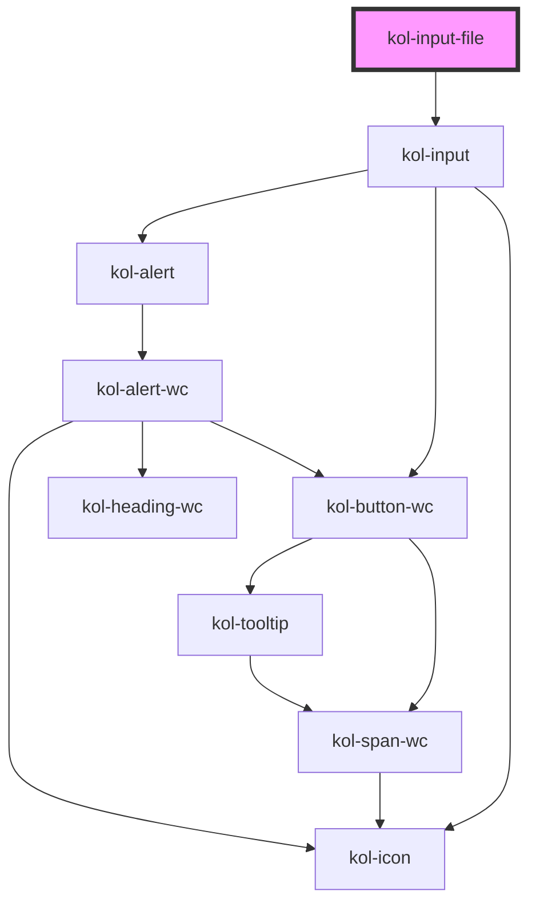

# InputFile

Der Input-Typ **File** erzeugt ein Eingabefeld für zum Beispiel Uploads. Es können eine oder auch mehrere Dateien ausgewählt werden.

## Konstruktion

### Code

```html
<kol-input-file _id="mein_upload" _name="mein_upload" _accept="image/png, image/jpeg, application/pdf" _icon='{ "right": "codicon codicon-device-camera"}'>
	Bild hochladen
</kol-input-file>
```

### Beispiel

<kol-input-file _id="mein_upload" _name="mein_upload" _accept="image/png, image/jpeg, application/pdf" _icon='{ "right": "codicon codicon-device-camera"}'> Bild hochladen </kol-input-file>

## Verwendung

Geben Sie über das Attribut **`_accept`** an, welche Dateitypen zur Auswahl erlaubt sind. Wird das Attribut nicht oder leer übergeben, sind alle Dateitypen erlaubt.
Mögliche Werte und weitere Informationen erhalten Sie im <kol-link _href="https://developer.mozilla.org/en-US/docs/Web/HTML/Attributes/accept" _label="MDN Artikel zum Attribut accept"></kol-link>.

### Best practices

- Achten sie darauf `id` und `name` korrekt zu setzen, damit die Daten beim Formular Absenden mitgesendet werden.
- Lassen Sie nur die Dateitypen zum Upload zu, die für die Programmausführung benötigt werden. Eine fehlende Einschränkung der hochladbaren Dateitypen kann ein erhebliches Sicherheitsrisiko sein.
- Begrenzen Sie die Größe der Dateien, die Sie zum Upload zulassen möchten.

## Barrierefreiheit

### Tastatursteuerung

| Taste | Funktion                                                        |
| ----- | --------------------------------------------------------------- |
| `Tab` | Fokussiert das Eingabefeld und ruft den Dateiauswahldialog auf. |

## Links und Referenzen

- https://medium.com/@gavyn/til-autofocus-inputs-are-an-accessibility-problem-32ced60c3109

<!-- Auto Generated Below -->

## Properties

| Property              | Attribute     | Description                                                                                                                                          | Type                                                                                                                                                                                                                                                                                                                                                                                                                                                                                                                                                                                                                                                                                                                                                                                                                                                                                     | Default     |
| --------------------- | ------------- | ---------------------------------------------------------------------------------------------------------------------------------------------------- | ---------------------------------------------------------------------------------------------------------------------------------------------------------------------------------------------------------------------------------------------------------------------------------------------------------------------------------------------------------------------------------------------------------------------------------------------------------------------------------------------------------------------------------------------------------------------------------------------------------------------------------------------------------------------------------------------------------------------------------------------------------------------------------------------------------------------------------------------------------------------------------------- | ----------- |
| `_accept`             | `_accept`     | Gibt an, welche Dateiformate erlaubt sind.                                                                                                           | `string \| undefined`                                                                                                                                                                                                                                                                                                                                                                                                                                                                                                                                                                                                                                                                                                                                                                                                                                                                    | `undefined` |
| `_accessKey`          | `_access-key` | Gibt an, mit welcher Tastenkombination man das interaktive Element der Komponente auslösen oder fokussieren kann.                                    | `string \| undefined`                                                                                                                                                                                                                                                                                                                                                                                                                                                                                                                                                                                                                                                                                                                                                                                                                                                                    | `undefined` |
| `_alert`              | `_alert`      | Gibt an, ob der Screenreader die Meldung aktiv vorlesen soll.                                                                                        | `boolean \| undefined`                                                                                                                                                                                                                                                                                                                                                                                                                                                                                                                                                                                                                                                                                                                                                                                                                                                                   | `true`      |
| `_disabled`           | `_disabled`   | Deaktiviert das interaktive Element in der Komponente und erlaubt keine Interaktion mehr damit.                                                      | `boolean \| undefined`                                                                                                                                                                                                                                                                                                                                                                                                                                                                                                                                                                                                                                                                                                                                                                                                                                                                   | `undefined` |
| `_error`              | `_error`      | Gibt den Text für eine Fehlermeldung an.                                                                                                             | `string \| undefined`                                                                                                                                                                                                                                                                                                                                                                                                                                                                                                                                                                                                                                                                                                                                                                                                                                                                    | `undefined` |
| `_hideLabel`          | `_hide-label` | Blendet die Beschriftung (Label) aus und zeigt sie stattdessen mittels eines Tooltips an.                                                            | `boolean \| undefined`                                                                                                                                                                                                                                                                                                                                                                                                                                                                                                                                                                                                                                                                                                                                                                                                                                                                   | `undefined` |
| `_hint`               | `_hint`       | Gibt den Hinweistext an.                                                                                                                             | `string \| undefined`                                                                                                                                                                                                                                                                                                                                                                                                                                                                                                                                                                                                                                                                                                                                                                                                                                                                    | `''`        |
| `_icon`               | `_icon`       | Setzt die Iconklasse (z.B.: `_icon="codicon codicon-home`).                                                                                          | `string \| undefined \| { right?: IconOrIconClass \| undefined; left?: IconOrIconClass \| undefined; }`                                                                                                                                                                                                                                                                                                                                                                                                                                                                                                                                                                                                                                                                                                                                                                                  | `undefined` |
| `_id`                 | `_id`         | Gibt die interne ID des primären Elements in der Komponente an.                                                                                      | `string \| undefined`                                                                                                                                                                                                                                                                                                                                                                                                                                                                                                                                                                                                                                                                                                                                                                                                                                                                    | `undefined` |
| `_label` _(required)_ | `_label`      | Setzt die sichtbare oder semantische Beschriftung der Komponente (z.B. Aria-Label, Label, Headline, Caption, Summary usw.).                          | `boolean \| string`                                                                                                                                                                                                                                                                                                                                                                                                                                                                                                                                                                                                                                                                                                                                                                                                                                                                      | `undefined` |
| `_multiple`           | `_multiple`   | Gibt an, ob mehrere Werte eingegeben werden können.                                                                                                  | `boolean \| undefined`                                                                                                                                                                                                                                                                                                                                                                                                                                                                                                                                                                                                                                                                                                                                                                                                                                                                   | `undefined` |
| `_name`               | `_name`       | Gibt den technischen Namen des Eingabefeldes an.                                                                                                     | `string \| undefined`                                                                                                                                                                                                                                                                                                                                                                                                                                                                                                                                                                                                                                                                                                                                                                                                                                                                    | `undefined` |
| `_on`                 | --            | Gibt die EventCallback-Funktionen für das Input-Event an.                                                                                            | `InputTypeOnBlur & InputTypeOnClick & InputTypeOnChange & InputTypeOnFocus \| undefined`                                                                                                                                                                                                                                                                                                                                                                                                                                                                                                                                                                                                                                                                                                                                                                                                 | `undefined` |
| `_required`           | `_required`   | Macht das Eingabeelement zu einem Pflichtfeld.                                                                                                       | `boolean \| undefined`                                                                                                                                                                                                                                                                                                                                                                                                                                                                                                                                                                                                                                                                                                                                                                                                                                                                   | `undefined` |
| `_smartButton`        | --            | Ermöglicht eine Schaltfläche ins das Eingabefeld mit einer beliebigen Aktion zu einzufügen (ohne label).                                             | `undefined \| { _label: LabelWithExpertSlotPropType; } & { _ariaControls?: string \| undefined; _icon?: Stringified<KoliBriIconProp> \| undefined; _iconAlign?: Align \| undefined; _iconOnly?: boolean \| undefined; _role?: AlternativButtonLinkRole \| undefined; _tabIndex?: number \| undefined; _tooltipAlign?: Align \| undefined; _ariaCurrent?: AriaCurrent \| undefined; _ariaExpanded?: boolean \| undefined; _ariaLabel?: string \| undefined; _ariaSelected?: boolean \| undefined; _disabled?: boolean \| undefined; _hideLabel?: boolean \| undefined; _accessKey?: string \| undefined; _id?: string \| undefined; _on?: KoliBriButtonCallbacks<unknown> \| undefined; _type?: KoliBriButtonType \| undefined; _value?: unknown; _label?: LabelWithExpertSlotPropType \| undefined; _variant?: KoliBriButtonVariant \| undefined; _customClass?: string \| undefined; }` | `undefined` |
| `_tabIndex`           | `_tab-index`  | Gibt an, welchen Tab-Index das primäre Element in der Komponente hat. (https://developer.mozilla.org/en-US/docs/Web/HTML/Global_attributes/tabindex) | `number \| undefined`                                                                                                                                                                                                                                                                                                                                                                                                                                                                                                                                                                                                                                                                                                                                                                                                                                                                    | `undefined` |
| `_touched`            | `_touched`    | Gibt an, ob dieses Eingabefeld von Nutzer:innen einmal besucht/berührt wurde.                                                                        | `boolean \| undefined`                                                                                                                                                                                                                                                                                                                                                                                                                                                                                                                                                                                                                                                                                                                                                                                                                                                                   | `false`     |
| `_value`              | `_value`      | Gibt den Wert des Eingabefeldes an.                                                                                                                  | `string \| undefined`                                                                                                                                                                                                                                                                                                                                                                                                                                                                                                                                                                                                                                                                                                                                                                                                                                                                    | `undefined` |

## Slots

| Slot | Description                         |
| ---- | ----------------------------------- |
|      | Die Beschriftung des Eingabefeldes. |

## Dependencies

### Depends on

- kol-input

### Graph



---
