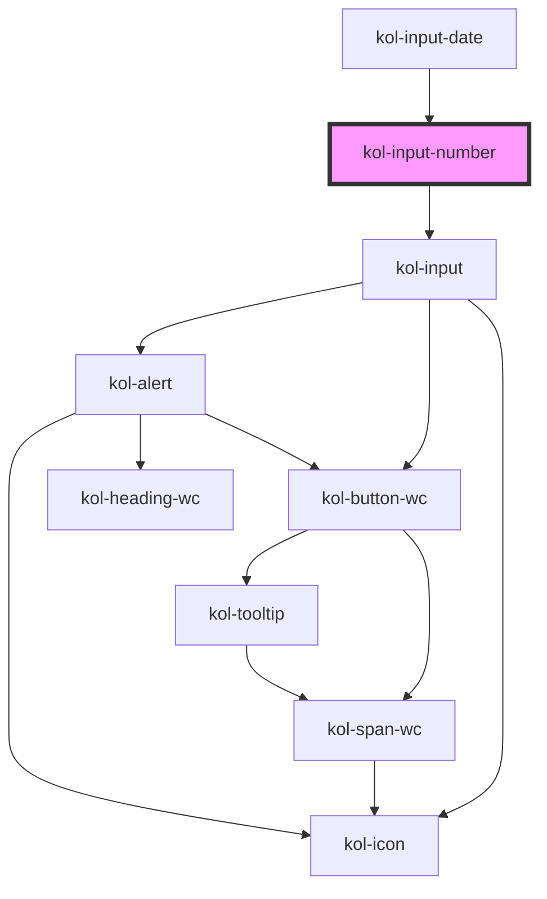

# InputNumber

Der Input-Typ **Number** erzeugt ein Eingabefeld für Zahlen.

## Konstruktion

### Code

```html
<kol-input-number _id="meine_zahl" _name="meine_zahl" _value="74">ZAHL!</kol-input-number>
```

### Beispiel

<kol-input-number _id="meine_zahl" _name="meine_zahl" _value="74">ZAHL!</kol-input-number>

## Verwendung

### Best practices

- Achten sie darauf `id` und `name` korrekt zu setzen, damit die Daten beim Formular Absenden mitgesendet werden.

### Tastatursteuerung

| Taste                         | Funktion                                                                                                                                             |
| ----------------------------- | ---------------------------------------------------------------------------------------------------------------------------------------------------- |
| `Tab`                         | Fokussiert das Eingabefeld.                                                                                                                          |
| `Pfeil-Tasten (oben / unten)` | Erhöht oder verringert den Wert innerhalb der Attribute **`_min`** und **`_max`** entsprechend der im Attribut **`_step`** angegebenen Schrittgröße. |

## Links und Referenzen

- https://medium.com/@gavyn/til-autofocus-inputs-are-an-accessibility-problem-32ced60c3109

<!-- Auto Generated Below -->


## Properties

| Property        | Attribute        | Description                                                                                                                                                                                                                                                               | Type                                                                                                                                                                                                                                                                                                                                                                                                                                                                                                                                                                                                                                                                                                                                                                                          | Default     |
| --------------- | ---------------- | ------------------------------------------------------------------------------------------------------------------------------------------------------------------------------------------------------------------------------------------------------------------------- | --------------------------------------------------------------------------------------------------------------------------------------------------------------------------------------------------------------------------------------------------------------------------------------------------------------------------------------------------------------------------------------------------------------------------------------------------------------------------------------------------------------------------------------------------------------------------------------------------------------------------------------------------------------------------------------------------------------------------------------------------------------------------------------------- | ----------- |
| `_accessKey`    | `_access-key`    | Gibt an, mit welcher Tastenkombination man das Input auslösen oder fokussieren kann.                                                                                                                                                                                      | `string \| undefined`                                                                                                                                                                                                                                                                                                                                                                                                                                                                                                                                                                                                                                                                                                                                                                         | `undefined` |
| `_alert`        | `_alert`         | Gibt an, ob die Fehlermeldung vorgelesen werden soll, wenn es eine gibt.                                                                                                                                                                                                  | `boolean \| undefined`                                                                                                                                                                                                                                                                                                                                                                                                                                                                                                                                                                                                                                                                                                                                                                        | `true`      |
| `_autoComplete` | `_auto-complete` | Gibt an, ob das Eingabefeld autovervollständigt werden kann.                                                                                                                                                                                                              | `"off" \| "on" \| undefined`                                                                                                                                                                                                                                                                                                                                                                                                                                                                                                                                                                                                                                                                                                                                                                  | `undefined` |
| `_disabled`     | `_disabled`      | Setzt das Feld in einen inaktiven Zustand, in dem es keine Interaktion erlaubt.                                                                                                                                                                                           | `boolean \| undefined`                                                                                                                                                                                                                                                                                                                                                                                                                                                                                                                                                                                                                                                                                                                                                                        | `undefined` |
| `_error`        | `_error`         | Gibt den Text für eine Fehlermeldung an.                                                                                                                                                                                                                                  | `string \| undefined`                                                                                                                                                                                                                                                                                                                                                                                                                                                                                                                                                                                                                                                                                                                                                                         | `undefined` |
| `_hideLabel`    | `_hide-label`    | Versteckt das sichtbare Label des Elements.                                                                                                                                                                                                                               | `boolean \| undefined`                                                                                                                                                                                                                                                                                                                                                                                                                                                                                                                                                                                                                                                                                                                                                                        | `undefined` |
| `_hint`         | `_hint`          | Gibt den Hinweistext an.                                                                                                                                                                                                                                                  | `string \| undefined`                                                                                                                                                                                                                                                                                                                                                                                                                                                                                                                                                                                                                                                                                                                                                                         | `''`        |
| `_icon`         | `_icon`          | Ermöglicht das Anzeigen von Icons links und/oder rechts am Rand des Eingabefeldes.                                                                                                                                                                                        | `string \| undefined \| { right?: IconOrIconClass \| undefined; left?: IconOrIconClass \| undefined; }`                                                                                                                                                                                                                                                                                                                                                                                                                                                                                                                                                                                                                                                                                       | `undefined` |
| `_id`           | `_id`            | Gibt die technische ID des Eingabefeldes an.                                                                                                                                                                                                                              | `string \| undefined`                                                                                                                                                                                                                                                                                                                                                                                                                                                                                                                                                                                                                                                                                                                                                                         | `undefined` |
| `_list`         | `_list`          | Gibt die Liste der Vorschlagszahlen an.                                                                                                                                                                                                                                   | `string \| string[] \| undefined`                                                                                                                                                                                                                                                                                                                                                                                                                                                                                                                                                                                                                                                                                                                                                             | `undefined` |
| `_max`          | `_max`           | Gibt den größtmöglichen Zahlenwert an.                                                                                                                                                                                                                                    | ``${number}-${number}-${number}T${number}:${number}:${number}` \| `${number}-${number}-${number}T${number}:${number}` \| `${number}-${number}-${number}` \| `${number}-${number}` \| `${number}-W${number}` \| `${number}:${number}:${number}` \| `${number}:${number}` \| number \| undefined`                                                                                                                                                                                                                                                                                                                                                                                                                                                                                               | `undefined` |
| `_min`          | `_min`           | Gibt den kleinstmöglichen Zahlenwert an.                                                                                                                                                                                                                                  | ``${number}-${number}-${number}T${number}:${number}:${number}` \| `${number}-${number}-${number}T${number}:${number}` \| `${number}-${number}-${number}` \| `${number}-${number}` \| `${number}-W${number}` \| `${number}:${number}:${number}` \| `${number}:${number}` \| number \| undefined`                                                                                                                                                                                                                                                                                                                                                                                                                                                                                               | `undefined` |
| `_name`         | `_name`          | Gibt den technischen Namen des Eingabefeldes an.                                                                                                                                                                                                                          | `string \| undefined`                                                                                                                                                                                                                                                                                                                                                                                                                                                                                                                                                                                                                                                                                                                                                                         | `undefined` |
| `_on`           | --               | Gibt die EventCallback-Funktionen für das Input-Event an.                                                                                                                                                                                                                 | `InputTypeOnBlur & InputTypeOnClick & InputTypeOnChange & InputTypeOnFocus \| undefined`                                                                                                                                                                                                                                                                                                                                                                                                                                                                                                                                                                                                                                                                                                      | `undefined` |
| `_placeholder`  | `_placeholder`   | Gibt den Platzhalter des Eingabefeldes an, wenn es leer ist.                                                                                                                                                                                                              | `string \| undefined`                                                                                                                                                                                                                                                                                                                                                                                                                                                                                                                                                                                                                                                                                                                                                                         | `undefined` |
| `_readOnly`     | `_read-only`     | Setzt das Eingabefeld in den schreibgeschützten Modus.                                                                                                                                                                                                                    | `boolean \| undefined`                                                                                                                                                                                                                                                                                                                                                                                                                                                                                                                                                                                                                                                                                                                                                                        | `undefined` |
| `_required`     | `_required`      | Macht das Eingabeelement zu einem Pflichtfeld.                                                                                                                                                                                                                            | `boolean \| undefined`                                                                                                                                                                                                                                                                                                                                                                                                                                                                                                                                                                                                                                                                                                                                                                        | `undefined` |
| `_smartButton`  | --               | Ermöglicht eine Schaltfläche ins das Eingabefeld mit einer beliebigen Aktion zu einzufügen (ohne label).                                                                                                                                                                  | `undefined \| { _label: string; } & { _ariaControls?: string \| undefined; _ariaLabel?: string \| undefined; _icon?: Stringified<KoliBriIconProp> \| undefined; _iconAlign?: PropAlignment \| undefined; _iconOnly?: boolean \| undefined; _role?: AlternativButtonLinkRole \| undefined; _tabIndex?: number \| undefined; _tooltipAlign?: PropAlignment \| undefined; _ariaCurrent?: AriaCurrent \| undefined; _ariaExpanded?: boolean \| undefined; _ariaSelected?: boolean \| undefined; _disabled?: boolean \| undefined; _accessKey?: string \| undefined; _id?: string \| undefined; _on?: KoliBriButtonCallbacks<unknown> \| undefined; _type?: KoliBriButtonType \| undefined; _value?: unknown; _variant?: KoliBriButtonVariant \| undefined; _customClass?: string \| undefined; }` | `undefined` |
| `_step`         | `_step`          | Gibt die Schrittweite der Wertveränderung an                                                                                                                                                                                                                              | `number \| undefined`                                                                                                                                                                                                                                                                                                                                                                                                                                                                                                                                                                                                                                                                                                                                                                         | `undefined` |
| `_tabIndex`     | `_tab-index`     | Gibt an, welchen Tab-Index dieses Input hat.                                                                                                                                                                                                                              | `number \| undefined`                                                                                                                                                                                                                                                                                                                                                                                                                                                                                                                                                                                                                                                                                                                                                                         | `undefined` |
| `_touched`      | `_touched`       | Gibt an, ob dieses Eingabefeld von Nutzer:innen einmal besucht/berührt wurde.                                                                                                                                                                                             | `boolean \| undefined`                                                                                                                                                                                                                                                                                                                                                                                                                                                                                                                                                                                                                                                                                                                                                                        | `false`     |
| `_type`         | `_type`          | <span style="color:red">**[DEPRECATED]**</span> Das W3C hat die Date-Typen in eine eigene Gruppe zusammengefasst. Verwende hierfür die InputDate-Komponente.<br/><br/>Gibt an, ob es ein DateTime-, Date-, Month-, Week-, Time-, DateTime-Local-, Number-Eingabefeld ist. | `"date" \| "datetime-local" \| "month" \| "number" \| "time" \| "week" \| undefined`                                                                                                                                                                                                                                                                                                                                                                                                                                                                                                                                                                                                                                                                                                          | `'number'`  |
| `_value`        | `_value`         | Gibt den Wert des Eingabefeldes an.                                                                                                                                                                                                                                       | ``${number}-${number}-${number}T${number}:${number}:${number}` \| `${number}-${number}-${number}T${number}:${number}` \| `${number}-${number}-${number}` \| `${number}-${number}` \| `${number}-W${number}` \| `${number}:${number}:${number}` \| `${number}:${number}` \| null \| number \| undefined`                                                                                                                                                                                                                                                                                                                                                                                                                                                                                       | `undefined` |


## Dependencies

### Used by

 - [kol-input-date](../input-date)

### Depends on

- kol-input

### Graph


----------------------------------------------


