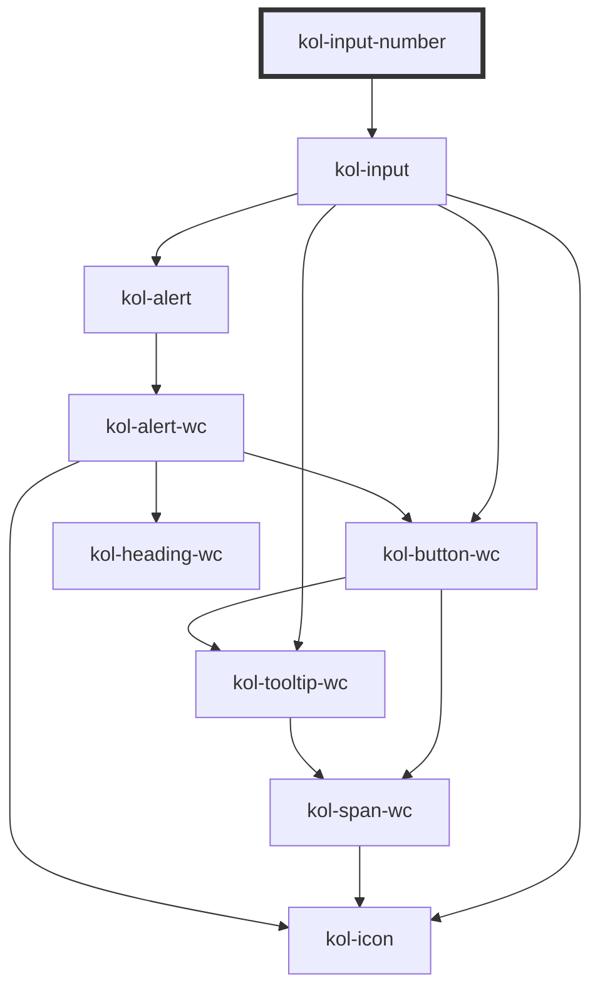

# InputNumber

Der Input-Typ **Number** erzeugt ein Eingabefeld für Zahlen.

## Konstruktion

### Code

```html
<kol-input-number _value="74" _label="ZAHL!" _icon='{"right": "codicon codicon-dashboard"}'></kol-input-number>
```

### Beispiel

<kol-input-number _value="74" _label="ZAHL!" _icon='{"right": "codicon codicon-dashboard"}'></kol-input-number>

## Verwendung

### Best practices

- Achten sie darauf `id` und `name` korrekt zu setzen, damit die Daten beim Formular Absenden mitgesendet werden.

### Tastatursteuerung

| Taste                         | Funktion                                                                                                                                             |
| ----------------------------- | ---------------------------------------------------------------------------------------------------------------------------------------------------- |
| `Tab`                         | Fokussiert das Eingabefeld.                                                                                                                          |
| `Pfeil-Tasten (oben / unten)` | Erhöht oder verringert den Wert innerhalb der Attribute **`_min`** und **`_max`** entsprechend der im Attribut **`_step`** angegebenen Schrittgröße. |

## Links und Referenzen

- <kol-link _href="https://medium.com/@gavyn/til-autofocus-inputs-are-an-accessibility-problem-32ced60c3109" _label="https://medium.com/@gavyn/til-autofocus-inputs-are-an-accessibility-problem-32ced60c3109" _target="_blank"></kol-link>

<!-- Auto Generated Below -->

## Properties

| Property        | Attribute        | Description                                                                                                                                                                                                                                                          | Type                                                                                                                                                                                                                                                                                                                                                                                                                                                                                                                                                                                                                                                                                                                                                                                                                                                                                                                                                                                     | Default     |
| --------------- | ---------------- | -------------------------------------------------------------------------------------------------------------------------------------------------------------------------------------------------------------------------------------------------------------------- | ---------------------------------------------------------------------------------------------------------------------------------------------------------------------------------------------------------------------------------------------------------------------------------------------------------------------------------------------------------------------------------------------------------------------------------------------------------------------------------------------------------------------------------------------------------------------------------------------------------------------------------------------------------------------------------------------------------------------------------------------------------------------------------------------------------------------------------------------------------------------------------------------------------------------------------------------------------------------------------------- | ----------- |
| `_accessKey`    | `_access-key`    | Defines which key combination can be used to trigger or focus the interactive element of the component.                                                                                                                                                              | `string \| undefined`                                                                                                                                                                                                                                                                                                                                                                                                                                                                                                                                                                                                                                                                                                                                                                                                                                                                                                                                                                    | `undefined` |
| `_alert`        | `_alert`         | Defines whether the screen-readers should read out the notification.                                                                                                                                                                                                 | `boolean \| undefined`                                                                                                                                                                                                                                                                                                                                                                                                                                                                                                                                                                                                                                                                                                                                                                                                                                                                                                                                                                   | `true`      |
| `_autoComplete` | `_auto-complete` | Defines whether the input can be auto-completed.                                                                                                                                                                                                                     | `"off" \| "on" \| undefined`                                                                                                                                                                                                                                                                                                                                                                                                                                                                                                                                                                                                                                                                                                                                                                                                                                                                                                                                                             | `undefined` |
| `_disabled`     | `_disabled`      | Makes the element not focusable and ignore all events.                                                                                                                                                                                                               | `boolean \| undefined`                                                                                                                                                                                                                                                                                                                                                                                                                                                                                                                                                                                                                                                                                                                                                                                                                                                                                                                                                                   | `false`     |
| `_error`        | `_error`         | Defines the error message text.                                                                                                                                                                                                                                      | `string \| undefined`                                                                                                                                                                                                                                                                                                                                                                                                                                                                                                                                                                                                                                                                                                                                                                                                                                                                                                                                                                    | `undefined` |
| `_hideError`    | `_hide-error`    | Hides the error message but leaves it in the DOM for the input's aria-describedby.                                                                                                                                                                                   | `boolean \| undefined`                                                                                                                                                                                                                                                                                                                                                                                                                                                                                                                                                                                                                                                                                                                                                                                                                                                                                                                                                                   | `false`     |
| `_hideLabel`    | `_hide-label`    | Hides the caption by default and displays the caption text with a tooltip when the interactive element is focused or the mouse is over it.                                                                                                                           | `boolean \| undefined`                                                                                                                                                                                                                                                                                                                                                                                                                                                                                                                                                                                                                                                                                                                                                                                                                                                                                                                                                                   | `false`     |
| `_hint`         | `_hint`          | Defines the hint text.                                                                                                                                                                                                                                               | `string \| undefined`                                                                                                                                                                                                                                                                                                                                                                                                                                                                                                                                                                                                                                                                                                                                                                                                                                                                                                                                                                    | `''`        |
| `_icon`         | `_icon`          | <span style="color:red">**[DEPRECATED]**</span> Use \_icons.<br/><br/>                                                                                                                                                                                               | `string \| undefined \| { right?: IconOrIconClass \| undefined; left?: IconOrIconClass \| undefined; }`                                                                                                                                                                                                                                                                                                                                                                                                                                                                                                                                                                                                                                                                                                                                                                                                                                                                                  | `undefined` |
| `_icons`        | `_icons`         | Defines the icon classnames (e.g. `_icons="fa-solid fa-user"`).                                                                                                                                                                                                      | `string \| undefined \| { right?: IconOrIconClass \| undefined; left?: IconOrIconClass \| undefined; }`                                                                                                                                                                                                                                                                                                                                                                                                                                                                                                                                                                                                                                                                                                                                                                                                                                                                                  | `undefined` |
| `_id`           | `_id`            | Defines the internal ID of the primary component element.                                                                                                                                                                                                            | `string \| undefined`                                                                                                                                                                                                                                                                                                                                                                                                                                                                                                                                                                                                                                                                                                                                                                                                                                                                                                                                                                    | `undefined` |
| `_label`        | `_label`         | Defines the visible or semantic label of the component (e.g. aria-label, label, headline, caption, summary, etc.). Set to `false` to enable the expert slot.                                                                                                         | `string \| undefined`                                                                                                                                                                                                                                                                                                                                                                                                                                                                                                                                                                                                                                                                                                                                                                                                                                                                                                                                                                    | `undefined` |
| `_list`         | `_list`          | <span style="color:red">**[DEPRECATED]**</span> Use \_suggestions intead.<br/><br/>Deprecated: Gibt die Liste der Vorschlagszahlen an.                                                                                                                               | `string \| string[] \| undefined`                                                                                                                                                                                                                                                                                                                                                                                                                                                                                                                                                                                                                                                                                                                                                                                                                                                                                                                                                        | `undefined` |
| `_max`          | `_max`           | Defines the largest possible input value.                                                                                                                                                                                                                            | ``${number}-${number}-${number}T${number}:${number}:${number}` \| `${number}-${number}-${number}T${number}:${number}` \| `${number}-${number}-${number}` \| `${number}-${number}` \| `${number}-W${number}` \| `${number}:${number}:${number}` \| `${number}:${number}` \| number \| undefined`                                                                                                                                                                                                                                                                                                                                                                                                                                                                                                                                                                                                                                                                                          | `undefined` |
| `_min`          | `_min`           | Defines the smallest possible input value.                                                                                                                                                                                                                           | ``${number}-${number}-${number}T${number}:${number}:${number}` \| `${number}-${number}-${number}T${number}:${number}` \| `${number}-${number}-${number}` \| `${number}-${number}` \| `${number}-W${number}` \| `${number}:${number}:${number}` \| `${number}:${number}` \| number \| undefined`                                                                                                                                                                                                                                                                                                                                                                                                                                                                                                                                                                                                                                                                                          | `undefined` |
| `_name`         | `_name`          | Defines the technical name of an input field.                                                                                                                                                                                                                        | `string \| undefined`                                                                                                                                                                                                                                                                                                                                                                                                                                                                                                                                                                                                                                                                                                                                                                                                                                                                                                                                                                    | `undefined` |
| `_on`           | --               | Gibt die EventCallback-Funktionen für das Input-Event an.                                                                                                                                                                                                            | `InputTypeOnBlur & InputTypeOnClick & InputTypeOnChange & InputTypeOnFocus & InputTypeOnInput \| undefined`                                                                                                                                                                                                                                                                                                                                                                                                                                                                                                                                                                                                                                                                                                                                                                                                                                                                              | `undefined` |
| `_placeholder`  | `_placeholder`   | Defines the placeholder for input field. To be shown when there's no value.                                                                                                                                                                                          | `string \| undefined`                                                                                                                                                                                                                                                                                                                                                                                                                                                                                                                                                                                                                                                                                                                                                                                                                                                                                                                                                                    | `undefined` |
| `_readOnly`     | `_read-only`     | Makes the input element read only.                                                                                                                                                                                                                                   | `boolean \| undefined`                                                                                                                                                                                                                                                                                                                                                                                                                                                                                                                                                                                                                                                                                                                                                                                                                                                                                                                                                                   | `false`     |
| `_required`     | `_required`      | Makes the input element required.                                                                                                                                                                                                                                    | `boolean \| undefined`                                                                                                                                                                                                                                                                                                                                                                                                                                                                                                                                                                                                                                                                                                                                                                                                                                                                                                                                                                   | `false`     |
| `_smartButton`  | `_smart-button`  | Allows to add a button with an arbitrary action within the element (\_hide-label only).                                                                                                                                                                              | `string \| undefined \| { _label: string; } & { _tabIndex?: number \| undefined; _value?: Stringified<StencilUnknown>; _accessKey?: string \| undefined; _iconAlign?: AlignPropType \| undefined; _iconOnly?: boolean \| undefined; _icon?: IconsPropType \| undefined; _role?: AlternativeButtonLinkRolePropType \| undefined; _ariaControls?: string \| undefined; _ariaCurrent?: AriaCurrentPropType \| undefined; _ariaExpanded?: boolean \| undefined; _ariaLabel?: string \| undefined; _ariaSelected?: boolean \| undefined; _on?: ButtonCallbacksPropType<StencilUnknown> \| undefined; _type?: ButtonTypePropType \| undefined; _variant?: ButtonVariantPropType \| undefined; _customClass?: string \| undefined; _disabled?: boolean \| undefined; _hideLabel?: boolean \| undefined; _icons?: IconsPropType \| undefined; _id?: string \| undefined; _name?: string \| undefined; _syncValueBySelector?: string \| undefined; _tooltipAlign?: AlignPropType \| undefined; }` | `undefined` |
| `_step`         | `_step`          | Defines the step size for value changes.                                                                                                                                                                                                                             | `number \| undefined`                                                                                                                                                                                                                                                                                                                                                                                                                                                                                                                                                                                                                                                                                                                                                                                                                                                                                                                                                                    | `undefined` |
| `_suggestions`  | `_suggestions`   | Suggestions to provide for the input.                                                                                                                                                                                                                                | `W3CInputValue[] \| string \| undefined`                                                                                                                                                                                                                                                                                                                                                                                                                                                                                                                                                                                                                                                                                                                                                                                                                                                                                                                                                 | `undefined` |
| `_tabIndex`     | `_tab-index`     | Defines which tab-index the primary element of the component has. (https://developer.mozilla.org/en-US/docs/Web/HTML/Global_attributes/tabindex)                                                                                                                     | `number \| undefined`                                                                                                                                                                                                                                                                                                                                                                                                                                                                                                                                                                                                                                                                                                                                                                                                                                                                                                                                                                    | `undefined` |
| `_tooltipAlign` | `_tooltip-align` | Defines where to show the Tooltip preferably: top, right, bottom or left.                                                                                                                                                                                            | `"bottom" \| "left" \| "right" \| "top" \| undefined`                                                                                                                                                                                                                                                                                                                                                                                                                                                                                                                                                                                                                                                                                                                                                                                                                                                                                                                                    | `'top'`     |
| `_touched`      | `_touched`       | Shows if the input was touched by a user.                                                                                                                                                                                                                            | `boolean \| undefined`                                                                                                                                                                                                                                                                                                                                                                                                                                                                                                                                                                                                                                                                                                                                                                                                                                                                                                                                                                   | `false`     |
| `_type`         | `_type`          | <span style="color:red">**[DEPRECATED]**</span> Das W3C hat die Date-Typen in eine eigene Gruppe zusammengefasst. Verwende hierfür die InputDate-Komponente.<br/><br/>Deprecated: Defines either the type of the component or of the components interactive element. | `"date" \| "datetime-local" \| "month" \| "number" \| "time" \| "week" \| undefined`                                                                                                                                                                                                                                                                                                                                                                                                                                                                                                                                                                                                                                                                                                                                                                                                                                                                                                     | `'number'`  |
| `_value`        | `_value`         | Defines the value of the input.                                                                                                                                                                                                                                      | ``${number}-${number}-${number}T${number}:${number}:${number}` \| `${number}-${number}-${number}T${number}:${number}` \| `${number}-${number}-${number}` \| `${number}-${number}` \| `${number}-W${number}` \| `${number}:${number}:${number}` \| `${number}:${number}` \| null \| number \| undefined`                                                                                                                                                                                                                                                                                                                                                                                                                                                                                                                                                                                                                                                                                  | `undefined` |

## Slots

| Slot | Description                         |
| ---- | ----------------------------------- |
|      | Die Beschriftung des Eingabefeldes. |

## Dependencies

### Depends on

- kol-input

### Graph



---
