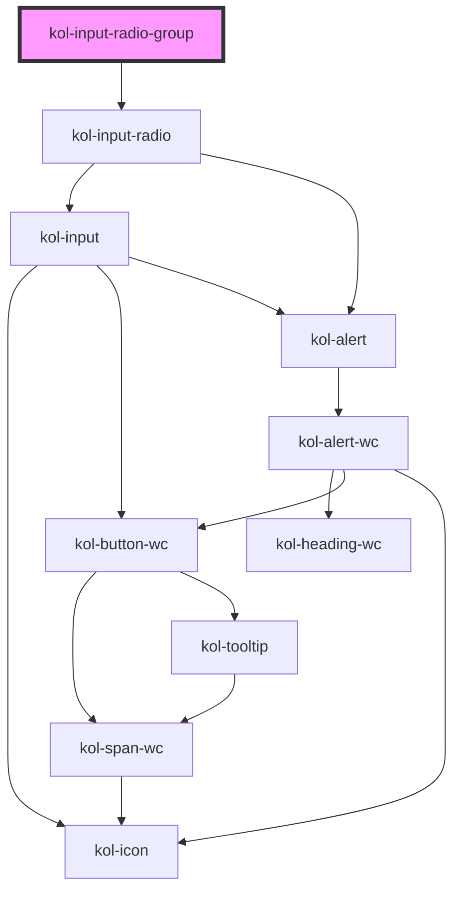

# InputRadioGroup

<!-- Auto Generated Below -->

> **[DEPRECATED]** Die Komponenten Input-Radio-Group und Input-Radio werden zur Komponente Input-Radio zusammengeführt. Verwendet einfach den Tag `<kol-input-radio>` statt `<kol-input-radio-group>`.

## Properties

| Property              | Attribute      | Description                                                                                                                                          | Type                                                                                     | Default      |
| --------------------- | -------------- | ---------------------------------------------------------------------------------------------------------------------------------------------------- | ---------------------------------------------------------------------------------------- | ------------ |
| `_accessKey`          | `_access-key`  | Gibt an, mit welcher Tastenkombination man das interaktive Element der Komponente auslösen oder fokussieren kann.                                    | `string \| undefined`                                                                    | `undefined`  |
| `_alert`              | `_alert`       | Gibt an, ob der Screenreader die Meldung aktiv vorlesen soll.                                                                                        | `boolean \| undefined`                                                                   | `true`       |
| `_disabled`           | `_disabled`    | Deaktiviert das interaktive Element in der Komponente und erlaubt keine Interaktion mehr damit.                                                      | `boolean \| undefined`                                                                   | `undefined`  |
| `_error`              | `_error`       | Gibt den Text für eine Fehlermeldung an.                                                                                                             | `string \| undefined`                                                                    | `undefined`  |
| `_hideLabel`          | `_hide-label`  | Blendet die Beschriftung (Label) aus und zeigt sie stattdessen mittels eines Tooltips an.                                                            | `boolean \| undefined`                                                                   | `undefined`  |
| `_hint`               | `_hint`        | Gibt den Hinweistext an.                                                                                                                             | `string \| undefined`                                                                    | `''`         |
| `_id`                 | `_id`          | Gibt die interne ID des primären Elements in der Komponente an.                                                                                      | `string \| undefined`                                                                    | `undefined`  |
| `_label` _(required)_ | `_label`       | Setzt die sichtbare oder semantische Beschriftung der Komponente (z.B. Aria-Label, Label, Headline, Caption, Summary usw.).                          | `boolean \| string`                                                                      | `undefined`  |
| `_list` _(required)_  | `_list`        | Gibt die Liste der Optionen für das Eingabefeld an.                                                                                                  | `Option<W3CInputValue>[] \| string`                                                      | `undefined`  |
| `_name`               | `_name`        | Gibt den technischen Namen des Eingabefeldes an.                                                                                                     | `string \| undefined`                                                                    | `undefined`  |
| `_on`                 | --             | Gibt die EventCallback-Funktionen für das Input-Event an.                                                                                            | `InputTypeOnBlur & InputTypeOnClick & InputTypeOnChange & InputTypeOnFocus \| undefined` | `undefined`  |
| `_orientation`        | `_orientation` | Gibt die horizontale oder vertikale Ausrichtung der Komponente an.                                                                                   | `"horizontal" \| "vertical" \| undefined`                                                | `'vertical'` |
| `_required`           | `_required`    | Macht das Eingabeelement zu einem Pflichtfeld.                                                                                                       | `boolean \| undefined`                                                                   | `undefined`  |
| `_tabIndex`           | `_tab-index`   | Gibt an, welchen Tab-Index das primäre Element in der Komponente hat. (https://developer.mozilla.org/en-US/docs/Web/HTML/Global_attributes/tabindex) | `number \| undefined`                                                                    | `undefined`  |
| `_touched`            | `_touched`     | Gibt an, ob dieses Eingabefeld von Nutzer:innen einmal besucht/berührt wurde.                                                                        | `boolean \| undefined`                                                                   | `false`      |
| `_value`              | `_value`       | Gibt den Wert der Radio an.                                                                                                                          | `number \| string \| undefined`                                                          | `undefined`  |

## Dependencies

### Depends on

- [kol-input-radio](../input-radio)

### Graph

---
