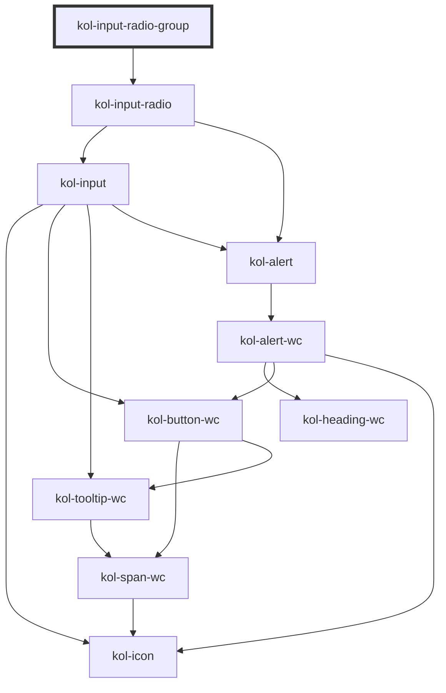

# InputRadioGroup

<!-- Auto Generated Below -->

> **[DEPRECATED]** Die Komponenten Input-Radio-Group und Input-Radio werden zur Komponente Input-Radio zusammengeführt. Verwendet einfach den Tag `<kol-input-radio>` statt `<kol-input-radio-group>`.

## Properties

| Property             | Attribute      | Description                                                                                                                                                  | Type                                                                                     | Default      |
| -------------------- | -------------- | ------------------------------------------------------------------------------------------------------------------------------------------------------------ | ---------------------------------------------------------------------------------------- | ------------ |
| `_accessKey`         | `_access-key`  | Defines which key combination can be used to trigger or focus the interactive element of the component.                                                      | `string \| undefined`                                                                    | `undefined`  |
| `_alert`             | `_alert`       | Defines whether the screen-readers should read out the notification.                                                                                         | `boolean \| undefined`                                                                   | `true`       |
| `_disabled`          | `_disabled`    | Makes the element not focusable and ignore all events.                                                                                                       | `boolean \| undefined`                                                                   | `false`      |
| `_error`             | `_error`       | Defines the error message text.                                                                                                                              | `string \| undefined`                                                                    | `undefined`  |
| `_hideLabel`         | `_hide-label`  | Hides the caption by default and displays the caption text with a tooltip when the interactive element is focused or the mouse is over it.                   | `boolean \| undefined`                                                                   | `false`      |
| `_hint`              | `_hint`        | Defines the hint text.                                                                                                                                       | `string \| undefined`                                                                    | `''`         |
| `_id`                | `_id`          | Defines the internal ID of the primary component element.                                                                                                    | `string \| undefined`                                                                    | `undefined`  |
| `_label`             | `_label`       | Defines the visible or semantic label of the component (e.g. aria-label, label, headline, caption, summary, etc.). Set to `false` to enable the expert slot. | `string \| undefined`                                                                    | `undefined`  |
| `_list` _(required)_ | `_list`        | Gibt die Liste der Optionen für das Eingabefeld an.                                                                                                          | `Option<W3CInputValue>[] \| string`                                                      | `undefined`  |
| `_name`              | `_name`        | Defines the technical name of an input field.                                                                                                                | `string \| undefined`                                                                    | `undefined`  |
| `_on`                | --             | Gibt die EventCallback-Funktionen für das Input-Event an.                                                                                                    | `InputTypeOnBlur & InputTypeOnClick & InputTypeOnChange & InputTypeOnFocus \| undefined` | `undefined`  |
| `_orientation`       | `_orientation` | Defines whether the orientation of the component is horizontal or vertical.                                                                                  | `"horizontal" \| "vertical" \| undefined`                                                | `'vertical'` |
| `_required`          | `_required`    | Macht das Eingabeelement zu einem Pflichtfeld.                                                                                                               | `boolean \| undefined`                                                                   | `false`      |
| `_tabIndex`          | `_tab-index`   | Defines which tab-index the primary element of the component has. (https://developer.mozilla.org/en-US/docs/Web/HTML/Global_attributes/tabindex)             | `number \| undefined`                                                                    | `undefined`  |
| `_touched`           | `_touched`     | Gibt an, ob dieses Eingabefeld von Nutzer:innen einmal besucht/berührt wurde.                                                                                | `boolean \| undefined`                                                                   | `false`      |
| `_value`             | `_value`       | Defines the value of the input.                                                                                                                              | `number \| string \| undefined`                                                          | `undefined`  |

## Dependencies

### Depends on

- [kol-input-radio](../input-radio)

### Graph

---
